EDA on Amaze Payment Solution Data
================
Ashish Kamboj

### Load Libraries

``` r
  library(dplyr)
  library(ggplot2)
  library(scales)
  library(ggthemes)
```

### Load Data

``` r
  credit_data <- read.csv("credit_data.csv", stringsAsFactors = F)
  cycles <- read.csv("cycles.csv", stringsAsFactors = F)
  users_data <- read.csv("users_data.csv", stringsAsFactors = F)
  transactions_data <- read.csv("transactions_data.csv", stringsAsFactors = F)
  settlements_data <- read.csv("settlements_data.csv", stringsAsFactors = F)
  failure_events_data <- read.csv("failure_events_data.csv", stringsAsFactors = F)
  
  str(credit_data)  #18468 obs. of  3 variables
```

    ## 'data.frame':    18468 obs. of  3 variables:
    ##  $ user_id            : int  2358 2358 10504 10504 9948 9948 7021 3022 15747 3177 ...
    ##  $ cycle_id           : int  15 18 21 16 14 16 12 7 18 12 ...
    ##  $ global_credit_limit: int  75000 150000 150000 75000 75000 150000 200000 150000 75000 500000 ...

``` r
  str(cycles) #23 obs. of  3 variables
```

    ## 'data.frame':    23 obs. of  3 variables:
    ##  $ cycle_id  : int  1 2 3 4 5 6 7 8 9 10 ...
    ##  $ start_date: chr  "2015-11-01 00:00:00 +0000 +0000" "2015-11-16 00:00:00 +0000 +0000" "2015-12-01 00:00:00 +0000 +0000" "2015-12-16 00:00:00 +0000 +0000" ...
    ##  $ end_date  : chr  "2015-11-15 00:00:00 +0000 +0000" "2015-11-30 23:59:59 +0000 +0000" "2015-12-15 00:00:00 +0000 +0000" "2015-12-31 23:59:59 +0000 +0000" ...

``` r
  str(users_data) #16050 obs. of  5 variables
```

    ## 'data.frame':    16050 obs. of  5 variables:
    ##  $ user_id : int  1 2 3 4 5 6 7 8 9 10 ...
    ##  $ referrer: chr  "a" "a" "" "a" ...
    ##  $ email   : chr  "1@1.com" "2@2.com" "3@1.com" "4@3.com" ...
    ##  $ name    : chr  "oh t" "nk s" "itna" "osn" ...
    ##  $ city_id : int  4 7 NA 3 7 154 3 3 3 NA ...

``` r
  str(transactions_data) #73731 obs. of  8 variables
```

    ## 'data.frame':    73731 obs. of  5 variables:
    ##  $ transaction_id    : int  141695 141694 141688 141686 141684 141679 141678 141677 141675 141674 ...
    ##  $ user_id           : int  13693 8166 15886 12014 12392 3537 15876 14398 15377 15890 ...
    ##  $ merchant_id       : int  1 1 1 8 1 1 9 1 9 9 ...
    ##  $ transaction_amount: int  10100 20900 28100 18000 63500 36400 89200 36400 18568 23042 ...
    ##  $ created_at        : chr  "2016-09-30 15:29:10.228672 +0000 +0000" "2016-09-30 15:29:00.286923 +0000 +0000" "2016-09-30 15:27:55.801021 +0000 +0000" "2016-09-30 15:27:17.891471 +0000 +0000" ...

``` r
  str(settlements_data) #30683 obs. of  10 variables
```

    ## 'data.frame':    30683 obs. of  8 variables:
    ##  $ id               : int  31096 29135 27995 31095 28720 28815 29587 29529 27522 29331 ...
    ##  $ user_id          : int  1738 6055 10630 5766 12416 13371 13172 7199 12228 10216 ...
    ##  $ cycle_id         : chr  "21" "20" "20" "21" ...
    ##  $ settlement_amount: int  190500 138900 43100 75300 38000 14400 26400 11900 17700 49700 ...
    ##  $ settlement_status: chr  "onetime_settlement" "bill_settled" "bill_settled" "onetime_settlement" ...
    ##  $ days_delayed     : num  NA 15 15 NA 15 ...
    ##  $ bill_created_at  : chr  "" "2016-08-31 16:16:00.874006 +0000 +0000" "2016-08-31 15:47:52.453709 +0000 +0000" "" ...
    ##  $ settled_at       : chr  "2016-09-15 15:29:45.245929 +0000 +0000" "2016-09-15 15:27:43.69227 +0000 +0000" "2016-09-15 15:26:55.238252 +0000 +0000" "2016-09-15 15:26:20.622842 +0000 +0000" ...

``` r
  str(failure_events_data)  #17993 obs. of  10 variables
```

    ## 'data.frame':    17993 obs. of  6 variables:
    ##  $ failure_event_id: int  1 2 3 4 5 6 7 8 9 10 ...
    ##  $ transaction_id  : int  56 63 64 65 66 67 70 71 72 73 ...
    ##  $ user_id         : int  5 183 183 183 183 183 183 183 183 183 ...
    ##  $ failure_type    : chr  "error1" "error1" "error1" "error1" ...
    ##  $ amount_in_paise : int  7000 13000 13000 13000 13000 13000 13000 13000 13000 13000 ...
    ##  $ created_at      : chr  "2015-12-18 06:55:41.84924 +0000 +0000" "2016-01-06 12:11:19.504704 +0000 +0000" "2016-01-06 12:13:28.760053 +0000 +0000" "2016-01-06 12:35:36.668034 +0000 +0000" ...


Data Preparation ::
===================

### Checking for NA values

``` r
  sapply(credit_data, function(x) sum(is.na(x)))  #No missing or NA values
```

    ##             user_id            cycle_id global_credit_limit 
    ##                   0                   0                   0

``` r
  sapply(failure_events_data, function(x) sum(is.na(x)))  #No missing or NA values
```

    ## failure_event_id   transaction_id          user_id     failure_type 
    ##                0                0                0                0 
    ##  amount_in_paise       created_at 
    ##                0                0

``` r
  sapply(settlements_data, function(x) sum(is.na(x))) #8288 NA values in days_delayed column
```

    ##                id           user_id          cycle_id settlement_amount 
    ##                 0                 0                 0                 0 
    ## settlement_status      days_delayed   bill_created_at        settled_at 
    ##                 0              8288                 0                 0

``` r
  sapply(transactions_data, function(x) sum(is.na(x)))  #No missing or NA values
```

    ##     transaction_id            user_id        merchant_id 
    ##                  0                  0                  0 
    ## transaction_amount         created_at 
    ##                  0                  0

``` r
  sapply(users_data, function(x) sum(is.na(x))) #3105 NA values in city_id column
```

    ##  user_id referrer    email     name  city_id 
    ##        0        0        0        0     3105

### Transactional Data Preparation:

``` r
  ## Converting merchant_id to factor
    transactions_data$merchant_id <- as.factor(transactions_data$merchant_id)
    
  ## Extracting combination of Year and Month
    transactions_data$Year_Month <- substr(transactions_data$created_at,1,7)

  ## Extracting Hours from the created date
    transactions_data$Hour <- strftime(transactions_data$created_at, format = "%H")
    
  ## Extracting Date from the created date ( as it includes time also)
    transactions_data$Date <- substr(transactions_data$created_at,1,10)
    transactions_data$Date <- as.Date(transactions_data$Date) #Converting Date column in to date data type
```

### Settlement Data Preparation:

``` r
  ## Missing values treatement for days_delayed column
    settlements_data$days_delayed[settlements_data$settlement_status == "onetime_settlement"] <- 0
    settlements_data$days_delayed[settlements_data$settlement_status == "bill_pending"] <- -1
    
  ## Extracted combination of Year and Month
    settlements_data$Year_Month <- ifelse(settlements_data$settlement_status != "onetime_settlement", 
                                    substr(settlements_data$bill_created_at,1,7), substr(settlements_data$settled_at,1,7))
    
  ## Extracted Hours from the settled date
    settlements_data$Hour <- ifelse(settlements_data$settlement_status != "onetime_settlement", 
                                    substr(settlements_data$bill_created_at,12,13), substr(settlements_data$settled_at,12,13))
    
  ## Replacing the #NA in "cycle_id" column with proper cycle_id
    settlements_data$cycle_id[settlements_data$cycle_id == "#N/A"] <- 11
    settlements_data$cycle_id <- as.factor(as.numeric(settlements_data$cycle_id))  #Converting cycle_id to factor
```

### Failure Events Data Preparation:

``` r
 ## Extracted combination of Year and Month
  failure_events_data$Year_Month <- substr(failure_events_data$created_at,1,7)
  
 ## Extracted Hours from the created date
  failure_events_data$Hour <- strftime(failure_events_data$created_at, format = "%H")
  
 ## Merging failure event data user_id with city_id (in user_data)
  failure_events_data <- merge(x = failure_events_data, y = users_data[ , c("user_id", "city_id")], by = "user_id", all.x=TRUE)
    
 ## Replacing NA values in "city_id" with 0
  failure_events_data$city_id[which(is.na(failure_events_data$city_id))] <- 0
    
 ## Converting city_Id into factor
  failure_events_data$city_id <- as.factor(failure_events_data$city_id)
```

### User data Preparation:

``` r
  ## Replacing blank/empty referer to "unknown"
    users_data$referrer[users_data$referrer == ""] <- "unknown"
```

Exploratory Data Analysis ::
============================

### Credit data analysis:

``` r
  dim(credit_data)
```

    ## [1] 18468     3

``` r
  length(unique(credit_data$user_id))
```

    ## [1] 14285

``` r
  length(unique(credit_data$cycle_id))
```

    ## [1] 20

``` r
  #For Credit data we can't analyze much
  #Some of the combinations of "userid" and "cycle_id" not present in credit data but present in settlements data, 
  #So I've assumed that the credit limit for that cycle (for that user) was same as the previous cycle_id.
```

### Cycle data analysis::

``` r
  #No analysis is required, will be helpful for analysing further dataset inordr to get cycle_id based on the date
  #This data is not of much importance for analysis

  summary(cycles)
```

    ##     cycle_id     start_date          end_date        
    ##  Min.   : 1.0   Length:23          Length:23         
    ##  1st Qu.: 6.5   Class :character   Class :character  
    ##  Median :12.0   Mode  :character   Mode  :character  
    ##  Mean   :12.0                                        
    ##  3rd Qu.:17.5                                        
    ##  Max.   :23.0

### Users data analysis::

``` r
  # Contains the information about user like name, email_id, city etc.
  unique(users_data$referrer)
```

    ##  [1] "a"       "unknown" "b"       "c"       "d"       "e"       "f"      
    ##  [8] "g"       "h"       "i"       "j"       "k"       "l"       "m"      
    ## [15] "n"       "o"

``` r
  ## Frequency of Users Referred by Referrer
    users_data %>% group_by(referrer) %>% summarise(count=n()) %>% data.frame() %>% ggplot(aes(x=referrer, y=count)) + 
    geom_bar(stat = "identity", fill="lightslateblue") + theme_hc(base_size = 18, base_family = "sans") +   
    geom_text(aes(label=count),vjust=-0.3, size=3.5) + labs(x="Referrer",y="Frequency of Users Referred") + 
    ggtitle("Number Of Users Referred by Referrer") + theme(plot.title = element_text(hjust = 0.5))
```

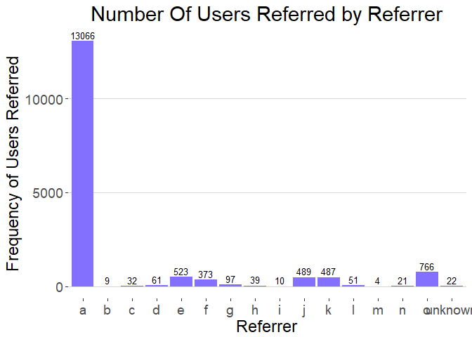

``` r
  # "a" had referred the most of the users
```

### Transactional Data analysis::

``` r
  dim(transactions_data)
```

    ## [1] 73731     8

``` r
  length(unique(transactions_data$merchant_id))
```

    ## [1] 18

``` r
  ## Number of Transactions per merchant ID
    transactions_data %>% group_by(merchant_id) %>% summarise(count=n()) %>% data.frame() %>% ggplot(aes(x=merchant_id, y=count)) + 
    geom_bar(stat = "identity", fill="goldenrod1") + theme_hc(base_size = 18, base_family = "sans") + 
    geom_text(aes(label=count), vjust=-0.3, size=3.5) + labs(x="Merchant ID's",y="Number of Transactions") + 
    ggtitle("Number Of Transaction for Merchant ID") + theme(plot.title = element_text(hjust = 0.5))
```

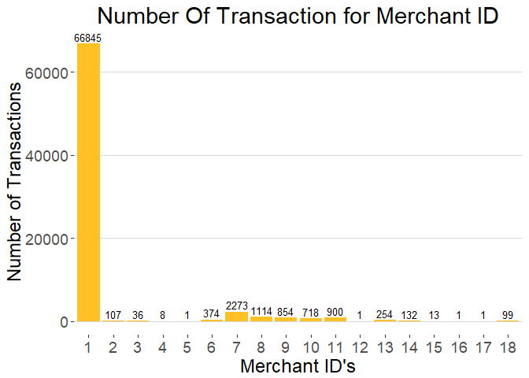

``` r
  ## Monthly transaction amount
    transactions_data %>% group_by(Year_Month) %>% summarise(total_amount=sum(transaction_amount)) %>% data.frame() %>% 
    ggplot(aes(x=Year_Month, y=total_amount/100000)) + geom_bar(stat = "identity", fill="steelblue") + 
    theme_hc(base_size = 18, base_family = "sans") + labs(x="Months",y="Transaction Amount in Lacs") + 
    ggtitle("Monthly Transaction Amount") + theme(plot.title = element_text(hjust = 0.5))
```

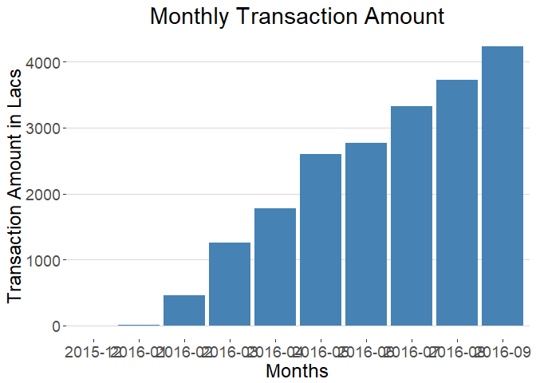

``` r
  ## Hourly Transaction amount detail
    transactions_data %>% group_by(Hour) %>% summarise(total_amount=sum(transaction_amount)) %>% data.frame() %>% 
    ggplot(aes(x=Hour, y=total_amount/100000)) + geom_bar(stat = "identity", fill="darkred") + 
    theme_hc(base_size = 18, base_family = "sans") + labs(x="Hour",y="Transaction Amount in Lacs") + 
    ggtitle("Hourly Transaction Amount") + theme(plot.title = element_text(hjust = 0.5))
```

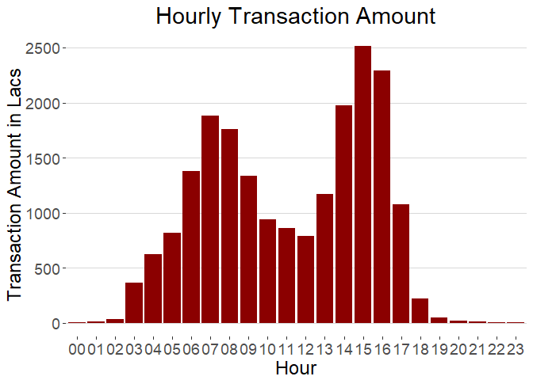

``` r
  ## Hourly Transactions
    transactions_data %>% group_by(Hour) %>% summarise(count=n()) %>% data.frame() %>% ggplot(aes(x=Hour, y=count)) + 
    geom_bar(stat = "identity", fill="purple") + theme_hc(base_size = 18, base_family = "sans") + 
    geom_text(aes(label=count), vjust=-0.3, size=2.8) + labs(x="Hour",y="Number Of Transactions") + 
    ggtitle("Hourly Transactions") + theme(plot.title = element_text(hjust = 0.5))
```

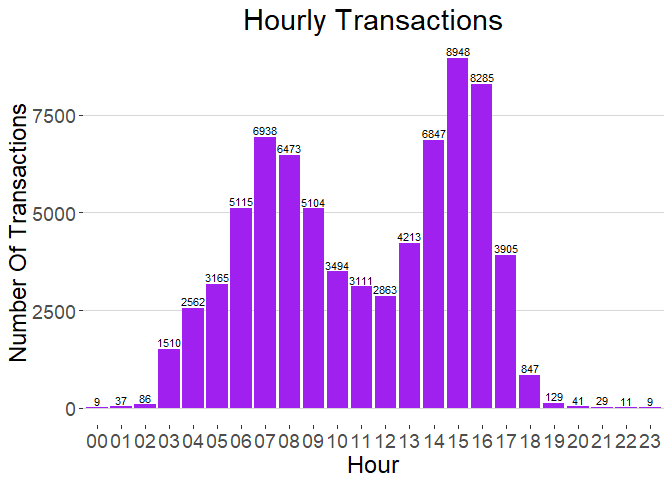

``` r
  ## Aggregated daily transactional amount
    transactions_data %>% group_by(Date) %>% summarise(total_amount=sum(transaction_amount)) %>% data.frame() %>% 
    ggplot(aes(x=Date, y=total_amount/100000)) + geom_line(size = 0.5,color = "steelblue") + geom_point() + 
    theme_bw() + scale_x_date(labels = date_format("%Y-%m-%d"), breaks = date_breaks("1 week")) + 
    theme(axis.text.x = element_text(colour = "black", angle=90, vjust = 0.5)) + 
    ggtitle("Daily Transactional Amount") + theme(plot.title = element_text(hjust = 0.5))
```

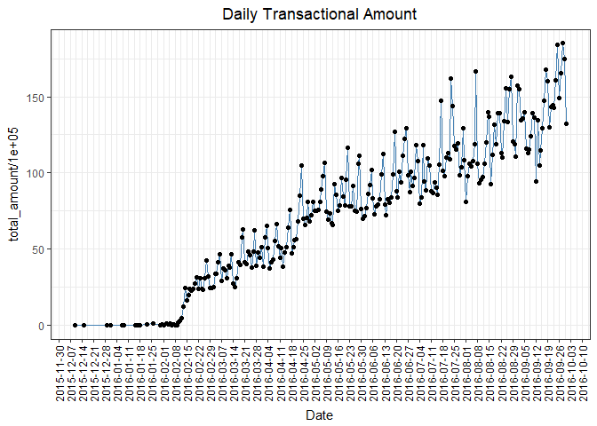

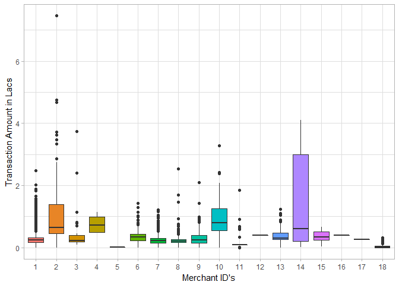

### Settlement data analysis::

``` r
  ## Counts of different settlement status
    settlements_data %>% group_by(settlement_status) %>% summarise(count=n()) %>% data.frame() %>% 
    ggplot(aes(x=settlement_status, y=count)) + geom_bar(stat = "identity", width = 0.5, fill="yellow") + 
    geom_text(aes(label=count),vjust=-0.3, size=5) + theme_hc(base_size = 18, base_family = "sans") + 
    labs(x="Settlement Status",y="Number Of Settlements") + ggtitle("Counts of Settlemnt Status") + 
    theme(plot.title = element_text(hjust = 0.5)) 
```

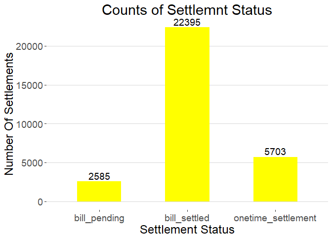

``` r
  ## Total settlement amount of different settlement status
    settlements_data %>% group_by(settlement_status) %>% summarise(total_amount=sum(settlement_amount)) %>% data.frame() %>% 
    ggplot(aes(x=settlement_status, y=total_amount/100000)) + geom_bar(stat = "identity", width = 0.7, fill="tan1") + 
    theme_hc(base_size = 18, base_family = "sans") + labs(x="Settlement Status",y="Settlement Amount in Lacs") + 
    ggtitle("Settlement Amount Of Different Settlement Status") + theme(plot.title = element_text(hjust = 0.5))
```

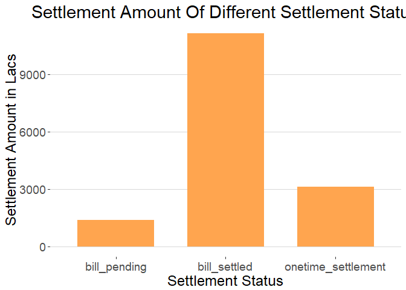

``` r
  ## Monthly aggregated settlement amount
    settlements_data %>% group_by(Year_Month) %>% summarise(total_amount=sum(settlement_amount)) %>% data.frame() %>% 
    ggplot(aes(x=Year_Month, y=total_amount/100000)) + geom_bar(stat = "identity", width = 0.7, fill="seagreen4") + 
    theme_hc(base_size = 18, base_family = "sans") + labs(x="Months",y="Settlement Amount in Lacs") + 
    ggtitle("Monthly Settlement Amount") + theme(plot.title = element_text(hjust = 0.5))
```

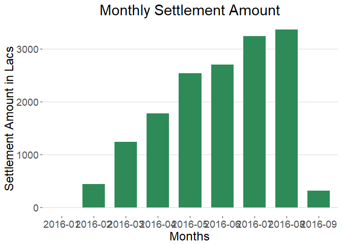

``` r
#September month settlement amount detail is less because it didn't contain all the settlement (it included only the onetime_settlemnt which had happened befor 15-Sep, so we can ignore the sep month amount)
```

``` r
  ## Aggregated Settlement amount by Cycle Id
    settlements_data %>% group_by(cycle_id) %>% summarise(total_amount=sum(settlement_amount)) %>% data.frame() %>% 
    ggplot(aes(x=cycle_id, y=total_amount/100000)) + geom_bar(stat = "identity", width = 0.7, fill="maroon4") + 
    theme_hc(base_size = 18, base_family = "sans") + labs(x="Cycle ID",y="Settlement Amount in Lacs") + 
    ggtitle("Settlement Amount By Cycle ID") + theme(plot.title = element_text(hjust = 0.5))
```

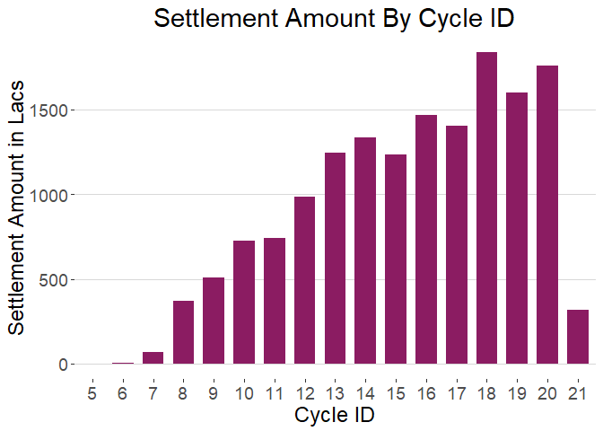

``` r
#Cycle 21 settlement amount detail is less because it didn't contain all the settlement (it included only the onetime_settlemnt so we can ignore the cycle 21 amount)
```

``` r
  ## Aggregated monthly settlement amount by different settlement status
    settlements_data %>% group_by(Year_Month,settlement_status) %>% summarise(total_amount=sum(settlement_amount)) %>% data.frame() %>% 
    ggplot(aes(x=Year_Month, y=total_amount/100000, fill=settlement_status)) + geom_bar(stat = "identity", width = 0.6) +   
    theme_hc(base_size = 18, base_family = "sans") + labs(x="Months",y="Settlement Amount in Lacs") + 
    ggtitle("Monthly Settlement Amount By Status Type") + theme(plot.title = element_text(hjust = 0.5)) + 
    scale_fill_manual("Settlement Status: ", values = c("bill_pending" = "red1", "bill_settled" = "green4", "onetime_settlement" = "navyblue"))
```

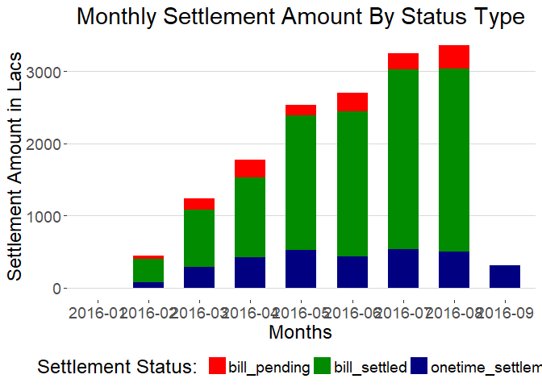

``` r
#September month settlement amount detail is less because it didn't contain all the settlement (it included only the onetime_settlemnt which had happened befor 15-Sep, so we can ignore the sep month amount)
```

``` r
  ## Aggregated settlement amount by cyle_id for different settlement status
    settlements_data %>% group_by(cycle_id,settlement_status) %>% summarise(total_amount=sum(settlement_amount)) %>% data.frame() %>% 
    ggplot(aes(x=cycle_id, y=total_amount/100000, fill=settlement_status)) + geom_bar(stat = "identity", width = 0.6) + 
    theme_hc(base_size = 18, base_family = "sans") + labs(x="Cycle ID",y="Settlement Amount in Lacs") + 
    ggtitle("Settlement Amount By Cycle ID") + theme(plot.title = element_text(hjust = 0.5)) + 
    scale_fill_manual("Settlement Status: ", values = c("bill_pending" = "orangered", "bill_settled" = "palegreen4", "onetime_settlement" = "yellow1"))
```

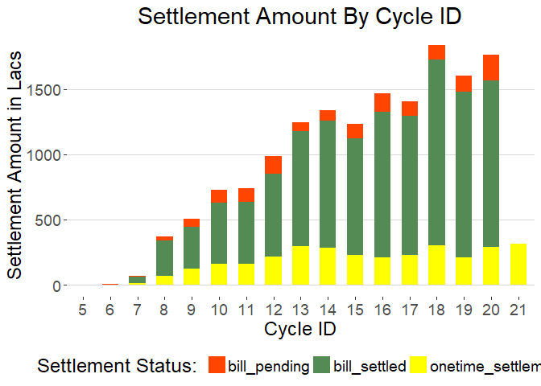

``` r
#Cycle 21 settlement amount detail is less because it didn't contain all the settlement (it included only the onetime_settlemnt so we can ignore the cycle 21 amount)
```

``` r
  ## Monthly numbers of amount settlement required
    settlements_data %>% group_by(Year_Month,settlement_status) %>% summarise(count=n()) %>% data.frame() %>% 
    ggplot(aes(x=Year_Month, y=count, fill=settlement_status)) + geom_bar(stat = "identity", width = 0.7) + 
    theme_hc(base_size = 18, base_family = "sans") + labs(x="Months",y="Frequency of Amount Settlement") + 
    ggtitle("Monthly Settlement Amount Counts") + theme(plot.title = element_text(hjust = 0.5)) + 
    scale_fill_manual("Settlement Status: ", values = c("bill_pending" = "red1", "bill_settled" = "green4", "onetime_settlement" = "navyblue"))
```

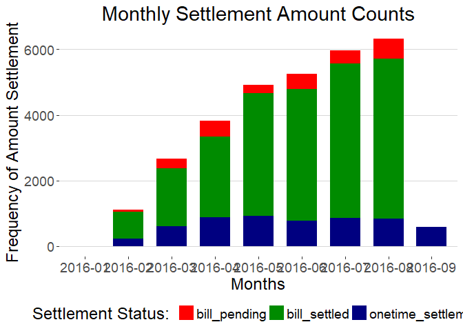

``` r
#September month settlement amount count detail is less because it didn't contain all the settlement (it included only the onetime_settlemnt)
```

``` r
  ## Settlement Amount Counts For Each Cyle
    settlements_data %>% group_by(cycle_id,settlement_status) %>% summarise(count=n()) %>% data.frame() %>% 
    ggplot(aes(x=cycle_id, y=count, fill=settlement_status)) + geom_bar(stat = "identity", width = 0.7) + 
    theme_hc(base_size = 18, base_family = "sans") + labs(x="Cycle ID",y="Frequency of Amount Settlement") + 
    ggtitle("Settlement Amount Counts For Each Cyle") + theme(plot.title = element_text(hjust = 0.5)) + 
    scale_fill_manual("Settlement Status: ", values = c("bill_pending" = "red1", "bill_settled" = "green4", "onetime_settlement" = "navyblue"))
```

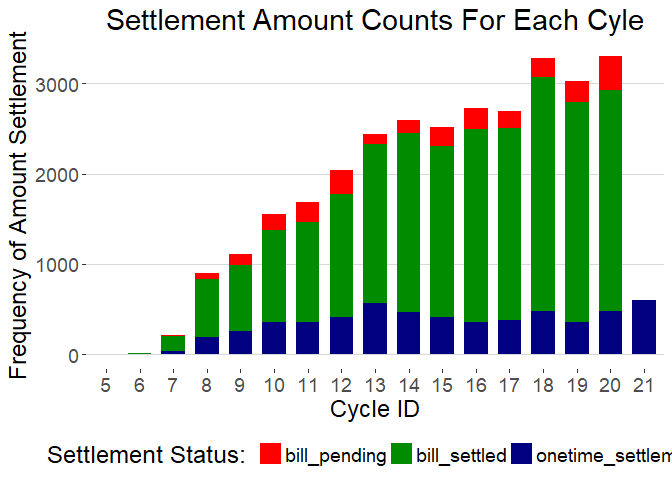

``` r
#Cycle 21 settlement amount detail is less because it didn't contain all the settlement (it included only the onetime_settlemnt)
```

``` r
  ## Hourly Settlement Amount Frequency
    settlements_data %>% group_by(Hour,settlement_status) %>% summarise(count=n()) %>% data.frame() %>% 
    ggplot(aes(x=Hour, y=count, fill=settlement_status)) + geom_bar(stat = "identity", width = 0.7) + 
    theme_hc(base_size = 18, base_family = "sans") + labs(x="Hours",y="Frequency of Amount Settlement") + 
    ggtitle("Hourly Settlement Amount Frequency") + theme(plot.title = element_text(hjust = 0.5)) + 
    scale_fill_manual("Settlement Status: ", values = c("bill_pending" = "orangered", "bill_settled" = "palegreen4", "onetime_settlement" = "goldenrod1"))
```

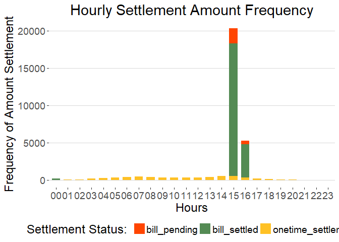

``` r
  ## Monthly Average Days Delayed For payment for 'bill_settled' Status
    settlements_data %>% filter(settlement_status=="bill_settled") %>% group_by(Year_Month) %>% 
    summarise(mean_days_delayed=mean(days_delayed)) %>% data.frame() %>% ggplot(aes(x=Year_Month, y=mean_days_delayed)) + 
    geom_bar(stat = "identity", width = 0.5, fill="turquoise3") + theme_hc(base_size = 18, base_family = "sans") + 
    labs(x="Months",y="Average days delayed for settlement") + ggtitle("Monthly Average Days Delayed For 'bill_settled' Status") + 
    theme(plot.title = element_text(hjust = 0.5))
```

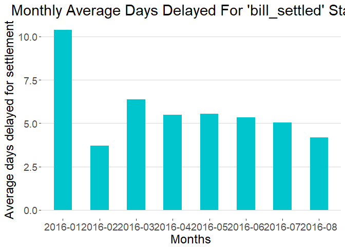

``` r
  ## Average Days Delayed for 'bill_settled' settlement Status in each cycle
    settlements_data %>% filter(settlement_status=="bill_settled") %>% group_by(cycle_id) %>% 
    summarise(mean_days_delayed=mean(days_delayed)) %>% data.frame() %>% ggplot(aes(x=cycle_id, y=mean_days_delayed)) + 
    geom_bar(stat = "identity", width = 0.5, fill="chocolate4") + theme_hc(base_size = 18, base_family = "sans") + 
    labs(x="Cycle ID",y="Average days delayed for settlement") + ggtitle("Average Days Delayed For 'bill_settled' Status") + 
    theme(plot.title = element_text(hjust = 0.5))
```

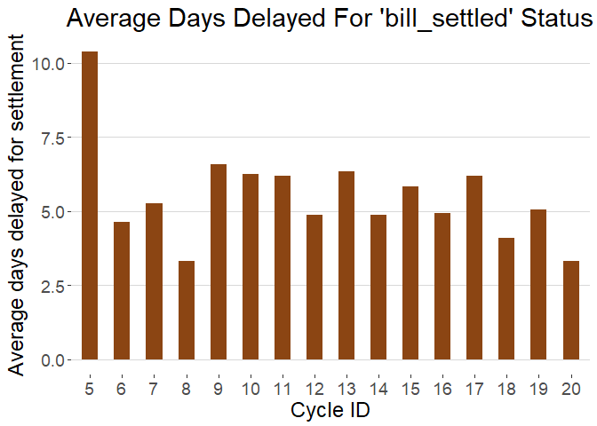

### Failure event data analysis::

``` r
  ## Number of time a particular error appears
    failure_events_data %>% group_by(failure_type) %>% summarise(count=n()) %>% data.frame() %>% ggplot(aes(x=failure_type, y=count)) + 
    geom_bar(stat = "identity", fill="coral") + geom_text(aes(label=count), vjust=-0.3, size=5) + 
    theme_hc(base_size = 18, base_family = "sans") + labs(x="Failure Type",y="Frequency of Failure") + 
    ggtitle("Frequency of Failure Types") + theme(plot.title = element_text(hjust = 0.5))
```

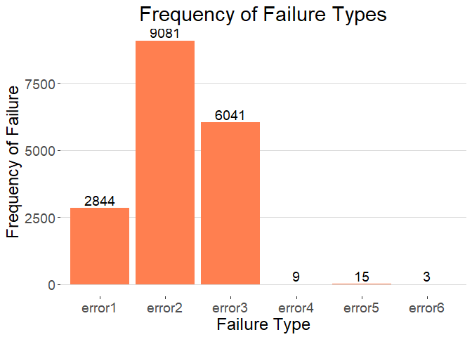

``` r
  ## Aggregated Transactional amount per error type
    failure_events_data %>% group_by(failure_type) %>% summarise(total_amount=sum(amount_in_paise)) %>% data.frame() %>% 
    ggplot(aes(x=failure_type, y=total_amount/100000)) + geom_bar(stat = "identity", fill="blue") + 
    theme_hc(base_size = 18, base_family = "sans") + labs(x="Failure Type",y="Amount in Lacs") + 
    ggtitle("Total Amount Involved In Each Failure") + theme(plot.title = element_text(hjust = 0.5))
```

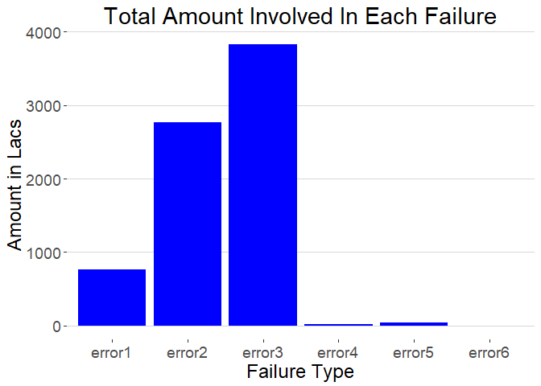

``` r
  ## Count of errors month wise
    failure_events_data %>% group_by(Year_Month) %>% summarise(count=n()) %>% data.frame() %>% ggplot(aes(x=Year_Month, y=count)) + 
    geom_bar(stat = "identity", fill="darkcyan") + geom_text(aes(label=count), vjust=-0.3, size=5) + 
    theme_hc(base_size = 18, base_family = "sans") + labs(x="Months",y="Frequency of Failure") + 
    ggtitle("Monthly Frequency Of Total Failures") + theme(plot.title = element_text(hjust = 0.5))
```

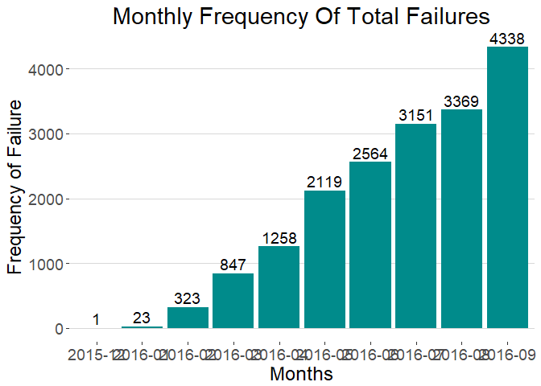

``` r
  ## Monthly Distribution of different failure type 
    failure_events_data %>% group_by(Year_Month,failure_type) %>% summarise(count=n()) %>% data.frame() %>% 
    ggplot(aes(x=Year_Month, y=count, fill=failure_type)) + geom_bar(stat = "identity") + theme_hc(base_size = 18, base_family = "sans") +
    labs(x="Months",y="Frequency of Failure") + ggtitle("Monthly Frequency Of Each Failure") + 
    theme(plot.title = element_text(hjust = 0.5))
```

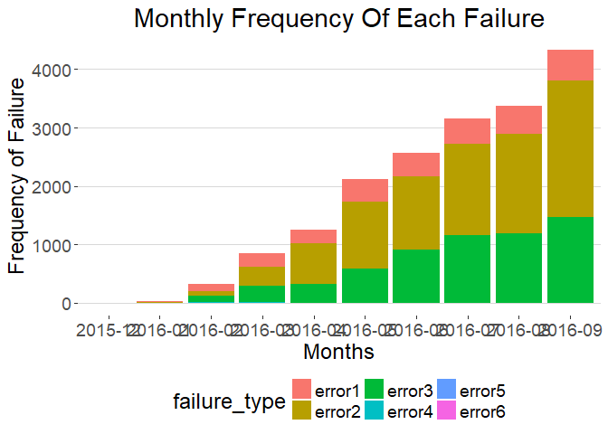

``` r
  ## Aggregated monthly frequency of users associated with failed transactions
    failure_events_data %>% group_by(Year_Month) %>% summarise(count=length(unique(user_id))) %>% data.frame() %>% 
    ggplot(aes(x=Year_Month, y=count)) + geom_bar(stat = "identity", fill="darkorange") + theme_hc(base_size = 18, base_family = "sans") +
    geom_text(aes(label=count), vjust=-0.3, size=5) + labs(x="Months",y="Frequency of Unique Users") + 
    ggtitle("Monthly Unique Users Associated With Failed Transactions") + 
    theme(plot.title = element_text(hjust = 0.5),axis.text.x = element_text(angle=90, vjust = 0.5))
```

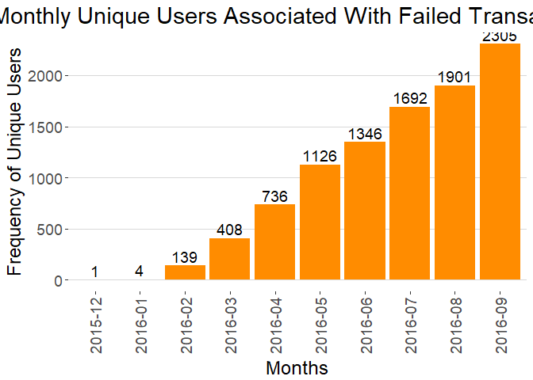

``` r
  ## Hourly count of errors
    failure_events_data %>% group_by(Hour) %>% summarise(count=n()) %>% data.frame() %>% ggplot(aes(x=Hour, y=count)) + 
    geom_bar(stat = "identity", fill="darkslategray4")  + geom_text(aes(label=count), vjust=-0.3, size=3.5) + 
    theme_hc(base_size = 18, base_family = "sans") + labs(x="Hours",y="Frequency of Failure") + 
    ggtitle("Failed Transactions By Hours") + theme(plot.title = element_text(hjust = 0.5))
```

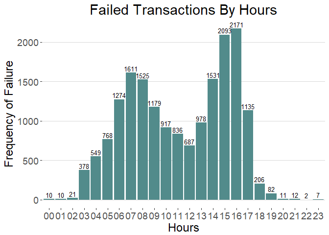

``` r
  ## Hourly distribution of errors
    failure_events_data %>% group_by(Hour, failure_type) %>% summarise(count=n()) %>% data.frame() %>% 
    ggplot(aes(x=Hour, y=count, fill=failure_type)) + geom_bar(stat = "identity") + theme_hc(base_size = 18, base_family = "sans") +
    labs(x="Hours",y="Frequency of Failure") + ggtitle("Frequency Of Failure Types By Hours") + 
    theme(plot.title = element_text(hjust = 0.5))
```

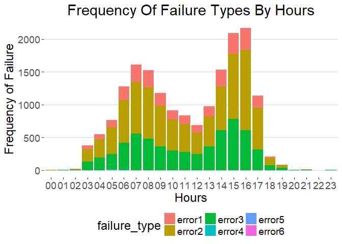

``` r
  ## Aggregated failed transactional Amount by each hours
    failure_events_data %>% group_by(Hour) %>% summarise(total_amount=sum(amount_in_paise)) %>% data.frame() %>% 
    ggplot(aes(x=Hour, y=total_amount/100000)) + geom_bar(stat = "identity", fill="deeppink3") + 
    theme_hc(base_size = 18, base_family = "sans") + labs(x="Hours",y="Amount in Lacs") + 
    ggtitle("Hourly Total Transactional Failure Amount") + theme(plot.title = element_text(hjust = 0.5))
```


``` r
  ## Top 10 Cities from where most of the transactions failed
    failure_events_data %>% group_by(city_id) %>% summarise(count=n()) %>% data.frame() %>% arrange(desc(count)) %>% 
    head(10) %>% ggplot(aes(x=city_id, y=count)) + geom_bar(stat = "identity", fill="yellowgreen") + 
    theme_hc(base_size = 18, base_family = "sans") + geom_text(aes(label=count), vjust=-0.3, size=5) + 
    labs(x="City ID",y="Frequency of Failures") + ggtitle("City With Most Failed Transactions") + 
    theme(plot.title = element_text(hjust = 0.5))
```

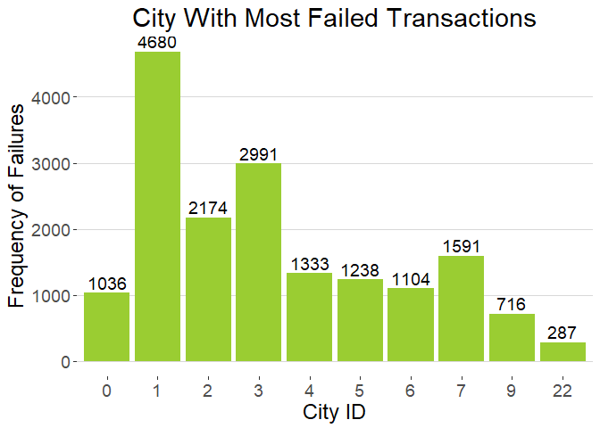
