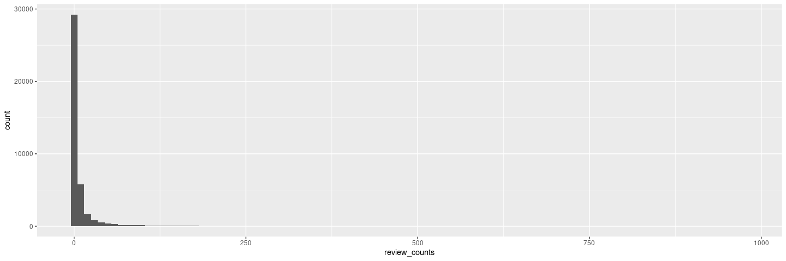
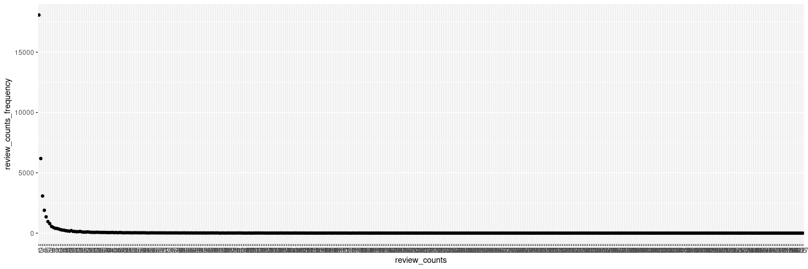
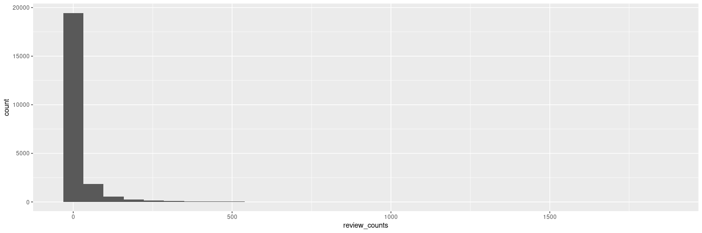
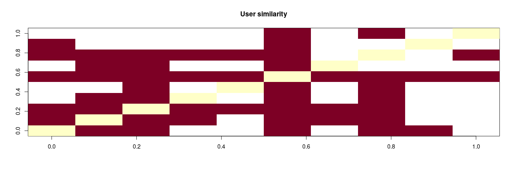
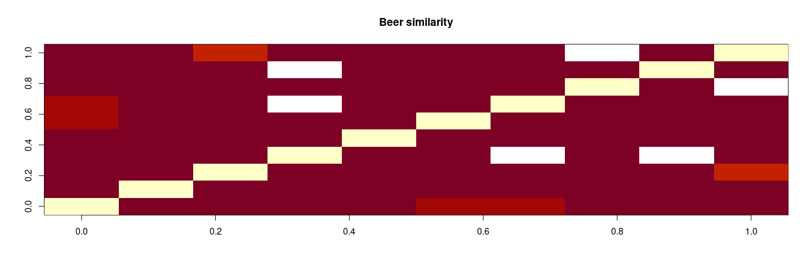
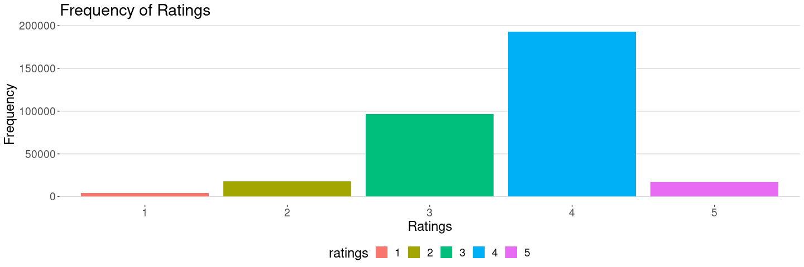
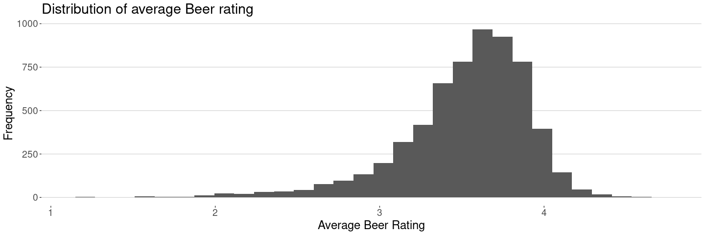
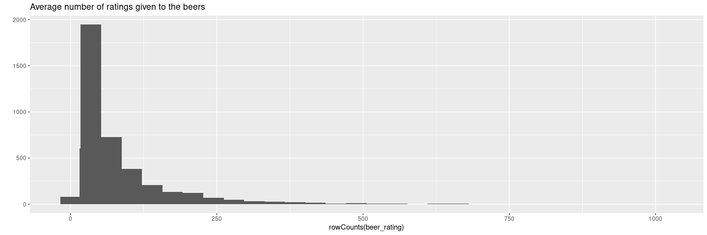
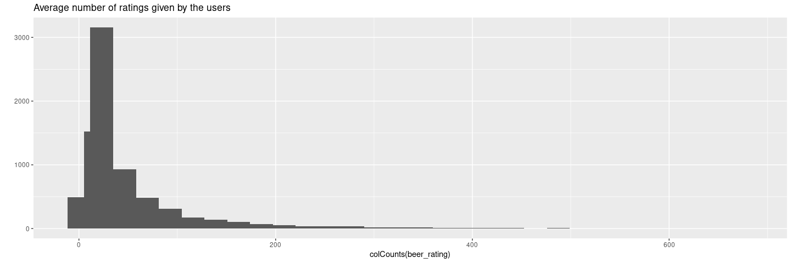
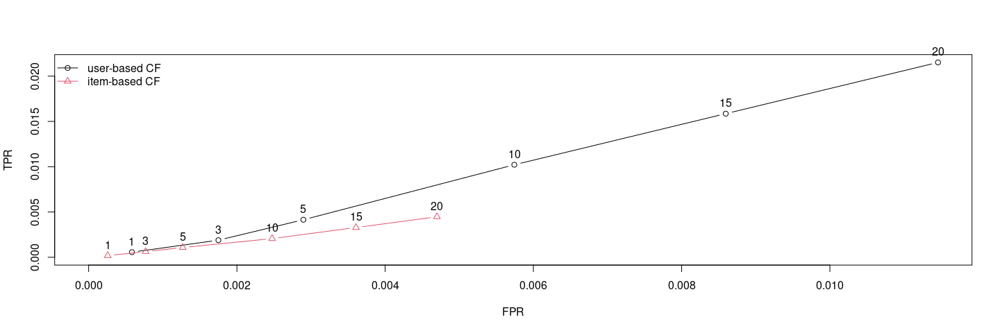

Beer Recommender System
================

### **1. Data Understanding**

#### **1.1. Load Libraries**

``` r
library(recommenderlab)
library(ggplot2)
library(ggthemes)
library(dplyr)
```

#### **1.2. Load Data file**

``` r
beer_data <- read.csv("beer_data.csv", stringsAsFactors = FALSE)
```

``` r
str(beer_data)   # 475984 obs. of  3 variables
```

    ## 'data.frame':    475984 obs. of  3 variables:
    ##  $ beer_beerid       : int  48215 52159 52159 52159 52159 58046 58046 58046 58046 58046 ...
    ##  $ review_profilename: chr  "stcules" "oline73" "alpinebryant" "rawthar" ...
    ##  $ review_overall    : num  3 3 3 4 3.5 4.5 4 4.5 4.5 4 ...

### **2. Data Preparation**

#### **2.1. checking for ‘NA’ values**

``` r
sapply(beer_data, function(x) sum(is.na(x)))  #Dataset doesn't contain 'NA' values
```

    ##        beer_beerid review_profilename     review_overall 
    ##                  0                  0                  0

#### **2.2. Checking for the blank/empty values**

``` r
sapply(beer_data, function(x) length(which(x=="")))  #100 users without profile name
```

    ##        beer_beerid review_profilename     review_overall 
    ##                  0                100                  0

#### **2.3. Removing the records with the empty profilename**

``` r
beer_data[beer_data == ""] <-NA
beer_data <- beer_data[!is.na(beer_data$review_profilename),]
nrow(beer_data) #475884
```

    ## [1] 475884

#### **2.4. Removing the duplicate records (or the user who provided the review for same beer more than once)**

``` r
beer_data_deduplicated <- beer_data[!duplicated(beer_data[,1:2]),]
nrow(beer_data_deduplicated)  #Removed 1422 duplicate records
```

    ## [1] 474462

#### **2.5. Removing the beers with ‘0’ rating**

##### **2.5.1. Checking if there are records with rating ‘0’**

``` r
table(beer_data_deduplicated$review_overall)  #6 records
```

    ## 
    ##      0      1    1.5      2    2.5      3    3.5      4    4.5      5 
    ##      6   3284   3810  11587  17557  49426  90578 174240  96937  27037

##### **2.5.2. Revmoved the rows(or beer) with ‘0’ rating**

``` r
beer_data_filtered <- subset(beer_data_deduplicated, beer_data_deduplicated$review_overall !=0)
nrow(beer_data_filtered)  # Removed 6 rows where rating were '0'
```

    ## [1] 474456

### **3. Data Preparation and Exploratory Data Analysis (EDA)**

#### **3.1. Choose only those beers that have at least N number of reviews**

##### **3.1.1. Creating a data frame to store the review counts for each beerid**

``` r
beer_review_count <- as.data.frame(table(beer_data_filtered$beer_beerid))
colnames(beer_review_count) <- c("beerid", "review_counts")
View(beer_review_count)
```

###### **3.1.1.1. Analysing beerid review counts**

``` r
summary(beer_review_count$review_counts)
```

    ##    Min. 1st Qu.  Median    Mean 3rd Qu.    Max. 
    ##    1.00    1.00    2.00   11.77    5.00  977.00

``` r
quantile(beer_review_count$review_counts, probs = seq(0, 1, .01))  # Around 40% beer having single review
```

    ##   0%   1%   2%   3%   4%   5%   6%   7%   8%   9%  10%  11%  12%  13%  14%  15% 
    ##    1    1    1    1    1    1    1    1    1    1    1    1    1    1    1    1 
    ##  16%  17%  18%  19%  20%  21%  22%  23%  24%  25%  26%  27%  28%  29%  30%  31% 
    ##    1    1    1    1    1    1    1    1    1    1    1    1    1    1    1    1 
    ##  32%  33%  34%  35%  36%  37%  38%  39%  40%  41%  42%  43%  44%  45%  46%  47% 
    ##    1    1    1    1    1    1    1    1    1    1    1    1    1    2    2    2 
    ##  48%  49%  50%  51%  52%  53%  54%  55%  56%  57%  58%  59%  60%  61%  62%  63% 
    ##    2    2    2    2    2    2    2    2    2    2    2    2    2    3    3    3 
    ##  64%  65%  66%  67%  68%  69%  70%  71%  72%  73%  74%  75%  76%  77%  78%  79% 
    ##    3    3    3    3    4    4    4    4    4    5    5    5    6    6    6    7 
    ##  80%  81%  82%  83%  84%  85%  86%  87%  88%  89%  90%  91%  92%  93%  94%  95% 
    ##    7    8    9   10   11   12   13   15   16   19   21   24   28   34   41   51 
    ##  96%  97%  98%  99% 100% 
    ##   65   86  121  195  977

``` r
ggplot(beer_review_count, aes(x=review_counts)) + geom_histogram(bins = 100) # Most of the beers having single review count
```

<!-- -->

###### **3.1.1.2. Taking the average number of reviews as &gt;11**

``` r
beer_review_count_filter <- subset(beer_review_count, beer_review_count$review_counts>11)
```

##### **3.1.2. Calculating the frequency of review counts**

``` r
beer_review_count_freq <- as.data.frame(table(beer_review_count$review_counts))
colnames(beer_review_count_freq) <- c("review_counts", "review_counts_frequency")
ggplot(beer_review_count_freq,aes(x=review_counts,y=review_counts_frequency)) + geom_point() #review=1 having maximum number of counts
```

<!-- -->

##### **3.1.3. Aggregating the reviews by userprofile**

``` r
beer_user_review_count <- as.data.frame(table(beer_data_filtered$review_profilename))
colnames(beer_user_review_count) <- c("profilename", "review_counts")
View(beer_user_review_count)
```

###### **3.1.3.1. Analysing userid review counts**

``` r
summary(beer_user_review_count$review_counts)
```

    ##    Min. 1st Qu.  Median    Mean 3rd Qu.    Max. 
    ##    1.00    1.00    3.00   21.09   11.00 1842.00

``` r
quantile(beer_user_review_count$review_counts, probs = seq(0, 1, .01))  # Around 30% of users has provided a review for one beer
```

    ##      0%      1%      2%      3%      4%      5%      6%      7%      8%      9% 
    ##    1.00    1.00    1.00    1.00    1.00    1.00    1.00    1.00    1.00    1.00 
    ##     10%     11%     12%     13%     14%     15%     16%     17%     18%     19% 
    ##    1.00    1.00    1.00    1.00    1.00    1.00    1.00    1.00    1.00    1.00 
    ##     20%     21%     22%     23%     24%     25%     26%     27%     28%     29% 
    ##    1.00    1.00    1.00    1.00    1.00    1.00    1.00    1.00    1.00    1.00 
    ##     30%     31%     32%     33%     34%     35%     36%     37%     38%     39% 
    ##    1.00    1.00    1.00    1.00    1.00    1.00    2.00    2.00    2.00    2.00 
    ##     40%     41%     42%     43%     44%     45%     46%     47%     48%     49% 
    ##    2.00    2.00    2.00    2.00    2.00    2.00    2.00    2.00    2.00    3.00 
    ##     50%     51%     52%     53%     54%     55%     56%     57%     58%     59% 
    ##    3.00    3.00    3.00    3.00    3.00    3.00    4.00    4.00    4.00    4.00 
    ##     60%     61%     62%     63%     64%     65%     66%     67%     68%     69% 
    ##    4.00    5.00    5.00    5.00    5.00    6.00    6.00    6.00    7.00    7.00 
    ##     70%     71%     72%     73%     74%     75%     76%     77%     78%     79% 
    ##    8.00    8.00    9.00    9.00   10.00   11.00   12.00   13.00   14.00   15.00 
    ##     80%     81%     82%     83%     84%     85%     86%     87%     88%     89% 
    ##   17.00   18.00   20.00   22.00   24.00   27.00   30.00   34.00   38.00   43.00 
    ##     90%     91%     92%     93%     94%     95%     96%     97%     98%     99% 
    ##   48.00   55.00   63.00   73.00   86.00  101.00  124.00  157.00  213.00  315.08 
    ##    100% 
    ## 1842.00

``` r
ggplot(beer_user_review_count, aes(x=review_counts)) + geom_histogram(bins = 30) # Most of the beers having single review count
```

<!-- -->

###### **3.1.3.2. Taking the average number of reviews as &gt;21**

``` r
beer_user_review_count_filter <- subset(beer_user_review_count, beer_user_review_count$review_counts>21)
```

##### **3.1.4. Creating a data frame based on the above filters**

``` r
beer_data_final <- beer_data_filtered[(beer_data_filtered$beer_beerid %in% beer_review_count_filter$beerid)& 
                                          (beer_data_filtered$review_profilename %in% beer_user_review_count_filter$profilename),]
```

``` r
str(beer_data_final)
```

    ## 'data.frame':    327820 obs. of  3 variables:
    ##  $ beer_beerid       : int  58046 58046 58046 58046 58046 58046 436 58046 58046 58046 ...
    ##  $ review_profilename: chr  "dbmernin83" "Blakaeris" "bashiba" "oberon" ...
    ##  $ review_overall    : num  4 4.5 4.5 4 4.5 4 3 4.5 4.5 3.5 ...

###### **3.1.4.1. Converting “beerid” and “profilename” in to factor, Also “review\_overall” into integer**

``` r
beer_data_final$beer_beerid <- as.factor(beer_data_final$beer_beerid)
beer_data_final$review_profilename <- as.factor((beer_data_final$review_profilename))
beer_data_final$review_overall <- as.integer(beer_data_final$review_overall)
```

###### **3.1.4.2. Interchanging the column order, making profilename (or User) as first column and Beerid as 2nd column**

``` r
beer_data_final <- beer_data_final[,c(2,1,3)]
```

#### **3.2. Converting the Dataframe into realRatingMatrix**

``` r
beer_rating <- as(beer_data_final, "realRatingMatrix")
class(beer_rating)
```

    ## [1] "realRatingMatrix"
    ## attr(,"package")
    ## [1] "recommenderlab"

##### **3.2.1. get some information**

``` r
dim(beer_rating)
```

    ## [1] 3874 6150

``` r
#dimnames(beer_rating)
#rowCounts(beer_rating)
#colCounts(beer_rating)
#rowMeans(beer_rating)
```

### **4. Data Exploration**

#### **4.1. Determine how similar the first ten users are with each other and visualise it**

``` r
similar_users <- similarity(beer_rating[1:10, ], method = "cosine", which = "users")
```

##### **4.1.1. Similarity matrix**

``` r
as.matrix(similar_users)
```

    ##            0110x011  05Harley 100floods 1759Girl 1Adam12  1fastz28  1whiskey
    ## 0110x011  0.0000000 1.0000000 1.0000000       NA      NA 0.9938837        NA
    ## 05Harley  1.0000000 0.0000000 1.0000000        1      NA 0.9901475 1.0000000
    ## 100floods 1.0000000 1.0000000 0.0000000        1       1 0.9941348 0.9949367
    ## 1759Girl         NA 1.0000000 1.0000000        0      NA 1.0000000        NA
    ## 1Adam12          NA        NA 1.0000000       NA       0 1.0000000        NA
    ## 1fastz28  0.9938837 0.9901475 0.9941348        1       1 0.0000000 0.9899495
    ## 1whiskey         NA 1.0000000 0.9949367       NA      NA 0.9899495 0.0000000
    ## 2xHops    1.0000000 1.0000000 0.9938837        1       1 1.0000000        NA
    ## 321jeff   1.0000000        NA        NA       NA      NA 1.0000000        NA
    ## 32hoss32         NA        NA        NA       NA      NA 0.9824561        NA
    ##              2xHops 321jeff  32hoss32
    ## 0110x011  1.0000000       1        NA
    ## 05Harley  1.0000000      NA        NA
    ## 100floods 0.9938837      NA        NA
    ## 1759Girl  1.0000000      NA        NA
    ## 1Adam12   1.0000000      NA        NA
    ## 1fastz28  1.0000000       1 0.9824561
    ## 1whiskey         NA      NA        NA
    ## 2xHops    0.0000000      NA 1.0000000
    ## 321jeff          NA       0        NA
    ## 32hoss32  1.0000000      NA 0.0000000

##### **4.1.2. Visualise similarity matrix**

``` r
image(as.matrix(similar_users), main = "User similarity")
```

<!-- -->

#### **4.2. Compute and visualize the similarity between the first 10 beers**

``` r
similar_beers <- similarity(beer_rating[,1:10 ], method = "cosine", which = "items")
```

##### **4.2.1. Similarity matrix**

``` r
as.matrix(similar_beers)
```

    ##            5         6         7         8         9        10        11
    ## 5  0.0000000 0.9773756 0.9837143 0.9909924 0.9585225 0.9084863 0.9032271
    ## 6  0.9773756 0.0000000 0.9403636 0.9370791 0.9738238 0.9724816 0.9261584
    ## 7  0.9837143 0.9403636 0.0000000 0.9827076 0.9806513 0.9334357 0.9922779
    ## 8  0.9909924 0.9370791 0.9827076 0.0000000 0.9899495 0.9756098        NA
    ## 9  0.9585225 0.9738238 0.9806513 0.9899495 0.0000000 0.9454171 1.0000000
    ## 10 0.9084863 0.9724816 0.9334357 0.9756098 0.9454171 0.0000000 0.9993148
    ## 11 0.9032271 0.9261584 0.9922779        NA 1.0000000 0.9993148 0.0000000
    ## 12 1.0000000 0.9897475 0.9918366 1.0000000 0.9260924 1.0000000 0.9510442
    ## 13 0.9867973 0.9899495 0.9772992        NA 1.0000000 0.9271726 0.9909924
    ## 14 1.0000000 0.9186708 0.8021806 1.0000000 1.0000000 0.9506687 0.9682773
    ##           12        13        14
    ## 5  1.0000000 0.9867973 1.0000000
    ## 6  0.9897475 0.9899495 0.9186708
    ## 7  0.9918366 0.9772992 0.8021806
    ## 8  1.0000000        NA 1.0000000
    ## 9  0.9260924 1.0000000 1.0000000
    ## 10 1.0000000 0.9271726 0.9506687
    ## 11 0.9510442 0.9909924 0.9682773
    ## 12 0.0000000 1.0000000        NA
    ## 13 1.0000000 0.0000000 1.0000000
    ## 14        NA 1.0000000 0.0000000

##### **4.2.2. Visualize similarity matrix**

``` r
image(as.matrix(similar_beers), main = "Beer similarity")
```

<!-- -->

#### **4.3. What are the unique values of ratings?**

``` r
ratings <- as.vector(beer_rating@data)
unique_ratings <- unique(ratings)
sort(unique_ratings)   # 0 1 2 3 4 5
```

    ## [1] 0 1 2 3 4 5

#### **4.4. Visualize the rating values and notice**

``` r
table(ratings)
```

    ## ratings
    ##        0        1        2        3        4        5 
    ## 23497280     3902    17991    96341   192692    16894

##### Removing the Rating=0, as 0 was genereated beacuse of the missing values while converting the data frame in to realRatingMatrix

``` r
ratings <- factor(ratings[ratings != 0])
```

##### Visualizing the beer ratings

``` r
qplot(ratings, xlab = "Ratings", ylab = "Frequency", main = "Frequency of Ratings", fill = ratings) + 
theme_hc(base_size = 18, base_family = "sans")
```

<!-- -->

``` r
# Most the reviews given by user having rating 4 followed by 3
```

##### **4.4.1. The average beer ratings**

``` r
avg_beer_rating <- colMeans(beer_rating)
summary(avg_beer_rating)  #3.5
```

    ##    Min. 1st Qu.  Median    Mean 3rd Qu.    Max. 
    ##   1.161   3.350   3.593   3.525   3.786   4.667

###### **4.4.1.1. Visualizing the average beer rating through plot**

``` r
qplot(avg_beer_rating, xlab = "Average Beer Rating", ylab = "Frequency", main = "Distribution of average Beer rating") + 
stat_bin(binwidth = 0.05) + theme_hc(base_size = 18, base_family = "sans")
```

    ## `stat_bin()` using `bins = 30`. Pick better value with `binwidth`.

<!-- -->

##### **4.4.2. The average user ratings**

``` r
avg_user_rating <- rowMeans(beer_rating)
summary(avg_user_rating)  #3.6
```

    ##    Min. 1st Qu.  Median    Mean 3rd Qu.    Max. 
    ##   2.600   3.494   3.650   3.629   3.781   4.950

###### **4.4.2.1. Visualizing the average beer rating through plot**

``` r
qplot(avg_beer_rating, xlab = "Average User Rating", ylab = "Frequency", main = "Distribution of Average User Rating") + 
stat_bin(binwidth = 0.05) + theme_hc(base_size = 18, base_family = "sans")
```

    ## `stat_bin()` using `bins = 30`. Pick better value with `binwidth`.

<!-- -->

##### **4.4.3. The average number of ratings given to the beers**

``` r
qplot(rowCounts(beer_rating), main = "Average number of ratings given to the beers") + stat_bin(binwidth = 10)
```

    ## `stat_bin()` using `bins = 30`. Pick better value with `binwidth`.

<!-- -->

``` r
summary(rowCounts(beer_rating)) #84
```

    ##    Min. 1st Qu.  Median    Mean 3rd Qu.    Max. 
    ##    4.00   30.00   50.00   84.62   99.00 1016.00

``` r
number_of_ratings_beer <- group_by(beer_data_final,beer_beerid) %>% summarise(rating_counts =n())
summary(number_of_ratings_beer)  
```

    ##   beer_beerid   rating_counts  
    ##  5      :   1   Min.   :  4.0  
    ##  6      :   1   1st Qu.: 16.0  
    ##  7      :   1   Median : 26.0  
    ##  8      :   1   Mean   : 53.3  
    ##  9      :   1   3rd Qu.: 60.0  
    ##  10     :   1   Max.   :677.0  
    ##  (Other):6144

##### **4.4.4. The average number of ratings given by the users**

``` r
qplot(colCounts(beer_rating), main = "Average number of ratings given by the users") + stat_bin(binwidth = 10)
```

    ## `stat_bin()` using `bins = 30`. Pick better value with `binwidth`.

<!-- -->

``` r
summary(colCounts(beer_rating))  #53
```

    ##    Min. 1st Qu.  Median    Mean 3rd Qu.    Max. 
    ##     4.0    16.0    26.0    53.3    60.0   677.0

``` r
number_of_ratings_user <- group_by(beer_data_final,review_profilename) %>% summarise(rating_counts =n())
summary(number_of_ratings_user) 
```

    ##  review_profilename rating_counts    
    ##  0110x011 :   1     Min.   :   4.00  
    ##  05Harley :   1     1st Qu.:  30.00  
    ##  100floods:   1     Median :  50.00  
    ##  1759Girl :   1     Mean   :  84.62  
    ##  1Adam12  :   1     3rd Qu.:  99.00  
    ##  1fastz28 :   1     Max.   :1016.00  
    ##  (Other)  :3868

### **5. Recommendation Models**

#### \*\*5.1. List of models available

``` r
recommender_models <- recommenderRegistry$get_entries(dataType = "realRatingMatrix")
names(recommender_models)# 9 types of models
```

    ##  [1] "HYBRID_realRatingMatrix"       "ALS_realRatingMatrix"         
    ##  [3] "ALS_implicit_realRatingMatrix" "IBCF_realRatingMatrix"        
    ##  [5] "LIBMF_realRatingMatrix"        "POPULAR_realRatingMatrix"     
    ##  [7] "RANDOM_realRatingMatrix"       "RERECOMMEND_realRatingMatrix" 
    ##  [9] "SVD_realRatingMatrix"          "SVDF_realRatingMatrix"        
    ## [11] "UBCF_realRatingMatrix"

#### \*\*5.2. Description of recommendation system algorithms/models used

``` r
lapply(recommender_models, "[[", "description")
```

    ## $HYBRID_realRatingMatrix
    ## [1] "Hybrid recommender that aggegates several recommendation strategies using weighted averages."
    ## 
    ## $ALS_realRatingMatrix
    ## [1] "Recommender for explicit ratings based on latent factors, calculated by alternating least squares algorithm."
    ## 
    ## $ALS_implicit_realRatingMatrix
    ## [1] "Recommender for implicit data based on latent factors, calculated by alternating least squares algorithm."
    ## 
    ## $IBCF_realRatingMatrix
    ## [1] "Recommender based on item-based collaborative filtering."
    ## 
    ## $LIBMF_realRatingMatrix
    ## [1] "Matrix factorization with LIBMF via package recosystem (https://cran.r-project.org/web/packages/recosystem/vignettes/introduction.html)."
    ## 
    ## $POPULAR_realRatingMatrix
    ## [1] "Recommender based on item popularity."
    ## 
    ## $RANDOM_realRatingMatrix
    ## [1] "Produce random recommendations (real ratings)."
    ## 
    ## $RERECOMMEND_realRatingMatrix
    ## [1] "Re-recommends highly rated items (real ratings)."
    ## 
    ## $SVD_realRatingMatrix
    ## [1] "Recommender based on SVD approximation with column-mean imputation."
    ## 
    ## $SVDF_realRatingMatrix
    ## [1] "Recommender based on Funk SVD with gradient descend (https://sifter.org/~simon/journal/20061211.html)."
    ## 
    ## $UBCF_realRatingMatrix
    ## [1] "Recommender based on user-based collaborative filtering."

#### \*\*5.3. Checking the parameters of IBCF and UBCF models

``` r
recommender_models$IBCF_realRatingMatrix$parameters  
```

    ## $k
    ## [1] 30
    ## 
    ## $method
    ## [1] "Cosine"
    ## 
    ## $normalize
    ## [1] "center"
    ## 
    ## $normalize_sim_matrix
    ## [1] FALSE
    ## 
    ## $alpha
    ## [1] 0.5
    ## 
    ## $na_as_zero
    ## [1] FALSE

``` r
recommender_models$UBCF_realRatingMatrix$parameters
```

    ## $method
    ## [1] "cosine"
    ## 
    ## $nn
    ## [1] 25
    ## 
    ## $sample
    ## [1] FALSE
    ## 
    ## $weighted
    ## [1] TRUE
    ## 
    ## $normalize
    ## [1] "center"
    ## 
    ## $min_matching_items
    ## [1] 0
    ## 
    ## $min_predictive_items
    ## [1] 0

#### **5.4. Filtering the records in realRatingMatrix, as it was taking more time for experimenting different values of “k” and “train\_split” in order to build model and do evaluation**

``` r
beer_data_final <- beer_data_final[which(beer_data_final$review_overall >3),]
beer_rating <-  as(beer_data_final, "realRatingMatrix") #converting to real rating matrix
beer_rating <- beer_rating[rowCounts(beer_rating) >20,colCounts(beer_rating) >30 ]
```

#### **5.5. Divide your data into training and testing datasets**

##### **5.5.1. Initializing blank DF for storing accuracy measures for UBCF and IBCF**

``` r
error_UBCF <- data.frame()
error_IBCF <- data.frame()
```

##### \*\*5.5.2. Generating sequence for train split

``` r
train_split <- seq(0.7,0.9,by=0.05)
```

##### **5.5.3. Generating sequence for K**

``` r
k_split <- seq(1,5)
```

##### **5.5.4. Figuring out the best values for “k” and “train split”. Then Building, evaluating and make Predictions. It took around 27 mins to execute**

``` r
for (i in train_split){
  for (j in k_split){
        
    # Declaring the scheme
    set.seed(100)
    scheme <- evaluationScheme(beer_rating, method = "split", train = i,k = j, given=7 , goodRating = 4)
        
    # Building the recommendation models
    recom_UBCF<-Recommender(getData(scheme, "train"), "UBCF") 
    recom_IBCF <- Recommender(getData(scheme, "train"), "IBCF") 
        
    # Making the Predictions
    predict_UBCF <- predict(recom_UBCF, getData(scheme, "known"), type="ratings") 
    predict_IBCF<- predict(recom_IBCF, getData(scheme, "known"), type="ratings")
        
    # Evaluating the performance parameters
    error_recom_UBCF<-calcPredictionAccuracy(predict_UBCF, getData(scheme, "unknown"))
    error_recom_IBCF<-calcPredictionAccuracy(predict_IBCF, getData(scheme, "unknown"))
        
    # Storing the result in a dataframe
    error_UBCF1 <- cbind(data.frame(iteration=paste("split_",i,"k_",j)),t(data.frame(error_recom_UBCF)))
    error_UBCF <- rbind(error_UBCF1,error_UBCF)
      
    error_IBCF1 <- cbind(data.frame(iteration=paste("split_",i,"k_",j)),t(data.frame(error_recom_IBCF)))
    error_IBCF <- rbind(error_IBCF1,error_IBCF)
  }
}  
```

##### **5.5.5. Viewing the performance measures for both UBCF and IBCF**

``` r
View(error_UBCF)
```

``` r
View(error_IBCF)
```

##### **5.5.6. Find out the minimum RMSE value among all the iterationshe**

``` r
min(error_UBCF$RMSE)  # 0.2884068
```

    ## [1] 0.3253114

``` r
error_UBCF$iteration[error_UBCF$RMSE==min(error_UBCF$RMSE)]  # split = 0.75, k = 2
```

    ## [1] "split_ 0.7 k_ 3"

``` r
min(error_IBCF$RMSE) # 0.4143252
```

    ## [1] 0.3746343

``` r
error_IBCF$iteration[error_IBCF$RMSE==min(error_IBCF$RMSE)]  # split = 0.9, k = 2
```

    ## [1] "split_ 0.85 k_ 5"

##### **5.5.7. Scheme2 evaluation using cross-validation**

``` r
scheme2 <- evaluationScheme(beer_rating, method = "cross-validation",k = 5, given = 7, goodRating = 4)
```

###### **5.5.7.1. Building the recommendation models**

``` r
recom_UBCF_2<-Recommender(getData(scheme2, "train"), "UBCF") 
recom_IBCF_2 <- Recommender(getData(scheme2, "train"), "IBCF") 
```

###### **5.5.7.2. Making the Predictions**

``` r
predict_UBCF_2 <- predict(recom_UBCF_2, getData(scheme2, "known"), type="ratings") 
predict_IBCF_2 <- predict(recom_IBCF_2, getData(scheme2, "known"), type="ratings")
```

#### **5.6. Compare the performance of the two models and suggest the one that should be deployed. Plot the ROC curves for UBCF and IBCF and compare them**

##### **5.6.1. Evaluating schema using values: split=0.75 and k=2**

``` r
set.seed(100)
scheme_final <- evaluationScheme(beer_rating, method = "split", train = .75, k = 2, given=7 , goodRating = 4)
scheme_final
```

    ## Evaluation scheme with 7 items given
    ## Method: 'split' with 2 run(s).
    ## Training set proportion: 0.750
    ## Good ratings: >=4.000000
    ## Data set: 2808 x 1722 rating matrix of class 'realRatingMatrix' with 143330 ratings.

``` r
algorithms <- list(
  "user-based CF" = list(name="UBCF", param=list(normalize = "Z-score", method="Cosine", nn=30, minRating=4)),
  "item-based CF" = list(name="IBCF", param=list(normalize = "Z-score"))
)
```

##### **5.6.2. Running algorithms to predict next n movies**

``` r
results <- evaluate(scheme_final, algorithms, n=c(1, 3, 5, 10, 15, 20))  ##result of "split" evaluation scheme
```

    ## UBCF run fold/sample [model time/prediction time]
    ##   1  Available parameter (with default values):
    ## method    =  cosine
    ## nn    =  25
    ## sample    =  FALSE
    ## weighted  =  TRUE
    ## normalize     =  center
    ## min_matching_items    =  0
    ## min_predictive_items  =  0
    ## verbose   =  FALSE
    ## [0.042sec/13.04sec] 
    ##   2  Available parameter (with default values):
    ## method    =  cosine
    ## nn    =  25
    ## sample    =  FALSE
    ## weighted  =  TRUE
    ## normalize     =  center
    ## min_matching_items    =  0
    ## min_predictive_items  =  0
    ## verbose   =  FALSE
    ## [0.035sec/13.296sec] 
    ## IBCF run fold/sample [model time/prediction time]
    ##   1  [20.036sec/0.17sec] 
    ##   2  [20.259sec/0.153sec]

``` r
class(results)
```

    ## [1] "evaluationResultList"
    ## attr(,"package")
    ## [1] "recommenderlab"

``` r
result2 <- evaluate(scheme2, algorithms, n=c(1, 3, 5, 10, 15, 20))  #result of "cross-validation" evaluation scheme
```

    ## UBCF run fold/sample [model time/prediction time]
    ##   1  Available parameter (with default values):
    ## method    =  cosine
    ## nn    =  25
    ## sample    =  FALSE
    ## weighted  =  TRUE
    ## normalize     =  center
    ## min_matching_items    =  0
    ## min_predictive_items  =  0
    ## verbose   =  FALSE
    ## [0.052sec/10.17sec] 
    ##   2  Available parameter (with default values):
    ## method    =  cosine
    ## nn    =  25
    ## sample    =  FALSE
    ## weighted  =  TRUE
    ## normalize     =  center
    ## min_matching_items    =  0
    ## min_predictive_items  =  0
    ## verbose   =  FALSE
    ## [0.032sec/10.814sec] 
    ##   3  Available parameter (with default values):
    ## method    =  cosine
    ## nn    =  25
    ## sample    =  FALSE
    ## weighted  =  TRUE
    ## normalize     =  center
    ## min_matching_items    =  0
    ## min_predictive_items  =  0
    ## verbose   =  FALSE
    ## [0.035sec/11.159sec] 
    ##   4  Available parameter (with default values):
    ## method    =  cosine
    ## nn    =  25
    ## sample    =  FALSE
    ## weighted  =  TRUE
    ## normalize     =  center
    ## min_matching_items    =  0
    ## min_predictive_items  =  0
    ## verbose   =  FALSE
    ## [0.036sec/10.887sec] 
    ##   5  Available parameter (with default values):
    ## method    =  cosine
    ## nn    =  25
    ## sample    =  FALSE
    ## weighted  =  TRUE
    ## normalize     =  center
    ## min_matching_items    =  0
    ## min_predictive_items  =  0
    ## verbose   =  FALSE
    ## [0.037sec/11.033sec] 
    ## IBCF run fold/sample [model time/prediction time]
    ##   1  [22.177sec/0.109sec] 
    ##   2  [21.978sec/0.106sec] 
    ##   3  [21.702sec/0.12sec] 
    ##   4  [22.006sec/0.102sec] 
    ##   5  [22.009sec/0.108sec]

``` r
class(result2)
```

    ## [1] "evaluationResultList"
    ## attr(,"package")
    ## [1] "recommenderlab"

##### **5.6.3. Plotting ROC Curves**

``` r
plot(results, annotate = 1:4, legend="topleft")  # UBCF model is better than the IBCF model
```

<!-- -->

``` r
# We can deploy UBCF model for recommendations
    
plot(result2, annotate = 1:4, legend="topleft")  # UBCF model is better than the IBCF model
```

<!-- -->

``` r
# We can deploy UBCF model for recommendations
```

#### **5.7. Give the names of the top 5 beers that you would recommend to the users “cokes”, “genog” & “giblet”**

##### **5.7.1. Using the UBCF model to recommend top 5 beers**

``` r
recommendation_UBCF<-Recommender(getData(scheme_final, "train"), "UBCF") #using scheme with method type as "split"
```

##### **5.7.2. Top 5 beer recommendation for “cokes”**

``` r
recommendations_UBCF_cokes <- predict(recommendation_UBCF, beer_rating["cokes",], n=5)
```

##### **5.7.3. Displaying the recommendations (or recommended beer)**

``` r
as(recommendations_UBCF_cokes, "list")
```

    ## $cokes
    ## [1] "5281"  "54827" "5423"  "45250" "1641"

##### **5.7.3. Top 5 beer recommendation for “genog”**

``` r
recommendations_UBCF_geong <- predict(recommendation_UBCF, beer_rating["genog",], n=5)
```

###### **5.7.3.1. Displaying the recommendations (or recommended beer)**

``` r
as(recommendations_UBCF_geong, "list")
```

    ## $genog
    ## [1] "59214" "5212"  "38334" "234"   "1137"

##### **5.7.4. Top 5 beer recommendation for “giblet”**

``` r
recommendations_UBCF_giblet <- predict(recommendation_UBCF, beer_rating["giblet",], n=5)
```

###### **5.7.4.1. Displaying the recommendations (or recommended beer)**

``` r
as(recommendations_UBCF_giblet, "list")
```

    ## $giblet
    ## [1] "17" "31" "33" "34" "36"

##### **5.7.5. Using the IBCF model to recommend top 5 beers**

``` r
recommendation_IBCF<-Recommender(getData(scheme_final, "train"), "IBCF")
```

##### **5.7.6. Top 5 beer recommendation for “cokes”**

``` r
recommendations_IBCF_cokes <- predict(recommendation_IBCF, beer_rating["cokes",], n=5)
```

###### **5.7.6.1. Displaying the recommendations (or recommended beer)**

``` r
as(recommendations_IBCF_cokes, "list")
```

    ## $cokes
    ## [1] "910"  "1014" "1468" "1645" "9474"

##### **5.7.7. Top 5 beer recommendation for “genog”**

``` r
recommendations_IBCF_geong <- predict(recommendation_IBCF, beer_rating["genog",], n=5)
```

###### **5.7.7.1. Displaying the recommendations (or recommended beer)**

``` r
as(recommendations_IBCF_geong, "list")
```

    ## $genog
    ## [1] "10"  "134" "159" "432" "813"

##### **5.7.8. Top 5 beer recommendation for “giblet”**

``` r
recommendations_IBCF_giblet <- predict(recommendation_IBCF, beer_rating["giblet",], n=5)
```

###### **5.7.8.1. Displaying the recommendations (or recommended beer)**

``` r
as(recommendations_IBCF_giblet, "list")
```

    ## $giblet
    ## character(0)

``` r
# character(0) means user does not found in matrix 
```
