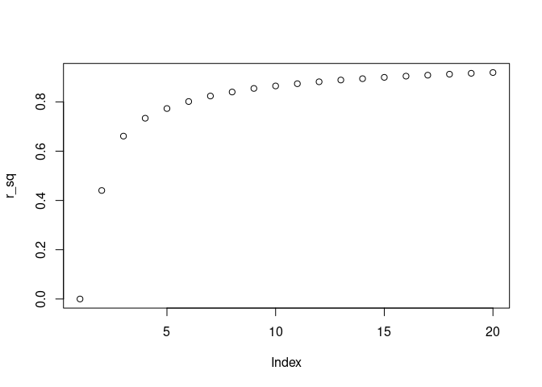
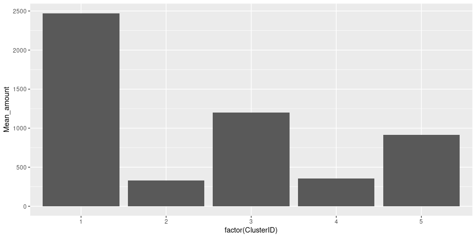
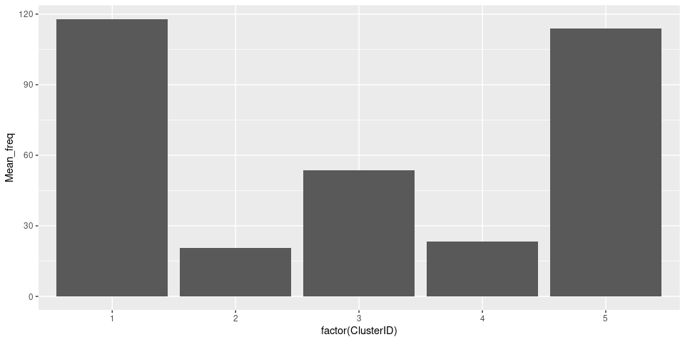
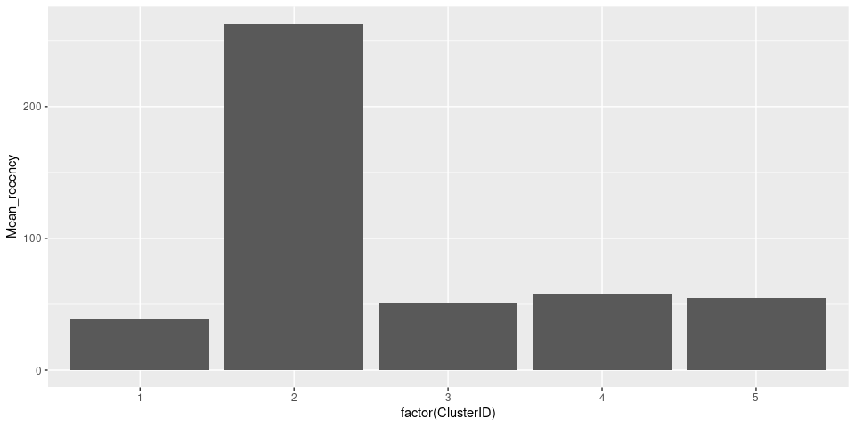

Customer Segmentation - Kmeans
================

### **1. Importing Library**

``` r
library(dplyr)
library(ggplot2)
library(readxl)
library(knitr)
```

### **2. Importing the dataset**

``` r
Online.Retail  <- read_excel("Online Retail.xlsx")
```

| InvoiceNo | StockCode | Description                         | Quantity | InvoiceDate         | UnitPrice | CustomerID | Country        |
|:----------|:----------|:------------------------------------|---------:|:--------------------|----------:|-----------:|:---------------|
| 536365    | 85123A    | WHITE HANGING HEART T-LIGHT HOLDER  |        6 | 2010-12-01 08:26:00 |      2.55 |      17850 | United Kingdom |
| 536365    | 71053     | WHITE METAL LANTERN                 |        6 | 2010-12-01 08:26:00 |      3.39 |      17850 | United Kingdom |
| 536365    | 84406B    | CREAM CUPID HEARTS COAT HANGER      |        8 | 2010-12-01 08:26:00 |      2.75 |      17850 | United Kingdom |
| 536365    | 84029G    | KNITTED UNION FLAG HOT WATER BOTTLE |        6 | 2010-12-01 08:26:00 |      3.39 |      17850 | United Kingdom |
| 536365    | 84029E    | RED WOOLLY HOTTIE WHITE HEART.      |        6 | 2010-12-01 08:26:00 |      3.39 |      17850 | United Kingdom |
| 536365    | 22752     | SET 7 BABUSHKA NESTING BOXES        |        2 | 2010-12-01 08:26:00 |      7.65 |      17850 | United Kingdom |
| 536365    | 21730     | GLASS STAR FROSTED T-LIGHT HOLDER   |        6 | 2010-12-01 08:26:00 |      4.25 |      17850 | United Kingdom |
| 536366    | 22633     | HAND WARMER UNION JACK              |        6 | 2010-12-01 08:28:00 |      1.85 |      17850 | United Kingdom |
| 536366    | 22632     | HAND WARMER RED POLKA DOT           |        6 | 2010-12-01 08:28:00 |      1.85 |      17850 | United Kingdom |
| 536367    | 84879     | ASSORTED COLOUR BIRD ORNAMENT       |       32 | 2010-12-01 08:34:00 |      1.69 |      13047 | United Kingdom |

### **3. NA value treatment**

``` r
order_wise <- na.omit(Online.Retail)
```

### **4. Making RFM data**

``` r
Amount <- order_wise$Quantity * order_wise$UnitPrice
order_wise <- cbind(order_wise,Amount)

order_wise <- order_wise[order(order_wise$CustomerID),]
monetary <- aggregate(Amount~CustomerID, order_wise, sum)

frequency <- order_wise[,c(7,1)]
k<-table(as.factor(frequency$CustomerID))
k<-data.frame(k)

colnames(k)[1]<-c("CustomerID")
master <-merge(monetary,k,by="CustomerID")

recency <- order_wise[,c(7,5)]
recency$InvoiceDate<-as.Date(recency$InvoiceDate,"%d-%m-%Y %H:%M")

maximum<-max(recency$InvoiceDate)
maximum<-maximum+1
maximum$diff <-maximum-recency$InvoiceDate

recency$diff<-maximum$diff
df<-aggregate(recency$diff,by=list(recency$CustomerID),FUN="min")

colnames(df)[1]<- "CustomerID"
colnames(df)[2]<- "Recency"

RFM <- merge(monetary, k, by = ("CustomerID"))
RFM <- merge(RFM, df, by = ("CustomerID"))
RFM$Recency <- as.numeric(RFM$Recency)
```

### **5. Outlier treatment**

``` r
box <- boxplot.stats(RFM$Amount)
out <- box$out

RFM1 <- RFM[ !RFM$Amount %in% out, ]
RFM <- RFM1

box <- boxplot.stats(RFM$Freq)
out <- box$out

RFM1 <- RFM[ !RFM$Freq %in% out, ]
RFM <- RFM1

box <- boxplot.stats(RFM$Recency)
out <- box$out

RFM1 <- RFM[ !RFM$Recency %in% out, ]
RFM <- RFM1
```

### **6. Standardization of data**

``` r
RFM_norm1<- RFM[,-1]

RFM_norm1$Amount <- scale(RFM_norm1$Amount)
RFM_norm1$Freq <- scale(RFM_norm1$Freq)
RFM_norm1$Recency <- scale(RFM_norm1$Recency)
```

### **7. Implementing K-Means algorithm**

``` r
clus3 <- kmeans(RFM_norm1, centers = 3, iter.max = 50, nstart = 50)
```

### **8. Finding the optimal value of K**

``` r
r_sq<- rnorm(20)

for (number in 1:20){clus <- kmeans(RFM_norm1, centers = number, nstart = 50)
r_sq[number]<- clus$betweenss/clus$totss
}

plot(r_sq)
```

<!-- -->

### **9. Running the K-Means algorithm for K =4,5,6**

``` r
clus4 <- kmeans(RFM_norm1, centers = 4, iter.max = 50, nstart = 50)
clus5 <- kmeans(RFM_norm1, centers = 5, iter.max = 50, nstart = 50)
clus6 <- kmeans(RFM_norm1, centers = 6, iter.max = 50, nstart = 50)
```

### **10. Appending the ClusterIDs to RFM data**

``` r
RFM_km <-cbind(RFM,clus5$cluster)
colnames(RFM_km)[5]<- "ClusterID"
```

### **11. Cluster Analysis**

``` r
km_clusters<- group_by(RFM_km, ClusterID)
tab1<- summarise(km_clusters, Mean_amount=mean(Amount), Mean_freq=mean(Freq), Mean_recency=mean(Recency))
```

### **12. Plot**

``` r
ggplot(tab1, aes(x= factor(ClusterID), y=Mean_amount)) + geom_bar(stat = "identity")
```

<!-- -->

``` r
ggplot(tab1, aes(x= factor(ClusterID), y=Mean_freq)) + geom_bar(stat = "identity")
```

<!-- -->

``` r
ggplot(tab1, aes(x= factor(ClusterID), y=Mean_recency)) + geom_bar(stat = "identity")
```

<!-- -->
