HR Analytics
================

### Business Understanding

Based on the past and current customer information company XYZ has
maintained employee data having personal/demographic
information,Education details,Working Hours and JOb related information.

### AIM:

The aim is to automate the process of predicting employee’s attrition
(whether an employee will leave a company or not) to find the factors
leads to the employee leave a company Whether an employee will leave a
company or not will depend on data from the following three buckets:

1.  Demographic Information
2.  Education Details
3.  Job Details (including working hours, area of expertise/domain)

### **1. Data Understanding**

#### **1.1. Load Libraries**

``` r
library(plyr)
library(ggplot2)
library(cowplot)
library(mltools)
library(MASS)
library(car)
library(GGally)
library(e1071)
library(ROCR)
library(dplyr)
library(caTools)
library(caret)
library(knitr)
```

##### **1.2. Load 5 data files**

``` r
emp_survey <- read.csv("employee_survey_data.csv",stringsAsFactors = FALSE)
mngr_survey <- read.csv("manager_survey_data.csv",stringsAsFactors = FALSE)
emp_info <- read.csv("general_data.csv",stringsAsFactors = FALSE)
in_time <- read.csv("in_time.csv",stringsAsFactors = FALSE)
out_time <- read.csv("out_time.csv",stringsAsFactors = FALSE)
```

``` r
str(emp_survey)   # 4410 obs. of 4 variables
```

    ## 'data.frame':    4410 obs. of  4 variables:
    ##  $ EmployeeID             : int  1 2 3 4 5 6 7 8 9 10 ...
    ##  $ EnvironmentSatisfaction: int  3 3 2 4 4 3 1 1 2 2 ...
    ##  $ JobSatisfaction        : int  4 2 2 4 1 2 3 2 4 1 ...
    ##  $ WorkLifeBalance        : int  2 4 1 3 3 2 1 3 3 3 ...

``` r
str(mngr_survey)  # 4410 obs. of 3 variables
```

    ## 'data.frame':    4410 obs. of  3 variables:
    ##  $ EmployeeID       : int  1 2 3 4 5 6 7 8 9 10 ...
    ##  $ JobInvolvement   : int  3 2 3 2 3 3 3 3 3 3 ...
    ##  $ PerformanceRating: int  3 4 3 3 3 3 4 4 4 3 ...

``` r
str(emp_info)     # 4410 obs. of 24 variables
```

    ## 'data.frame':    4410 obs. of  24 variables:
    ##  $ Age                    : int  51 31 32 38 32 46 28 29 31 25 ...
    ##  $ Attrition              : chr  "No" "Yes" "No" "No" ...
    ##  $ BusinessTravel         : chr  "Travel_Rarely" "Travel_Frequently" "Travel_Frequently" "Non-Travel" ...
    ##  $ Department             : chr  "Sales" "Research & Development" "Research & Development" "Research & Development" ...
    ##  $ DistanceFromHome       : int  6 10 17 2 10 8 11 18 1 7 ...
    ##  $ Education              : int  2 1 4 5 1 3 2 3 3 4 ...
    ##  $ EducationField         : chr  "Life Sciences" "Life Sciences" "Other" "Life Sciences" ...
    ##  $ EmployeeCount          : int  1 1 1 1 1 1 1 1 1 1 ...
    ##  $ EmployeeID             : int  1 2 3 4 5 6 7 8 9 10 ...
    ##  $ Gender                 : chr  "Female" "Female" "Male" "Male" ...
    ##  $ JobLevel               : int  1 1 4 3 1 4 2 2 3 4 ...
    ##  $ JobRole                : chr  "Healthcare Representative" "Research Scientist" "Sales Executive" "Human Resources" ...
    ##  $ MaritalStatus          : chr  "Married" "Single" "Married" "Married" ...
    ##  $ MonthlyIncome          : int  131160 41890 193280 83210 23420 40710 58130 31430 20440 134640 ...
    ##  $ NumCompaniesWorked     : int  1 0 1 3 4 3 2 2 0 1 ...
    ##  $ Over18                 : chr  "Y" "Y" "Y" "Y" ...
    ##  $ PercentSalaryHike      : int  11 23 15 11 12 13 20 22 21 13 ...
    ##  $ StandardHours          : int  8 8 8 8 8 8 8 8 8 8 ...
    ##  $ StockOptionLevel       : int  0 1 3 3 2 0 1 3 0 1 ...
    ##  $ TotalWorkingYears      : int  1 6 5 13 9 28 5 10 10 6 ...
    ##  $ TrainingTimesLastYear  : int  6 3 2 5 2 5 2 2 2 2 ...
    ##  $ YearsAtCompany         : int  1 5 5 8 6 7 0 0 9 6 ...
    ##  $ YearsSinceLastPromotion: int  0 1 0 7 0 7 0 0 7 1 ...
    ##  $ YearsWithCurrManager   : int  0 4 3 5 4 7 0 0 8 5 ...

``` r
str(in_time)      # 4410 obs. of 262 variables
```

    ## 'data.frame':    4410 obs. of  262 variables:
    ##  $ X          : int  1 2 3 4 5 6 7 8 9 10 ...
    ##  $ X1.1.2015  : logi  NA NA NA NA NA NA ...
    ##  $ X1.2.2015  : chr  "1/2/2015 9:43" "1/2/2015 10:15" "1/2/2015 10:17" "1/2/2015 10:05" ...
    ##  $ X1.5.2015  : chr  "1/5/2015 10:08" "1/5/2015 10:21" "1/5/2015 9:50" "1/5/2015 9:56" ...
    ##  $ X1.6.2015  : chr  "1/6/2015 9:54" NA "1/6/2015 10:14" "1/6/2015 10:11" ...
    ##  $ X1.7.2015  : chr  "1/7/2015 9:34" "1/7/2015 9:45" "1/7/2015 9:47" "1/7/2015 9:37" ...
    ##  $ X1.8.2015  : chr  "1/8/2015 9:51" "1/8/2015 10:09" "1/8/2015 10:03" "1/8/2015 10:02" ...
    ##  $ X1.9.2015  : chr  "1/9/2015 10:09" "1/9/2015 9:43" "1/9/2015 10:05" "1/9/2015 10:08" ...
    ##  $ X1.12.2015 : chr  "1/12/2015 9:42" "1/12/2015 10:00" "1/12/2015 10:03" "1/12/2015 10:13" ...
    ##  $ X1.13.2015 : chr  "1/13/2015 10:13" "1/13/2015 10:43" "1/13/2015 10:21" "1/13/2015 9:53" ...
    ##  $ X1.14.2015 : logi  NA NA NA NA NA NA ...
    ##  $ X1.15.2015 : chr  "1/15/2015 10:01" "1/15/2015 9:37" "1/15/2015 9:55" "1/15/2015 10:00" ...
    ##  $ X1.16.2015 : chr  "1/16/2015 10:19" "1/16/2015 9:57" "1/16/2015 10:05" "1/16/2015 9:58" ...
    ##  $ X1.19.2015 : chr  NA "1/19/2015 10:23" "1/19/2015 9:47" "1/19/2015 9:43" ...
    ##  $ X1.20.2015 : chr  "1/20/2015 9:50" "1/20/2015 9:29" "1/20/2015 9:57" "1/20/2015 10:29" ...
    ##  $ X1.21.2015 : chr  "1/21/2015 9:49" "1/21/2015 9:46" "1/21/2015 10:29" "1/21/2015 10:04" ...
    ##  $ X1.22.2015 : chr  "1/22/2015 9:47" "1/22/2015 10:03" "1/22/2015 9:59" "1/22/2015 9:51" ...
    ##  $ X1.23.2015 : chr  "1/23/2015 9:23" "1/23/2015 9:20" "1/23/2015 10:16" "1/23/2015 9:56" ...
    ##  $ X1.26.2015 : logi  NA NA NA NA NA NA ...
    ##  $ X1.27.2015 : chr  "1/27/2015 9:50" "1/27/2015 10:07" "1/27/2015 10:07" "1/27/2015 9:48" ...
    ##  $ X1.28.2015 : chr  "1/28/2015 9:56" "1/28/2015 10:08" "1/28/2015 10:05" "1/28/2015 10:00" ...
    ##  $ X1.29.2015 : chr  "1/29/2015 9:53" "1/29/2015 9:52" "1/29/2015 10:06" "1/29/2015 9:49" ...
    ##  $ X1.30.2015 : chr  "1/30/2015 10:09" "1/30/2015 9:49" "1/30/2015 10:14" "1/30/2015 9:56" ...
    ##  $ X2.2.2015  : chr  "2/2/2015 9:38" "2/2/2015 10:07" "2/2/2015 9:54" "2/2/2015 10:14" ...
    ##  $ X2.3.2015  : chr  "2/3/2015 10:23" "2/3/2015 9:55" "2/3/2015 9:27" "2/3/2015 10:01" ...
    ##  $ X2.4.2015  : chr  "2/4/2015 9:48" "2/4/2015 10:25" "2/4/2015 10:04" "2/4/2015 10:31" ...
    ##  $ X2.5.2015  : chr  "2/5/2015 9:52" "2/5/2015 10:05" "2/5/2015 10:08" "2/5/2015 10:02" ...
    ##  $ X2.6.2015  : chr  "2/6/2015 9:53" "2/6/2015 9:12" "2/6/2015 10:23" "2/6/2015 9:24" ...
    ##  $ X2.9.2015  : chr  "2/9/2015 10:01" NA "2/9/2015 10:08" "2/9/2015 9:56" ...
    ##  $ X2.10.2015 : chr  "2/10/2015 10:14" "2/10/2015 10:10" "2/10/2015 10:26" NA ...
    ##  $ X2.11.2015 : chr  "2/11/2015 10:18" "2/11/2015 9:40" "2/11/2015 10:02" "2/11/2015 10:00" ...
    ##  $ X2.12.2015 : chr  "2/12/2015 10:10" "2/12/2015 10:10" "2/12/2015 9:55" "2/12/2015 10:01" ...
    ##  $ X2.13.2015 : chr  "2/13/2015 9:13" "2/13/2015 9:35" "2/13/2015 10:32" "2/13/2015 10:14" ...
    ##  $ X2.16.2015 : chr  "2/16/2015 10:14" "2/16/2015 10:04" "2/16/2015 10:18" "2/16/2015 9:50" ...
    ##  $ X2.17.2015 : chr  "2/17/2015 10:03" "2/17/2015 9:45" "2/17/2015 10:04" "2/17/2015 9:52" ...
    ##  $ X2.18.2015 : chr  "2/18/2015 10:23" "2/18/2015 9:54" "2/18/2015 10:16" "2/18/2015 9:39" ...
    ##  $ X2.19.2015 : chr  NA "2/19/2015 10:11" "2/19/2015 9:47" "2/19/2015 9:43" ...
    ##  $ X2.20.2015 : chr  "2/20/2015 9:54" "2/20/2015 10:06" "2/20/2015 10:20" "2/20/2015 10:01" ...
    ##  $ X2.23.2015 : chr  "2/23/2015 9:46" "2/23/2015 9:41" "2/23/2015 10:14" "2/23/2015 9:33" ...
    ##  $ X2.24.2015 : chr  "2/24/2015 10:11" "2/24/2015 9:44" "2/24/2015 10:23" "2/24/2015 10:27" ...
    ##  $ X2.25.2015 : chr  "2/25/2015 9:52" "2/25/2015 9:58" "2/25/2015 9:59" "2/25/2015 9:45" ...
    ##  $ X2.26.2015 : chr  "2/26/2015 9:56" "2/26/2015 9:59" "2/26/2015 10:01" "2/26/2015 9:48" ...
    ##  $ X2.27.2015 : chr  "2/27/2015 9:58" "2/27/2015 10:31" "2/27/2015 9:57" "2/27/2015 9:43" ...
    ##  $ X3.2.2015  : chr  "3/2/2015 10:19" "3/2/2015 9:55" "3/2/2015 10:02" NA ...
    ##  $ X3.3.2015  : chr  "3/3/2015 10:08" "3/3/2015 10:31" "3/3/2015 10:07" "3/3/2015 10:15" ...
    ##  $ X3.4.2015  : chr  "3/4/2015 10:05" "3/4/2015 9:56" "3/4/2015 10:15" "3/4/2015 9:59" ...
    ##  $ X3.5.2015  : logi  NA NA NA NA NA NA ...
    ##  $ X3.6.2015  : chr  "3/6/2015 9:55" "3/6/2015 10:01" "3/6/2015 9:48" NA ...
    ##  $ X3.9.2015  : chr  "3/9/2015 10:28" "3/9/2015 10:02" "3/9/2015 10:17" "3/9/2015 10:05" ...
    ##  $ X3.10.2015 : chr  "3/10/2015 9:47" "3/10/2015 9:32" "3/10/2015 9:46" "3/10/2015 9:29" ...
    ##  $ X3.11.2015 : chr  "3/11/2015 9:48" "3/11/2015 9:57" "3/11/2015 10:26" "3/11/2015 9:57" ...
    ##  $ X3.12.2015 : chr  "3/12/2015 10:10" "3/12/2015 9:59" "3/12/2015 9:56" "3/12/2015 9:41" ...
    ##  $ X3.13.2015 : chr  "3/13/2015 10:07" "3/13/2015 9:59" "3/13/2015 9:36" "3/13/2015 9:52" ...
    ##  $ X3.16.2015 : chr  NA "3/16/2015 9:56" "3/16/2015 10:07" "3/16/2015 9:56" ...
    ##  $ X3.17.2015 : chr  "3/17/2015 10:05" "3/17/2015 9:36" "3/17/2015 10:00" "3/17/2015 9:52" ...
    ##  $ X3.18.2015 : chr  "3/18/2015 10:28" "3/18/2015 10:00" "3/18/2015 10:20" "3/18/2015 10:25" ...
    ##  $ X3.19.2015 : chr  "3/19/2015 10:01" "3/19/2015 9:46" "3/19/2015 9:54" "3/19/2015 10:26" ...
    ##  $ X3.20.2015 : chr  "3/20/2015 10:37" "3/20/2015 10:06" NA "3/20/2015 10:22" ...
    ##  $ X3.23.2015 : chr  "3/23/2015 10:11" "3/23/2015 10:02" "3/23/2015 10:04" "3/23/2015 10:21" ...
    ##  $ X3.24.2015 : chr  "3/24/2015 10:33" NA "3/24/2015 10:18" "3/24/2015 10:26" ...
    ##  $ X3.25.2015 : chr  "3/25/2015 9:41" "3/25/2015 10:03" "3/25/2015 9:43" "3/25/2015 10:00" ...
    ##  $ X3.26.2015 : chr  NA "3/26/2015 9:52" "3/26/2015 9:37" "3/26/2015 10:21" ...
    ##  $ X3.27.2015 : chr  "3/27/2015 9:47" "3/27/2015 10:02" NA NA ...
    ##  $ X3.30.2015 : chr  "3/30/2015 10:11" "3/30/2015 10:04" "3/30/2015 9:54" "3/30/2015 10:11" ...
    ##  $ X3.31.2015 : chr  "3/31/2015 10:08" "3/31/2015 10:30" "3/31/2015 10:00" "3/31/2015 9:59" ...
    ##  $ X4.1.2015  : chr  "4/1/2015 10:12" "4/1/2015 9:46" "4/1/2015 9:52" "4/1/2015 9:48" ...
    ##  $ X4.2.2015  : chr  "4/2/2015 9:45" "4/2/2015 9:53" "4/2/2015 10:24" "4/2/2015 9:37" ...
    ##  $ X4.3.2015  : chr  "4/3/2015 10:00" "4/3/2015 10:30" "4/3/2015 10:01" "4/3/2015 9:55" ...
    ##  $ X4.6.2015  : chr  "4/6/2015 9:40" "4/6/2015 10:18" "4/6/2015 9:33" "4/6/2015 9:59" ...
    ##  $ X4.7.2015  : chr  "4/7/2015 10:16" "4/7/2015 10:22" "4/7/2015 10:13" "4/7/2015 10:35" ...
    ##  $ X4.8.2015  : chr  "4/8/2015 10:04" "4/8/2015 9:46" "4/8/2015 10:38" "4/8/2015 10:26" ...
    ##  $ X4.9.2015  : chr  "4/9/2015 9:21" "4/9/2015 10:02" "4/9/2015 10:17" "4/9/2015 10:12" ...
    ##  $ X4.10.2015 : chr  "4/10/2015 9:46" "4/10/2015 9:47" "4/10/2015 10:28" "4/10/2015 10:22" ...
    ##  $ X4.13.2015 : chr  "4/13/2015 9:39" "4/13/2015 9:33" "4/13/2015 10:14" "4/13/2015 9:31" ...
    ##  $ X4.14.2015 : chr  "4/14/2015 9:58" "4/14/2015 9:50" "4/14/2015 9:29" NA ...
    ##  $ X4.15.2015 : chr  "4/15/2015 9:55" "4/15/2015 10:06" "4/15/2015 10:06" "4/15/2015 10:12" ...
    ##  $ X4.16.2015 : chr  "4/16/2015 9:46" "4/16/2015 10:07" "4/16/2015 9:46" "4/16/2015 9:45" ...
    ##  $ X4.17.2015 : chr  "4/17/2015 9:54" "4/17/2015 9:40" "4/17/2015 10:16" "4/17/2015 10:04" ...
    ##  $ X4.20.2015 : chr  "4/20/2015 10:03" "4/20/2015 10:04" "4/20/2015 9:36" "4/20/2015 9:51" ...
    ##  $ X4.21.2015 : chr  "4/21/2015 9:50" "4/21/2015 10:21" "4/21/2015 10:07" "4/21/2015 10:13" ...
    ##  $ X4.22.2015 : chr  "4/22/2015 9:56" "4/22/2015 9:40" "4/22/2015 9:56" "4/22/2015 9:50" ...
    ##  $ X4.23.2015 : chr  "4/23/2015 10:12" "4/23/2015 10:06" NA "4/23/2015 9:37" ...
    ##  $ X4.24.2015 : chr  "4/24/2015 10:05" "4/24/2015 10:10" "4/24/2015 10:10" "4/24/2015 9:58" ...
    ##  $ X4.27.2015 : chr  "4/27/2015 10:12" "4/27/2015 9:33" "4/27/2015 9:29" "4/27/2015 9:53" ...
    ##  $ X4.28.2015 : chr  "4/28/2015 9:57" "4/28/2015 9:52" "4/28/2015 10:01" "4/28/2015 9:24" ...
    ##  $ X4.29.2015 : chr  "4/29/2015 9:46" NA "4/29/2015 9:54" "4/29/2015 9:55" ...
    ##  $ X4.30.2015 : chr  "4/30/2015 9:48" "4/30/2015 10:14" "4/30/2015 9:40" "4/30/2015 10:02" ...
    ##  $ X5.1.2015  : logi  NA NA NA NA NA NA ...
    ##  $ X5.4.2015  : chr  "5/4/2015 9:40" "5/4/2015 9:53" "5/4/2015 9:55" "5/4/2015 10:28" ...
    ##  $ X5.5.2015  : chr  "5/5/2015 9:54" "5/5/2015 10:25" "5/5/2015 9:53" "5/5/2015 10:00" ...
    ##  $ X5.6.2015  : chr  "5/6/2015 9:49" "5/6/2015 9:46" "5/6/2015 10:20" "5/6/2015 10:18" ...
    ##  $ X5.7.2015  : chr  "5/7/2015 10:06" "5/7/2015 9:49" "5/7/2015 9:49" "5/7/2015 10:03" ...
    ##  $ X5.8.2015  : chr  "5/8/2015 9:55" "5/8/2015 9:56" "5/8/2015 10:21" "5/8/2015 10:00" ...
    ##  $ X5.11.2015 : chr  NA "5/11/2015 9:58" "5/11/2015 9:47" "5/11/2015 10:23" ...
    ##  $ X5.12.2015 : chr  "5/12/2015 9:50" "5/12/2015 9:44" "5/12/2015 9:39" "5/12/2015 9:36" ...
    ##  $ X5.13.2015 : chr  "5/13/2015 10:24" "5/13/2015 10:06" "5/13/2015 9:50" "5/13/2015 10:13" ...
    ##  $ X5.14.2015 : chr  "5/14/2015 9:50" NA "5/14/2015 9:45" "5/14/2015 9:45" ...
    ##  $ X5.15.2015 : chr  "5/15/2015 9:55" "5/15/2015 9:43" "5/15/2015 9:48" "5/15/2015 9:27" ...
    ##  $ X5.18.2015 : chr  NA NA "5/18/2015 10:03" "5/18/2015 9:29" ...
    ##   [list output truncated]

``` r
str(out_time)     # 4410 obs. of 262 variables
```

    ## 'data.frame':    4410 obs. of  262 variables:
    ##  $ X          : int  1 2 3 4 5 6 7 8 9 10 ...
    ##  $ X1.1.2015  : logi  NA NA NA NA NA NA ...
    ##  $ X1.2.2015  : chr  "1/2/2015 16:56" "1/2/2015 18:22" "1/2/2015 16:59" "1/2/2015 17:25" ...
    ##  $ X1.5.2015  : chr  "1/5/2015 17:20" "1/5/2015 17:48" "1/5/2015 17:06" "1/5/2015 17:14" ...
    ##  $ X1.6.2015  : chr  "1/6/2015 17:19" NA "1/6/2015 16:38" "1/6/2015 17:07" ...
    ##  $ X1.7.2015  : chr  "1/7/2015 16:34" "1/7/2015 17:09" "1/7/2015 16:33" "1/7/2015 16:32" ...
    ##  $ X1.8.2015  : chr  "1/8/2015 17:08" "1/8/2015 17:34" "1/8/2015 17:24" "1/8/2015 16:53" ...
    ##  $ X1.9.2015  : chr  "1/9/2015 17:38" "1/9/2015 16:52" "1/9/2015 16:57" "1/9/2015 17:19" ...
    ##  $ X1.12.2015 : chr  "1/12/2015 16:58" "1/12/2015 17:36" "1/12/2015 17:28" "1/12/2015 17:13" ...
    ##  $ X1.13.2015 : chr  "1/13/2015 18:02" "1/13/2015 18:00" "1/13/2015 17:21" "1/13/2015 17:11" ...
    ##  $ X1.14.2015 : logi  NA NA NA NA NA NA ...
    ##  $ X1.15.2015 : chr  "1/15/2015 17:22" "1/15/2015 17:14" "1/15/2015 17:21" "1/15/2015 16:53" ...
    ##  $ X1.16.2015 : chr  "1/16/2015 17:35" "1/16/2015 17:40" "1/16/2015 17:18" "1/16/2015 16:52" ...
    ##  $ X1.19.2015 : chr  NA "1/19/2015 17:58" "1/19/2015 16:52" "1/19/2015 16:14" ...
    ##  $ X1.20.2015 : chr  "1/20/2015 16:37" "1/20/2015 17:05" "1/20/2015 16:52" "1/20/2015 17:39" ...
    ##  $ X1.21.2015 : chr  "1/21/2015 16:55" "1/21/2015 17:41" "1/21/2015 17:17" "1/21/2015 16:46" ...
    ##  $ X1.22.2015 : chr  "1/22/2015 16:50" "1/22/2015 17:26" "1/22/2015 17:27" "1/22/2015 16:51" ...
    ##  $ X1.23.2015 : chr  "1/23/2015 17:00" "1/23/2015 17:06" "1/23/2015 17:11" "1/23/2015 17:05" ...
    ##  $ X1.26.2015 : logi  NA NA NA NA NA NA ...
    ##  $ X1.27.2015 : chr  "1/27/2015 17:28" "1/27/2015 17:35" "1/27/2015 17:22" "1/27/2015 17:03" ...
    ##  $ X1.28.2015 : chr  "1/28/2015 17:03" "1/28/2015 17:19" "1/28/2015 16:24" "1/28/2015 17:33" ...
    ##  $ X1.29.2015 : chr  "1/29/2015 17:18" "1/29/2015 17:07" "1/29/2015 17:20" "1/29/2015 16:44" ...
    ##  $ X1.30.2015 : chr  "1/30/2015 17:00" "1/30/2015 16:53" "1/30/2015 17:16" "1/30/2015 17:09" ...
    ##  $ X2.2.2015  : chr  "2/2/2015 16:32" "2/2/2015 17:45" "2/2/2015 16:59" "2/2/2015 17:18" ...
    ##  $ X2.3.2015  : chr  "2/3/2015 17:35" "2/3/2015 17:33" "2/3/2015 15:58" "2/3/2015 17:27" ...
    ##  $ X2.4.2015  : chr  "2/4/2015 17:24" "2/4/2015 18:04" "2/4/2015 17:25" "2/4/2015 17:30" ...
    ##  $ X2.5.2015  : chr  "2/5/2015 17:26" "2/5/2015 17:43" "2/5/2015 16:29" "2/5/2015 17:11" ...
    ##  $ X2.6.2015  : chr  "2/6/2015 17:21" "2/6/2015 17:06" "2/6/2015 17:18" "2/6/2015 16:33" ...
    ##  $ X2.9.2015  : chr  "2/9/2015 17:37" NA "2/9/2015 16:48" "2/9/2015 17:16" ...
    ##  $ X2.10.2015 : chr  "2/10/2015 17:30" "2/10/2015 18:12" "2/10/2015 17:15" NA ...
    ##  $ X2.11.2015 : chr  "2/11/2015 17:30" "2/11/2015 17:18" "2/11/2015 16:49" "2/11/2015 17:04" ...
    ##  $ X2.12.2015 : chr  "2/12/2015 17:36" "2/12/2015 18:08" "2/12/2015 16:22" "2/12/2015 17:22" ...
    ##  $ X2.13.2015 : chr  "2/13/2015 16:25" "2/13/2015 17:19" "2/13/2015 17:41" "2/13/2015 17:22" ...
    ##  $ X2.16.2015 : chr  "2/16/2015 17:50" "2/16/2015 17:46" "2/16/2015 17:20" "2/16/2015 17:11" ...
    ##  $ X2.17.2015 : chr  "2/17/2015 17:28" "2/17/2015 17:09" "2/17/2015 16:46" "2/17/2015 16:59" ...
    ##  $ X2.18.2015 : chr  "2/18/2015 18:13" "2/18/2015 17:48" "2/18/2015 17:19" "2/18/2015 16:31" ...
    ##  $ X2.19.2015 : chr  NA "2/19/2015 18:06" "2/19/2015 16:44" "2/19/2015 17:15" ...
    ##  $ X2.20.2015 : chr  "2/20/2015 17:44" "2/20/2015 17:31" "2/20/2015 17:14" "2/20/2015 16:43" ...
    ##  $ X2.23.2015 : chr  "2/23/2015 17:13" "2/23/2015 17:57" "2/23/2015 17:59" "2/23/2015 16:44" ...
    ##  $ X2.24.2015 : chr  "2/24/2015 17:24" "2/24/2015 17:32" "2/24/2015 17:08" "2/24/2015 17:30" ...
    ##  $ X2.25.2015 : chr  "2/25/2015 17:27" "2/25/2015 17:43" "2/25/2015 16:55" "2/25/2015 16:02" ...
    ##  $ X2.26.2015 : chr  "2/26/2015 17:08" "2/26/2015 17:49" "2/26/2015 17:34" "2/26/2015 17:09" ...
    ##  $ X2.27.2015 : chr  "2/27/2015 17:21" "2/27/2015 18:38" "2/27/2015 16:48" "2/27/2015 16:59" ...
    ##  $ X3.2.2015  : chr  "3/2/2015 17:29" "3/2/2015 17:36" "3/2/2015 17:32" NA ...
    ##  $ X3.3.2015  : chr  "3/3/2015 16:54" "3/3/2015 18:12" "3/3/2015 17:11" "3/3/2015 17:39" ...
    ##  $ X3.4.2015  : chr  "3/4/2015 17:50" "3/4/2015 17:52" "3/4/2015 17:26" "3/4/2015 16:26" ...
    ##  $ X3.5.2015  : logi  NA NA NA NA NA NA ...
    ##  $ X3.6.2015  : chr  "3/6/2015 17:44" "3/6/2015 17:21" "3/6/2015 16:35" NA ...
    ##  $ X3.9.2015  : chr  "3/9/2015 17:53" "3/9/2015 18:10" "3/9/2015 17:08" "3/9/2015 17:15" ...
    ##  $ X3.10.2015 : chr  "3/10/2015 16:42" "3/10/2015 17:14" "3/10/2015 16:38" "3/10/2015 16:53" ...
    ##  $ X3.11.2015 : chr  "3/11/2015 16:58" "3/11/2015 17:56" "3/11/2015 17:31" "3/11/2015 17:27" ...
    ##  $ X3.12.2015 : chr  "3/12/2015 17:15" "3/12/2015 17:30" "3/12/2015 17:13" "3/12/2015 17:18" ...
    ##  $ X3.13.2015 : chr  "3/13/2015 17:25" "3/13/2015 17:48" "3/13/2015 16:25" "3/13/2015 16:42" ...
    ##  $ X3.16.2015 : chr  NA "3/16/2015 17:08" "3/16/2015 16:53" "3/16/2015 16:39" ...
    ##  $ X3.17.2015 : chr  "3/17/2015 17:00" "3/17/2015 16:58" "3/17/2015 17:07" "3/17/2015 17:04" ...
    ##  $ X3.18.2015 : chr  "3/18/2015 17:40" "3/18/2015 17:16" "3/18/2015 17:39" "3/18/2015 17:31" ...
    ##  $ X3.19.2015 : chr  "3/19/2015 17:52" "3/19/2015 17:28" "3/19/2015 16:27" "3/19/2015 17:27" ...
    ##  $ X3.20.2015 : chr  "3/20/2015 17:47" "3/20/2015 17:31" NA "3/20/2015 17:35" ...
    ##  $ X3.23.2015 : chr  "3/23/2015 17:48" "3/23/2015 17:58" "3/23/2015 16:50" "3/23/2015 17:18" ...
    ##  $ X3.24.2015 : chr  "3/24/2015 17:48" NA "3/24/2015 17:12" "3/24/2015 17:22" ...
    ##  $ X3.25.2015 : chr  "3/25/2015 17:08" "3/25/2015 17:22" "3/25/2015 16:42" "3/25/2015 17:20" ...
    ##  $ X3.26.2015 : chr  NA "3/26/2015 17:48" "3/26/2015 17:02" "3/26/2015 18:10" ...
    ##  $ X3.27.2015 : chr  "3/27/2015 17:20" "3/27/2015 17:49" NA NA ...
    ##  $ X3.30.2015 : chr  "3/30/2015 17:33" "3/30/2015 17:28" "3/30/2015 16:37" "3/30/2015 17:13" ...
    ##  $ X3.31.2015 : chr  "3/31/2015 18:00" "3/31/2015 18:28" "3/31/2015 17:29" "3/31/2015 17:35" ...
    ##  $ X4.1.2015  : chr  "4/1/2015 17:32" "4/1/2015 17:30" "4/1/2015 16:47" "4/1/2015 17:19" ...
    ##  $ X4.2.2015  : chr  "4/2/2015 17:24" "4/2/2015 17:39" "4/2/2015 17:14" "4/2/2015 16:32" ...
    ##  $ X4.3.2015  : chr  "4/3/2015 17:11" "4/3/2015 18:07" "4/3/2015 16:46" "4/3/2015 16:59" ...
    ##  $ X4.6.2015  : chr  "4/6/2015 16:42" "4/6/2015 17:40" "4/6/2015 16:27" "4/6/2015 17:23" ...
    ##  $ X4.7.2015  : chr  "4/7/2015 17:55" "4/7/2015 17:50" "4/7/2015 17:27" "4/7/2015 17:39" ...
    ##  $ X4.8.2015  : chr  "4/8/2015 17:30" "4/8/2015 17:09" "4/8/2015 17:36" "4/8/2015 17:39" ...
    ##  $ X4.9.2015  : chr  "4/9/2015 17:09" "4/9/2015 17:07" "4/9/2015 17:45" "4/9/2015 17:15" ...
    ##  $ X4.10.2015 : chr  "4/10/2015 16:53" "4/10/2015 17:43" "4/10/2015 17:13" "4/10/2015 17:21" ...
    ##  $ X4.13.2015 : chr  "4/13/2015 17:00" "4/13/2015 17:45" "4/13/2015 17:30" "4/13/2015 16:22" ...
    ##  $ X4.14.2015 : chr  "4/14/2015 17:07" "4/14/2015 18:00" "4/14/2015 16:43" NA ...
    ##  $ X4.15.2015 : chr  "4/15/2015 17:23" "4/15/2015 17:35" "4/15/2015 17:23" "4/15/2015 16:42" ...
    ##  $ X4.16.2015 : chr  "4/16/2015 17:31" "4/16/2015 17:21" "4/16/2015 16:49" "4/16/2015 16:50" ...
    ##  $ X4.17.2015 : chr  "4/17/2015 17:11" "4/17/2015 17:24" "4/17/2015 17:52" "4/17/2015 17:03" ...
    ##  $ X4.20.2015 : chr  "4/20/2015 17:45" "4/20/2015 17:51" "4/20/2015 17:03" "4/20/2015 17:10" ...
    ##  $ X4.21.2015 : chr  "4/21/2015 16:49" "4/21/2015 18:49" "4/21/2015 17:15" "4/21/2015 17:18" ...
    ##  $ X4.22.2015 : chr  "4/22/2015 17:27" "4/22/2015 17:40" "4/22/2015 17:23" "4/22/2015 17:06" ...
    ##  $ X4.23.2015 : chr  "4/23/2015 17:32" "4/23/2015 18:04" NA "4/23/2015 17:15" ...
    ##  $ X4.24.2015 : chr  "4/24/2015 17:39" "4/24/2015 17:42" "4/24/2015 17:05" "4/24/2015 17:24" ...
    ##  $ X4.27.2015 : chr  "4/27/2015 17:26" "4/27/2015 17:12" "4/27/2015 16:29" "4/27/2015 17:16" ...
    ##  $ X4.28.2015 : chr  "4/28/2015 17:50" "4/28/2015 17:29" "4/28/2015 17:22" "4/28/2015 16:19" ...
    ##  $ X4.29.2015 : chr  "4/29/2015 17:27" NA "4/29/2015 16:52" "4/29/2015 17:04" ...
    ##  $ X4.30.2015 : chr  "4/30/2015 17:18" "4/30/2015 18:18" "4/30/2015 16:43" "4/30/2015 17:09" ...
    ##  $ X5.1.2015  : logi  NA NA NA NA NA NA ...
    ##  $ X5.4.2015  : chr  "5/4/2015 17:05" "5/4/2015 17:41" "5/4/2015 16:42" "5/4/2015 17:59" ...
    ##  $ X5.5.2015  : chr  "5/5/2015 17:13" "5/5/2015 18:08" "5/5/2015 16:13" "5/5/2015 16:44" ...
    ##  $ X5.6.2015  : chr  "5/6/2015 17:16" "5/6/2015 17:37" "5/6/2015 17:27" "5/6/2015 18:08" ...
    ##  $ X5.7.2015  : chr  "5/7/2015 17:10" "5/7/2015 17:26" "5/7/2015 16:41" "5/7/2015 17:13" ...
    ##  $ X5.8.2015  : chr  "5/8/2015 17:31" "5/8/2015 17:07" "5/8/2015 17:13" "5/8/2015 17:43" ...
    ##  $ X5.11.2015 : chr  NA "5/11/2015 17:30" "5/11/2015 16:49" "5/11/2015 17:31" ...
    ##  $ X5.12.2015 : chr  "5/12/2015 17:16" "5/12/2015 17:39" "5/12/2015 16:45" "5/12/2015 16:53" ...
    ##  $ X5.13.2015 : chr  "5/13/2015 17:54" "5/13/2015 17:35" "5/13/2015 16:40" "5/13/2015 17:23" ...
    ##  $ X5.14.2015 : chr  "5/14/2015 17:44" NA "5/14/2015 17:01" "5/14/2015 17:01" ...
    ##  $ X5.15.2015 : chr  "5/15/2015 16:44" "5/15/2015 17:06" "5/15/2015 16:25" "5/15/2015 16:36" ...
    ##  $ X5.18.2015 : chr  NA NA "5/18/2015 17:17" "5/18/2015 16:22" ...
    ##   [list output truncated]

### **2. Data Preparation & Exploratory Data Analysis**

#### **2.1. Convert in\_time and out\_time in to hours**

``` r
in_time[2:262] <- sapply(in_time[2:262], function(x) round((as.numeric(format(as.POSIXct(x,format="%m/%d/%Y %H:%M"),"%H")) + as.numeric(format(as.POSIXct(x,format="%m/%d/%Y %H:%M"),"%M"))/60),2))

out_time[2:262] <- sapply(out_time[2:262], function(x) round((as.numeric(format(as.POSIXct(x,format="%m/%d/%Y %H:%M"),"%H")) + as.numeric(format(as.POSIXct(x,format="%m/%d/%Y %H:%M"),"%M"))/60),2))
```

#### **2.2. create a data frame which stores hours worked per day by each employee**

``` r
total_time <- out_time
total_time[2:262] <- out_time[2:262]-in_time[2:262]
```

#### **2.3. Calculate average hours worked by each employee**

``` r
avg_hrs_worked <- vector('numeric')
for (i in 1:4410){
  avg_hrs_worked[i] <- round(sum(total_time[i,2:262],na.rm = TRUE)/12,2)
}
    
emp_avg_hrs <- cbind(total_time[1],avg_hrs_worked)
colnames(emp_avg_hrs)[1] <-"EmployeeID"
```

#### **2.4. Merge/Collate data together in single file**

##### **2.4.1. Merge emp\_info,emp\_survey,mngr\_survey and emp\_avg\_hrs dataframe in to one by “EmployeeID”**

``` r
length(unique(emp_info$EmployeeID))     # 4410, confirming EmployeeID is key 
```

    ## [1] 4410

``` r
length(unique(emp_survey$EmployeeID))   # 4410, confirming EmployeeID is key
```

    ## [1] 4410

``` r
length(unique(mngr_survey$EmployeeID))  # 4410, confirming EmployeeID is key
```

    ## [1] 4410

``` r
length(unique(emp_avg_hrs$EmployeeID))  # 4410, confirming EmployeeID is key
```

    ## [1] 4410

``` r
employee <- join_all(list(emp_info,emp_survey,mngr_survey,emp_avg_hrs), by ="EmployeeID",type = "inner")
View(employee)
```

``` r
kable(employee[1:10, ]) # Master file
```

| Age | Attrition | BusinessTravel     | Department             | DistanceFromHome | Education | EducationField | EmployeeCount | EmployeeID | Gender | JobLevel | JobRole                   | MaritalStatus | MonthlyIncome | NumCompaniesWorked | Over18 | PercentSalaryHike | StandardHours | StockOptionLevel | TotalWorkingYears | TrainingTimesLastYear | YearsAtCompany | YearsSinceLastPromotion | YearsWithCurrManager | EnvironmentSatisfaction | JobSatisfaction | WorkLifeBalance | JobInvolvement | PerformanceRating | avg\_hrs\_worked |
|----:|:----------|:-------------------|:-----------------------|-----------------:|----------:|:---------------|--------------:|-----------:|:-------|---------:|:--------------------------|:--------------|--------------:|-------------------:|:-------|------------------:|--------------:|-----------------:|------------------:|----------------------:|---------------:|------------------------:|---------------------:|------------------------:|----------------:|----------------:|---------------:|------------------:|-----------------:|
|  51 | No        | Travel\_Rarely     | Sales                  |                6 |         2 | Life Sciences  |             1 |          1 | Female |        1 | Healthcare Representative | Married       |        131160 |                  1 | Y      |                11 |             8 |                0 |                 1 |                     6 |              1 |                       0 |                    0 |                       3 |               4 |               2 |              3 |                 3 |           142.56 |
|  31 | Yes       | Travel\_Frequently | Research & Development |               10 |         1 | Life Sciences  |             1 |          2 | Female |        1 | Research Scientist        | Single        |         41890 |                  0 | Y      |                23 |             8 |                1 |                 6 |                     3 |              5 |                       1 |                    4 |                       3 |               2 |               4 |              2 |                 4 |           151.78 |
|  32 | No        | Travel\_Frequently | Research & Development |               17 |         4 | Other          |             1 |          3 | Male   |        4 | Sales Executive           | Married       |        193280 |                  1 | Y      |                15 |             8 |                3 |                 5 |                     2 |              5 |                       0 |                    3 |                       2 |               2 |               1 |              3 |                 3 |           141.44 |
|  38 | No        | Non-Travel         | Research & Development |                2 |         5 | Life Sciences  |             1 |          4 | Male   |        3 | Human Resources           | Married       |         83210 |                  3 | Y      |                11 |             8 |                3 |                13 |                     5 |              8 |                       7 |                    5 |                       4 |               4 |               3 |              2 |                 3 |           140.88 |
|  32 | No        | Travel\_Rarely     | Research & Development |               10 |         1 | Medical        |             1 |          5 | Male   |        1 | Sales Executive           | Single        |         23420 |                  4 | Y      |                12 |             8 |                2 |                 9 |                     2 |              6 |                       0 |                    4 |                       4 |               1 |               3 |              3 |                 3 |           163.46 |
|  46 | No        | Travel\_Rarely     | Research & Development |                8 |         3 | Life Sciences  |             1 |          6 | Female |        4 | Research Director         | Married       |         40710 |                  3 | Y      |                13 |             8 |                0 |                28 |                     5 |              7 |                       7 |                    7 |                       3 |               2 |               2 |              3 |                 3 |           213.22 |
|  28 | Yes       | Travel\_Rarely     | Research & Development |               11 |         2 | Medical        |             1 |          7 | Male   |        2 | Sales Executive           | Single        |         58130 |                  2 | Y      |                20 |             8 |                1 |                 5 |                     2 |              0 |                       0 |                    0 |                       1 |               3 |               1 |              3 |                 4 |           133.84 |
|  29 | No        | Travel\_Rarely     | Research & Development |               18 |         3 | Life Sciences  |             1 |          8 | Male   |        2 | Sales Executive           | Married       |         31430 |                  2 | Y      |                22 |             8 |                3 |                10 |                     2 |              0 |                       0 |                    0 |                       1 |               2 |               3 |              3 |                 4 |           136.19 |
|  31 | No        | Travel\_Rarely     | Research & Development |                1 |         3 | Life Sciences  |             1 |          9 | Male   |        3 | Laboratory Technician     | Married       |         20440 |                  0 | Y      |                21 |             8 |                0 |                10 |                     2 |              9 |                       7 |                    8 |                       2 |               4 |               3 |              3 |                 4 |           138.71 |
|  25 | No        | Non-Travel         | Research & Development |                7 |         4 | Medical        |             1 |         10 | Female |        4 | Laboratory Technician     | Divorced      |        134640 |                  1 | Y      |                13 |             8 |                1 |                 6 |                     2 |              6 |                       1 |                    5 |                       2 |               1 |               3 |              3 |                 3 |           138.05 |

##### **2.4.2. Understanding the structure of the collated file**

``` r
str(employee) #4410 obs. of  30 variables
```

    ## 'data.frame':    4410 obs. of  30 variables:
    ##  $ Age                    : int  51 31 32 38 32 46 28 29 31 25 ...
    ##  $ Attrition              : chr  "No" "Yes" "No" "No" ...
    ##  $ BusinessTravel         : chr  "Travel_Rarely" "Travel_Frequently" "Travel_Frequently" "Non-Travel" ...
    ##  $ Department             : chr  "Sales" "Research & Development" "Research & Development" "Research & Development" ...
    ##  $ DistanceFromHome       : int  6 10 17 2 10 8 11 18 1 7 ...
    ##  $ Education              : int  2 1 4 5 1 3 2 3 3 4 ...
    ##  $ EducationField         : chr  "Life Sciences" "Life Sciences" "Other" "Life Sciences" ...
    ##  $ EmployeeCount          : int  1 1 1 1 1 1 1 1 1 1 ...
    ##  $ EmployeeID             : int  1 2 3 4 5 6 7 8 9 10 ...
    ##  $ Gender                 : chr  "Female" "Female" "Male" "Male" ...
    ##  $ JobLevel               : int  1 1 4 3 1 4 2 2 3 4 ...
    ##  $ JobRole                : chr  "Healthcare Representative" "Research Scientist" "Sales Executive" "Human Resources" ...
    ##  $ MaritalStatus          : chr  "Married" "Single" "Married" "Married" ...
    ##  $ MonthlyIncome          : int  131160 41890 193280 83210 23420 40710 58130 31430 20440 134640 ...
    ##  $ NumCompaniesWorked     : int  1 0 1 3 4 3 2 2 0 1 ...
    ##  $ Over18                 : chr  "Y" "Y" "Y" "Y" ...
    ##  $ PercentSalaryHike      : int  11 23 15 11 12 13 20 22 21 13 ...
    ##  $ StandardHours          : int  8 8 8 8 8 8 8 8 8 8 ...
    ##  $ StockOptionLevel       : int  0 1 3 3 2 0 1 3 0 1 ...
    ##  $ TotalWorkingYears      : int  1 6 5 13 9 28 5 10 10 6 ...
    ##  $ TrainingTimesLastYear  : int  6 3 2 5 2 5 2 2 2 2 ...
    ##  $ YearsAtCompany         : int  1 5 5 8 6 7 0 0 9 6 ...
    ##  $ YearsSinceLastPromotion: int  0 1 0 7 0 7 0 0 7 1 ...
    ##  $ YearsWithCurrManager   : int  0 4 3 5 4 7 0 0 8 5 ...
    ##  $ EnvironmentSatisfaction: int  3 3 2 4 4 3 1 1 2 2 ...
    ##  $ JobSatisfaction        : int  4 2 2 4 1 2 3 2 4 1 ...
    ##  $ WorkLifeBalance        : int  2 4 1 3 3 2 1 3 3 3 ...
    ##  $ JobInvolvement         : int  3 2 3 2 3 3 3 3 3 3 ...
    ##  $ PerformanceRating      : int  3 4 3 3 3 3 4 4 4 3 ...
    ##  $ avg_hrs_worked         : num  143 152 141 141 163 ...

``` r
# Continuous Variables: Age, DistanceFromHome, MonthlyIncome, NumCompaniesWorked, PercentageSalaryHike, TotalWorkingYears, trainingTimesLastYear, YyearsAtCompany, YearsSinceLastPromotion, YearsWithCurrManager, avg_hrs_worked

# Categorical variables: Attrition, BusinessTravel, Department, Education, EducationField, Gender, JobLevel, JobRole, MaritalStatus, StockOptionLevel, EnvironmentSatisfaction, JobSatisfaction, WorkLifeBalance, JobInvolvement, PerformanceRating
```

##### **2.4.3. Barcharts for categorical features with stacked telecom information**

``` r
bar_theme1<- theme(axis.text.x = element_text(angle = 90, hjust = 1, vjust = 0.5), legend.position="none")
      
plot_grid(ggplot(employee, aes(x=Age,fill=Attrition))+ geom_bar(), 
          ggplot(employee, aes(x=factor(BusinessTravel),fill=Attrition))+ geom_bar()+bar_theme1,
          ggplot(employee, aes(x=factor(Department),fill=Attrition))+ geom_bar()+bar_theme1,
          ggplot(employee, aes(x=DistanceFromHome,fill=Attrition))+ geom_bar()+bar_theme1,
          ggplot(employee, aes(x=factor(Education),fill=Attrition))+ geom_bar()+bar_theme1,
          ggplot(employee, aes(x=factor(EducationField),fill=Attrition))+ geom_bar()+bar_theme1,align = "h")
```

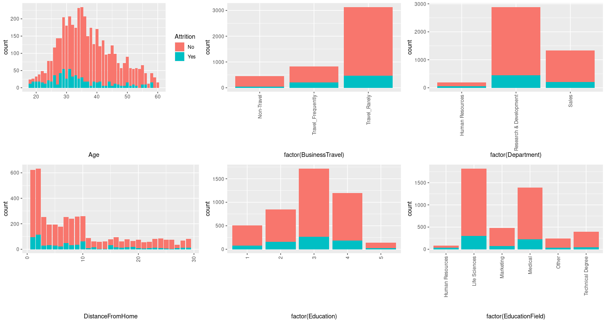<!-- -->

``` r
#reveals strong contrast for Attrition wrt Age, BusinessTravel, Department
#moderate wrt DistanceFromHome, Education and EducationFields
```

``` r
plot_grid(ggplot(employee, aes(x=Gender,fill=Attrition))+ geom_bar(), 
          ggplot(employee, aes(x=factor(JobLevel),fill=Attrition))+ geom_bar()+bar_theme1,
          ggplot(employee, aes(x=factor(JobRole),fill=Attrition))+ geom_bar()+bar_theme1,
          ggplot(employee, aes(x=factor(MaritalStatus),fill=Attrition))+ geom_bar()+bar_theme1,
          ggplot(employee, aes(x=MonthlyIncome,fill=Attrition))+ geom_bar()+bar_theme1,
          ggplot(employee, aes(x=factor(NumCompaniesWorked),fill=Attrition))+ geom_bar()+bar_theme1,align = "h") 
```

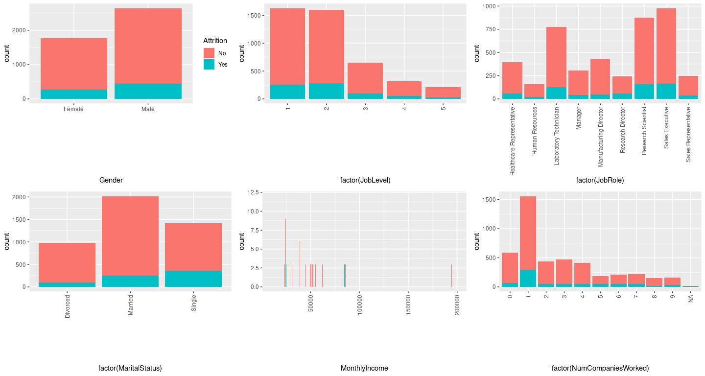<!-- -->

``` r
#reveals fairly contrast for Attrition wrt MaritalStatus, NumCompaniesWorked and Gender
#moderate wrt JobLevel, JobRole and MonthlyIncome
```

``` r
plot_grid(ggplot(employee, aes(x=PercentSalaryHike,fill=Attrition))+ geom_bar(), 
          ggplot(employee, aes(x=factor(StockOptionLevel),fill=Attrition))+ geom_bar()+bar_theme1,
          ggplot(employee, aes(x=TotalWorkingYears,fill=Attrition))+ geom_bar()+bar_theme1,
          ggplot(employee, aes(x=factor(TrainingTimesLastYear),fill=Attrition))+ geom_bar()+bar_theme1,
          ggplot(employee, aes(x=YearsAtCompany,fill=Attrition))+ geom_bar()+bar_theme1,
          ggplot(employee, aes(x=YearsSinceLastPromotion,fill=Attrition))+ geom_bar()+bar_theme1,align = "h")
```

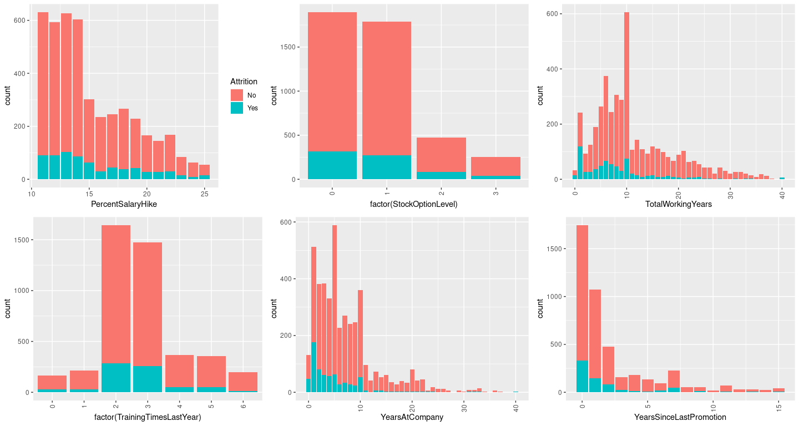<!-- -->

``` r
#reveals Fairly contrast for Attrition wrt TotalWorkingYears,YearsSinceLastPromotion
```

``` r
plot_grid(ggplot(employee, aes(x=YearsWithCurrManager,fill=Attrition))+ geom_bar(), 
          ggplot(employee, aes(x=factor(EnvironmentSatisfaction),fill=Attrition))+ geom_bar()+bar_theme1,
          ggplot(employee, aes(x=factor(JobSatisfaction),fill=Attrition))+ geom_bar()+bar_theme1,
          ggplot(employee, aes(x=factor(WorkLifeBalance),fill=Attrition))+ geom_bar()+bar_theme1,
          ggplot(employee, aes(x=factor(JobInvolvement),fill=Attrition))+ geom_bar()+bar_theme1,
          ggplot(employee, aes(x=factor(PerformanceRating),fill=Attrition))+ geom_bar()+bar_theme1,align = "h")
```

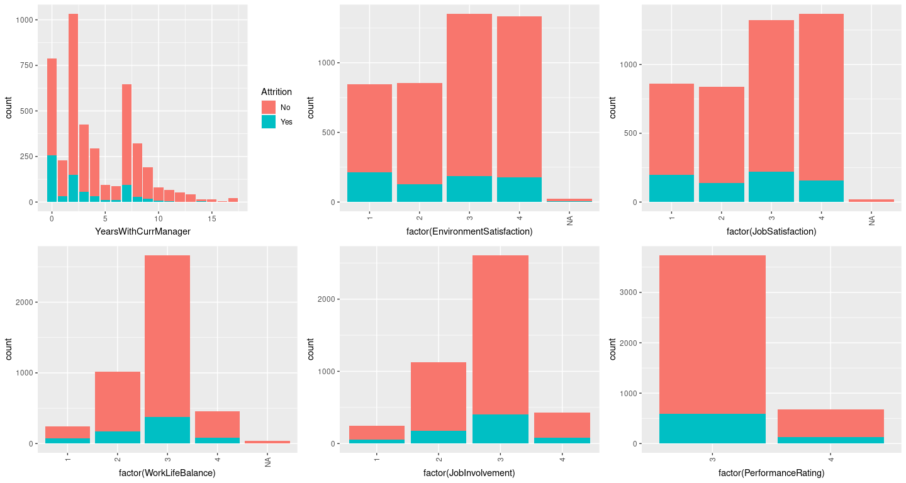<!-- -->

``` r
#reveals strongly contrast for Attrition wrt YearsWithCurrManager, EnvironmentSatisfaction, WorkLifeBalance
```

##### **2.4.4. Histogram and Boxplots for numeric variables**

``` r
box_theme<- theme(axis.line=element_blank(),axis.title=element_blank(), axis.ticks=element_blank(), axis.text=element_blank())
      
box_theme_y<- theme(axis.line.y=element_blank(),axis.title.y=element_blank(), axis.ticks.y=element_blank(), axis.text.y=element_blank(),
              legend.position="none")
```

``` r
plot_grid(ggplot(employee, aes(Age))+ geom_histogram(binwidth = 10),
          ggplot(employee, aes(x="",y=Age))+ geom_boxplot(width=0.1)+coord_flip()+box_theme, align = "v",ncol = 1) # No outlier
```

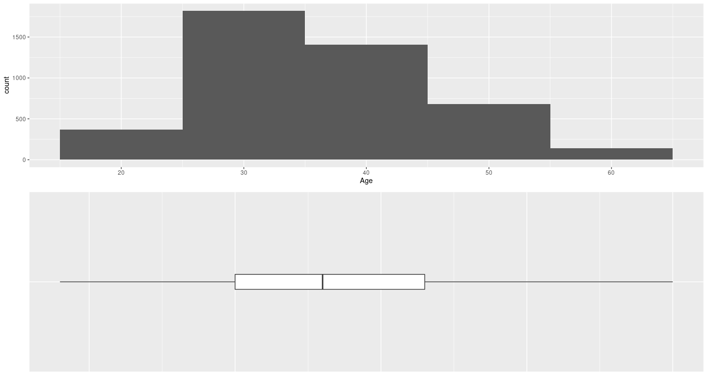<!-- -->

``` r
plot_grid(ggplot(employee, aes(DistanceFromHome))+ geom_histogram(binwidth = 10),
          ggplot(employee, aes(x="",y=DistanceFromHome))+ geom_boxplot(width=0.1)+coord_flip()+box_theme, align = "v",ncol = 1) # No outlier
```

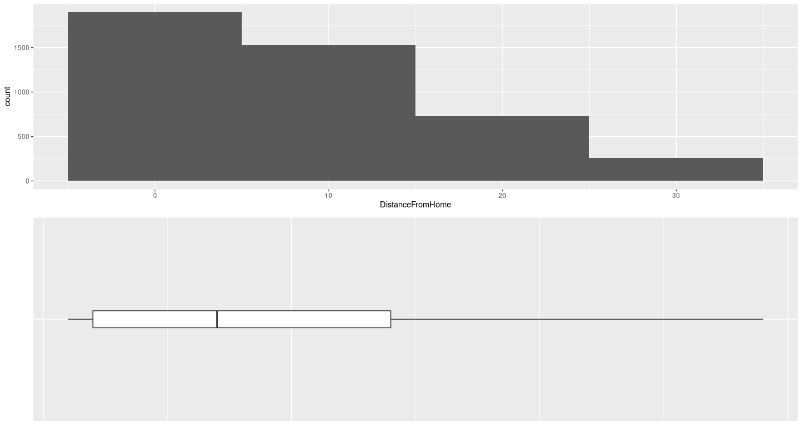<!-- -->

###### **2.4.4.1. Variables with outliers**

``` r
plot_grid(ggplot(employee, aes(avg_hrs_worked))+ geom_histogram(binwidth=2),
                ggplot(employee, aes(x="",y=avg_hrs_worked))+ geom_boxplot(width=0.1)+coord_flip()+box_theme, 
                align = "v",ncol = 1) #Outlier found
```

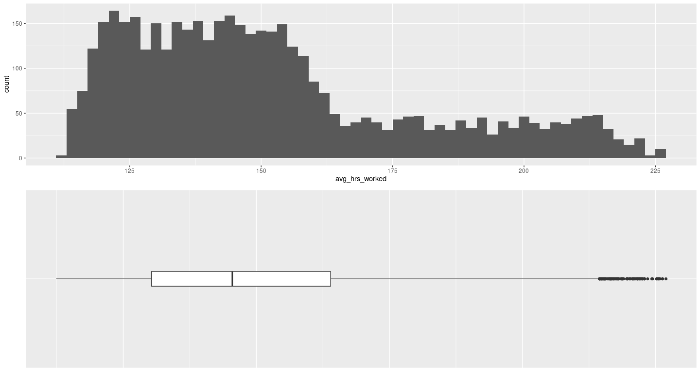<!-- -->

``` r
plot_grid(ggplot(employee, aes(MonthlyIncome))+ geom_histogram(binwidth=20000),
          ggplot(employee, aes(x="",y=MonthlyIncome))+ geom_boxplot(width=0.1)+coord_flip()+box_theme, align = "v",ncol = 1) #Outlier found
```

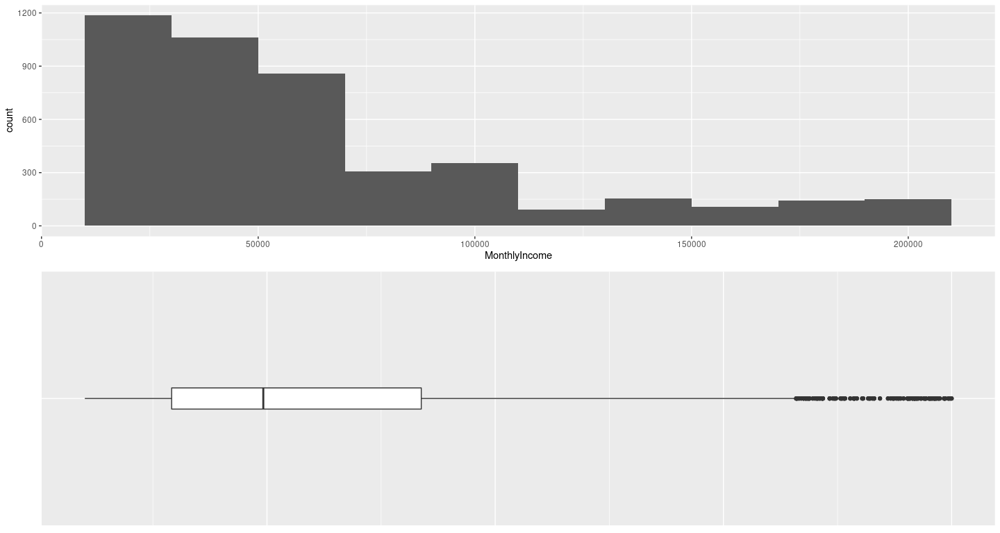<!-- -->

``` r
plot_grid(ggplot(employee, aes(TotalWorkingYears))+ geom_histogram(binwidth=2),
          ggplot(employee, aes(x="",y=TotalWorkingYears))+ geom_boxplot(width=0.1)+coord_flip()+box_theme, align = "v",ncol = 1) #Outlier found
```

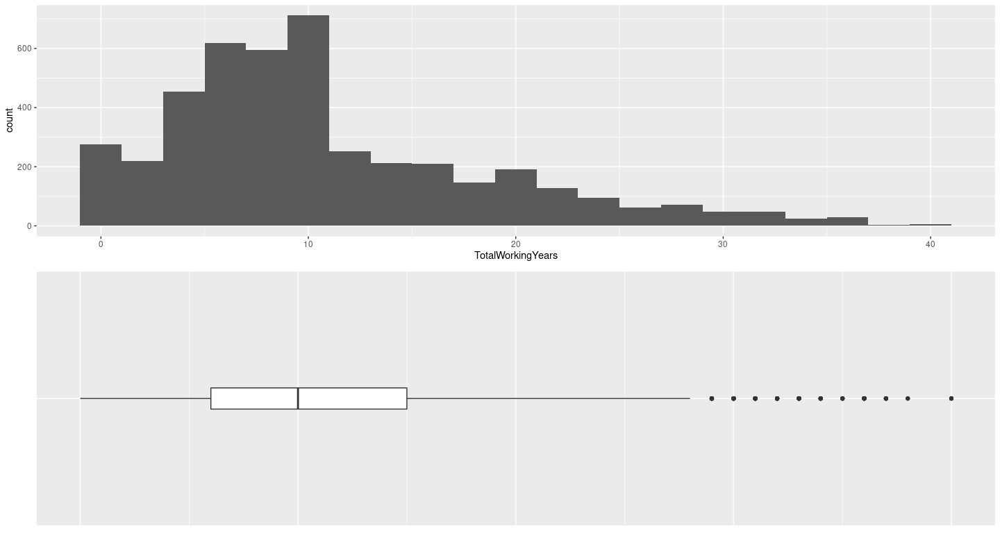<!-- -->

``` r
plot_grid(ggplot(employee, aes(TrainingTimesLastYear))+ geom_histogram(binwidth=2),
          ggplot(employee, aes(x="",y=TrainingTimesLastYear))+ geom_boxplot(width=0.1)+coord_flip()+box_theme, align = "v",ncol = 1) #Outlier found
```

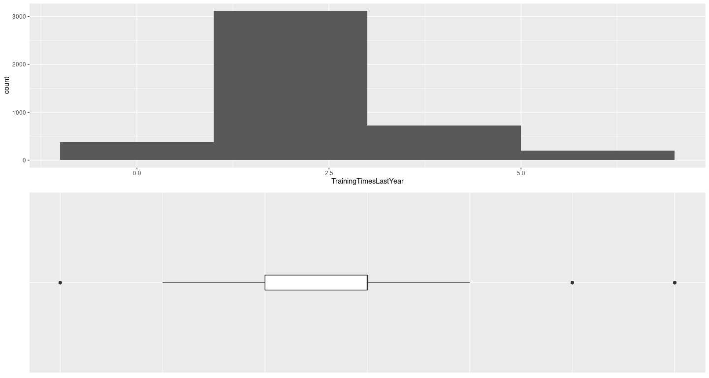<!-- -->

``` r
plot_grid(ggplot(employee, aes(YearsSinceLastPromotion))+ geom_histogram(binwidth=2),
          ggplot(employee, aes(x="",y=YearsSinceLastPromotion))+ geom_boxplot(width=0.1)+coord_flip()+box_theme, align = "v",ncol = 1) #Outlier found
```

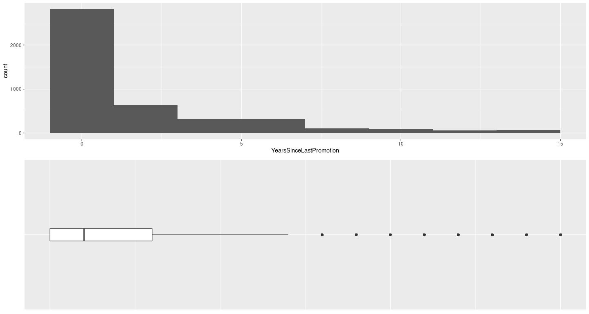<!-- -->

``` r
plot_grid(ggplot(employee, aes(YearsAtCompany))+ geom_histogram(binwidth=2),
          ggplot(employee, aes(x="",y=YearsAtCompany))+ geom_boxplot(width=0.1)+coord_flip()+box_theme, align = "v",ncol = 1) #Outlier found
```

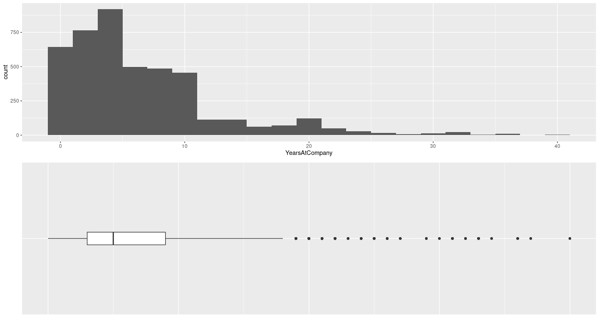<!-- -->

``` r
plot_grid(ggplot(employee, aes(YearsWithCurrManager))+ geom_histogram(binwidth=2),
          ggplot(employee, aes(x="",y=YearsWithCurrManager))+ geom_boxplot(width=0.1)+coord_flip()+box_theme, align = "v",ncol = 1) #Outlier found
```

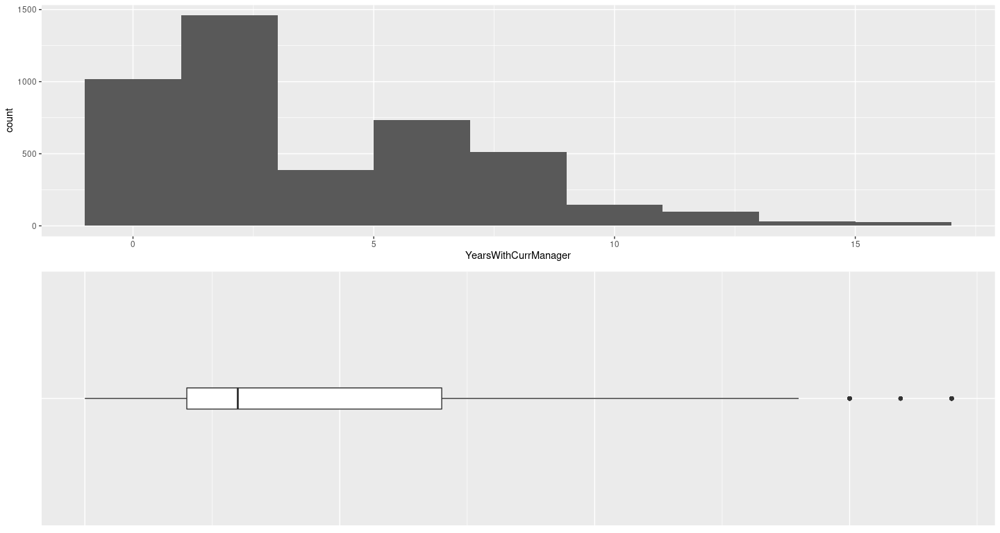<!-- -->

``` r
plot_grid(ggplot(employee, aes(x=Attrition,y=YearsSinceLastPromotion, fill=Attrition))+ geom_boxplot(width=0.2)+ 
          coord_flip() +theme(legend.position="none"),
          ggplot(employee, aes(x=Attrition,y=YearsAtCompany, fill=Attrition))+ geom_boxplot(width=0.2) + coord_flip() + box_theme_y,
          ggplot(employee, aes(x=Attrition,y=YearsWithCurrManager, fill=Attrition))+ geom_boxplot(width=0.2) + coord_flip() + box_theme_y,
          ggplot(employee, aes(x=Attrition,y=TotalWorkingYears, fill=Attrition))+ geom_boxplot(width=0.2) + coord_flip() + box_theme_y,
                align = "v",nrow = 1)
```

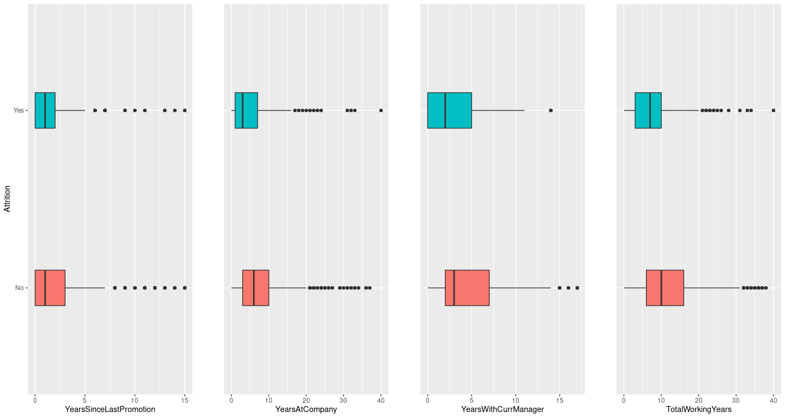<!-- -->

``` r
plot_grid(ggplot(employee, aes(x=Attrition,y=Age, fill=Attrition))+ geom_boxplot(width=0.2)+ coord_flip() +theme(legend.position="none"),
          ggplot(employee, aes(x=Attrition,y=DistanceFromHome, fill=Attrition))+ geom_boxplot(width=0.2) + coord_flip() + box_theme_y,
          ggplot(employee, aes(x=Attrition,y=MonthlyIncome, fill=Attrition))+ geom_boxplot(width=0.2) + coord_flip() + box_theme_y,
          ggplot(employee, aes(x=Attrition,y=avg_hrs_worked, fill=Attrition))+ geom_boxplot(width=0.2) + coord_flip() + box_theme_y,
                align = "v",nrow = 1)
```

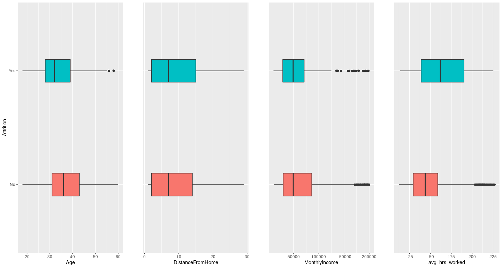<!-- -->

##### **2.4.5. Correlation between numeric variables**

``` r
ggpairs(employee[, c("Age", "DistanceFromHome","MonthlyIncome","NumCompaniesWorked","PercentSalaryHike","TotalWorkingYears","TrainingTimesLastYear","YearsAtCompany","YearsSinceLastPromotion","YearsWithCurrManager","avg_hrs_worked")])
```

<!-- -->

``` r
# YearsAtCompany and YearsWithCurrManager are highly coorealted (.802)
# YearsAtCompany and YearsSinceLastPromotion are fairly coorealted (.599)
# YearsSinceLastPromotion and YearsWithCurrManager are fairly coorelated (.519)
```

### **3. Data Preparation**

#### **3.1. De-Duplication not required**

#### **3.2. Outlier treatment and imputing missing value**

##### **3.2.1. Treating column with values as NA**

###### **3.2.1.1. Assigining ‘0’ (signifies No Repsonse from employees) to NA values in survey variables**

``` r
employee$EnvironmentSatisfaction[which(is.na(employee$EnvironmentSatisfaction))] <- 0
employee$JobSatisfaction[which(is.na(employee$JobSatisfaction))] <- 0
employee$WorkLifeBalance[which(is.na(employee$WorkLifeBalance))] <- 0
```

###### **3.2.1.2. Replacing NA values in “NumCompaniesWorked” and “TotalWorkingYears” variables**

``` r
employee$NumCompaniesWorked <- ifelse(is.na(employee$NumCompaniesWorked) & (employee$TotalWorkingYears-employee$YearsAtCompany) == 0,1,
                  ifelse(is.na(employee$NumCompaniesWorked) & (employee$TotalWorkingYears-employee$YearsAtCompany) ==1,0,employee$NumCompaniesWorked))
        
employee$TotalWorkingYears <- ifelse(is.na(employee$TotalWorkingYears) & (employee$NumCompaniesWorked+employee$YearsAtCompany) == (employee$YearsAtCompany+1),employee$YearsAtCompany,ifelse(is.na(employee$TotalWorkingYears) & (employee$NumCompaniesWorked+employee$YearsAtCompany) ==(employee$YearsAtCompany),0,employee$TotalWorkingYears))
```

##### **3.2.2. Outlier treatment**

``` r
employee$avg_hrs_worked[which(employee$avg_hrs_worked>213.7784)]<-213.7784
employee$MonthlyIncome[which(employee$MonthlyIncome>137756.0)]<-137756.0
employee$TotalWorkingYears[which(employee$TotalWorkingYears>32)]<-32
employee$TrainingTimesLastYear[which(employee$TrainingTimesLastYear>4)]<-4
employee$TrainingTimesLastYear[which(employee$TrainingTimesLastYear<1)]<-1
employee$YearsSinceLastPromotion[which(employee$YearsSinceLastPromotion>9)]<-9
employee$YearsWithCurrManager[which(employee$YearsWithCurrManager>14)]<-14
employee$YearsAtCompany[which(employee$YearsAtCompany>24)]<-24
```

##### **3.2.3. Missing value**

``` r
sapply(employee, function(x) sum(is.na(x))) # shows all 14 NAs 
```

    ##                     Age               Attrition          BusinessTravel 
    ##                       0                       0                       0 
    ##              Department        DistanceFromHome               Education 
    ##                       0                       0                       0 
    ##          EducationField           EmployeeCount              EmployeeID 
    ##                       0                       0                       0 
    ##                  Gender                JobLevel                 JobRole 
    ##                       0                       0                       0 
    ##           MaritalStatus           MonthlyIncome      NumCompaniesWorked 
    ##                       0                       0                       9 
    ##                  Over18       PercentSalaryHike           StandardHours 
    ##                       0                       0                       0 
    ##        StockOptionLevel       TotalWorkingYears   TrainingTimesLastYear 
    ##                       0                       5                       0 
    ##          YearsAtCompany YearsSinceLastPromotion    YearsWithCurrManager 
    ##                       0                       0                       0 
    ## EnvironmentSatisfaction         JobSatisfaction         WorkLifeBalance 
    ##                       0                       0                       0 
    ##          JobInvolvement       PerformanceRating          avg_hrs_worked 
    ##                       0                       0                       0

``` r
View(subset(employee, is.na(NumCompaniesWorked))) # 9 NAs in NumCompaniesWorked , 3-Yes and 6-No
View(subset(employee, is.na(TotalWorkingYears))) # 9 NAs in TotalWorkingYears , 1-Yes and 4-No
```

``` r
kable(subset(employee, is.na(NumCompaniesWorked))[1:10, ])
```

|      | Age | Attrition | BusinessTravel     | Department             | DistanceFromHome | Education | EducationField   | EmployeeCount | EmployeeID | Gender | JobLevel | JobRole                   | MaritalStatus | MonthlyIncome | NumCompaniesWorked | Over18 | PercentSalaryHike | StandardHours | StockOptionLevel | TotalWorkingYears | TrainingTimesLastYear | YearsAtCompany | YearsSinceLastPromotion | YearsWithCurrManager | EnvironmentSatisfaction | JobSatisfaction | WorkLifeBalance | JobInvolvement | PerformanceRating | avg\_hrs\_worked |
|:-----|----:|:----------|:-------------------|:-----------------------|-----------------:|----------:|:-----------------|--------------:|-----------:|:-------|---------:|:--------------------------|:--------------|--------------:|-------------------:|:-------|------------------:|--------------:|-----------------:|------------------:|----------------------:|---------------:|------------------------:|---------------------:|------------------------:|----------------:|----------------:|---------------:|------------------:|-----------------:|
| 211  |  52 | No        | Travel\_Rarely     | Sales                  |                2 |         1 | Medical          |             1 |        211 | Male   |        1 | Laboratory Technician     | Divorced      |         99800 |                 NA | Y      |                11 |             8 |                1 |                18 |                     2 |             10 |                       6 |                    9 |                       4 |               1 |               3 |              3 |                 3 |           184.53 |
| 344  |  40 | No        | Travel\_Frequently | Sales                  |                9 |         3 | Marketing        |             1 |        344 | Male   |        3 | Manufacturing Director    | Single        |         22380 |                 NA | Y      |                14 |             8 |                0 |                10 |                     3 |              1 |                       0 |                    0 |                       1 |               3 |               3 |              3 |                 3 |           133.12 |
| 648  |  29 | No        | Travel\_Rarely     | Research & Development |                3 |         3 | Technical Degree |             1 |        648 | Female |        2 | Healthcare Representative | Divorced      |         48050 |                 NA | Y      |                16 |             8 |                1 |                 9 |                     2 |              7 |                       1 |                    7 |                       4 |               4 |               2 |              3 |                 3 |           137.20 |
| 800  |  29 | Yes       | Travel\_Frequently | Research & Development |               28 |         3 | Medical          |             1 |        800 | Female |        5 | Research Scientist        | Single        |         44340 |                 NA | Y      |                17 |             8 |                3 |                 7 |                     1 |              5 |                       0 |                    0 |                       1 |               2 |               1 |              3 |                 3 |           157.86 |
| 1313 |  37 | Yes       | Travel\_Rarely     | Human Resources        |                9 |         3 | Human Resources  |             1 |       1313 | Male   |        2 | Healthcare Representative | Divorced      |         54840 |                 NA | Y      |                17 |             8 |                0 |                 7 |                     4 |              3 |                       0 |                    2 |                       3 |               1 |               3 |              3 |                 3 |           208.87 |
| 2697 |  28 | Yes       | Travel\_Rarely     | Research & Development |                1 |         4 | Life Sciences    |             1 |       2697 | Male   |        5 | Research Director         | Single        |        100960 |                 NA | Y      |                13 |             8 |                0 |                 6 |                     2 |              4 |                       0 |                    3 |                       3 |               3 |               3 |              3 |                 3 |           212.89 |
| 3534 |  56 | No        | Travel\_Rarely     | Research & Development |                3 |         2 | Other            |             1 |       3534 | Male   |        2 | Healthcare Representative | Divorced      |         44490 |                 NA | Y      |                15 |             8 |                0 |                28 |                     3 |              5 |                       4 |                    2 |                       4 |               1 |               3 |              1 |                 3 |           124.18 |
| 3911 |  41 | No        | Non-Travel         | Sales                  |                2 |         2 | Medical          |             1 |       3911 | Male   |        2 | Research Scientist        | Married       |        107980 |                 NA | Y      |                14 |             8 |                2 |                10 |                     4 |              3 |                       1 |                    2 |                       3 |               2 |               3 |              1 |                 3 |           149.72 |
| 4227 |  36 | No        | Travel\_Rarely     | Research & Development |                2 |         3 | Life Sciences    |             1 |       4227 | Male   |        2 | Sales Representative      | Married       |         43200 |                 NA | Y      |                17 |             8 |                0 |                 5 |                     2 |              1 |                       0 |                    0 |                       2 |               4 |               3 |              3 |                 3 |           141.72 |
| NA   |  NA | NA        | NA                 | NA                     |               NA |        NA | NA               |            NA |         NA | NA     |       NA | NA                        | NA            |            NA |                 NA | NA     |                NA |            NA |               NA |                NA |                    NA |             NA |                      NA |                   NA |                      NA |              NA |              NA |             NA |                NA |               NA |

``` r
kable(subset(employee, is.na(TotalWorkingYears))[1:10, ])
```

|      | Age | Attrition | BusinessTravel     | Department             | DistanceFromHome | Education | EducationField | EmployeeCount | EmployeeID | Gender | JobLevel | JobRole                | MaritalStatus | MonthlyIncome | NumCompaniesWorked | Over18 | PercentSalaryHike | StandardHours | StockOptionLevel | TotalWorkingYears | TrainingTimesLastYear | YearsAtCompany | YearsSinceLastPromotion | YearsWithCurrManager | EnvironmentSatisfaction | JobSatisfaction | WorkLifeBalance | JobInvolvement | PerformanceRating | avg\_hrs\_worked |
|:-----|----:|:----------|:-------------------|:-----------------------|-----------------:|----------:|:---------------|--------------:|-----------:|:-------|---------:|:-----------------------|:--------------|--------------:|-------------------:|:-------|------------------:|--------------:|-----------------:|------------------:|----------------------:|---------------:|------------------------:|---------------------:|------------------------:|----------------:|----------------:|---------------:|------------------:|-----------------:|
| 138  |  43 | No        | Travel\_Frequently | Sales                  |               14 |         3 | Life Sciences  |             1 |        138 | Female |        1 | Manufacturing Director | Married       |         37480 |                  7 | Y      |                14 |             8 |                2 |                NA |                     3 |              3 |                       1 |                    2 |                       4 |               4 |               3 |              2 |                 3 |           145.20 |
| 309  |  47 | Yes       | Travel\_Frequently | Research & Development |                4 |         3 | Life Sciences  |             1 |        309 | Male   |        1 | Research Director      | Single        |         27740 |                  4 | Y      |                13 |             8 |                1 |                NA |                     2 |              5 |                       1 |                    3 |                       2 |               3 |               3 |              3 |                 3 |           193.50 |
| 575  |  37 | No        | Travel\_Rarely     | Research & Development |               23 |         3 | Life Sciences  |             1 |        575 | Male   |        3 | Manufacturing Director | Divorced      |        137756 |                  7 | Y      |                16 |             8 |                1 |                NA |                     2 |              6 |                       1 |                    3 |                       3 |               4 |               3 |              3 |                 3 |           162.72 |
| 1518 |  36 | No        | Non-Travel         | Research & Development |                5 |         4 | Life Sciences  |             1 |       1518 | Male   |        1 | Sales Executive        | Married       |         85780 |                  7 | Y      |                21 |             8 |                0 |                NA |                     4 |              9 |                       0 |                    8 |                       2 |               2 |               3 |              3 |                 4 |           150.48 |
| 3121 |  35 | No        | Travel\_Rarely     | Research & Development |               12 |         2 | Medical        |             1 |       3121 | Female |        2 | Sales Representative   | Married       |         28090 |                  4 | Y      |                23 |             8 |                1 |                NA |                     2 |              8 |                       0 |                    0 |                       4 |               3 |               3 |              1 |                 4 |           175.71 |
| NA   |  NA | NA        | NA                 | NA                     |               NA |        NA | NA             |            NA |         NA | NA     |       NA | NA                     | NA            |            NA |                 NA | NA     |                NA |            NA |               NA |                NA |                    NA |             NA |                      NA |                   NA |                      NA |              NA |              NA |             NA |                NA |               NA |
| NA.1 |  NA | NA        | NA                 | NA                     |               NA |        NA | NA             |            NA |         NA | NA     |       NA | NA                     | NA            |            NA |                 NA | NA     |                NA |            NA |               NA |                NA |                    NA |             NA |                      NA |                   NA |                      NA |              NA |              NA |             NA |                NA |               NA |
| NA.2 |  NA | NA        | NA                 | NA                     |               NA |        NA | NA             |            NA |         NA | NA     |       NA | NA                     | NA            |            NA |                 NA | NA     |                NA |            NA |               NA |                NA |                    NA |             NA |                      NA |                   NA |                      NA |              NA |              NA |             NA |                NA |               NA |
| NA.3 |  NA | NA        | NA                 | NA                     |               NA |        NA | NA             |            NA |         NA | NA     |       NA | NA                     | NA            |            NA |                 NA | NA     |                NA |            NA |               NA |                NA |                    NA |             NA |                      NA |                   NA |                      NA |              NA |              NA |             NA |                NA |               NA |
| NA.4 |  NA | NA        | NA                 | NA                     |               NA |        NA | NA             |            NA |         NA | NA     |       NA | NA                     | NA            |            NA |                 NA | NA     |                NA |            NA |               NA |                NA |                    NA |             NA |                      NA |                   NA |                      NA |              NA |              NA |             NA |                NA |               NA |

##### **3.2.4. It means that 14/4410 = 0.003174603 i.e 0.3%, best is to remove these observations from the analysis**

``` r
employee <- employee[!is.na(employee$NumCompaniesWorked),]
employee <- employee[!is.na(employee$TotalWorkingYears),]
```

``` r
View(employee)
```

##### **3.2.5. Bringing the variables in the correct format (numeric to character)**

``` r
employee$Education <- mapvalues(employee$Education, from = c(1,2,3,4,5), to = c("Below College","College","Bachelor","Master","Doctor"))
employee$EnvironmentSatisfaction <- mapvalues(employee$EnvironmentSatisfaction, from = c(0,1,2,3,4), to = c("No response","Low","Medium","High","Very High"))
employee$JobSatisfaction <- mapvalues(employee$JobSatisfaction, from = c(0,1,2,3,4), to = c("No response","Low","Medium","High","Very High"))
employee$WorkLifeBalance <- mapvalues(employee$WorkLifeBalance, from = c(0,1,2,3,4), to = c("No response","Bad","Good","Better","Best"))
employee$JobInvolvement <- mapvalues(employee$JobInvolvement, from = c(1,2,3,4), to = c("Low","Medium","High","Very High"))
employee$PerformanceRating <- mapvalues(employee$PerformanceRating, from = c(3,4), to = c("Excellent","Outstanding"))
```

### **4. Feature standardization**

#### **4.1. Normalizing continuous features**

``` r
employee$Age<- scale(employee$Age) # scale used: mean 36.9172, sd 9.135808
employee$DistanceFromHome<- scale(employee$DistanceFromHome) # scale used: mean 9.195177, sd 8.105035
employee$MonthlyIncome<- scale(employee$MonthlyIncome) # scale used: mean 61099.25, sd 38050.28
employee$NumCompaniesWorked<- scale(employee$NumCompaniesWorked) # scale used: mean 2.686306, sd 2.497071
employee$PercentSalaryHike<- scale(employee$PercentSalaryHike) # scale used: mean 15.20769, sd 3.660675
employee$TotalWorkingYears<- scale(employee$TotalWorkingYears) # scale used: mean 11.21201, sd 7.59882
employee$TrainingTimesLastYear<- scale(employee$TrainingTimesLastYear) # scale used: mean 2.66697, sd 0.9000624
employee$YearsAtCompany<- scale(employee$YearsAtCompany) # scale used: mean 6.886943, sd 5.665793
employee$YearsSinceLastPromotion<- scale(employee$YearsSinceLastPromotion) # scale used: mean 2.022748, sd 2.713206
employee$YearsWithCurrManager<- scale(employee$YearsWithCurrManager) # scale used: mean 4.10646, sd 3.504075
employee$avg_hrs_worked<- scale(employee$avg_hrs_worked) # scale used: mean 151.5999, sd 27.27653
```

#### **4.2. Converting target variable Attrition from No/Yes character to factorwith levels 0/1**

``` r
employee$Attrition<- ifelse(employee$Attrition=="Yes",1,0)
```

#### **4.3. Checking Attrition rate**

``` r
attrition <- sum(employee$Attrition)/nrow(employee)
attrition # 16.08% churn rate. 
```

    ## [1] 0.160828

#### **4.4. Creating a dataframe of categorical features**

``` r
employee_chr<- employee[,-c(1,2,5,8,9,14,15,16,17,18,20,21,22,23,24,30)]
```

#### **4.5. Converting categorical attributes to factor**

``` r
employee_fact<- data.frame(sapply(employee_chr, function(x) factor(x)))
str(employee_fact)
```

    ## 'data.frame':    4396 obs. of  14 variables:
    ##  $ BusinessTravel         : chr  "Travel_Rarely" "Travel_Frequently" "Travel_Frequently" "Non-Travel" ...
    ##  $ Department             : chr  "Sales" "Research & Development" "Research & Development" "Research & Development" ...
    ##  $ Education              : chr  "College" "Below College" "Master" "Doctor" ...
    ##  $ EducationField         : chr  "Life Sciences" "Life Sciences" "Other" "Life Sciences" ...
    ##  $ Gender                 : chr  "Female" "Female" "Male" "Male" ...
    ##  $ JobLevel               : chr  "1" "1" "4" "3" ...
    ##  $ JobRole                : chr  "Healthcare Representative" "Research Scientist" "Sales Executive" "Human Resources" ...
    ##  $ MaritalStatus          : chr  "Married" "Single" "Married" "Married" ...
    ##  $ StockOptionLevel       : chr  "0" "1" "3" "3" ...
    ##  $ EnvironmentSatisfaction: chr  "High" "High" "Medium" "Very High" ...
    ##  $ JobSatisfaction        : chr  "Very High" "Medium" "Medium" "Very High" ...
    ##  $ WorkLifeBalance        : chr  "Good" "Best" "Bad" "Better" ...
    ##  $ JobInvolvement         : chr  "High" "Medium" "High" "Medium" ...
    ##  $ PerformanceRating      : chr  "Excellent" "Outstanding" "Excellent" "Excellent" ...

#### **4.6. Creating dummy variables for factor attributes**

``` r
dummies<- data.frame(sapply(employee_fact, function(x) data.frame(model.matrix(~x-1,data =employee_fact))[,-1]))
View(dummies)
```

#### **4.7. Final dataset**

``` r
employee_final<- cbind(employee[,-c(3,4,6:13,16,18,19,25:29)],dummies)
View(employee_final) #4396 obs. of  60 variables
```

### **5. splitting the data between train and test**

``` r
set.seed(100)
indices = sample.split(employee_final$Attrition, SplitRatio = 0.7)
train = employee_final[indices,]
test = employee_final[!(indices),]
```

### **6. Logistic Regression**

#### **6.1. Initial model**

``` r
model_1 = glm(Attrition ~ ., data = train, family = "binomial")
summary(model_1) #AIC 2135.4 | nullDev 2714.6 | resDev 2017.4
```

    ## 
    ## Call:
    ## glm(formula = Attrition ~ ., family = "binomial", data = train)
    ## 
    ## Deviance Residuals: 
    ##     Min       1Q   Median       3Q      Max  
    ## -1.8613  -0.5464  -0.3098  -0.1442   3.9332  
    ## 
    ## Coefficients:
    ##                                      Estimate Std. Error z value Pr(>|z|)    
    ## (Intercept)                          -1.55028    0.54719  -2.833 0.004609 ** 
    ## Age                                  -0.29313    0.08264  -3.547 0.000390 ***
    ## DistanceFromHome                     -0.02139    0.05909  -0.362 0.717371    
    ## MonthlyIncome                        -0.04434    0.06100  -0.727 0.467295    
    ## NumCompaniesWorked                    0.35572    0.06223   5.716 1.09e-08 ***
    ## PercentSalaryHike                     0.09400    0.09228   1.019 0.308390    
    ## TotalWorkingYears                    -0.72993    0.12594  -5.796 6.79e-09 ***
    ## TrainingTimesLastYear                -0.13969    0.05969  -2.340 0.019281 *  
    ## YearsAtCompany                        0.09249    0.14458   0.640 0.522363    
    ## YearsSinceLastPromotion               0.62162    0.08199   7.582 3.41e-14 ***
    ## YearsWithCurrManager                 -0.51081    0.11715  -4.360 1.30e-05 ***
    ## avg_hrs_worked                        0.65389    0.05644  11.585  < 2e-16 ***
    ## BusinessTravel.xTravel_Frequently     1.66552    0.26316   6.329 2.47e-10 ***
    ## BusinessTravel.xTravel_Rarely         0.83891    0.24342   3.446 0.000568 ***
    ## Department.xResearch...Development   -0.86470    0.33271  -2.599 0.009350 ** 
    ## Department.xSales                    -0.87928    0.35281  -2.492 0.012695 *  
    ## Education.xBelow.College              0.04652    0.20309   0.229 0.818834    
    ## Education.xCollege                    0.24475    0.16167   1.514 0.130057    
    ## Education.xDoctor                    -0.58994    0.36635  -1.610 0.107331    
    ## Education.xMaster                     0.03133    0.14515   0.216 0.829122    
    ## EducationField.xLife.Sciences        -0.25779    0.46935  -0.549 0.582839    
    ## EducationField.xMarketing            -0.38278    0.51395  -0.745 0.456408    
    ## EducationField.xMedical              -0.44551    0.46719  -0.954 0.340283    
    ## EducationField.xOther                -0.53919    0.52420  -1.029 0.303668    
    ## EducationField.xTechnical.Degree     -0.43845    0.50997  -0.860 0.389921    
    ## Gender                               -0.08377    0.12029  -0.696 0.486187    
    ## JobLevel.x2                           0.22453    0.13647   1.645 0.099898 .  
    ## JobLevel.x3                          -0.10113    0.18075  -0.559 0.575826    
    ## JobLevel.x4                          -0.13136    0.24156  -0.544 0.586578    
    ## JobLevel.x5                          -0.46044    0.31159  -1.478 0.139486    
    ## JobRole.xHuman.Resources             -0.01019    0.37120  -0.027 0.978106    
    ## JobRole.xLaboratory.Technician        0.39253    0.24881   1.578 0.114661    
    ## JobRole.xManager                     -0.24251    0.32066  -0.756 0.449483    
    ## JobRole.xManufacturing.Director      -0.43053    0.29563  -1.456 0.145314    
    ## JobRole.xResearch.Director            1.08009    0.29611   3.648 0.000265 ***
    ## JobRole.xResearch.Scientist           0.40937    0.24430   1.676 0.093809 .  
    ## JobRole.xSales.Executive              0.45888    0.24253   1.892 0.058482 .  
    ## JobRole.xSales.Representative        -0.03879    0.31817  -0.122 0.902971    
    ## MaritalStatus.xMarried                0.08549    0.17333   0.493 0.621838    
    ## MaritalStatus.xSingle                 1.11279    0.17211   6.466 1.01e-10 ***
    ## StockOptionLevel.x1                  -0.22855    0.12881  -1.774 0.076006 .  
    ## StockOptionLevel.x2                   0.07136    0.19532   0.365 0.714861    
    ## StockOptionLevel.x3                  -0.17485    0.25950  -0.674 0.500439    
    ## EnvironmentSatisfaction.xLow          1.00198    0.16026   6.252 4.05e-10 ***
    ## EnvironmentSatisfaction.xMedium       0.01990    0.17526   0.114 0.909594    
    ## EnvironmentSatisfaction.xNo.response -0.91371    1.11545  -0.819 0.412709    
    ## EnvironmentSatisfaction.xVery.High   -0.18421    0.15690  -1.174 0.240353    
    ## JobSatisfaction.xLow                  0.50821    0.15674   3.242 0.001186 ** 
    ## JobSatisfaction.xMedium              -0.01564    0.16726  -0.094 0.925499    
    ## JobSatisfaction.xNo.response         -0.18381    1.10265  -0.167 0.867605    
    ## JobSatisfaction.xVery.High           -0.75860    0.15988  -4.745 2.09e-06 ***
    ## WorkLifeBalance.xBest                -1.28848    0.27572  -4.673 2.97e-06 ***
    ## WorkLifeBalance.xBetter              -1.33390    0.22267  -5.990 2.09e-09 ***
    ## WorkLifeBalance.xGood                -0.95653    0.23950  -3.994 6.50e-05 ***
    ## WorkLifeBalance.xNo.response         -0.89008    0.70383  -1.265 0.206005    
    ## JobInvolvement.xLow                   0.32124    0.23885   1.345 0.178634    
    ## JobInvolvement.xMedium                0.28431    0.13998   2.031 0.042245 *  
    ## JobInvolvement.xVery.High            -0.05238    0.20039  -0.261 0.793791    
    ## PerformanceRating                    -0.08945    0.24945  -0.359 0.719885    
    ## ---
    ## Signif. codes:  0 '***' 0.001 '**' 0.01 '*' 0.05 '.' 0.1 ' ' 1
    ## 
    ## (Dispersion parameter for binomial family taken to be 1)
    ## 
    ##     Null deviance: 2714.6  on 3076  degrees of freedom
    ## Residual deviance: 2017.4  on 3018  degrees of freedom
    ## AIC: 2135.4
    ## 
    ## Number of Fisher Scoring iterations: 6

#### **6.2. Stepwise selection**

``` r
model_2<- stepAIC(model_1, direction="both")
```

    ## Start:  AIC=2135.36
    ## Attrition ~ Age + DistanceFromHome + MonthlyIncome + NumCompaniesWorked + 
    ##     PercentSalaryHike + TotalWorkingYears + TrainingTimesLastYear + 
    ##     YearsAtCompany + YearsSinceLastPromotion + YearsWithCurrManager + 
    ##     avg_hrs_worked + BusinessTravel.xTravel_Frequently + BusinessTravel.xTravel_Rarely + 
    ##     Department.xResearch...Development + Department.xSales + 
    ##     Education.xBelow.College + Education.xCollege + Education.xDoctor + 
    ##     Education.xMaster + EducationField.xLife.Sciences + EducationField.xMarketing + 
    ##     EducationField.xMedical + EducationField.xOther + EducationField.xTechnical.Degree + 
    ##     Gender + JobLevel.x2 + JobLevel.x3 + JobLevel.x4 + JobLevel.x5 + 
    ##     JobRole.xHuman.Resources + JobRole.xLaboratory.Technician + 
    ##     JobRole.xManager + JobRole.xManufacturing.Director + JobRole.xResearch.Director + 
    ##     JobRole.xResearch.Scientist + JobRole.xSales.Executive + 
    ##     JobRole.xSales.Representative + MaritalStatus.xMarried + 
    ##     MaritalStatus.xSingle + StockOptionLevel.x1 + StockOptionLevel.x2 + 
    ##     StockOptionLevel.x3 + EnvironmentSatisfaction.xLow + EnvironmentSatisfaction.xMedium + 
    ##     EnvironmentSatisfaction.xNo.response + EnvironmentSatisfaction.xVery.High + 
    ##     JobSatisfaction.xLow + JobSatisfaction.xMedium + JobSatisfaction.xNo.response + 
    ##     JobSatisfaction.xVery.High + WorkLifeBalance.xBest + WorkLifeBalance.xBetter + 
    ##     WorkLifeBalance.xGood + WorkLifeBalance.xNo.response + JobInvolvement.xLow + 
    ##     JobInvolvement.xMedium + JobInvolvement.xVery.High + PerformanceRating
    ## 
    ##                                        Df Deviance    AIC
    ## - JobRole.xHuman.Resources              1   2017.4 2133.4
    ## - JobSatisfaction.xMedium               1   2017.4 2133.4
    ## - EnvironmentSatisfaction.xMedium       1   2017.4 2133.4
    ## - JobRole.xSales.Representative         1   2017.4 2133.4
    ## - JobSatisfaction.xNo.response          1   2017.4 2133.4
    ## - Education.xMaster                     1   2017.4 2133.4
    ## - Education.xBelow.College              1   2017.4 2133.4
    ## - JobInvolvement.xVery.High             1   2017.4 2133.4
    ## - PerformanceRating                     1   2017.5 2133.5
    ## - DistanceFromHome                      1   2017.5 2133.5
    ## - StockOptionLevel.x2                   1   2017.5 2133.5
    ## - MaritalStatus.xMarried                1   2017.6 2133.6
    ## - JobLevel.x4                           1   2017.7 2133.7
    ## - EducationField.xLife.Sciences         1   2017.7 2133.7
    ## - JobLevel.x3                           1   2017.7 2133.7
    ## - YearsAtCompany                        1   2017.8 2133.8
    ## - StockOptionLevel.x3                   1   2017.8 2133.8
    ## - Gender                                1   2017.8 2133.8
    ## - MonthlyIncome                         1   2017.9 2133.9
    ## - EducationField.xMarketing             1   2017.9 2133.9
    ## - JobRole.xManager                      1   2017.9 2133.9
    ## - EducationField.xTechnical.Degree      1   2018.1 2134.1
    ## - EnvironmentSatisfaction.xNo.response  1   2018.2 2134.2
    ## - EducationField.xMedical               1   2018.3 2134.3
    ## - PercentSalaryHike                     1   2018.4 2134.4
    ## - EducationField.xOther                 1   2018.4 2134.4
    ## - EnvironmentSatisfaction.xVery.High    1   2018.7 2134.7
    ## - WorkLifeBalance.xNo.response          1   2019.1 2135.1
    ## - JobInvolvement.xLow                   1   2019.1 2135.1
    ## <none>                                      2017.4 2135.4
    ## - JobRole.xManufacturing.Director       1   2019.5 2135.5
    ## - Education.xCollege                    1   2019.6 2135.6
    ## - JobLevel.x5                           1   2019.7 2135.7
    ## - JobRole.xLaboratory.Technician        1   2019.9 2135.9
    ## - JobLevel.x2                           1   2020.1 2136.1
    ## - Education.xDoctor                     1   2020.2 2136.2
    ## - JobRole.xResearch.Scientist           1   2020.2 2136.2
    ## - StockOptionLevel.x1                   1   2020.5 2136.5
    ## - JobRole.xSales.Executive              1   2021.1 2137.1
    ## - JobInvolvement.xMedium                1   2021.4 2137.4
    ## - TrainingTimesLastYear                 1   2022.9 2138.9
    ## - Department.xSales                     1   2023.2 2139.2
    ## - Department.xResearch...Development    1   2023.6 2139.6
    ## - JobSatisfaction.xLow                  1   2027.8 2143.8
    ## - Age                                   1   2030.4 2146.4
    ## - JobRole.xResearch.Director            1   2030.8 2146.8
    ## - BusinessTravel.xTravel_Rarely         1   2031.0 2147.0
    ## - WorkLifeBalance.xGood                 1   2032.8 2148.8
    ## - YearsWithCurrManager                  1   2035.8 2151.8
    ## - WorkLifeBalance.xBest                 1   2039.3 2155.3
    ## - JobSatisfaction.xVery.High            1   2040.5 2156.5
    ## - NumCompaniesWorked                    1   2049.3 2165.3
    ## - WorkLifeBalance.xBetter               1   2050.8 2166.8
    ## - TotalWorkingYears                     1   2055.1 2171.1
    ## - EnvironmentSatisfaction.xLow          1   2057.0 2173.0
    ## - MaritalStatus.xSingle                 1   2063.1 2179.1
    ## - BusinessTravel.xTravel_Frequently     1   2065.6 2181.6
    ## - YearsSinceLastPromotion               1   2076.2 2192.2
    ## - avg_hrs_worked                        1   2157.9 2273.9
    ## 
    ## Step:  AIC=2133.36
    ## Attrition ~ Age + DistanceFromHome + MonthlyIncome + NumCompaniesWorked + 
    ##     PercentSalaryHike + TotalWorkingYears + TrainingTimesLastYear + 
    ##     YearsAtCompany + YearsSinceLastPromotion + YearsWithCurrManager + 
    ##     avg_hrs_worked + BusinessTravel.xTravel_Frequently + BusinessTravel.xTravel_Rarely + 
    ##     Department.xResearch...Development + Department.xSales + 
    ##     Education.xBelow.College + Education.xCollege + Education.xDoctor + 
    ##     Education.xMaster + EducationField.xLife.Sciences + EducationField.xMarketing + 
    ##     EducationField.xMedical + EducationField.xOther + EducationField.xTechnical.Degree + 
    ##     Gender + JobLevel.x2 + JobLevel.x3 + JobLevel.x4 + JobLevel.x5 + 
    ##     JobRole.xLaboratory.Technician + JobRole.xManager + JobRole.xManufacturing.Director + 
    ##     JobRole.xResearch.Director + JobRole.xResearch.Scientist + 
    ##     JobRole.xSales.Executive + JobRole.xSales.Representative + 
    ##     MaritalStatus.xMarried + MaritalStatus.xSingle + StockOptionLevel.x1 + 
    ##     StockOptionLevel.x2 + StockOptionLevel.x3 + EnvironmentSatisfaction.xLow + 
    ##     EnvironmentSatisfaction.xMedium + EnvironmentSatisfaction.xNo.response + 
    ##     EnvironmentSatisfaction.xVery.High + JobSatisfaction.xLow + 
    ##     JobSatisfaction.xMedium + JobSatisfaction.xNo.response + 
    ##     JobSatisfaction.xVery.High + WorkLifeBalance.xBest + WorkLifeBalance.xBetter + 
    ##     WorkLifeBalance.xGood + WorkLifeBalance.xNo.response + JobInvolvement.xLow + 
    ##     JobInvolvement.xMedium + JobInvolvement.xVery.High + PerformanceRating
    ## 
    ##                                        Df Deviance    AIC
    ## - JobSatisfaction.xMedium               1   2017.4 2131.4
    ## - EnvironmentSatisfaction.xMedium       1   2017.4 2131.4
    ## - JobRole.xSales.Representative         1   2017.4 2131.4
    ## - JobSatisfaction.xNo.response          1   2017.4 2131.4
    ## - Education.xMaster                     1   2017.4 2131.4
    ## - Education.xBelow.College              1   2017.4 2131.4
    ## - JobInvolvement.xVery.High             1   2017.4 2131.4
    ## - PerformanceRating                     1   2017.5 2131.5
    ## - StockOptionLevel.x2                   1   2017.5 2131.5
    ## - DistanceFromHome                      1   2017.5 2131.5
    ## - MaritalStatus.xMarried                1   2017.6 2131.6
    ## - JobLevel.x4                           1   2017.7 2131.7
    ## - EducationField.xLife.Sciences         1   2017.7 2131.7
    ## - JobLevel.x3                           1   2017.7 2131.7
    ## - YearsAtCompany                        1   2017.8 2131.8
    ## - StockOptionLevel.x3                   1   2017.8 2131.8
    ## - Gender                                1   2017.8 2131.8
    ## - MonthlyIncome                         1   2017.9 2131.9
    ## - EducationField.xMarketing             1   2017.9 2131.9
    ## - JobRole.xManager                      1   2018.0 2132.0
    ## - EducationField.xTechnical.Degree      1   2018.1 2132.1
    ## - EnvironmentSatisfaction.xNo.response  1   2018.2 2132.2
    ## - EducationField.xMedical               1   2018.3 2132.3
    ## - PercentSalaryHike                     1   2018.4 2132.4
    ## - EducationField.xOther                 1   2018.4 2132.4
    ## - EnvironmentSatisfaction.xVery.High    1   2018.7 2132.7
    ## - WorkLifeBalance.xNo.response          1   2019.1 2133.1
    ## - JobInvolvement.xLow                   1   2019.1 2133.1
    ## <none>                                      2017.4 2133.4
    ## - Education.xCollege                    1   2019.6 2133.6
    ## - JobLevel.x5                           1   2019.7 2133.7
    ## - JobRole.xManufacturing.Director       1   2019.9 2133.9
    ## - JobLevel.x2                           1   2020.1 2134.1
    ## - Education.xDoctor                     1   2020.2 2134.2
    ## - StockOptionLevel.x1                   1   2020.5 2134.5
    ## - JobRole.xLaboratory.Technician        1   2020.6 2134.6
    ## - JobRole.xResearch.Scientist           1   2021.1 2135.1
    ## + JobRole.xHuman.Resources              1   2017.4 2135.4
    ## - JobInvolvement.xMedium                1   2021.4 2135.4
    ## - JobRole.xSales.Executive              1   2022.2 2136.2
    ## - TrainingTimesLastYear                 1   2022.9 2136.9
    ## - Department.xSales                     1   2023.2 2137.2
    ## - Department.xResearch...Development    1   2023.6 2137.6
    ## - JobSatisfaction.xLow                  1   2027.9 2141.9
    ## - Age                                   1   2030.5 2144.5
    ## - BusinessTravel.xTravel_Rarely         1   2031.0 2145.0
    ## - WorkLifeBalance.xGood                 1   2032.9 2146.9
    ## - JobRole.xResearch.Director            1   2033.1 2147.1
    ## - YearsWithCurrManager                  1   2035.8 2149.8
    ## - WorkLifeBalance.xBest                 1   2039.3 2153.3
    ## - JobSatisfaction.xVery.High            1   2040.5 2154.5
    ## - NumCompaniesWorked                    1   2049.3 2163.3
    ## - WorkLifeBalance.xBetter               1   2050.9 2164.9
    ## - TotalWorkingYears                     1   2055.1 2169.1
    ## - EnvironmentSatisfaction.xLow          1   2057.0 2171.0
    ## - MaritalStatus.xSingle                 1   2063.3 2177.3
    ## - BusinessTravel.xTravel_Frequently     1   2065.6 2179.6
    ## - YearsSinceLastPromotion               1   2076.2 2190.2
    ## - avg_hrs_worked                        1   2157.9 2271.9
    ## 
    ## Step:  AIC=2131.37
    ## Attrition ~ Age + DistanceFromHome + MonthlyIncome + NumCompaniesWorked + 
    ##     PercentSalaryHike + TotalWorkingYears + TrainingTimesLastYear + 
    ##     YearsAtCompany + YearsSinceLastPromotion + YearsWithCurrManager + 
    ##     avg_hrs_worked + BusinessTravel.xTravel_Frequently + BusinessTravel.xTravel_Rarely + 
    ##     Department.xResearch...Development + Department.xSales + 
    ##     Education.xBelow.College + Education.xCollege + Education.xDoctor + 
    ##     Education.xMaster + EducationField.xLife.Sciences + EducationField.xMarketing + 
    ##     EducationField.xMedical + EducationField.xOther + EducationField.xTechnical.Degree + 
    ##     Gender + JobLevel.x2 + JobLevel.x3 + JobLevel.x4 + JobLevel.x5 + 
    ##     JobRole.xLaboratory.Technician + JobRole.xManager + JobRole.xManufacturing.Director + 
    ##     JobRole.xResearch.Director + JobRole.xResearch.Scientist + 
    ##     JobRole.xSales.Executive + JobRole.xSales.Representative + 
    ##     MaritalStatus.xMarried + MaritalStatus.xSingle + StockOptionLevel.x1 + 
    ##     StockOptionLevel.x2 + StockOptionLevel.x3 + EnvironmentSatisfaction.xLow + 
    ##     EnvironmentSatisfaction.xMedium + EnvironmentSatisfaction.xNo.response + 
    ##     EnvironmentSatisfaction.xVery.High + JobSatisfaction.xLow + 
    ##     JobSatisfaction.xNo.response + JobSatisfaction.xVery.High + 
    ##     WorkLifeBalance.xBest + WorkLifeBalance.xBetter + WorkLifeBalance.xGood + 
    ##     WorkLifeBalance.xNo.response + JobInvolvement.xLow + JobInvolvement.xMedium + 
    ##     JobInvolvement.xVery.High + PerformanceRating
    ## 
    ##                                        Df Deviance    AIC
    ## - EnvironmentSatisfaction.xMedium       1   2017.4 2129.4
    ## - JobRole.xSales.Representative         1   2017.4 2129.4
    ## - JobSatisfaction.xNo.response          1   2017.4 2129.4
    ## - Education.xMaster                     1   2017.4 2129.4
    ## - Education.xBelow.College              1   2017.4 2129.4
    ## - JobInvolvement.xVery.High             1   2017.4 2129.4
    ## - PerformanceRating                     1   2017.5 2129.5
    ## - DistanceFromHome                      1   2017.5 2129.5
    ## - StockOptionLevel.x2                   1   2017.5 2129.5
    ## - MaritalStatus.xMarried                1   2017.6 2129.6
    ## - EducationField.xLife.Sciences         1   2017.7 2129.7
    ## - JobLevel.x4                           1   2017.7 2129.7
    ## - JobLevel.x3                           1   2017.7 2129.7
    ## - YearsAtCompany                        1   2017.8 2129.8
    ## - StockOptionLevel.x3                   1   2017.8 2129.8
    ## - Gender                                1   2017.9 2129.9
    ## - MonthlyIncome                         1   2017.9 2129.9
    ## - EducationField.xMarketing             1   2017.9 2129.9
    ## - JobRole.xManager                      1   2018.0 2130.0
    ## - EducationField.xTechnical.Degree      1   2018.1 2130.1
    ## - EnvironmentSatisfaction.xNo.response  1   2018.2 2130.2
    ## - EducationField.xMedical               1   2018.3 2130.3
    ## - PercentSalaryHike                     1   2018.4 2130.4
    ## - EducationField.xOther                 1   2018.4 2130.4
    ## - EnvironmentSatisfaction.xVery.High    1   2018.7 2130.7
    ## - WorkLifeBalance.xNo.response          1   2019.1 2131.1
    ## - JobInvolvement.xLow                   1   2019.1 2131.1
    ## <none>                                      2017.4 2131.4
    ## - Education.xCollege                    1   2019.7 2131.7
    ## - JobLevel.x5                           1   2019.7 2131.7
    ## - JobRole.xManufacturing.Director       1   2019.9 2131.9
    ## - JobLevel.x2                           1   2020.1 2132.1
    ## - Education.xDoctor                     1   2020.2 2132.2
    ## - StockOptionLevel.x1                   1   2020.5 2132.5
    ## - JobRole.xLaboratory.Technician        1   2020.6 2132.6
    ## - JobRole.xResearch.Scientist           1   2021.1 2133.1
    ## + JobSatisfaction.xMedium               1   2017.4 2133.4
    ## + JobRole.xHuman.Resources              1   2017.4 2133.4
    ## - JobInvolvement.xMedium                1   2021.5 2133.5
    ## - JobRole.xSales.Executive              1   2022.2 2134.2
    ## - TrainingTimesLastYear                 1   2022.9 2134.9
    ## - Department.xSales                     1   2023.2 2135.2
    ## - Department.xResearch...Development    1   2023.6 2135.6
    ## - JobSatisfaction.xLow                  1   2030.0 2142.0
    ## - Age                                   1   2030.5 2142.5
    ## - BusinessTravel.xTravel_Rarely         1   2031.0 2143.0
    ## - WorkLifeBalance.xGood                 1   2032.9 2144.9
    ## - JobRole.xResearch.Director            1   2033.1 2145.1
    ## - YearsWithCurrManager                  1   2035.9 2147.9
    ## - WorkLifeBalance.xBest                 1   2039.3 2151.3
    ## - JobSatisfaction.xVery.High            1   2045.0 2157.0
    ## - NumCompaniesWorked                    1   2049.3 2161.3
    ## - WorkLifeBalance.xBetter               1   2050.9 2162.9
    ## - TotalWorkingYears                     1   2055.1 2167.1
    ## - EnvironmentSatisfaction.xLow          1   2057.2 2169.2
    ## - MaritalStatus.xSingle                 1   2063.3 2175.3
    ## - BusinessTravel.xTravel_Frequently     1   2065.7 2177.7
    ## - YearsSinceLastPromotion               1   2076.3 2188.3
    ## - avg_hrs_worked                        1   2157.9 2269.9
    ## 
    ## Step:  AIC=2129.38
    ## Attrition ~ Age + DistanceFromHome + MonthlyIncome + NumCompaniesWorked + 
    ##     PercentSalaryHike + TotalWorkingYears + TrainingTimesLastYear + 
    ##     YearsAtCompany + YearsSinceLastPromotion + YearsWithCurrManager + 
    ##     avg_hrs_worked + BusinessTravel.xTravel_Frequently + BusinessTravel.xTravel_Rarely + 
    ##     Department.xResearch...Development + Department.xSales + 
    ##     Education.xBelow.College + Education.xCollege + Education.xDoctor + 
    ##     Education.xMaster + EducationField.xLife.Sciences + EducationField.xMarketing + 
    ##     EducationField.xMedical + EducationField.xOther + EducationField.xTechnical.Degree + 
    ##     Gender + JobLevel.x2 + JobLevel.x3 + JobLevel.x4 + JobLevel.x5 + 
    ##     JobRole.xLaboratory.Technician + JobRole.xManager + JobRole.xManufacturing.Director + 
    ##     JobRole.xResearch.Director + JobRole.xResearch.Scientist + 
    ##     JobRole.xSales.Executive + JobRole.xSales.Representative + 
    ##     MaritalStatus.xMarried + MaritalStatus.xSingle + StockOptionLevel.x1 + 
    ##     StockOptionLevel.x2 + StockOptionLevel.x3 + EnvironmentSatisfaction.xLow + 
    ##     EnvironmentSatisfaction.xNo.response + EnvironmentSatisfaction.xVery.High + 
    ##     JobSatisfaction.xLow + JobSatisfaction.xNo.response + JobSatisfaction.xVery.High + 
    ##     WorkLifeBalance.xBest + WorkLifeBalance.xBetter + WorkLifeBalance.xGood + 
    ##     WorkLifeBalance.xNo.response + JobInvolvement.xLow + JobInvolvement.xMedium + 
    ##     JobInvolvement.xVery.High + PerformanceRating
    ## 
    ##                                        Df Deviance    AIC
    ## - JobRole.xSales.Representative         1   2017.4 2127.4
    ## - JobSatisfaction.xNo.response          1   2017.4 2127.4
    ## - Education.xMaster                     1   2017.4 2127.4
    ## - Education.xBelow.College              1   2017.4 2127.4
    ## - JobInvolvement.xVery.High             1   2017.5 2127.4
    ## - PerformanceRating                     1   2017.5 2127.5
    ## - DistanceFromHome                      1   2017.5 2127.5
    ## - StockOptionLevel.x2                   1   2017.5 2127.5
    ## - MaritalStatus.xMarried                1   2017.6 2127.6
    ## - JobLevel.x4                           1   2017.7 2127.7
    ## - EducationField.xLife.Sciences         1   2017.7 2127.7
    ## - JobLevel.x3                           1   2017.7 2127.7
    ## - YearsAtCompany                        1   2017.8 2127.8
    ## - StockOptionLevel.x3                   1   2017.8 2127.8
    ## - Gender                                1   2017.9 2127.9
    ## - MonthlyIncome                         1   2017.9 2127.9
    ## - EducationField.xMarketing             1   2018.0 2127.9
    ## - JobRole.xManager                      1   2018.0 2128.0
    ## - EducationField.xTechnical.Degree      1   2018.1 2128.1
    ## - EnvironmentSatisfaction.xNo.response  1   2018.2 2128.2
    ## - EducationField.xMedical               1   2018.3 2128.3
    ## - PercentSalaryHike                     1   2018.4 2128.4
    ## - EducationField.xOther                 1   2018.5 2128.5
    ## - WorkLifeBalance.xNo.response          1   2019.1 2129.1
    ## - JobInvolvement.xLow                   1   2019.2 2129.2
    ## - EnvironmentSatisfaction.xVery.High    1   2019.2 2129.2
    ## <none>                                      2017.4 2129.4
    ## - Education.xCollege                    1   2019.7 2129.7
    ## - JobLevel.x5                           1   2019.7 2129.7
    ## - JobRole.xManufacturing.Director       1   2019.9 2129.9
    ## - JobLevel.x2                           1   2020.1 2130.1
    ## - Education.xDoctor                     1   2020.2 2130.2
    ## - StockOptionLevel.x1                   1   2020.5 2130.6
    ## - JobRole.xLaboratory.Technician        1   2020.7 2130.7
    ## - JobRole.xResearch.Scientist           1   2021.2 2131.2
    ## + EnvironmentSatisfaction.xMedium       1   2017.4 2131.4
    ## + JobSatisfaction.xMedium               1   2017.4 2131.4
    ## + JobRole.xHuman.Resources              1   2017.4 2131.4
    ## - JobInvolvement.xMedium                1   2021.5 2131.5
    ## - JobRole.xSales.Executive              1   2022.2 2132.2
    ## - TrainingTimesLastYear                 1   2022.9 2132.9
    ## - Department.xSales                     1   2023.2 2133.2
    ## - Department.xResearch...Development    1   2023.6 2133.6
    ## - JobSatisfaction.xLow                  1   2030.0 2140.0
    ## - Age                                   1   2030.5 2140.5
    ## - BusinessTravel.xTravel_Rarely         1   2031.0 2141.0
    ## - WorkLifeBalance.xGood                 1   2032.9 2142.9
    ## - JobRole.xResearch.Director            1   2033.2 2143.2
    ## - YearsWithCurrManager                  1   2035.9 2145.9
    ## - WorkLifeBalance.xBest                 1   2039.3 2149.3
    ## - JobSatisfaction.xVery.High            1   2045.1 2155.1
    ## - NumCompaniesWorked                    1   2049.3 2159.3
    ## - WorkLifeBalance.xBetter               1   2050.9 2160.9
    ## - TotalWorkingYears                     1   2055.1 2165.1
    ## - MaritalStatus.xSingle                 1   2063.3 2173.3
    ## - EnvironmentSatisfaction.xLow          1   2064.4 2174.4
    ## - BusinessTravel.xTravel_Frequently     1   2065.7 2175.7
    ## - YearsSinceLastPromotion               1   2076.3 2186.3
    ## - avg_hrs_worked                        1   2157.9 2267.9
    ## 
    ## Step:  AIC=2127.39
    ## Attrition ~ Age + DistanceFromHome + MonthlyIncome + NumCompaniesWorked + 
    ##     PercentSalaryHike + TotalWorkingYears + TrainingTimesLastYear + 
    ##     YearsAtCompany + YearsSinceLastPromotion + YearsWithCurrManager + 
    ##     avg_hrs_worked + BusinessTravel.xTravel_Frequently + BusinessTravel.xTravel_Rarely + 
    ##     Department.xResearch...Development + Department.xSales + 
    ##     Education.xBelow.College + Education.xCollege + Education.xDoctor + 
    ##     Education.xMaster + EducationField.xLife.Sciences + EducationField.xMarketing + 
    ##     EducationField.xMedical + EducationField.xOther + EducationField.xTechnical.Degree + 
    ##     Gender + JobLevel.x2 + JobLevel.x3 + JobLevel.x4 + JobLevel.x5 + 
    ##     JobRole.xLaboratory.Technician + JobRole.xManager + JobRole.xManufacturing.Director + 
    ##     JobRole.xResearch.Director + JobRole.xResearch.Scientist + 
    ##     JobRole.xSales.Executive + MaritalStatus.xMarried + MaritalStatus.xSingle + 
    ##     StockOptionLevel.x1 + StockOptionLevel.x2 + StockOptionLevel.x3 + 
    ##     EnvironmentSatisfaction.xLow + EnvironmentSatisfaction.xNo.response + 
    ##     EnvironmentSatisfaction.xVery.High + JobSatisfaction.xLow + 
    ##     JobSatisfaction.xNo.response + JobSatisfaction.xVery.High + 
    ##     WorkLifeBalance.xBest + WorkLifeBalance.xBetter + WorkLifeBalance.xGood + 
    ##     WorkLifeBalance.xNo.response + JobInvolvement.xLow + JobInvolvement.xMedium + 
    ##     JobInvolvement.xVery.High + PerformanceRating
    ## 
    ##                                        Df Deviance    AIC
    ## - JobSatisfaction.xNo.response          1   2017.4 2125.4
    ## - Education.xMaster                     1   2017.4 2125.4
    ## - Education.xBelow.College              1   2017.5 2125.4
    ## - JobInvolvement.xVery.High             1   2017.5 2125.5
    ## - PerformanceRating                     1   2017.5 2125.5
    ## - DistanceFromHome                      1   2017.5 2125.5
    ## - StockOptionLevel.x2                   1   2017.5 2125.5
    ## - MaritalStatus.xMarried                1   2017.7 2125.7
    ## - JobLevel.x4                           1   2017.7 2125.7
    ## - EducationField.xLife.Sciences         1   2017.7 2125.7
    ## - JobLevel.x3                           1   2017.7 2125.7
    ## - YearsAtCompany                        1   2017.8 2125.8
    ## - StockOptionLevel.x3                   1   2017.9 2125.9
    ## - Gender                                1   2017.9 2125.9
    ## - MonthlyIncome                         1   2017.9 2125.9
    ## - EducationField.xMarketing             1   2018.0 2126.0
    ## - JobRole.xManager                      1   2018.1 2126.1
    ## - EducationField.xTechnical.Degree      1   2018.2 2126.2
    ## - EnvironmentSatisfaction.xNo.response  1   2018.2 2126.2
    ## - EducationField.xMedical               1   2018.3 2126.3
    ## - PercentSalaryHike                     1   2018.4 2126.4
    ## - EducationField.xOther                 1   2018.5 2126.5
    ## - WorkLifeBalance.xNo.response          1   2019.1 2127.1
    ## - JobInvolvement.xLow                   1   2019.2 2127.2
    ## - EnvironmentSatisfaction.xVery.High    1   2019.3 2127.3
    ## <none>                                      2017.4 2127.4
    ## - Education.xCollege                    1   2019.7 2127.7
    ## - JobLevel.x5                           1   2019.7 2127.7
    ## - JobLevel.x2                           1   2020.1 2128.1
    ## - JobRole.xManufacturing.Director       1   2020.2 2128.2
    ## - Education.xDoctor                     1   2020.2 2128.2
    ## - StockOptionLevel.x1                   1   2020.6 2128.6
    ## + JobRole.xSales.Representative         1   2017.4 2129.4
    ## + EnvironmentSatisfaction.xMedium       1   2017.4 2129.4
    ## + JobSatisfaction.xMedium               1   2017.4 2129.4
    ## + JobRole.xHuman.Resources              1   2017.4 2129.4
    ## - JobInvolvement.xMedium                1   2021.5 2129.5
    ## - JobRole.xLaboratory.Technician        1   2021.7 2129.7
    ## - JobRole.xResearch.Scientist           1   2022.4 2130.4
    ## - TrainingTimesLastYear                 1   2023.0 2131.0
    ## - Department.xSales                     1   2023.2 2131.2
    ## - Department.xResearch...Development    1   2023.6 2131.6
    ## - JobRole.xSales.Executive              1   2023.8 2131.8
    ## - JobSatisfaction.xLow                  1   2030.0 2138.0
    ## - Age                                   1   2030.5 2138.5
    ## - BusinessTravel.xTravel_Rarely         1   2031.0 2139.0
    ## - WorkLifeBalance.xGood                 1   2032.9 2140.9
    ## - JobRole.xResearch.Director            1   2035.5 2143.5
    ## - YearsWithCurrManager                  1   2035.9 2143.9
    ## - WorkLifeBalance.xBest                 1   2039.3 2147.3
    ## - JobSatisfaction.xVery.High            1   2045.1 2153.1
    ## - NumCompaniesWorked                    1   2049.4 2157.4
    ## - WorkLifeBalance.xBetter               1   2050.9 2158.9
    ## - TotalWorkingYears                     1   2055.1 2163.1
    ## - MaritalStatus.xSingle                 1   2063.4 2171.4
    ## - EnvironmentSatisfaction.xLow          1   2064.5 2172.5
    ## - BusinessTravel.xTravel_Frequently     1   2065.7 2173.7
    ## - YearsSinceLastPromotion               1   2076.4 2184.4
    ## - avg_hrs_worked                        1   2158.0 2266.0
    ## 
    ## Step:  AIC=2125.42
    ## Attrition ~ Age + DistanceFromHome + MonthlyIncome + NumCompaniesWorked + 
    ##     PercentSalaryHike + TotalWorkingYears + TrainingTimesLastYear + 
    ##     YearsAtCompany + YearsSinceLastPromotion + YearsWithCurrManager + 
    ##     avg_hrs_worked + BusinessTravel.xTravel_Frequently + BusinessTravel.xTravel_Rarely + 
    ##     Department.xResearch...Development + Department.xSales + 
    ##     Education.xBelow.College + Education.xCollege + Education.xDoctor + 
    ##     Education.xMaster + EducationField.xLife.Sciences + EducationField.xMarketing + 
    ##     EducationField.xMedical + EducationField.xOther + EducationField.xTechnical.Degree + 
    ##     Gender + JobLevel.x2 + JobLevel.x3 + JobLevel.x4 + JobLevel.x5 + 
    ##     JobRole.xLaboratory.Technician + JobRole.xManager + JobRole.xManufacturing.Director + 
    ##     JobRole.xResearch.Director + JobRole.xResearch.Scientist + 
    ##     JobRole.xSales.Executive + MaritalStatus.xMarried + MaritalStatus.xSingle + 
    ##     StockOptionLevel.x1 + StockOptionLevel.x2 + StockOptionLevel.x3 + 
    ##     EnvironmentSatisfaction.xLow + EnvironmentSatisfaction.xNo.response + 
    ##     EnvironmentSatisfaction.xVery.High + JobSatisfaction.xLow + 
    ##     JobSatisfaction.xVery.High + WorkLifeBalance.xBest + WorkLifeBalance.xBetter + 
    ##     WorkLifeBalance.xGood + WorkLifeBalance.xNo.response + JobInvolvement.xLow + 
    ##     JobInvolvement.xMedium + JobInvolvement.xVery.High + PerformanceRating
    ## 
    ##                                        Df Deviance    AIC
    ## - Education.xMaster                     1   2017.5 2123.5
    ## - Education.xBelow.College              1   2017.5 2123.5
    ## - JobInvolvement.xVery.High             1   2017.5 2123.5
    ## - PerformanceRating                     1   2017.5 2123.5
    ## - DistanceFromHome                      1   2017.5 2123.6
    ## - StockOptionLevel.x2                   1   2017.6 2123.6
    ## - MaritalStatus.xMarried                1   2017.7 2123.7
    ## - JobLevel.x4                           1   2017.7 2123.7
    ## - EducationField.xLife.Sciences         1   2017.7 2123.7
    ## - JobLevel.x3                           1   2017.7 2123.7
    ## - YearsAtCompany                        1   2017.8 2123.8
    ## - StockOptionLevel.x3                   1   2017.9 2123.9
    ## - Gender                                1   2017.9 2123.9
    ## - MonthlyIncome                         1   2017.9 2123.9
    ## - EducationField.xMarketing             1   2018.0 2124.0
    ## - JobRole.xManager                      1   2018.1 2124.1
    ## - EducationField.xTechnical.Degree      1   2018.2 2124.2
    ## - EnvironmentSatisfaction.xNo.response  1   2018.3 2124.3
    ## - EducationField.xMedical               1   2018.3 2124.3
    ## - PercentSalaryHike                     1   2018.4 2124.4
    ## - EducationField.xOther                 1   2018.5 2124.5
    ## - WorkLifeBalance.xNo.response          1   2019.1 2125.1
    ## - JobInvolvement.xLow                   1   2019.2 2125.2
    ## - EnvironmentSatisfaction.xVery.High    1   2019.3 2125.3
    ## <none>                                      2017.4 2125.4
    ## - Education.xCollege                    1   2019.7 2125.7
    ## - JobLevel.x5                           1   2019.7 2125.7
    ## - JobLevel.x2                           1   2020.2 2126.2
    ## - JobRole.xManufacturing.Director       1   2020.2 2126.2
    ## - Education.xDoctor                     1   2020.3 2126.3
    ## - StockOptionLevel.x1                   1   2020.6 2126.6
    ## + JobSatisfaction.xNo.response          1   2017.4 2127.4
    ## + JobRole.xSales.Representative         1   2017.4 2127.4
    ## + EnvironmentSatisfaction.xMedium       1   2017.4 2127.4
    ## + JobSatisfaction.xMedium               1   2017.4 2127.4
    ## + JobRole.xHuman.Resources              1   2017.4 2127.4
    ## - JobInvolvement.xMedium                1   2021.6 2127.6
    ## - JobRole.xLaboratory.Technician        1   2021.7 2127.7
    ## - JobRole.xResearch.Scientist           1   2022.5 2128.4
    ## - TrainingTimesLastYear                 1   2023.0 2129.1
    ## - Department.xSales                     1   2023.2 2129.2
    ## - Department.xResearch...Development    1   2023.6 2129.6
    ## - JobRole.xSales.Executive              1   2023.8 2129.8
    ## - JobSatisfaction.xLow                  1   2030.1 2136.1
    ## - Age                                   1   2030.5 2136.5
    ## - BusinessTravel.xTravel_Rarely         1   2031.1 2137.1
    ## - WorkLifeBalance.xGood                 1   2032.9 2138.9
    ## - JobRole.xResearch.Director            1   2035.5 2141.5
    ## - YearsWithCurrManager                  1   2035.9 2141.9
    ## - WorkLifeBalance.xBest                 1   2039.3 2145.3
    ## - JobSatisfaction.xVery.High            1   2045.1 2151.1
    ## - NumCompaniesWorked                    1   2049.4 2155.4
    ## - WorkLifeBalance.xBetter               1   2050.9 2156.9
    ## - TotalWorkingYears                     1   2055.2 2161.2
    ## - MaritalStatus.xSingle                 1   2063.6 2169.6
    ## - EnvironmentSatisfaction.xLow          1   2064.7 2170.7
    ## - BusinessTravel.xTravel_Frequently     1   2065.8 2171.8
    ## - YearsSinceLastPromotion               1   2076.4 2182.4
    ## - avg_hrs_worked                        1   2158.1 2264.1
    ## 
    ## Step:  AIC=2123.47
    ## Attrition ~ Age + DistanceFromHome + MonthlyIncome + NumCompaniesWorked + 
    ##     PercentSalaryHike + TotalWorkingYears + TrainingTimesLastYear + 
    ##     YearsAtCompany + YearsSinceLastPromotion + YearsWithCurrManager + 
    ##     avg_hrs_worked + BusinessTravel.xTravel_Frequently + BusinessTravel.xTravel_Rarely + 
    ##     Department.xResearch...Development + Department.xSales + 
    ##     Education.xBelow.College + Education.xCollege + Education.xDoctor + 
    ##     EducationField.xLife.Sciences + EducationField.xMarketing + 
    ##     EducationField.xMedical + EducationField.xOther + EducationField.xTechnical.Degree + 
    ##     Gender + JobLevel.x2 + JobLevel.x3 + JobLevel.x4 + JobLevel.x5 + 
    ##     JobRole.xLaboratory.Technician + JobRole.xManager + JobRole.xManufacturing.Director + 
    ##     JobRole.xResearch.Director + JobRole.xResearch.Scientist + 
    ##     JobRole.xSales.Executive + MaritalStatus.xMarried + MaritalStatus.xSingle + 
    ##     StockOptionLevel.x1 + StockOptionLevel.x2 + StockOptionLevel.x3 + 
    ##     EnvironmentSatisfaction.xLow + EnvironmentSatisfaction.xNo.response + 
    ##     EnvironmentSatisfaction.xVery.High + JobSatisfaction.xLow + 
    ##     JobSatisfaction.xVery.High + WorkLifeBalance.xBest + WorkLifeBalance.xBetter + 
    ##     WorkLifeBalance.xGood + WorkLifeBalance.xNo.response + JobInvolvement.xLow + 
    ##     JobInvolvement.xMedium + JobInvolvement.xVery.High + PerformanceRating
    ## 
    ##                                        Df Deviance    AIC
    ## - Education.xBelow.College              1   2017.5 2121.5
    ## - JobInvolvement.xVery.High             1   2017.5 2121.5
    ## - PerformanceRating                     1   2017.6 2121.6
    ## - DistanceFromHome                      1   2017.6 2121.6
    ## - StockOptionLevel.x2                   1   2017.6 2121.6
    ## - MaritalStatus.xMarried                1   2017.7 2121.7
    ## - JobLevel.x4                           1   2017.8 2121.8
    ## - EducationField.xLife.Sciences         1   2017.8 2121.8
    ## - JobLevel.x3                           1   2017.8 2121.8
    ## - YearsAtCompany                        1   2017.9 2121.9
    ## - StockOptionLevel.x3                   1   2017.9 2121.9
    ## - Gender                                1   2018.0 2122.0
    ## - MonthlyIncome                         1   2018.0 2122.0
    ## - EducationField.xMarketing             1   2018.0 2122.1
    ## - JobRole.xManager                      1   2018.1 2122.1
    ## - EducationField.xTechnical.Degree      1   2018.2 2122.2
    ## - EnvironmentSatisfaction.xNo.response  1   2018.3 2122.3
    ## - EducationField.xMedical               1   2018.4 2122.4
    ## - PercentSalaryHike                     1   2018.5 2122.5
    ## - EducationField.xOther                 1   2018.5 2122.5
    ## - WorkLifeBalance.xNo.response          1   2019.2 2123.2
    ## - JobInvolvement.xLow                   1   2019.2 2123.2
    ## - EnvironmentSatisfaction.xVery.High    1   2019.4 2123.4
    ## <none>                                      2017.5 2123.5
    ## - JobLevel.x5                           1   2019.8 2123.8
    ## - Education.xCollege                    1   2019.8 2123.8
    ## - JobLevel.x2                           1   2020.2 2124.2
    ## - JobRole.xManufacturing.Director       1   2020.2 2124.2
    ## - Education.xDoctor                     1   2020.5 2124.6
    ## - StockOptionLevel.x1                   1   2020.6 2124.6
    ## + Education.xMaster                     1   2017.4 2125.4
    ## + JobSatisfaction.xNo.response          1   2017.4 2125.4
    ## + EnvironmentSatisfaction.xMedium       1   2017.5 2125.5
    ## + JobRole.xSales.Representative         1   2017.5 2125.5
    ## + JobSatisfaction.xMedium               1   2017.5 2125.5
    ## + JobRole.xHuman.Resources              1   2017.5 2125.5
    ## - JobInvolvement.xMedium                1   2021.7 2125.7
    ## - JobRole.xLaboratory.Technician        1   2021.7 2125.7
    ## - JobRole.xResearch.Scientist           1   2022.5 2126.5
    ## - TrainingTimesLastYear                 1   2023.1 2127.1
    ## - Department.xSales                     1   2023.2 2127.2
    ## - Department.xResearch...Development    1   2023.7 2127.7
    ## - JobRole.xSales.Executive              1   2023.9 2127.9
    ## - JobSatisfaction.xLow                  1   2030.1 2134.1
    ## - Age                                   1   2030.6 2134.6
    ## - BusinessTravel.xTravel_Rarely         1   2031.2 2135.2
    ## - WorkLifeBalance.xGood                 1   2033.0 2137.0
    ## - JobRole.xResearch.Director            1   2035.6 2139.6
    ## - YearsWithCurrManager                  1   2036.0 2140.0
    ## - WorkLifeBalance.xBest                 1   2039.4 2143.4
    ## - JobSatisfaction.xVery.High            1   2045.1 2149.1
    ## - NumCompaniesWorked                    1   2049.4 2153.4
    ## - WorkLifeBalance.xBetter               1   2051.0 2155.0
    ## - TotalWorkingYears                     1   2055.2 2159.2
    ## - MaritalStatus.xSingle                 1   2063.6 2167.6
    ## - EnvironmentSatisfaction.xLow          1   2064.7 2168.7
    ## - BusinessTravel.xTravel_Frequently     1   2065.9 2169.9
    ## - YearsSinceLastPromotion               1   2076.6 2180.6
    ## - avg_hrs_worked                        1   2158.5 2262.5
    ## 
    ## Step:  AIC=2121.5
    ## Attrition ~ Age + DistanceFromHome + MonthlyIncome + NumCompaniesWorked + 
    ##     PercentSalaryHike + TotalWorkingYears + TrainingTimesLastYear + 
    ##     YearsAtCompany + YearsSinceLastPromotion + YearsWithCurrManager + 
    ##     avg_hrs_worked + BusinessTravel.xTravel_Frequently + BusinessTravel.xTravel_Rarely + 
    ##     Department.xResearch...Development + Department.xSales + 
    ##     Education.xCollege + Education.xDoctor + EducationField.xLife.Sciences + 
    ##     EducationField.xMarketing + EducationField.xMedical + EducationField.xOther + 
    ##     EducationField.xTechnical.Degree + Gender + JobLevel.x2 + 
    ##     JobLevel.x3 + JobLevel.x4 + JobLevel.x5 + JobRole.xLaboratory.Technician + 
    ##     JobRole.xManager + JobRole.xManufacturing.Director + JobRole.xResearch.Director + 
    ##     JobRole.xResearch.Scientist + JobRole.xSales.Executive + 
    ##     MaritalStatus.xMarried + MaritalStatus.xSingle + StockOptionLevel.x1 + 
    ##     StockOptionLevel.x2 + StockOptionLevel.x3 + EnvironmentSatisfaction.xLow + 
    ##     EnvironmentSatisfaction.xNo.response + EnvironmentSatisfaction.xVery.High + 
    ##     JobSatisfaction.xLow + JobSatisfaction.xVery.High + WorkLifeBalance.xBest + 
    ##     WorkLifeBalance.xBetter + WorkLifeBalance.xGood + WorkLifeBalance.xNo.response + 
    ##     JobInvolvement.xLow + JobInvolvement.xMedium + JobInvolvement.xVery.High + 
    ##     PerformanceRating
    ## 
    ##                                        Df Deviance    AIC
    ## - JobInvolvement.xVery.High             1   2017.6 2119.6
    ## - PerformanceRating                     1   2017.6 2119.6
    ## - DistanceFromHome                      1   2017.6 2119.6
    ## - StockOptionLevel.x2                   1   2017.7 2119.7
    ## - MaritalStatus.xMarried                1   2017.8 2119.8
    ## - JobLevel.x4                           1   2017.8 2119.8
    ## - EducationField.xLife.Sciences         1   2017.8 2119.8
    ## - JobLevel.x3                           1   2017.8 2119.8
    ## - YearsAtCompany                        1   2017.9 2119.9
    ## - StockOptionLevel.x3                   1   2018.0 2120.0
    ## - Gender                                1   2018.0 2120.0
    ## - MonthlyIncome                         1   2018.0 2120.0
    ## - EducationField.xMarketing             1   2018.1 2120.1
    ## - JobRole.xManager                      1   2018.2 2120.2
    ## - EducationField.xTechnical.Degree      1   2018.3 2120.3
    ## - EnvironmentSatisfaction.xNo.response  1   2018.3 2120.3
    ## - EducationField.xMedical               1   2018.4 2120.4
    ## - PercentSalaryHike                     1   2018.5 2120.5
    ## - EducationField.xOther                 1   2018.6 2120.6
    ## - WorkLifeBalance.xNo.response          1   2019.2 2121.2
    ## - JobInvolvement.xLow                   1   2019.3 2121.3
    ## - EnvironmentSatisfaction.xVery.High    1   2019.4 2121.4
    ## <none>                                      2017.5 2121.5
    ## - Education.xCollege                    1   2019.8 2121.8
    ## - JobLevel.x5                           1   2019.8 2121.8
    ## - JobLevel.x2                           1   2020.2 2122.2
    ## - JobRole.xManufacturing.Director       1   2020.2 2122.2
    ## - StockOptionLevel.x1                   1   2020.6 2122.6
    ## - Education.xDoctor                     1   2020.6 2122.6
    ## + Education.xBelow.College              1   2017.5 2123.5
    ## + JobSatisfaction.xNo.response          1   2017.5 2123.5
    ## + Education.xMaster                     1   2017.5 2123.5
    ## + JobRole.xSales.Representative         1   2017.5 2123.5
    ## + EnvironmentSatisfaction.xMedium       1   2017.5 2123.5
    ## + JobSatisfaction.xMedium               1   2017.5 2123.5
    ## + JobRole.xHuman.Resources              1   2017.5 2123.5
    ## - JobInvolvement.xMedium                1   2021.8 2123.8
    ## - JobRole.xLaboratory.Technician        1   2021.9 2123.9
    ## - JobRole.xResearch.Scientist           1   2022.6 2124.6
    ## - TrainingTimesLastYear                 1   2023.2 2125.2
    ## - Department.xSales                     1   2023.3 2125.3
    ## - Department.xResearch...Development    1   2023.7 2125.7
    ## - JobRole.xSales.Executive              1   2024.0 2126.0
    ## - JobSatisfaction.xLow                  1   2030.2 2132.2
    ## - Age                                   1   2030.6 2132.6
    ## - BusinessTravel.xTravel_Rarely         1   2031.2 2133.2
    ## - WorkLifeBalance.xGood                 1   2033.0 2135.0
    ## - JobRole.xResearch.Director            1   2035.6 2137.6
    ## - YearsWithCurrManager                  1   2036.0 2138.0
    ## - WorkLifeBalance.xBest                 1   2039.5 2141.5
    ## - JobSatisfaction.xVery.High            1   2045.3 2147.3
    ## - NumCompaniesWorked                    1   2049.5 2151.5
    ## - WorkLifeBalance.xBetter               1   2051.1 2153.1
    ## - TotalWorkingYears                     1   2055.2 2157.2
    ## - MaritalStatus.xSingle                 1   2063.6 2165.6
    ## - EnvironmentSatisfaction.xLow          1   2064.7 2166.7
    ## - BusinessTravel.xTravel_Frequently     1   2065.9 2167.9
    ## - YearsSinceLastPromotion               1   2076.6 2178.6
    ## - avg_hrs_worked                        1   2158.6 2260.6
    ## 
    ## Step:  AIC=2119.56
    ## Attrition ~ Age + DistanceFromHome + MonthlyIncome + NumCompaniesWorked + 
    ##     PercentSalaryHike + TotalWorkingYears + TrainingTimesLastYear + 
    ##     YearsAtCompany + YearsSinceLastPromotion + YearsWithCurrManager + 
    ##     avg_hrs_worked + BusinessTravel.xTravel_Frequently + BusinessTravel.xTravel_Rarely + 
    ##     Department.xResearch...Development + Department.xSales + 
    ##     Education.xCollege + Education.xDoctor + EducationField.xLife.Sciences + 
    ##     EducationField.xMarketing + EducationField.xMedical + EducationField.xOther + 
    ##     EducationField.xTechnical.Degree + Gender + JobLevel.x2 + 
    ##     JobLevel.x3 + JobLevel.x4 + JobLevel.x5 + JobRole.xLaboratory.Technician + 
    ##     JobRole.xManager + JobRole.xManufacturing.Director + JobRole.xResearch.Director + 
    ##     JobRole.xResearch.Scientist + JobRole.xSales.Executive + 
    ##     MaritalStatus.xMarried + MaritalStatus.xSingle + StockOptionLevel.x1 + 
    ##     StockOptionLevel.x2 + StockOptionLevel.x3 + EnvironmentSatisfaction.xLow + 
    ##     EnvironmentSatisfaction.xNo.response + EnvironmentSatisfaction.xVery.High + 
    ##     JobSatisfaction.xLow + JobSatisfaction.xVery.High + WorkLifeBalance.xBest + 
    ##     WorkLifeBalance.xBetter + WorkLifeBalance.xGood + WorkLifeBalance.xNo.response + 
    ##     JobInvolvement.xLow + JobInvolvement.xMedium + PerformanceRating
    ## 
    ##                                        Df Deviance    AIC
    ## - PerformanceRating                     1   2017.7 2117.7
    ## - DistanceFromHome                      1   2017.7 2117.7
    ## - StockOptionLevel.x2                   1   2017.7 2117.7
    ## - MaritalStatus.xMarried                1   2017.8 2117.8
    ## - JobLevel.x4                           1   2017.9 2117.9
    ## - JobLevel.x3                           1   2017.9 2117.9
    ## - EducationField.xLife.Sciences         1   2017.9 2117.9
    ## - YearsAtCompany                        1   2018.0 2117.9
    ## - StockOptionLevel.x3                   1   2018.0 2118.0
    ## - Gender                                1   2018.1 2118.1
    ## - MonthlyIncome                         1   2018.1 2118.1
    ## - EducationField.xMarketing             1   2018.2 2118.2
    ## - JobRole.xManager                      1   2018.2 2118.2
    ## - EducationField.xTechnical.Degree      1   2018.3 2118.3
    ## - EnvironmentSatisfaction.xNo.response  1   2018.4 2118.4
    ## - EducationField.xMedical               1   2018.5 2118.5
    ## - PercentSalaryHike                     1   2018.6 2118.6
    ## - EducationField.xOther                 1   2018.7 2118.7
    ## - WorkLifeBalance.xNo.response          1   2019.3 2119.3
    ## - JobInvolvement.xLow                   1   2019.4 2119.4
    ## - EnvironmentSatisfaction.xVery.High    1   2019.5 2119.5
    ## <none>                                      2017.6 2119.6
    ## - Education.xCollege                    1   2019.9 2119.9
    ## - JobLevel.x5                           1   2019.9 2119.9
    ## - JobLevel.x2                           1   2020.3 2120.3
    ## - JobRole.xManufacturing.Director       1   2020.3 2120.3
    ## - StockOptionLevel.x1                   1   2020.7 2120.7
    ## - Education.xDoctor                     1   2020.7 2120.7
    ## + JobInvolvement.xVery.High             1   2017.5 2121.5
    ## + Education.xBelow.College              1   2017.5 2121.5
    ## + JobSatisfaction.xNo.response          1   2017.5 2121.5
    ## + Education.xMaster                     1   2017.5 2121.5
    ## + EnvironmentSatisfaction.xMedium       1   2017.5 2121.6
    ## + JobSatisfaction.xMedium               1   2017.5 2121.6
    ## + JobRole.xSales.Representative         1   2017.5 2121.6
    ## + JobRole.xHuman.Resources              1   2017.6 2121.6
    ## - JobRole.xLaboratory.Technician        1   2022.0 2122.0
    ## - JobInvolvement.xMedium                1   2022.3 2122.3
    ## - JobRole.xResearch.Scientist           1   2022.7 2122.7
    ## - TrainingTimesLastYear                 1   2023.3 2123.3
    ## - Department.xSales                     1   2023.3 2123.3
    ## - Department.xResearch...Development    1   2023.7 2123.7
    ## - JobRole.xSales.Executive              1   2024.1 2124.1
    ## - JobSatisfaction.xLow                  1   2030.2 2130.2
    ## - Age                                   1   2030.8 2130.8
    ## - BusinessTravel.xTravel_Rarely         1   2031.2 2131.2
    ## - WorkLifeBalance.xGood                 1   2033.0 2133.0
    ## - JobRole.xResearch.Director            1   2035.6 2135.6
    ## - YearsWithCurrManager                  1   2036.0 2136.1
    ## - WorkLifeBalance.xBest                 1   2039.5 2139.5
    ## - JobSatisfaction.xVery.High            1   2045.3 2145.3
    ## - NumCompaniesWorked                    1   2049.5 2149.5
    ## - WorkLifeBalance.xBetter               1   2051.1 2151.1
    ## - TotalWorkingYears                     1   2055.3 2155.3
    ## - MaritalStatus.xSingle                 1   2063.9 2163.9
    ## - EnvironmentSatisfaction.xLow          1   2064.8 2164.8
    ## - BusinessTravel.xTravel_Frequently     1   2066.1 2166.1
    ## - YearsSinceLastPromotion               1   2076.7 2176.7
    ## - avg_hrs_worked                        1   2158.9 2258.9
    ## 
    ## Step:  AIC=2117.68
    ## Attrition ~ Age + DistanceFromHome + MonthlyIncome + NumCompaniesWorked + 
    ##     PercentSalaryHike + TotalWorkingYears + TrainingTimesLastYear + 
    ##     YearsAtCompany + YearsSinceLastPromotion + YearsWithCurrManager + 
    ##     avg_hrs_worked + BusinessTravel.xTravel_Frequently + BusinessTravel.xTravel_Rarely + 
    ##     Department.xResearch...Development + Department.xSales + 
    ##     Education.xCollege + Education.xDoctor + EducationField.xLife.Sciences + 
    ##     EducationField.xMarketing + EducationField.xMedical + EducationField.xOther + 
    ##     EducationField.xTechnical.Degree + Gender + JobLevel.x2 + 
    ##     JobLevel.x3 + JobLevel.x4 + JobLevel.x5 + JobRole.xLaboratory.Technician + 
    ##     JobRole.xManager + JobRole.xManufacturing.Director + JobRole.xResearch.Director + 
    ##     JobRole.xResearch.Scientist + JobRole.xSales.Executive + 
    ##     MaritalStatus.xMarried + MaritalStatus.xSingle + StockOptionLevel.x1 + 
    ##     StockOptionLevel.x2 + StockOptionLevel.x3 + EnvironmentSatisfaction.xLow + 
    ##     EnvironmentSatisfaction.xNo.response + EnvironmentSatisfaction.xVery.High + 
    ##     JobSatisfaction.xLow + JobSatisfaction.xVery.High + WorkLifeBalance.xBest + 
    ##     WorkLifeBalance.xBetter + WorkLifeBalance.xGood + WorkLifeBalance.xNo.response + 
    ##     JobInvolvement.xLow + JobInvolvement.xMedium
    ## 
    ##                                        Df Deviance    AIC
    ## - DistanceFromHome                      1   2017.8 2115.8
    ## - StockOptionLevel.x2                   1   2017.8 2115.8
    ## - MaritalStatus.xMarried                1   2018.0 2115.9
    ## - JobLevel.x4                           1   2018.0 2116.0
    ## - JobLevel.x3                           1   2018.0 2116.0
    ## - EducationField.xLife.Sciences         1   2018.0 2116.0
    ## - YearsAtCompany                        1   2018.1 2116.1
    ## - StockOptionLevel.x3                   1   2018.1 2116.1
    ## - Gender                                1   2018.2 2116.2
    ## - MonthlyIncome                         1   2018.2 2116.2
    ## - EducationField.xMarketing             1   2018.3 2116.3
    ## - JobRole.xManager                      1   2018.3 2116.3
    ## - EducationField.xTechnical.Degree      1   2018.4 2116.4
    ## - EnvironmentSatisfaction.xNo.response  1   2018.5 2116.6
    ## - EducationField.xMedical               1   2018.6 2116.6
    ## - EducationField.xOther                 1   2018.8 2116.8
    ## - PercentSalaryHike                     1   2019.1 2117.1
    ## - WorkLifeBalance.xNo.response          1   2019.4 2117.4
    ## - JobInvolvement.xLow                   1   2019.5 2117.5
    ## - EnvironmentSatisfaction.xVery.High    1   2019.6 2117.6
    ## <none>                                      2017.7 2117.7
    ## - Education.xCollege                    1   2019.9 2117.9
    ## - JobLevel.x5                           1   2020.1 2118.1
    ## - JobRole.xManufacturing.Director       1   2020.4 2118.4
    ## - JobLevel.x2                           1   2020.4 2118.4
    ## - StockOptionLevel.x1                   1   2020.8 2118.8
    ## - Education.xDoctor                     1   2020.8 2118.8
    ## + PerformanceRating                     1   2017.6 2119.6
    ## + JobInvolvement.xVery.High             1   2017.6 2119.6
    ## + Education.xBelow.College              1   2017.7 2119.7
    ## + JobSatisfaction.xNo.response          1   2017.7 2119.7
    ## + Education.xMaster                     1   2017.7 2119.7
    ## + JobSatisfaction.xMedium               1   2017.7 2119.7
    ## + EnvironmentSatisfaction.xMedium       1   2017.7 2119.7
    ## + JobRole.xSales.Representative         1   2017.7 2119.7
    ## + JobRole.xHuman.Resources              1   2017.7 2119.7
    ## - JobRole.xLaboratory.Technician        1   2022.1 2120.1
    ## - JobInvolvement.xMedium                1   2022.5 2120.5
    ## - JobRole.xResearch.Scientist           1   2022.8 2120.8
    ## - TrainingTimesLastYear                 1   2023.4 2121.4
    ## - Department.xSales                     1   2023.4 2121.4
    ## - Department.xResearch...Development    1   2023.9 2121.9
    ## - JobRole.xSales.Executive              1   2024.2 2122.2
    ## - JobSatisfaction.xLow                  1   2030.2 2128.2
    ## - Age                                   1   2030.8 2128.8
    ## - BusinessTravel.xTravel_Rarely         1   2031.3 2129.3
    ## - WorkLifeBalance.xGood                 1   2033.0 2131.1
    ## - JobRole.xResearch.Director            1   2035.7 2133.7
    ## - YearsWithCurrManager                  1   2036.2 2134.2
    ## - WorkLifeBalance.xBest                 1   2039.7 2137.7
    ## - JobSatisfaction.xVery.High            1   2045.9 2143.9
    ## - NumCompaniesWorked                    1   2049.8 2147.8
    ## - WorkLifeBalance.xBetter               1   2051.2 2149.2
    ## - TotalWorkingYears                     1   2055.4 2153.4
    ## - MaritalStatus.xSingle                 1   2064.0 2162.0
    ## - EnvironmentSatisfaction.xLow          1   2065.0 2163.0
    ## - BusinessTravel.xTravel_Frequently     1   2066.2 2164.2
    ## - YearsSinceLastPromotion               1   2077.0 2175.0
    ## - avg_hrs_worked                        1   2159.0 2257.0
    ## 
    ## Step:  AIC=2115.81
    ## Attrition ~ Age + MonthlyIncome + NumCompaniesWorked + PercentSalaryHike + 
    ##     TotalWorkingYears + TrainingTimesLastYear + YearsAtCompany + 
    ##     YearsSinceLastPromotion + YearsWithCurrManager + avg_hrs_worked + 
    ##     BusinessTravel.xTravel_Frequently + BusinessTravel.xTravel_Rarely + 
    ##     Department.xResearch...Development + Department.xSales + 
    ##     Education.xCollege + Education.xDoctor + EducationField.xLife.Sciences + 
    ##     EducationField.xMarketing + EducationField.xMedical + EducationField.xOther + 
    ##     EducationField.xTechnical.Degree + Gender + JobLevel.x2 + 
    ##     JobLevel.x3 + JobLevel.x4 + JobLevel.x5 + JobRole.xLaboratory.Technician + 
    ##     JobRole.xManager + JobRole.xManufacturing.Director + JobRole.xResearch.Director + 
    ##     JobRole.xResearch.Scientist + JobRole.xSales.Executive + 
    ##     MaritalStatus.xMarried + MaritalStatus.xSingle + StockOptionLevel.x1 + 
    ##     StockOptionLevel.x2 + StockOptionLevel.x3 + EnvironmentSatisfaction.xLow + 
    ##     EnvironmentSatisfaction.xNo.response + EnvironmentSatisfaction.xVery.High + 
    ##     JobSatisfaction.xLow + JobSatisfaction.xVery.High + WorkLifeBalance.xBest + 
    ##     WorkLifeBalance.xBetter + WorkLifeBalance.xGood + WorkLifeBalance.xNo.response + 
    ##     JobInvolvement.xLow + JobInvolvement.xMedium
    ## 
    ##                                        Df Deviance    AIC
    ## - StockOptionLevel.x2                   1   2018.0 2114.0
    ## - MaritalStatus.xMarried                1   2018.1 2114.1
    ## - EducationField.xLife.Sciences         1   2018.1 2114.1
    ## - JobLevel.x4                           1   2018.1 2114.1
    ## - JobLevel.x3                           1   2018.1 2114.1
    ## - YearsAtCompany                        1   2018.2 2114.2
    ## - StockOptionLevel.x3                   1   2018.3 2114.3
    ## - Gender                                1   2018.3 2114.3
    ## - MonthlyIncome                         1   2018.3 2114.3
    ## - EducationField.xMarketing             1   2018.4 2114.4
    ## - JobRole.xManager                      1   2018.5 2114.5
    ## - EducationField.xTechnical.Degree      1   2018.5 2114.5
    ## - EnvironmentSatisfaction.xNo.response  1   2018.7 2114.7
    ## - EducationField.xMedical               1   2018.7 2114.7
    ## - EducationField.xOther                 1   2018.8 2114.8
    ## - PercentSalaryHike                     1   2019.2 2115.2
    ## - WorkLifeBalance.xNo.response          1   2019.5 2115.6
    ## - JobInvolvement.xLow                   1   2019.7 2115.7
    ## - EnvironmentSatisfaction.xVery.High    1   2019.7 2115.7
    ## <none>                                      2017.8 2115.8
    ## - JobLevel.x5                           1   2020.2 2116.2
    ## - Education.xCollege                    1   2020.2 2116.2
    ## - JobRole.xManufacturing.Director       1   2020.5 2116.5
    ## - JobLevel.x2                           1   2020.6 2116.6
    ## - StockOptionLevel.x1                   1   2020.9 2116.9
    ## - Education.xDoctor                     1   2020.9 2116.9
    ## + DistanceFromHome                      1   2017.7 2117.7
    ## + PerformanceRating                     1   2017.7 2117.7
    ## + JobInvolvement.xVery.High             1   2017.7 2117.7
    ## + Education.xMaster                     1   2017.8 2117.8
    ## + JobSatisfaction.xNo.response          1   2017.8 2117.8
    ## + Education.xBelow.College              1   2017.8 2117.8
    ## + JobSatisfaction.xMedium               1   2017.8 2117.8
    ## + EnvironmentSatisfaction.xMedium       1   2017.8 2117.8
    ## + JobRole.xSales.Representative         1   2017.8 2117.8
    ## + JobRole.xHuman.Resources              1   2017.8 2117.8
    ## - JobRole.xLaboratory.Technician        1   2022.2 2118.2
    ## - JobInvolvement.xMedium                1   2022.6 2118.6
    ## - JobRole.xResearch.Scientist           1   2023.0 2119.0
    ## - TrainingTimesLastYear                 1   2023.5 2119.5
    ## - Department.xSales                     1   2023.7 2119.7
    ## - Department.xResearch...Development    1   2024.2 2120.2
    ## - JobRole.xSales.Executive              1   2024.3 2120.3
    ## - JobSatisfaction.xLow                  1   2030.3 2126.3
    ## - Age                                   1   2031.2 2127.2
    ## - BusinessTravel.xTravel_Rarely         1   2031.3 2127.3
    ## - WorkLifeBalance.xGood                 1   2033.1 2129.1
    ## - JobRole.xResearch.Director            1   2035.8 2131.8
    ## - YearsWithCurrManager                  1   2036.5 2132.5
    ## - WorkLifeBalance.xBest                 1   2039.8 2135.8
    ## - JobSatisfaction.xVery.High            1   2046.0 2141.9
    ## - NumCompaniesWorked                    1   2049.9 2145.9
    ## - WorkLifeBalance.xBetter               1   2051.2 2147.2
    ## - TotalWorkingYears                     1   2055.5 2151.5
    ## - MaritalStatus.xSingle                 1   2064.2 2160.2
    ## - EnvironmentSatisfaction.xLow          1   2065.1 2161.1
    ## - BusinessTravel.xTravel_Frequently     1   2066.2 2162.2
    ## - YearsSinceLastPromotion               1   2077.4 2173.4
    ## - avg_hrs_worked                        1   2159.3 2255.3
    ## 
    ## Step:  AIC=2113.98
    ## Attrition ~ Age + MonthlyIncome + NumCompaniesWorked + PercentSalaryHike + 
    ##     TotalWorkingYears + TrainingTimesLastYear + YearsAtCompany + 
    ##     YearsSinceLastPromotion + YearsWithCurrManager + avg_hrs_worked + 
    ##     BusinessTravel.xTravel_Frequently + BusinessTravel.xTravel_Rarely + 
    ##     Department.xResearch...Development + Department.xSales + 
    ##     Education.xCollege + Education.xDoctor + EducationField.xLife.Sciences + 
    ##     EducationField.xMarketing + EducationField.xMedical + EducationField.xOther + 
    ##     EducationField.xTechnical.Degree + Gender + JobLevel.x2 + 
    ##     JobLevel.x3 + JobLevel.x4 + JobLevel.x5 + JobRole.xLaboratory.Technician + 
    ##     JobRole.xManager + JobRole.xManufacturing.Director + JobRole.xResearch.Director + 
    ##     JobRole.xResearch.Scientist + JobRole.xSales.Executive + 
    ##     MaritalStatus.xMarried + MaritalStatus.xSingle + StockOptionLevel.x1 + 
    ##     StockOptionLevel.x3 + EnvironmentSatisfaction.xLow + EnvironmentSatisfaction.xNo.response + 
    ##     EnvironmentSatisfaction.xVery.High + JobSatisfaction.xLow + 
    ##     JobSatisfaction.xVery.High + WorkLifeBalance.xBest + WorkLifeBalance.xBetter + 
    ##     WorkLifeBalance.xGood + WorkLifeBalance.xNo.response + JobInvolvement.xLow + 
    ##     JobInvolvement.xMedium
    ## 
    ##                                        Df Deviance    AIC
    ## - MaritalStatus.xMarried                1   2018.2 2112.2
    ## - EducationField.xLife.Sciences         1   2018.3 2112.3
    ## - JobLevel.x4                           1   2018.3 2112.3
    ## - JobLevel.x3                           1   2018.3 2112.3
    ## - YearsAtCompany                        1   2018.4 2112.4
    ## - MonthlyIncome                         1   2018.5 2112.5
    ## - Gender                                1   2018.5 2112.5
    ## - EducationField.xMarketing             1   2018.5 2112.5
    ## - StockOptionLevel.x3                   1   2018.6 2112.6
    ## - JobRole.xManager                      1   2018.7 2112.7
    ## - EducationField.xTechnical.Degree      1   2018.7 2112.7
    ## - EnvironmentSatisfaction.xNo.response  1   2018.8 2112.8
    ## - EducationField.xMedical               1   2018.9 2112.9
    ## - EducationField.xOther                 1   2019.0 2113.0
    ## - PercentSalaryHike                     1   2019.4 2113.4
    ## - WorkLifeBalance.xNo.response          1   2019.8 2113.8
    ## - JobInvolvement.xLow                   1   2019.8 2113.8
    ## - EnvironmentSatisfaction.xVery.High    1   2019.9 2113.9
    ## <none>                                      2018.0 2114.0
    ## - Education.xCollege                    1   2020.3 2114.3
    ## - JobLevel.x5                           1   2020.3 2114.3
    ## - JobLevel.x2                           1   2020.7 2114.7
    ## - JobRole.xManufacturing.Director       1   2020.7 2114.7
    ## - Education.xDoctor                     1   2021.0 2115.0
    ## + StockOptionLevel.x2                   1   2017.8 2115.8
    ## + DistanceFromHome                      1   2017.8 2115.8
    ## + PerformanceRating                     1   2017.8 2115.8
    ## + JobInvolvement.xVery.High             1   2017.9 2115.9
    ## - StockOptionLevel.x1                   1   2021.9 2115.9
    ## + JobSatisfaction.xNo.response          1   2018.0 2115.9
    ## + Education.xMaster                     1   2018.0 2115.9
    ## + Education.xBelow.College              1   2018.0 2116.0
    ## + EnvironmentSatisfaction.xMedium       1   2018.0 2116.0
    ## + JobSatisfaction.xMedium               1   2018.0 2116.0
    ## + JobRole.xSales.Representative         1   2018.0 2116.0
    ## + JobRole.xHuman.Resources              1   2018.0 2116.0
    ## - JobRole.xLaboratory.Technician        1   2022.4 2116.4
    ## - JobInvolvement.xMedium                1   2022.7 2116.7
    ## - JobRole.xResearch.Scientist           1   2023.2 2117.2
    ## - TrainingTimesLastYear                 1   2023.8 2117.8
    ## - Department.xSales                     1   2023.9 2117.9
    ## - Department.xResearch...Development    1   2024.3 2118.3
    ## - JobRole.xSales.Executive              1   2024.5 2118.5
    ## - JobSatisfaction.xLow                  1   2030.3 2124.3
    ## - BusinessTravel.xTravel_Rarely         1   2031.4 2125.4
    ## - Age                                   1   2031.5 2125.5
    ## - WorkLifeBalance.xGood                 1   2033.3 2127.3
    ## - JobRole.xResearch.Director            1   2035.9 2129.9
    ## - YearsWithCurrManager                  1   2036.8 2130.8
    ## - WorkLifeBalance.xBest                 1   2040.0 2134.0
    ## - JobSatisfaction.xVery.High            1   2046.3 2140.3
    ## - NumCompaniesWorked                    1   2050.2 2144.2
    ## - WorkLifeBalance.xBetter               1   2051.5 2145.5
    ## - TotalWorkingYears                     1   2055.5 2149.5
    ## - MaritalStatus.xSingle                 1   2064.8 2158.8
    ## - EnvironmentSatisfaction.xLow          1   2065.6 2159.6
    ## - BusinessTravel.xTravel_Frequently     1   2066.2 2160.2
    ## - YearsSinceLastPromotion               1   2077.4 2171.4
    ## - avg_hrs_worked                        1   2159.3 2253.3
    ## 
    ## Step:  AIC=2112.24
    ## Attrition ~ Age + MonthlyIncome + NumCompaniesWorked + PercentSalaryHike + 
    ##     TotalWorkingYears + TrainingTimesLastYear + YearsAtCompany + 
    ##     YearsSinceLastPromotion + YearsWithCurrManager + avg_hrs_worked + 
    ##     BusinessTravel.xTravel_Frequently + BusinessTravel.xTravel_Rarely + 
    ##     Department.xResearch...Development + Department.xSales + 
    ##     Education.xCollege + Education.xDoctor + EducationField.xLife.Sciences + 
    ##     EducationField.xMarketing + EducationField.xMedical + EducationField.xOther + 
    ##     EducationField.xTechnical.Degree + Gender + JobLevel.x2 + 
    ##     JobLevel.x3 + JobLevel.x4 + JobLevel.x5 + JobRole.xLaboratory.Technician + 
    ##     JobRole.xManager + JobRole.xManufacturing.Director + JobRole.xResearch.Director + 
    ##     JobRole.xResearch.Scientist + JobRole.xSales.Executive + 
    ##     MaritalStatus.xSingle + StockOptionLevel.x1 + StockOptionLevel.x3 + 
    ##     EnvironmentSatisfaction.xLow + EnvironmentSatisfaction.xNo.response + 
    ##     EnvironmentSatisfaction.xVery.High + JobSatisfaction.xLow + 
    ##     JobSatisfaction.xVery.High + WorkLifeBalance.xBest + WorkLifeBalance.xBetter + 
    ##     WorkLifeBalance.xGood + WorkLifeBalance.xNo.response + JobInvolvement.xLow + 
    ##     JobInvolvement.xMedium
    ## 
    ##                                        Df Deviance    AIC
    ## - EducationField.xLife.Sciences         1   2018.5 2110.5
    ## - JobLevel.x4                           1   2018.5 2110.5
    ## - JobLevel.x3                           1   2018.6 2110.6
    ## - YearsAtCompany                        1   2018.6 2110.6
    ## - MonthlyIncome                         1   2018.7 2110.7
    ## - Gender                                1   2018.8 2110.8
    ## - EducationField.xMarketing             1   2018.8 2110.8
    ## - StockOptionLevel.x3                   1   2018.8 2110.8
    ## - EducationField.xTechnical.Degree      1   2019.0 2111.0
    ## - JobRole.xManager                      1   2019.0 2111.0
    ## - EducationField.xMedical               1   2019.1 2111.1
    ## - EnvironmentSatisfaction.xNo.response  1   2019.1 2111.1
    ## - EducationField.xOther                 1   2019.2 2111.2
    ## - PercentSalaryHike                     1   2019.7 2111.7
    ## - WorkLifeBalance.xNo.response          1   2020.0 2112.1
    ## - JobInvolvement.xLow                   1   2020.1 2112.1
    ## <none>                                      2018.2 2112.2
    ## - EnvironmentSatisfaction.xVery.High    1   2020.3 2112.3
    ## - Education.xCollege                    1   2020.6 2112.6
    ## - JobLevel.x5                           1   2020.6 2112.6
    ## - JobLevel.x2                           1   2020.9 2112.9
    ## - JobRole.xManufacturing.Director       1   2021.0 2112.9
    ## - Education.xDoctor                     1   2021.3 2113.3
    ## + MaritalStatus.xMarried                1   2018.0 2114.0
    ## + StockOptionLevel.x2                   1   2018.1 2114.1
    ## + DistanceFromHome                      1   2018.1 2114.1
    ## + PerformanceRating                     1   2018.1 2114.1
    ## - StockOptionLevel.x1                   1   2022.1 2114.1
    ## + JobInvolvement.xVery.High             1   2018.2 2114.2
    ## + Education.xMaster                     1   2018.2 2114.2
    ## + JobSatisfaction.xNo.response          1   2018.2 2114.2
    ## + Education.xBelow.College              1   2018.2 2114.2
    ## + EnvironmentSatisfaction.xMedium       1   2018.2 2114.2
    ## + JobSatisfaction.xMedium               1   2018.2 2114.2
    ## + JobRole.xSales.Representative         1   2018.2 2114.2
    ## + JobRole.xHuman.Resources              1   2018.2 2114.2
    ## - JobRole.xLaboratory.Technician        1   2022.6 2114.6
    ## - JobInvolvement.xMedium                1   2023.1 2115.1
    ## - JobRole.xResearch.Scientist           1   2023.5 2115.5
    ## - TrainingTimesLastYear                 1   2024.1 2116.1
    ## - Department.xSales                     1   2024.4 2116.4
    ## - Department.xResearch...Development    1   2024.8 2116.8
    ## - JobRole.xSales.Executive              1   2024.9 2116.9
    ## - JobSatisfaction.xLow                  1   2030.6 2122.6
    ## - Age                                   1   2031.8 2123.8
    ## - BusinessTravel.xTravel_Rarely         1   2031.9 2123.9
    ## - WorkLifeBalance.xGood                 1   2033.7 2125.7
    ## - JobRole.xResearch.Director            1   2036.4 2128.4
    ## - YearsWithCurrManager                  1   2037.1 2129.1
    ## - WorkLifeBalance.xBest                 1   2040.3 2132.3
    ## - JobSatisfaction.xVery.High            1   2046.5 2138.5
    ## - NumCompaniesWorked                    1   2050.3 2142.3
    ## - WorkLifeBalance.xBetter               1   2051.7 2143.7
    ## - TotalWorkingYears                     1   2055.6 2147.6
    ## - EnvironmentSatisfaction.xLow          1   2065.7 2157.7
    ## - BusinessTravel.xTravel_Frequently     1   2066.7 2158.7
    ## - YearsSinceLastPromotion               1   2078.5 2170.5
    ## - MaritalStatus.xSingle                 1   2095.3 2187.3
    ## - avg_hrs_worked                        1   2159.7 2251.7
    ## 
    ## Step:  AIC=2110.52
    ## Attrition ~ Age + MonthlyIncome + NumCompaniesWorked + PercentSalaryHike + 
    ##     TotalWorkingYears + TrainingTimesLastYear + YearsAtCompany + 
    ##     YearsSinceLastPromotion + YearsWithCurrManager + avg_hrs_worked + 
    ##     BusinessTravel.xTravel_Frequently + BusinessTravel.xTravel_Rarely + 
    ##     Department.xResearch...Development + Department.xSales + 
    ##     Education.xCollege + Education.xDoctor + EducationField.xMarketing + 
    ##     EducationField.xMedical + EducationField.xOther + EducationField.xTechnical.Degree + 
    ##     Gender + JobLevel.x2 + JobLevel.x3 + JobLevel.x4 + JobLevel.x5 + 
    ##     JobRole.xLaboratory.Technician + JobRole.xManager + JobRole.xManufacturing.Director + 
    ##     JobRole.xResearch.Director + JobRole.xResearch.Scientist + 
    ##     JobRole.xSales.Executive + MaritalStatus.xSingle + StockOptionLevel.x1 + 
    ##     StockOptionLevel.x3 + EnvironmentSatisfaction.xLow + EnvironmentSatisfaction.xNo.response + 
    ##     EnvironmentSatisfaction.xVery.High + JobSatisfaction.xLow + 
    ##     JobSatisfaction.xVery.High + WorkLifeBalance.xBest + WorkLifeBalance.xBetter + 
    ##     WorkLifeBalance.xGood + WorkLifeBalance.xNo.response + JobInvolvement.xLow + 
    ##     JobInvolvement.xMedium
    ## 
    ##                                        Df Deviance    AIC
    ## - JobLevel.x4                           1   2018.8 2108.8
    ## - EducationField.xMarketing             1   2018.9 2108.9
    ## - JobLevel.x3                           1   2018.9 2108.9
    ## - YearsAtCompany                        1   2018.9 2108.9
    ## - Gender                                1   2019.0 2109.0
    ## - MonthlyIncome                         1   2019.0 2109.0
    ## - StockOptionLevel.x3                   1   2019.1 2109.1
    ## - JobRole.xManager                      1   2019.2 2109.2
    ## - EducationField.xTechnical.Degree      1   2019.2 2109.2
    ## - EnvironmentSatisfaction.xNo.response  1   2019.4 2109.4
    ## - EducationField.xOther                 1   2019.6 2109.6
    ## - PercentSalaryHike                     1   2019.9 2109.9
    ## - WorkLifeBalance.xNo.response          1   2020.4 2110.4
    ## - EnvironmentSatisfaction.xVery.High    1   2020.5 2110.5
    ## <none>                                      2018.5 2110.5
    ## - JobInvolvement.xLow                   1   2020.6 2110.6
    ## - EducationField.xMedical               1   2020.6 2110.6
    ## - Education.xCollege                    1   2020.9 2110.9
    ## - JobLevel.x5                           1   2021.0 2110.9
    ## - JobRole.xManufacturing.Director       1   2021.2 2111.2
    ## - JobLevel.x2                           1   2021.2 2111.2
    ## - Education.xDoctor                     1   2021.7 2111.7
    ## + EducationField.xLife.Sciences         1   2018.2 2112.2
    ## + MaritalStatus.xMarried                1   2018.3 2112.3
    ## + StockOptionLevel.x2                   1   2018.3 2112.3
    ## - StockOptionLevel.x1                   1   2022.3 2112.3
    ## + PerformanceRating                     1   2018.4 2112.4
    ## + JobInvolvement.xVery.High             1   2018.4 2112.4
    ## + DistanceFromHome                      1   2018.4 2112.4
    ## + Education.xBelow.College              1   2018.5 2112.5
    ## + Education.xMaster                     1   2018.5 2112.5
    ## + JobSatisfaction.xNo.response          1   2018.5 2112.5
    ## + EnvironmentSatisfaction.xMedium       1   2018.5 2112.5
    ## + JobSatisfaction.xMedium               1   2018.5 2112.5
    ## + JobRole.xSales.Representative         1   2018.5 2112.5
    ## + JobRole.xHuman.Resources              1   2018.5 2112.5
    ## - JobRole.xLaboratory.Technician        1   2022.9 2112.9
    ## - JobInvolvement.xMedium                1   2023.3 2113.3
    ## - JobRole.xResearch.Scientist           1   2023.8 2113.8
    ## - TrainingTimesLastYear                 1   2024.4 2114.4
    ## - JobRole.xSales.Executive              1   2025.1 2115.1
    ## - JobSatisfaction.xLow                  1   2030.7 2120.7
    ## - BusinessTravel.xTravel_Rarely         1   2032.2 2122.2
    ## - Age                                   1   2032.3 2122.3
    ## - Department.xSales                     1   2032.4 2122.4
    ## - WorkLifeBalance.xGood                 1   2034.1 2124.1
    ## - Department.xResearch...Development    1   2034.4 2124.4
    ## - JobRole.xResearch.Director            1   2036.7 2126.7
    ## - YearsWithCurrManager                  1   2037.5 2127.5
    ## - WorkLifeBalance.xBest                 1   2040.5 2130.5
    ## - JobSatisfaction.xVery.High            1   2047.1 2137.1
    ## - NumCompaniesWorked                    1   2050.7 2140.7
    ## - WorkLifeBalance.xBetter               1   2052.0 2142.0
    ## - TotalWorkingYears                     1   2055.8 2145.8
    ## - EnvironmentSatisfaction.xLow          1   2066.0 2156.0
    ## - BusinessTravel.xTravel_Frequently     1   2066.9 2156.9
    ## - YearsSinceLastPromotion               1   2078.8 2168.8
    ## - MaritalStatus.xSingle                 1   2095.5 2185.5
    ## - avg_hrs_worked                        1   2161.2 2251.2
    ## 
    ## Step:  AIC=2108.83
    ## Attrition ~ Age + MonthlyIncome + NumCompaniesWorked + PercentSalaryHike + 
    ##     TotalWorkingYears + TrainingTimesLastYear + YearsAtCompany + 
    ##     YearsSinceLastPromotion + YearsWithCurrManager + avg_hrs_worked + 
    ##     BusinessTravel.xTravel_Frequently + BusinessTravel.xTravel_Rarely + 
    ##     Department.xResearch...Development + Department.xSales + 
    ##     Education.xCollege + Education.xDoctor + EducationField.xMarketing + 
    ##     EducationField.xMedical + EducationField.xOther + EducationField.xTechnical.Degree + 
    ##     Gender + JobLevel.x2 + JobLevel.x3 + JobLevel.x5 + JobRole.xLaboratory.Technician + 
    ##     JobRole.xManager + JobRole.xManufacturing.Director + JobRole.xResearch.Director + 
    ##     JobRole.xResearch.Scientist + JobRole.xSales.Executive + 
    ##     MaritalStatus.xSingle + StockOptionLevel.x1 + StockOptionLevel.x3 + 
    ##     EnvironmentSatisfaction.xLow + EnvironmentSatisfaction.xNo.response + 
    ##     EnvironmentSatisfaction.xVery.High + JobSatisfaction.xLow + 
    ##     JobSatisfaction.xVery.High + WorkLifeBalance.xBest + WorkLifeBalance.xBetter + 
    ##     WorkLifeBalance.xGood + WorkLifeBalance.xNo.response + JobInvolvement.xLow + 
    ##     JobInvolvement.xMedium
    ## 
    ##                                        Df Deviance    AIC
    ## - JobLevel.x3                           1   2019.1 2107.1
    ## - EducationField.xMarketing             1   2019.2 2107.2
    ## - YearsAtCompany                        1   2019.2 2107.2
    ## - Gender                                1   2019.3 2107.3
    ## - StockOptionLevel.x3                   1   2019.4 2107.4
    ## - MonthlyIncome                         1   2019.4 2107.4
    ## - EducationField.xTechnical.Degree      1   2019.5 2107.5
    ## - JobRole.xManager                      1   2019.5 2107.5
    ## - EnvironmentSatisfaction.xNo.response  1   2019.8 2107.8
    ## - EducationField.xOther                 1   2020.0 2108.0
    ## - PercentSalaryHike                     1   2020.2 2108.2
    ## - WorkLifeBalance.xNo.response          1   2020.7 2108.7
    ## - EnvironmentSatisfaction.xVery.High    1   2020.8 2108.8
    ## - EducationField.xMedical               1   2020.8 2108.8
    ## <none>                                      2018.8 2108.8
    ## - JobInvolvement.xLow                   1   2020.9 2108.9
    ## - JobLevel.x5                           1   2021.1 2109.1
    ## - Education.xCollege                    1   2021.1 2109.1
    ## - JobRole.xManufacturing.Director       1   2021.5 2109.5
    ## - Education.xDoctor                     1   2022.0 2110.0
    ## - JobLevel.x2                           1   2022.5 2110.4
    ## + JobLevel.x4                           1   2018.5 2110.5
    ## + EducationField.xLife.Sciences         1   2018.5 2110.5
    ## - StockOptionLevel.x1                   1   2022.5 2110.5
    ## + MaritalStatus.xMarried                1   2018.6 2110.6
    ## + StockOptionLevel.x2                   1   2018.6 2110.6
    ## + PerformanceRating                     1   2018.7 2110.7
    ## + JobInvolvement.xVery.High             1   2018.7 2110.7
    ## + DistanceFromHome                      1   2018.7 2110.7
    ## + Education.xBelow.College              1   2018.8 2110.8
    ## + JobSatisfaction.xNo.response          1   2018.8 2110.8
    ## + Education.xMaster                     1   2018.8 2110.8
    ## + JobSatisfaction.xMedium               1   2018.8 2110.8
    ## + EnvironmentSatisfaction.xMedium       1   2018.8 2110.8
    ## + JobRole.xSales.Representative         1   2018.8 2110.8
    ## + JobRole.xHuman.Resources              1   2018.8 2110.8
    ## - JobRole.xLaboratory.Technician        1   2023.3 2111.3
    ## - JobInvolvement.xMedium                1   2023.7 2111.7
    ## - JobRole.xResearch.Scientist           1   2024.2 2112.2
    ## - TrainingTimesLastYear                 1   2024.7 2112.7
    ## - JobRole.xSales.Executive              1   2025.5 2113.6
    ## - JobSatisfaction.xLow                  1   2030.9 2118.9
    ## - BusinessTravel.xTravel_Rarely         1   2032.4 2120.4
    ## - Age                                   1   2032.6 2120.6
    ## - Department.xSales                     1   2032.9 2120.9
    ## - WorkLifeBalance.xGood                 1   2034.2 2122.2
    ## - Department.xResearch...Development    1   2034.7 2122.7
    ## - JobRole.xResearch.Director            1   2036.8 2124.8
    ## - YearsWithCurrManager                  1   2038.0 2126.1
    ## - WorkLifeBalance.xBest                 1   2040.8 2128.8
    ## - JobSatisfaction.xVery.High            1   2047.5 2135.5
    ## - NumCompaniesWorked                    1   2050.9 2138.9
    ## - WorkLifeBalance.xBetter               1   2052.0 2140.0
    ## - TotalWorkingYears                     1   2056.1 2144.1
    ## - EnvironmentSatisfaction.xLow          1   2066.5 2154.5
    ## - BusinessTravel.xTravel_Frequently     1   2066.9 2154.9
    ## - YearsSinceLastPromotion               1   2079.1 2167.1
    ## - MaritalStatus.xSingle                 1   2096.9 2184.9
    ## - avg_hrs_worked                        1   2161.2 2249.2
    ## 
    ## Step:  AIC=2107.07
    ## Attrition ~ Age + MonthlyIncome + NumCompaniesWorked + PercentSalaryHike + 
    ##     TotalWorkingYears + TrainingTimesLastYear + YearsAtCompany + 
    ##     YearsSinceLastPromotion + YearsWithCurrManager + avg_hrs_worked + 
    ##     BusinessTravel.xTravel_Frequently + BusinessTravel.xTravel_Rarely + 
    ##     Department.xResearch...Development + Department.xSales + 
    ##     Education.xCollege + Education.xDoctor + EducationField.xMarketing + 
    ##     EducationField.xMedical + EducationField.xOther + EducationField.xTechnical.Degree + 
    ##     Gender + JobLevel.x2 + JobLevel.x5 + JobRole.xLaboratory.Technician + 
    ##     JobRole.xManager + JobRole.xManufacturing.Director + JobRole.xResearch.Director + 
    ##     JobRole.xResearch.Scientist + JobRole.xSales.Executive + 
    ##     MaritalStatus.xSingle + StockOptionLevel.x1 + StockOptionLevel.x3 + 
    ##     EnvironmentSatisfaction.xLow + EnvironmentSatisfaction.xNo.response + 
    ##     EnvironmentSatisfaction.xVery.High + JobSatisfaction.xLow + 
    ##     JobSatisfaction.xVery.High + WorkLifeBalance.xBest + WorkLifeBalance.xBetter + 
    ##     WorkLifeBalance.xGood + WorkLifeBalance.xNo.response + JobInvolvement.xLow + 
    ##     JobInvolvement.xMedium
    ## 
    ##                                        Df Deviance    AIC
    ## - EducationField.xMarketing             1   2019.4 2105.4
    ## - YearsAtCompany                        1   2019.5 2105.5
    ## - Gender                                1   2019.5 2105.5
    ## - StockOptionLevel.x3                   1   2019.6 2105.6
    ## - MonthlyIncome                         1   2019.6 2105.6
    ## - JobRole.xManager                      1   2019.7 2105.7
    ## - EducationField.xTechnical.Degree      1   2019.7 2105.7
    ## - EnvironmentSatisfaction.xNo.response  1   2020.0 2106.0
    ## - EducationField.xOther                 1   2020.3 2106.3
    ## - PercentSalaryHike                     1   2020.4 2106.4
    ## - WorkLifeBalance.xNo.response          1   2020.9 2106.9
    ## - EnvironmentSatisfaction.xVery.High    1   2020.9 2106.9
    ## - EducationField.xMedical               1   2021.0 2107.1
    ## <none>                                      2019.1 2107.1
    ## - JobLevel.x5                           1   2021.1 2107.1
    ## - JobInvolvement.xLow                   1   2021.2 2107.2
    ## - Education.xCollege                    1   2021.5 2107.5
    ## - JobRole.xManufacturing.Director       1   2021.7 2107.7
    ## - Education.xDoctor                     1   2022.2 2108.2
    ## - StockOptionLevel.x1                   1   2022.7 2108.7
    ## + EducationField.xLife.Sciences         1   2018.8 2108.8
    ## + JobLevel.x3                           1   2018.8 2108.8
    ## + MaritalStatus.xMarried                1   2018.8 2108.8
    ## + StockOptionLevel.x2                   1   2018.9 2108.9
    ## + JobLevel.x4                           1   2018.9 2108.9
    ## + PerformanceRating                     1   2018.9 2108.9
    ## + DistanceFromHome                      1   2019.0 2109.0
    ## + JobInvolvement.xVery.High             1   2019.0 2109.0
    ## + Education.xBelow.College              1   2019.0 2109.0
    ## + Education.xMaster                     1   2019.0 2109.0
    ## + JobSatisfaction.xMedium               1   2019.0 2109.1
    ## + JobSatisfaction.xNo.response          1   2019.0 2109.1
    ## + EnvironmentSatisfaction.xMedium       1   2019.0 2109.1
    ## + JobRole.xSales.Representative         1   2019.1 2109.1
    ## + JobRole.xHuman.Resources              1   2019.1 2109.1
    ## - JobRole.xLaboratory.Technician        1   2023.5 2109.5
    ## - JobInvolvement.xMedium                1   2023.9 2109.9
    ## - JobLevel.x2                           1   2024.0 2110.0
    ## - JobRole.xResearch.Scientist           1   2024.4 2110.4
    ## - TrainingTimesLastYear                 1   2024.8 2110.8
    ## - JobRole.xSales.Executive              1   2025.7 2111.7
    ## - JobSatisfaction.xLow                  1   2031.3 2117.3
    ## - BusinessTravel.xTravel_Rarely         1   2032.6 2118.6
    ## - Age                                   1   2032.8 2118.8
    ## - Department.xSales                     1   2033.1 2119.1
    ## - WorkLifeBalance.xGood                 1   2034.5 2120.5
    ## - Department.xResearch...Development    1   2034.9 2120.9
    ## - JobRole.xResearch.Director            1   2037.2 2123.2
    ## - YearsWithCurrManager                  1   2038.2 2124.2
    ## - WorkLifeBalance.xBest                 1   2040.9 2126.9
    ## - JobSatisfaction.xVery.High            1   2047.5 2133.5
    ## - NumCompaniesWorked                    1   2051.0 2137.0
    ## - WorkLifeBalance.xBetter               1   2052.3 2138.3
    ## - TotalWorkingYears                     1   2056.2 2142.2
    ## - EnvironmentSatisfaction.xLow          1   2066.8 2152.8
    ## - BusinessTravel.xTravel_Frequently     1   2067.6 2153.6
    ## - YearsSinceLastPromotion               1   2079.3 2165.3
    ## - MaritalStatus.xSingle                 1   2097.2 2183.2
    ## - avg_hrs_worked                        1   2161.3 2247.3
    ## 
    ## Step:  AIC=2105.42
    ## Attrition ~ Age + MonthlyIncome + NumCompaniesWorked + PercentSalaryHike + 
    ##     TotalWorkingYears + TrainingTimesLastYear + YearsAtCompany + 
    ##     YearsSinceLastPromotion + YearsWithCurrManager + avg_hrs_worked + 
    ##     BusinessTravel.xTravel_Frequently + BusinessTravel.xTravel_Rarely + 
    ##     Department.xResearch...Development + Department.xSales + 
    ##     Education.xCollege + Education.xDoctor + EducationField.xMedical + 
    ##     EducationField.xOther + EducationField.xTechnical.Degree + 
    ##     Gender + JobLevel.x2 + JobLevel.x5 + JobRole.xLaboratory.Technician + 
    ##     JobRole.xManager + JobRole.xManufacturing.Director + JobRole.xResearch.Director + 
    ##     JobRole.xResearch.Scientist + JobRole.xSales.Executive + 
    ##     MaritalStatus.xSingle + StockOptionLevel.x1 + StockOptionLevel.x3 + 
    ##     EnvironmentSatisfaction.xLow + EnvironmentSatisfaction.xNo.response + 
    ##     EnvironmentSatisfaction.xVery.High + JobSatisfaction.xLow + 
    ##     JobSatisfaction.xVery.High + WorkLifeBalance.xBest + WorkLifeBalance.xBetter + 
    ##     WorkLifeBalance.xGood + WorkLifeBalance.xNo.response + JobInvolvement.xLow + 
    ##     JobInvolvement.xMedium
    ## 
    ##                                        Df Deviance    AIC
    ## - YearsAtCompany                        1   2019.8 2103.8
    ## - Gender                                1   2019.9 2103.9
    ## - EducationField.xTechnical.Degree      1   2019.9 2103.9
    ## - StockOptionLevel.x3                   1   2020.0 2104.0
    ## - MonthlyIncome                         1   2020.0 2104.0
    ## - JobRole.xManager                      1   2020.1 2104.1
    ## - EnvironmentSatisfaction.xNo.response  1   2020.3 2104.3
    ## - EducationField.xOther                 1   2020.5 2104.5
    ## - PercentSalaryHike                     1   2020.8 2104.8
    ## - EducationField.xMedical               1   2021.2 2105.2
    ## - WorkLifeBalance.xNo.response          1   2021.2 2105.2
    ## - EnvironmentSatisfaction.xVery.High    1   2021.2 2105.2
    ## <none>                                      2019.4 2105.4
    ## - JobInvolvement.xLow                   1   2021.5 2105.5
    ## - JobLevel.x5                           1   2021.5 2105.5
    ## - Education.xCollege                    1   2021.9 2105.9
    ## - JobRole.xManufacturing.Director       1   2022.0 2106.0
    ## - Education.xDoctor                     1   2022.5 2106.5
    ## - StockOptionLevel.x1                   1   2023.0 2107.0
    ## + EducationField.xMarketing             1   2019.1 2107.1
    ## + MaritalStatus.xMarried                1   2019.2 2107.2
    ## + JobLevel.x3                           1   2019.2 2107.2
    ## + StockOptionLevel.x2                   1   2019.2 2107.2
    ## + JobLevel.x4                           1   2019.2 2107.2
    ## + PerformanceRating                     1   2019.3 2107.3
    ## + JobInvolvement.xVery.High             1   2019.3 2107.3
    ## + EducationField.xLife.Sciences         1   2019.3 2107.3
    ## + DistanceFromHome                      1   2019.3 2107.3
    ## + Education.xMaster                     1   2019.4 2107.4
    ## + Education.xBelow.College              1   2019.4 2107.4
    ## + EnvironmentSatisfaction.xMedium       1   2019.4 2107.4
    ## + JobSatisfaction.xMedium               1   2019.4 2107.4
    ## + JobSatisfaction.xNo.response          1   2019.4 2107.4
    ## + JobRole.xSales.Representative         1   2019.4 2107.4
    ## + JobRole.xHuman.Resources              1   2019.4 2107.4
    ## - JobRole.xLaboratory.Technician        1   2023.8 2107.8
    ## - JobInvolvement.xMedium                1   2024.2 2108.2
    ## - JobLevel.x2                           1   2024.4 2108.4
    ## - JobRole.xResearch.Scientist           1   2024.7 2108.7
    ## - TrainingTimesLastYear                 1   2025.2 2109.2
    ## - JobRole.xSales.Executive              1   2025.9 2109.9
    ## - JobSatisfaction.xLow                  1   2031.8 2115.8
    ## - BusinessTravel.xTravel_Rarely         1   2032.8 2116.8
    ## - Age                                   1   2033.0 2117.0
    ## - WorkLifeBalance.xGood                 1   2034.8 2118.8
    ## - Department.xResearch...Development    1   2035.3 2119.3
    ## - Department.xSales                     1   2036.2 2120.2
    ## - JobRole.xResearch.Director            1   2037.3 2121.3
    ## - YearsWithCurrManager                  1   2038.5 2122.5
    ## - WorkLifeBalance.xBest                 1   2041.1 2125.1
    ## - JobSatisfaction.xVery.High            1   2048.0 2132.0
    ## - NumCompaniesWorked                    1   2051.2 2135.2
    ## - WorkLifeBalance.xBetter               1   2052.5 2136.5
    ## - TotalWorkingYears                     1   2056.6 2140.6
    ## - EnvironmentSatisfaction.xLow          1   2066.8 2150.8
    ## - BusinessTravel.xTravel_Frequently     1   2067.7 2151.7
    ## - YearsSinceLastPromotion               1   2079.7 2163.7
    ## - MaritalStatus.xSingle                 1   2097.9 2181.9
    ## - avg_hrs_worked                        1   2161.5 2245.5
    ## 
    ## Step:  AIC=2103.82
    ## Attrition ~ Age + MonthlyIncome + NumCompaniesWorked + PercentSalaryHike + 
    ##     TotalWorkingYears + TrainingTimesLastYear + YearsSinceLastPromotion + 
    ##     YearsWithCurrManager + avg_hrs_worked + BusinessTravel.xTravel_Frequently + 
    ##     BusinessTravel.xTravel_Rarely + Department.xResearch...Development + 
    ##     Department.xSales + Education.xCollege + Education.xDoctor + 
    ##     EducationField.xMedical + EducationField.xOther + EducationField.xTechnical.Degree + 
    ##     Gender + JobLevel.x2 + JobLevel.x5 + JobRole.xLaboratory.Technician + 
    ##     JobRole.xManager + JobRole.xManufacturing.Director + JobRole.xResearch.Director + 
    ##     JobRole.xResearch.Scientist + JobRole.xSales.Executive + 
    ##     MaritalStatus.xSingle + StockOptionLevel.x1 + StockOptionLevel.x3 + 
    ##     EnvironmentSatisfaction.xLow + EnvironmentSatisfaction.xNo.response + 
    ##     EnvironmentSatisfaction.xVery.High + JobSatisfaction.xLow + 
    ##     JobSatisfaction.xVery.High + WorkLifeBalance.xBest + WorkLifeBalance.xBetter + 
    ##     WorkLifeBalance.xGood + WorkLifeBalance.xNo.response + JobInvolvement.xLow + 
    ##     JobInvolvement.xMedium
    ## 
    ##                                        Df Deviance    AIC
    ## - Gender                                1   2020.2 2102.2
    ## - EducationField.xTechnical.Degree      1   2020.3 2102.3
    ## - MonthlyIncome                         1   2020.4 2102.4
    ## - StockOptionLevel.x3                   1   2020.4 2102.4
    ## - JobRole.xManager                      1   2020.5 2102.5
    ## - EnvironmentSatisfaction.xNo.response  1   2020.8 2102.8
    ## - EducationField.xOther                 1   2020.8 2102.8
    ## - PercentSalaryHike                     1   2021.1 2103.1
    ## - EducationField.xMedical               1   2021.5 2103.5
    ## - WorkLifeBalance.xNo.response          1   2021.6 2103.6
    ## - EnvironmentSatisfaction.xVery.High    1   2021.6 2103.6
    ## <none>                                      2019.8 2103.8
    ## - JobInvolvement.xLow                   1   2021.8 2103.8
    ## - JobLevel.x5                           1   2021.8 2103.8
    ## - Education.xCollege                    1   2022.4 2104.4
    ## - JobRole.xManufacturing.Director       1   2022.5 2104.5
    ## - Education.xDoctor                     1   2022.9 2104.9
    ## + YearsAtCompany                        1   2019.4 2105.4
    ## + EducationField.xMarketing             1   2019.5 2105.5
    ## + JobLevel.x3                           1   2019.6 2105.6
    ## + MaritalStatus.xMarried                1   2019.6 2105.6
    ## + StockOptionLevel.x2                   1   2019.6 2105.6
    ## - StockOptionLevel.x1                   1   2023.6 2105.6
    ## + JobLevel.x4                           1   2019.6 2105.6
    ## + PerformanceRating                     1   2019.7 2105.7
    ## + JobInvolvement.xVery.High             1   2019.7 2105.7
    ## + DistanceFromHome                      1   2019.7 2105.7
    ## + EducationField.xLife.Sciences         1   2019.8 2105.8
    ## + Education.xBelow.College              1   2019.8 2105.8
    ## + Education.xMaster                     1   2019.8 2105.8
    ## + JobSatisfaction.xNo.response          1   2019.8 2105.8
    ## + EnvironmentSatisfaction.xMedium       1   2019.8 2105.8
    ## + JobSatisfaction.xMedium               1   2019.8 2105.8
    ## + JobRole.xSales.Representative         1   2019.8 2105.8
    ## + JobRole.xHuman.Resources              1   2019.8 2105.8
    ## - JobRole.xLaboratory.Technician        1   2024.2 2106.2
    ## - JobInvolvement.xMedium                1   2024.5 2106.5
    ## - JobRole.xResearch.Scientist           1   2024.9 2106.9
    ## - JobLevel.x2                           1   2024.9 2106.9
    ## - TrainingTimesLastYear                 1   2025.6 2107.6
    ## - JobRole.xSales.Executive              1   2026.1 2108.1
    ## - JobSatisfaction.xLow                  1   2032.0 2114.0
    ## - BusinessTravel.xTravel_Rarely         1   2033.2 2115.2
    ## - Age                                   1   2033.8 2115.8
    ## - WorkLifeBalance.xGood                 1   2035.1 2117.1
    ## - Department.xResearch...Development    1   2035.6 2117.6
    ## - Department.xSales                     1   2036.5 2118.5
    ## - JobRole.xResearch.Director            1   2037.6 2119.6
    ## - WorkLifeBalance.xBest                 1   2041.3 2123.3
    ## - YearsWithCurrManager                  1   2046.4 2128.4
    ## - JobSatisfaction.xVery.High            1   2048.3 2130.3
    ## - NumCompaniesWorked                    1   2051.7 2133.7
    ## - WorkLifeBalance.xBetter               1   2052.8 2134.8
    ## - TotalWorkingYears                     1   2061.8 2143.8
    ## - EnvironmentSatisfaction.xLow          1   2066.9 2148.9
    ## - BusinessTravel.xTravel_Frequently     1   2068.0 2150.0
    ## - YearsSinceLastPromotion               1   2085.4 2167.4
    ## - MaritalStatus.xSingle                 1   2098.2 2180.2
    ## - avg_hrs_worked                        1   2161.5 2243.5
    ## 
    ## Step:  AIC=2102.23
    ## Attrition ~ Age + MonthlyIncome + NumCompaniesWorked + PercentSalaryHike + 
    ##     TotalWorkingYears + TrainingTimesLastYear + YearsSinceLastPromotion + 
    ##     YearsWithCurrManager + avg_hrs_worked + BusinessTravel.xTravel_Frequently + 
    ##     BusinessTravel.xTravel_Rarely + Department.xResearch...Development + 
    ##     Department.xSales + Education.xCollege + Education.xDoctor + 
    ##     EducationField.xMedical + EducationField.xOther + EducationField.xTechnical.Degree + 
    ##     JobLevel.x2 + JobLevel.x5 + JobRole.xLaboratory.Technician + 
    ##     JobRole.xManager + JobRole.xManufacturing.Director + JobRole.xResearch.Director + 
    ##     JobRole.xResearch.Scientist + JobRole.xSales.Executive + 
    ##     MaritalStatus.xSingle + StockOptionLevel.x1 + StockOptionLevel.x3 + 
    ##     EnvironmentSatisfaction.xLow + EnvironmentSatisfaction.xNo.response + 
    ##     EnvironmentSatisfaction.xVery.High + JobSatisfaction.xLow + 
    ##     JobSatisfaction.xVery.High + WorkLifeBalance.xBest + WorkLifeBalance.xBetter + 
    ##     WorkLifeBalance.xGood + WorkLifeBalance.xNo.response + JobInvolvement.xLow + 
    ##     JobInvolvement.xMedium
    ## 
    ##                                        Df Deviance    AIC
    ## - EducationField.xTechnical.Degree      1   2020.8 2100.8
    ## - MonthlyIncome                         1   2020.8 2100.8
    ## - JobRole.xManager                      1   2020.8 2100.8
    ## - StockOptionLevel.x3                   1   2020.8 2100.8
    ## - EnvironmentSatisfaction.xNo.response  1   2021.2 2101.2
    ## - EducationField.xOther                 1   2021.3 2101.3
    ## - PercentSalaryHike                     1   2021.5 2101.5
    ## - EducationField.xMedical               1   2021.9 2101.9
    ## - WorkLifeBalance.xNo.response          1   2022.0 2102.0
    ## - EnvironmentSatisfaction.xVery.High    1   2022.1 2102.1
    ## - JobLevel.x5                           1   2022.2 2102.2
    ## <none>                                      2020.2 2102.2
    ## - JobInvolvement.xLow                   1   2022.3 2102.3
    ## - JobRole.xManufacturing.Director       1   2022.8 2102.8
    ## - Education.xCollege                    1   2022.9 2102.9
    ## - Education.xDoctor                     1   2023.3 2103.3
    ## + Gender                                1   2019.8 2103.8
    ## + YearsAtCompany                        1   2019.9 2103.9
    ## + EducationField.xMarketing             1   2019.9 2103.9
    ## + JobLevel.x3                           1   2020.0 2104.0
    ## + MaritalStatus.xMarried                1   2020.0 2104.0
    ## + StockOptionLevel.x2                   1   2020.0 2104.0
    ## + JobLevel.x4                           1   2020.0 2104.1
    ## - StockOptionLevel.x1                   1   2024.1 2104.1
    ## + PerformanceRating                     1   2020.1 2104.1
    ## + EducationField.xLife.Sciences         1   2020.2 2104.2
    ## + JobInvolvement.xVery.High             1   2020.2 2104.2
    ## + DistanceFromHome                      1   2020.2 2104.2
    ## + Education.xBelow.College              1   2020.2 2104.2
    ## + Education.xMaster                     1   2020.2 2104.2
    ## + EnvironmentSatisfaction.xMedium       1   2020.2 2104.2
    ## + JobSatisfaction.xMedium               1   2020.2 2104.2
    ## + JobSatisfaction.xNo.response          1   2020.2 2104.2
    ## + JobRole.xSales.Representative         1   2020.2 2104.2
    ## + JobRole.xHuman.Resources              1   2020.2 2104.2
    ## - JobRole.xLaboratory.Technician        1   2024.7 2104.7
    ## - JobInvolvement.xMedium                1   2024.9 2104.9
    ## - JobLevel.x2                           1   2025.3 2105.3
    ## - JobRole.xResearch.Scientist           1   2025.3 2105.3
    ## - TrainingTimesLastYear                 1   2025.9 2105.9
    ## - JobRole.xSales.Executive              1   2026.6 2106.6
    ## - JobSatisfaction.xLow                  1   2032.5 2112.4
    ## - BusinessTravel.xTravel_Rarely         1   2033.8 2113.8
    ## - Age                                   1   2034.1 2114.1
    ## - WorkLifeBalance.xGood                 1   2035.6 2115.6
    ## - Department.xResearch...Development    1   2036.0 2116.0
    ## - Department.xSales                     1   2037.1 2117.1
    ## - JobRole.xResearch.Director            1   2037.9 2117.9
    ## - WorkLifeBalance.xBest                 1   2041.7 2121.7
    ## - YearsWithCurrManager                  1   2046.7 2126.7
    ## - JobSatisfaction.xVery.High            1   2048.6 2128.6
    ## - NumCompaniesWorked                    1   2053.1 2133.1
    ## - WorkLifeBalance.xBetter               1   2053.1 2133.1
    ## - TotalWorkingYears                     1   2062.3 2142.3
    ## - EnvironmentSatisfaction.xLow          1   2066.9 2146.9
    ## - BusinessTravel.xTravel_Frequently     1   2068.9 2148.9
    ## - YearsSinceLastPromotion               1   2085.9 2165.9
    ## - MaritalStatus.xSingle                 1   2098.5 2178.5
    ## - avg_hrs_worked                        1   2161.7 2241.7
    ## 
    ## Step:  AIC=2100.78
    ## Attrition ~ Age + MonthlyIncome + NumCompaniesWorked + PercentSalaryHike + 
    ##     TotalWorkingYears + TrainingTimesLastYear + YearsSinceLastPromotion + 
    ##     YearsWithCurrManager + avg_hrs_worked + BusinessTravel.xTravel_Frequently + 
    ##     BusinessTravel.xTravel_Rarely + Department.xResearch...Development + 
    ##     Department.xSales + Education.xCollege + Education.xDoctor + 
    ##     EducationField.xMedical + EducationField.xOther + JobLevel.x2 + 
    ##     JobLevel.x5 + JobRole.xLaboratory.Technician + JobRole.xManager + 
    ##     JobRole.xManufacturing.Director + JobRole.xResearch.Director + 
    ##     JobRole.xResearch.Scientist + JobRole.xSales.Executive + 
    ##     MaritalStatus.xSingle + StockOptionLevel.x1 + StockOptionLevel.x3 + 
    ##     EnvironmentSatisfaction.xLow + EnvironmentSatisfaction.xNo.response + 
    ##     EnvironmentSatisfaction.xVery.High + JobSatisfaction.xLow + 
    ##     JobSatisfaction.xVery.High + WorkLifeBalance.xBest + WorkLifeBalance.xBetter + 
    ##     WorkLifeBalance.xGood + WorkLifeBalance.xNo.response + JobInvolvement.xLow + 
    ##     JobInvolvement.xMedium
    ## 
    ##                                        Df Deviance    AIC
    ## - MonthlyIncome                         1   2021.3 2099.3
    ## - StockOptionLevel.x3                   1   2021.3 2099.3
    ## - JobRole.xManager                      1   2021.3 2099.3
    ## - EducationField.xOther                 1   2021.7 2099.7
    ## - EnvironmentSatisfaction.xNo.response  1   2021.7 2099.7
    ## - PercentSalaryHike                     1   2022.1 2100.1
    ## - EducationField.xMedical               1   2022.2 2100.2
    ## - EnvironmentSatisfaction.xVery.High    1   2022.6 2100.6
    ## - WorkLifeBalance.xNo.response          1   2022.6 2100.6
    ## - JobLevel.x5                           1   2022.7 2100.7
    ## <none>                                      2020.8 2100.8
    ## - JobInvolvement.xLow                   1   2022.9 2100.9
    ## - JobRole.xManufacturing.Director       1   2023.3 2101.3
    ## - Education.xCollege                    1   2023.3 2101.3
    ## - Education.xDoctor                     1   2024.0 2102.0
    ## + EducationField.xTechnical.Degree      1   2020.2 2102.2
    ## + EducationField.xLife.Sciences         1   2020.3 2102.3
    ## + Gender                                1   2020.3 2102.3
    ## + YearsAtCompany                        1   2020.4 2102.4
    ## + MaritalStatus.xMarried                1   2020.5 2102.5
    ## + JobLevel.x3                           1   2020.5 2102.5
    ## + StockOptionLevel.x2                   1   2020.5 2102.5
    ## - StockOptionLevel.x1                   1   2024.5 2102.6
    ## + EducationField.xMarketing             1   2020.6 2102.6
    ## + JobLevel.x4                           1   2020.6 2102.6
    ## + PerformanceRating                     1   2020.6 2102.6
    ## + JobInvolvement.xVery.High             1   2020.7 2102.7
    ## + DistanceFromHome                      1   2020.7 2102.7
    ## + Education.xMaster                     1   2020.7 2102.7
    ## + Education.xBelow.College              1   2020.8 2102.8
    ## + EnvironmentSatisfaction.xMedium       1   2020.8 2102.8
    ## + JobSatisfaction.xMedium               1   2020.8 2102.8
    ## + JobSatisfaction.xNo.response          1   2020.8 2102.8
    ## + JobRole.xSales.Representative         1   2020.8 2102.8
    ## + JobRole.xHuman.Resources              1   2020.8 2102.8
    ## - JobRole.xLaboratory.Technician        1   2025.3 2103.3
    ## - JobInvolvement.xMedium                1   2025.4 2103.4
    ## - JobLevel.x2                           1   2025.8 2103.8
    ## - JobRole.xResearch.Scientist           1   2026.1 2104.1
    ## - TrainingTimesLastYear                 1   2026.4 2104.4
    ## - JobRole.xSales.Executive              1   2027.1 2105.1
    ## - JobSatisfaction.xLow                  1   2033.3 2111.3
    ## - BusinessTravel.xTravel_Rarely         1   2034.3 2112.3
    ## - Age                                   1   2035.0 2113.0
    ## - WorkLifeBalance.xGood                 1   2036.5 2114.5
    ## - Department.xResearch...Development    1   2037.0 2115.0
    ## - Department.xSales                     1   2037.9 2115.9
    ## - JobRole.xResearch.Director            1   2038.4 2116.4
    ## - WorkLifeBalance.xBest                 1   2042.3 2120.3
    ## - YearsWithCurrManager                  1   2047.1 2125.1
    ## - JobSatisfaction.xVery.High            1   2049.1 2127.1
    ## - NumCompaniesWorked                    1   2053.8 2131.8
    ## - WorkLifeBalance.xBetter               1   2054.0 2132.0
    ## - TotalWorkingYears                     1   2063.0 2141.0
    ## - EnvironmentSatisfaction.xLow          1   2068.2 2146.2
    ## - BusinessTravel.xTravel_Frequently     1   2069.4 2147.4
    ## - YearsSinceLastPromotion               1   2086.2 2164.2
    ## - MaritalStatus.xSingle                 1   2099.0 2177.0
    ## - avg_hrs_worked                        1   2162.1 2240.1
    ## 
    ## Step:  AIC=2099.33
    ## Attrition ~ Age + NumCompaniesWorked + PercentSalaryHike + TotalWorkingYears + 
    ##     TrainingTimesLastYear + YearsSinceLastPromotion + YearsWithCurrManager + 
    ##     avg_hrs_worked + BusinessTravel.xTravel_Frequently + BusinessTravel.xTravel_Rarely + 
    ##     Department.xResearch...Development + Department.xSales + 
    ##     Education.xCollege + Education.xDoctor + EducationField.xMedical + 
    ##     EducationField.xOther + JobLevel.x2 + JobLevel.x5 + JobRole.xLaboratory.Technician + 
    ##     JobRole.xManager + JobRole.xManufacturing.Director + JobRole.xResearch.Director + 
    ##     JobRole.xResearch.Scientist + JobRole.xSales.Executive + 
    ##     MaritalStatus.xSingle + StockOptionLevel.x1 + StockOptionLevel.x3 + 
    ##     EnvironmentSatisfaction.xLow + EnvironmentSatisfaction.xNo.response + 
    ##     EnvironmentSatisfaction.xVery.High + JobSatisfaction.xLow + 
    ##     JobSatisfaction.xVery.High + WorkLifeBalance.xBest + WorkLifeBalance.xBetter + 
    ##     WorkLifeBalance.xGood + WorkLifeBalance.xNo.response + JobInvolvement.xLow + 
    ##     JobInvolvement.xMedium
    ## 
    ##                                        Df Deviance    AIC
    ## - StockOptionLevel.x3                   1   2021.9 2097.9
    ## - JobRole.xManager                      1   2022.0 2098.0
    ## - EducationField.xOther                 1   2022.2 2098.2
    ## - EnvironmentSatisfaction.xNo.response  1   2022.3 2098.3
    ## - EducationField.xMedical               1   2022.7 2098.7
    ## - PercentSalaryHike                     1   2022.8 2098.8
    ## - WorkLifeBalance.xNo.response          1   2023.1 2099.1
    ## - EnvironmentSatisfaction.xVery.High    1   2023.1 2099.1
    ## - JobLevel.x5                           1   2023.2 2099.2
    ## <none>                                      2021.3 2099.3
    ## - JobInvolvement.xLow                   1   2023.5 2099.5
    ## - Education.xCollege                    1   2024.0 2100.0
    ## - JobRole.xManufacturing.Director       1   2024.1 2100.1
    ## - Education.xDoctor                     1   2024.6 2100.6
    ## + MonthlyIncome                         1   2020.8 2100.8
    ## + EducationField.xTechnical.Degree      1   2020.8 2100.8
    ## + Gender                                1   2020.9 2100.9
    ## + EducationField.xLife.Sciences         1   2020.9 2100.9
    ## + YearsAtCompany                        1   2021.0 2101.0
    ## + MaritalStatus.xMarried                1   2021.0 2101.0
    ## + JobLevel.x4                           1   2021.1 2101.1
    ## + JobLevel.x3                           1   2021.1 2101.1
    ## + StockOptionLevel.x2                   1   2021.1 2101.1
    ## + EducationField.xMarketing             1   2021.1 2101.1
    ## + PerformanceRating                     1   2021.2 2101.2
    ## - StockOptionLevel.x1                   1   2025.3 2101.3
    ## + JobInvolvement.xVery.High             1   2021.3 2101.3
    ## + DistanceFromHome                      1   2021.3 2101.3
    ## + Education.xMaster                     1   2021.3 2101.3
    ## + Education.xBelow.College              1   2021.3 2101.3
    ## + EnvironmentSatisfaction.xMedium       1   2021.3 2101.3
    ## + JobSatisfaction.xNo.response          1   2021.3 2101.3
    ## + JobSatisfaction.xMedium               1   2021.3 2101.3
    ## + JobRole.xSales.Representative         1   2021.3 2101.3
    ## + JobRole.xHuman.Resources              1   2021.3 2101.3
    ## - JobRole.xLaboratory.Technician        1   2025.7 2101.7
    ## - JobInvolvement.xMedium                1   2026.1 2102.1
    ## - JobLevel.x2                           1   2026.3 2102.3
    ## - JobRole.xResearch.Scientist           1   2026.5 2102.5
    ## - TrainingTimesLastYear                 1   2026.9 2102.9
    ## - JobRole.xSales.Executive              1   2027.5 2103.5
    ## - JobSatisfaction.xLow                  1   2033.8 2109.8
    ## - Age                                   1   2035.1 2111.1
    ## - BusinessTravel.xTravel_Rarely         1   2035.2 2111.2
    ## - WorkLifeBalance.xGood                 1   2036.7 2112.7
    ## - Department.xResearch...Development    1   2037.9 2113.9
    ## - Department.xSales                     1   2038.6 2114.6
    ## - JobRole.xResearch.Director            1   2038.7 2114.7
    ## - WorkLifeBalance.xBest                 1   2042.5 2118.6
    ## - YearsWithCurrManager                  1   2047.5 2123.6
    ## - JobSatisfaction.xVery.High            1   2049.5 2125.5
    ## - WorkLifeBalance.xBetter               1   2054.1 2130.1
    ## - NumCompaniesWorked                    1   2054.8 2130.8
    ## - TotalWorkingYears                     1   2064.1 2140.1
    ## - EnvironmentSatisfaction.xLow          1   2068.8 2144.8
    ## - BusinessTravel.xTravel_Frequently     1   2071.2 2147.2
    ## - YearsSinceLastPromotion               1   2086.5 2162.5
    ## - MaritalStatus.xSingle                 1   2101.2 2177.2
    ## - avg_hrs_worked                        1   2162.6 2238.6
    ## 
    ## Step:  AIC=2097.91
    ## Attrition ~ Age + NumCompaniesWorked + PercentSalaryHike + TotalWorkingYears + 
    ##     TrainingTimesLastYear + YearsSinceLastPromotion + YearsWithCurrManager + 
    ##     avg_hrs_worked + BusinessTravel.xTravel_Frequently + BusinessTravel.xTravel_Rarely + 
    ##     Department.xResearch...Development + Department.xSales + 
    ##     Education.xCollege + Education.xDoctor + EducationField.xMedical + 
    ##     EducationField.xOther + JobLevel.x2 + JobLevel.x5 + JobRole.xLaboratory.Technician + 
    ##     JobRole.xManager + JobRole.xManufacturing.Director + JobRole.xResearch.Director + 
    ##     JobRole.xResearch.Scientist + JobRole.xSales.Executive + 
    ##     MaritalStatus.xSingle + StockOptionLevel.x1 + EnvironmentSatisfaction.xLow + 
    ##     EnvironmentSatisfaction.xNo.response + EnvironmentSatisfaction.xVery.High + 
    ##     JobSatisfaction.xLow + JobSatisfaction.xVery.High + WorkLifeBalance.xBest + 
    ##     WorkLifeBalance.xBetter + WorkLifeBalance.xGood + WorkLifeBalance.xNo.response + 
    ##     JobInvolvement.xLow + JobInvolvement.xMedium
    ## 
    ##                                        Df Deviance    AIC
    ## - JobRole.xManager                      1   2022.5 2096.5
    ## - EnvironmentSatisfaction.xNo.response  1   2022.8 2096.8
    ## - EducationField.xOther                 1   2022.8 2096.8
    ## - PercentSalaryHike                     1   2023.3 2097.3
    ## - EducationField.xMedical               1   2023.3 2097.3
    ## - WorkLifeBalance.xNo.response          1   2023.6 2097.6
    ## - EnvironmentSatisfaction.xVery.High    1   2023.7 2097.7
    ## <none>                                      2021.9 2097.9
    ## - JobLevel.x5                           1   2024.0 2098.0
    ## - JobInvolvement.xLow                   1   2024.2 2098.2
    ## - JobRole.xManufacturing.Director       1   2024.6 2098.6
    ## - Education.xCollege                    1   2024.6 2098.6
    ## - Education.xDoctor                     1   2025.2 2099.2
    ## + StockOptionLevel.x3                   1   2021.3 2099.3
    ## + MonthlyIncome                         1   2021.3 2099.3
    ## - StockOptionLevel.x1                   1   2025.4 2099.4
    ## + Gender                                1   2021.4 2099.4
    ## + EducationField.xTechnical.Degree      1   2021.4 2099.4
    ## + EducationField.xLife.Sciences         1   2021.5 2099.5
    ## + YearsAtCompany                        1   2021.5 2099.5
    ## + StockOptionLevel.x2                   1   2021.6 2099.6
    ## + MaritalStatus.xMarried                1   2021.6 2099.6
    ## + JobLevel.x4                           1   2021.7 2099.7
    ## + JobLevel.x3                           1   2021.7 2099.7
    ## + EducationField.xMarketing             1   2021.7 2099.7
    ## + PerformanceRating                     1   2021.8 2099.8
    ## + JobInvolvement.xVery.High             1   2021.8 2099.8
    ## + DistanceFromHome                      1   2021.8 2099.8
    ## + Education.xBelow.College              1   2021.9 2099.9
    ## + Education.xMaster                     1   2021.9 2099.9
    ## + EnvironmentSatisfaction.xMedium       1   2021.9 2099.9
    ## + JobSatisfaction.xMedium               1   2021.9 2099.9
    ## + JobSatisfaction.xNo.response          1   2021.9 2099.9
    ## + JobRole.xSales.Representative         1   2021.9 2099.9
    ## + JobRole.xHuman.Resources              1   2021.9 2099.9
    ## - JobRole.xLaboratory.Technician        1   2026.2 2100.2
    ## - JobInvolvement.xMedium                1   2026.6 2100.6
    ## - JobRole.xResearch.Scientist           1   2027.0 2101.0
    ## - JobLevel.x2                           1   2027.0 2101.0
    ## - TrainingTimesLastYear                 1   2027.4 2101.4
    ## - JobRole.xSales.Executive              1   2027.9 2101.9
    ## - JobSatisfaction.xLow                  1   2034.8 2108.8
    ## - Age                                   1   2035.5 2109.5
    ## - BusinessTravel.xTravel_Rarely         1   2035.6 2109.6
    ## - WorkLifeBalance.xGood                 1   2036.9 2110.9
    ## - Department.xResearch...Development    1   2038.7 2112.7
    ## - JobRole.xResearch.Director            1   2039.6 2113.6
    ## - Department.xSales                     1   2039.6 2113.6
    ## - WorkLifeBalance.xBest                 1   2042.8 2116.8
    ## - YearsWithCurrManager                  1   2048.0 2121.9
    ## - JobSatisfaction.xVery.High            1   2049.6 2123.6
    ## - WorkLifeBalance.xBetter               1   2054.3 2128.3
    ## - NumCompaniesWorked                    1   2055.3 2129.3
    ## - TotalWorkingYears                     1   2065.0 2139.0
    ## - EnvironmentSatisfaction.xLow          1   2070.0 2144.0
    ## - BusinessTravel.xTravel_Frequently     1   2071.4 2145.4
    ## - YearsSinceLastPromotion               1   2087.4 2161.4
    ## - MaritalStatus.xSingle                 1   2101.3 2175.3
    ## - avg_hrs_worked                        1   2163.9 2237.9
    ## 
    ## Step:  AIC=2096.52
    ## Attrition ~ Age + NumCompaniesWorked + PercentSalaryHike + TotalWorkingYears + 
    ##     TrainingTimesLastYear + YearsSinceLastPromotion + YearsWithCurrManager + 
    ##     avg_hrs_worked + BusinessTravel.xTravel_Frequently + BusinessTravel.xTravel_Rarely + 
    ##     Department.xResearch...Development + Department.xSales + 
    ##     Education.xCollege + Education.xDoctor + EducationField.xMedical + 
    ##     EducationField.xOther + JobLevel.x2 + JobLevel.x5 + JobRole.xLaboratory.Technician + 
    ##     JobRole.xManufacturing.Director + JobRole.xResearch.Director + 
    ##     JobRole.xResearch.Scientist + JobRole.xSales.Executive + 
    ##     MaritalStatus.xSingle + StockOptionLevel.x1 + EnvironmentSatisfaction.xLow + 
    ##     EnvironmentSatisfaction.xNo.response + EnvironmentSatisfaction.xVery.High + 
    ##     JobSatisfaction.xLow + JobSatisfaction.xVery.High + WorkLifeBalance.xBest + 
    ##     WorkLifeBalance.xBetter + WorkLifeBalance.xGood + WorkLifeBalance.xNo.response + 
    ##     JobInvolvement.xLow + JobInvolvement.xMedium
    ## 
    ##                                        Df Deviance    AIC
    ## - EducationField.xOther                 1   2023.4 2095.4
    ## - EnvironmentSatisfaction.xNo.response  1   2023.4 2095.4
    ## - EducationField.xMedical               1   2023.9 2095.9
    ## - PercentSalaryHike                     1   2023.9 2095.9
    ## - WorkLifeBalance.xNo.response          1   2024.3 2096.3
    ## - EnvironmentSatisfaction.xVery.High    1   2024.3 2096.3
    ## <none>                                      2022.5 2096.5
    ## - JobLevel.x5                           1   2024.6 2096.6
    ## - JobInvolvement.xLow                   1   2024.7 2096.7
    ## - JobRole.xManufacturing.Director       1   2024.7 2096.7
    ## - Education.xCollege                    1   2025.3 2097.3
    ## + MonthlyIncome                         1   2021.9 2097.9
    ## - Education.xDoctor                     1   2025.9 2097.9
    ## + JobRole.xManager                      1   2021.9 2097.9
    ## + StockOptionLevel.x3                   1   2022.0 2098.0
    ## + EducationField.xTechnical.Degree      1   2022.1 2098.1
    ## - StockOptionLevel.x1                   1   2026.1 2098.1
    ## + Gender                                1   2022.1 2098.1
    ## + EducationField.xLife.Sciences         1   2022.1 2098.1
    ## + YearsAtCompany                        1   2022.1 2098.1
    ## + StockOptionLevel.x2                   1   2022.1 2098.1
    ## + MaritalStatus.xMarried                1   2022.2 2098.2
    ## + JobLevel.x4                           1   2022.3 2098.3
    ## + EducationField.xMarketing             1   2022.3 2098.3
    ## + JobLevel.x3                           1   2022.3 2098.3
    ## + PerformanceRating                     1   2022.4 2098.4
    ## + JobRole.xHuman.Resources              1   2022.5 2098.5
    ## + JobInvolvement.xVery.High             1   2022.5 2098.5
    ## + DistanceFromHome                      1   2022.5 2098.5
    ## + JobRole.xSales.Representative         1   2022.5 2098.5
    ## + Education.xBelow.College              1   2022.5 2098.5
    ## + Education.xMaster                     1   2022.5 2098.5
    ## + EnvironmentSatisfaction.xMedium       1   2022.5 2098.5
    ## + JobSatisfaction.xNo.response          1   2022.5 2098.5
    ## + JobSatisfaction.xMedium               1   2022.5 2098.5
    ## - JobInvolvement.xMedium                1   2027.3 2099.3
    ## - JobLevel.x2                           1   2027.6 2099.6
    ## - TrainingTimesLastYear                 1   2028.1 2100.1
    ## - JobRole.xLaboratory.Technician        1   2028.8 2100.8
    ## - JobRole.xResearch.Scientist           1   2030.2 2102.2
    ## - JobRole.xSales.Executive              1   2031.3 2103.3
    ## - JobSatisfaction.xLow                  1   2035.7 2107.7
    ## - Age                                   1   2036.1 2108.1
    ## - BusinessTravel.xTravel_Rarely         1   2036.2 2108.2
    ## - WorkLifeBalance.xGood                 1   2038.3 2110.3
    ## - Department.xResearch...Development    1   2039.5 2111.5
    ## - Department.xSales                     1   2040.2 2112.2
    ## - JobRole.xResearch.Director            1   2043.7 2115.7
    ## - WorkLifeBalance.xBest                 1   2043.9 2115.9
    ## - YearsWithCurrManager                  1   2048.2 2120.2
    ## - JobSatisfaction.xVery.High            1   2049.9 2121.9
    ## - NumCompaniesWorked                    1   2056.1 2128.1
    ## - WorkLifeBalance.xBetter               1   2056.1 2128.1
    ## - TotalWorkingYears                     1   2065.7 2137.7
    ## - EnvironmentSatisfaction.xLow          1   2070.4 2142.4
    ## - BusinessTravel.xTravel_Frequently     1   2071.8 2143.8
    ## - YearsSinceLastPromotion               1   2087.6 2159.6
    ## - MaritalStatus.xSingle                 1   2101.4 2173.4
    ## - avg_hrs_worked                        1   2164.7 2236.7
    ## 
    ## Step:  AIC=2095.43
    ## Attrition ~ Age + NumCompaniesWorked + PercentSalaryHike + TotalWorkingYears + 
    ##     TrainingTimesLastYear + YearsSinceLastPromotion + YearsWithCurrManager + 
    ##     avg_hrs_worked + BusinessTravel.xTravel_Frequently + BusinessTravel.xTravel_Rarely + 
    ##     Department.xResearch...Development + Department.xSales + 
    ##     Education.xCollege + Education.xDoctor + EducationField.xMedical + 
    ##     JobLevel.x2 + JobLevel.x5 + JobRole.xLaboratory.Technician + 
    ##     JobRole.xManufacturing.Director + JobRole.xResearch.Director + 
    ##     JobRole.xResearch.Scientist + JobRole.xSales.Executive + 
    ##     MaritalStatus.xSingle + StockOptionLevel.x1 + EnvironmentSatisfaction.xLow + 
    ##     EnvironmentSatisfaction.xNo.response + EnvironmentSatisfaction.xVery.High + 
    ##     JobSatisfaction.xLow + JobSatisfaction.xVery.High + WorkLifeBalance.xBest + 
    ##     WorkLifeBalance.xBetter + WorkLifeBalance.xGood + WorkLifeBalance.xNo.response + 
    ##     JobInvolvement.xLow + JobInvolvement.xMedium
    ## 
    ##                                        Df Deviance    AIC
    ## - EnvironmentSatisfaction.xNo.response  1   2024.3 2094.3
    ## - EducationField.xMedical               1   2024.4 2094.4
    ## - PercentSalaryHike                     1   2024.7 2094.7
    ## - WorkLifeBalance.xNo.response          1   2025.2 2095.2
    ## - EnvironmentSatisfaction.xVery.High    1   2025.2 2095.2
    ## - JobLevel.x5                           1   2025.4 2095.4
    ## <none>                                      2023.4 2095.4
    ## - JobRole.xManufacturing.Director       1   2025.6 2095.6
    ## - JobInvolvement.xLow                   1   2025.6 2095.6
    ## + EducationField.xLife.Sciences         1   2022.5 2096.5
    ## - Education.xCollege                    1   2026.5 2096.5
    ## + EducationField.xOther                 1   2022.5 2096.5
    ## - Education.xDoctor                     1   2026.7 2096.7
    ## + MonthlyIncome                         1   2022.8 2096.8
    ## + StockOptionLevel.x3                   1   2022.8 2096.8
    ## + JobRole.xManager                      1   2022.8 2096.8
    ## - StockOptionLevel.x1                   1   2027.0 2097.0
    ## + Gender                                1   2023.0 2097.0
    ## + StockOptionLevel.x2                   1   2023.1 2097.1
    ## + YearsAtCompany                        1   2023.1 2097.1
    ## + EducationField.xTechnical.Degree      1   2023.1 2097.1
    ## + MaritalStatus.xMarried                1   2023.2 2097.2
    ## + JobLevel.x4                           1   2023.2 2097.2
    ## + JobLevel.x3                           1   2023.2 2097.2
    ## + PerformanceRating                     1   2023.3 2097.3
    ## + EducationField.xMarketing             1   2023.3 2097.3
    ## + JobRole.xHuman.Resources              1   2023.3 2097.3
    ## + Education.xBelow.College              1   2023.4 2097.4
    ## + JobInvolvement.xVery.High             1   2023.4 2097.4
    ## + DistanceFromHome                      1   2023.4 2097.4
    ## + JobRole.xSales.Representative         1   2023.4 2097.4
    ## + EnvironmentSatisfaction.xMedium       1   2023.4 2097.4
    ## + JobSatisfaction.xNo.response          1   2023.4 2097.4
    ## + Education.xMaster                     1   2023.4 2097.4
    ## + JobSatisfaction.xMedium               1   2023.4 2097.4
    ## - JobInvolvement.xMedium                1   2028.4 2098.4
    ## - JobLevel.x2                           1   2028.5 2098.4
    ## - TrainingTimesLastYear                 1   2028.7 2098.7
    ## - JobRole.xLaboratory.Technician        1   2029.7 2099.7
    ## - JobRole.xResearch.Scientist           1   2031.1 2101.1
    ## - JobRole.xSales.Executive              1   2032.2 2102.2
    ## - JobSatisfaction.xLow                  1   2036.5 2106.4
    ## - Age                                   1   2037.4 2107.4
    ## - BusinessTravel.xTravel_Rarely         1   2037.6 2107.6
    ## - WorkLifeBalance.xGood                 1   2039.2 2109.2
    ## - Department.xResearch...Development    1   2040.7 2110.7
    ## - Department.xSales                     1   2041.0 2111.1
    ## - JobRole.xResearch.Director            1   2044.5 2114.5
    ## - WorkLifeBalance.xBest                 1   2044.8 2114.8
    ## - YearsWithCurrManager                  1   2049.4 2119.4
    ## - JobSatisfaction.xVery.High            1   2050.4 2120.4
    ## - WorkLifeBalance.xBetter               1   2057.2 2127.2
    ## - NumCompaniesWorked                    1   2057.3 2127.3
    ## - TotalWorkingYears                     1   2066.1 2136.1
    ## - EnvironmentSatisfaction.xLow          1   2071.1 2141.1
    ## - BusinessTravel.xTravel_Frequently     1   2073.0 2143.0
    ## - YearsSinceLastPromotion               1   2088.5 2158.5
    ## - MaritalStatus.xSingle                 1   2104.1 2174.1
    ## - avg_hrs_worked                        1   2167.6 2237.6
    ## 
    ## Step:  AIC=2094.31
    ## Attrition ~ Age + NumCompaniesWorked + PercentSalaryHike + TotalWorkingYears + 
    ##     TrainingTimesLastYear + YearsSinceLastPromotion + YearsWithCurrManager + 
    ##     avg_hrs_worked + BusinessTravel.xTravel_Frequently + BusinessTravel.xTravel_Rarely + 
    ##     Department.xResearch...Development + Department.xSales + 
    ##     Education.xCollege + Education.xDoctor + EducationField.xMedical + 
    ##     JobLevel.x2 + JobLevel.x5 + JobRole.xLaboratory.Technician + 
    ##     JobRole.xManufacturing.Director + JobRole.xResearch.Director + 
    ##     JobRole.xResearch.Scientist + JobRole.xSales.Executive + 
    ##     MaritalStatus.xSingle + StockOptionLevel.x1 + EnvironmentSatisfaction.xLow + 
    ##     EnvironmentSatisfaction.xVery.High + JobSatisfaction.xLow + 
    ##     JobSatisfaction.xVery.High + WorkLifeBalance.xBest + WorkLifeBalance.xBetter + 
    ##     WorkLifeBalance.xGood + WorkLifeBalance.xNo.response + JobInvolvement.xLow + 
    ##     JobInvolvement.xMedium
    ## 
    ##                                        Df Deviance    AIC
    ## - EducationField.xMedical               1   2025.2 2093.2
    ## - PercentSalaryHike                     1   2025.5 2093.6
    ## - EnvironmentSatisfaction.xVery.High    1   2026.0 2094.0
    ## - WorkLifeBalance.xNo.response          1   2026.1 2094.1
    ## - JobLevel.x5                           1   2026.2 2094.2
    ## <none>                                      2024.3 2094.3
    ## - JobRole.xManufacturing.Director       1   2026.4 2094.4
    ## - JobInvolvement.xLow                   1   2026.5 2094.5
    ## + EducationField.xLife.Sciences         1   2023.4 2095.4
    ## + EnvironmentSatisfaction.xNo.response  1   2023.4 2095.4
    ## + EducationField.xOther                 1   2023.4 2095.4
    ## - Education.xCollege                    1   2027.5 2095.5
    ## - Education.xDoctor                     1   2027.6 2095.6
    ## + MonthlyIncome                         1   2023.7 2095.7
    ## + JobRole.xManager                      1   2023.7 2095.7
    ## + StockOptionLevel.x3                   1   2023.7 2095.7
    ## + Gender                                1   2023.8 2095.8
    ## - StockOptionLevel.x1                   1   2027.9 2095.9
    ## + StockOptionLevel.x2                   1   2023.9 2095.9
    ## + YearsAtCompany                        1   2024.0 2096.0
    ## + EducationField.xTechnical.Degree      1   2024.0 2096.0
    ## + JobLevel.x4                           1   2024.0 2096.0
    ## + MaritalStatus.xMarried                1   2024.0 2096.0
    ## + JobLevel.x3                           1   2024.1 2096.1
    ## + PerformanceRating                     1   2024.2 2096.2
    ## + EducationField.xMarketing             1   2024.2 2096.2
    ## + JobRole.xHuman.Resources              1   2024.2 2096.2
    ## + JobInvolvement.xVery.High             1   2024.2 2096.2
    ## + Education.xBelow.College              1   2024.2 2096.2
    ## + EnvironmentSatisfaction.xMedium       1   2024.3 2096.3
    ## + JobRole.xSales.Representative         1   2024.3 2096.3
    ## + DistanceFromHome                      1   2024.3 2096.3
    ## + JobSatisfaction.xNo.response          1   2024.3 2096.3
    ## + Education.xMaster                     1   2024.3 2096.3
    ## + JobSatisfaction.xMedium               1   2024.3 2096.3
    ## - JobLevel.x2                           1   2029.3 2097.3
    ## - JobInvolvement.xMedium                1   2029.4 2097.4
    ## - TrainingTimesLastYear                 1   2029.6 2097.6
    ## - JobRole.xLaboratory.Technician        1   2030.8 2098.8
    ## - JobRole.xResearch.Scientist           1   2032.3 2100.3
    ## - JobRole.xSales.Executive              1   2033.4 2101.4
    ## - JobSatisfaction.xLow                  1   2037.5 2105.5
    ## - Age                                   1   2038.2 2106.2
    ## - BusinessTravel.xTravel_Rarely         1   2038.3 2106.3
    ## - WorkLifeBalance.xGood                 1   2040.3 2108.3
    ## - Department.xResearch...Development    1   2041.7 2109.7
    ## - Department.xSales                     1   2042.0 2110.0
    ## - JobRole.xResearch.Director            1   2045.8 2113.8
    ## - WorkLifeBalance.xBest                 1   2045.8 2113.8
    ## - YearsWithCurrManager                  1   2050.2 2118.2
    ## - JobSatisfaction.xVery.High            1   2051.5 2119.5
    ## - NumCompaniesWorked                    1   2057.9 2125.9
    ## - WorkLifeBalance.xBetter               1   2058.3 2126.3
    ## - TotalWorkingYears                     1   2066.9 2134.9
    ## - EnvironmentSatisfaction.xLow          1   2072.6 2140.6
    ## - BusinessTravel.xTravel_Frequently     1   2073.9 2141.9
    ## - YearsSinceLastPromotion               1   2089.3 2157.3
    ## - MaritalStatus.xSingle                 1   2105.2 2173.2
    ## - avg_hrs_worked                        1   2167.8 2235.8
    ## 
    ## Step:  AIC=2093.25
    ## Attrition ~ Age + NumCompaniesWorked + PercentSalaryHike + TotalWorkingYears + 
    ##     TrainingTimesLastYear + YearsSinceLastPromotion + YearsWithCurrManager + 
    ##     avg_hrs_worked + BusinessTravel.xTravel_Frequently + BusinessTravel.xTravel_Rarely + 
    ##     Department.xResearch...Development + Department.xSales + 
    ##     Education.xCollege + Education.xDoctor + JobLevel.x2 + JobLevel.x5 + 
    ##     JobRole.xLaboratory.Technician + JobRole.xManufacturing.Director + 
    ##     JobRole.xResearch.Director + JobRole.xResearch.Scientist + 
    ##     JobRole.xSales.Executive + MaritalStatus.xSingle + StockOptionLevel.x1 + 
    ##     EnvironmentSatisfaction.xLow + EnvironmentSatisfaction.xVery.High + 
    ##     JobSatisfaction.xLow + JobSatisfaction.xVery.High + WorkLifeBalance.xBest + 
    ##     WorkLifeBalance.xBetter + WorkLifeBalance.xGood + WorkLifeBalance.xNo.response + 
    ##     JobInvolvement.xLow + JobInvolvement.xMedium
    ## 
    ##                                        Df Deviance    AIC
    ## - PercentSalaryHike                     1   2026.4 2092.4
    ## - EnvironmentSatisfaction.xVery.High    1   2026.9 2092.9
    ## - JobLevel.x5                           1   2027.1 2093.1
    ## - WorkLifeBalance.xNo.response          1   2027.1 2093.1
    ## <none>                                      2025.2 2093.2
    ## - JobRole.xManufacturing.Director       1   2027.3 2093.3
    ## - JobInvolvement.xLow                   1   2027.4 2093.4
    ## + EducationField.xLife.Sciences         1   2023.4 2093.4
    ## + EducationField.xMedical               1   2024.3 2094.3
    ## + EnvironmentSatisfaction.xNo.response  1   2024.4 2094.4
    ## - Education.xCollege                    1   2028.5 2094.5
    ## + StockOptionLevel.x3                   1   2024.6 2094.6
    ## - Education.xDoctor                     1   2028.6 2094.6
    ## + MonthlyIncome                         1   2024.6 2094.6
    ## + EducationField.xOther                 1   2024.7 2094.7
    ## + JobRole.xManager                      1   2024.7 2094.7
    ## + Gender                                1   2024.8 2094.8
    ## + YearsAtCompany                        1   2024.9 2094.9
    ## + MaritalStatus.xMarried                1   2024.9 2094.9
    ## + StockOptionLevel.x2                   1   2025.0 2095.0
    ## + JobLevel.x4                           1   2025.0 2095.0
    ## + JobLevel.x3                           1   2025.0 2095.1
    ## + PerformanceRating                     1   2025.1 2095.1
    ## - StockOptionLevel.x1                   1   2029.1 2095.1
    ## + EducationField.xTechnical.Degree      1   2025.1 2095.1
    ## + JobRole.xHuman.Resources              1   2025.2 2095.2
    ## + EnvironmentSatisfaction.xMedium       1   2025.2 2095.2
    ## + JobInvolvement.xVery.High             1   2025.2 2095.2
    ## + Education.xBelow.College              1   2025.2 2095.2
    ## + EducationField.xMarketing             1   2025.2 2095.2
    ## + JobRole.xSales.Representative         1   2025.2 2095.2
    ## + DistanceFromHome                      1   2025.2 2095.2
    ## + JobSatisfaction.xNo.response          1   2025.2 2095.2
    ## + JobSatisfaction.xMedium               1   2025.2 2095.2
    ## + Education.xMaster                     1   2025.2 2095.2
    ## - JobInvolvement.xMedium                1   2030.0 2096.0
    ## - JobLevel.x2                           1   2030.3 2096.3
    ## - TrainingTimesLastYear                 1   2030.6 2096.6
    ## - JobRole.xLaboratory.Technician        1   2031.7 2097.7
    ## - JobRole.xResearch.Scientist           1   2033.2 2099.2
    ## - JobRole.xSales.Executive              1   2034.3 2100.3
    ## - JobSatisfaction.xLow                  1   2038.5 2104.5
    ## - BusinessTravel.xTravel_Rarely         1   2039.3 2105.3
    ## - Age                                   1   2039.5 2105.5
    ## - WorkLifeBalance.xGood                 1   2041.3 2107.3
    ## - Department.xSales                     1   2042.7 2108.7
    ## - Department.xResearch...Development    1   2043.3 2109.3
    ## - JobRole.xResearch.Director            1   2046.8 2112.8
    ## - WorkLifeBalance.xBest                 1   2047.0 2113.0
    ## - YearsWithCurrManager                  1   2050.8 2116.8
    ## - JobSatisfaction.xVery.High            1   2052.3 2118.3
    ## - WorkLifeBalance.xBetter               1   2059.3 2125.3
    ## - NumCompaniesWorked                    1   2059.9 2125.9
    ## - TotalWorkingYears                     1   2067.7 2133.7
    ## - EnvironmentSatisfaction.xLow          1   2073.1 2139.1
    ## - BusinessTravel.xTravel_Frequently     1   2074.5 2140.5
    ## - YearsSinceLastPromotion               1   2090.1 2156.1
    ## - MaritalStatus.xSingle                 1   2106.6 2172.6
    ## - avg_hrs_worked                        1   2168.6 2234.6
    ## 
    ## Step:  AIC=2092.43
    ## Attrition ~ Age + NumCompaniesWorked + TotalWorkingYears + TrainingTimesLastYear + 
    ##     YearsSinceLastPromotion + YearsWithCurrManager + avg_hrs_worked + 
    ##     BusinessTravel.xTravel_Frequently + BusinessTravel.xTravel_Rarely + 
    ##     Department.xResearch...Development + Department.xSales + 
    ##     Education.xCollege + Education.xDoctor + JobLevel.x2 + JobLevel.x5 + 
    ##     JobRole.xLaboratory.Technician + JobRole.xManufacturing.Director + 
    ##     JobRole.xResearch.Director + JobRole.xResearch.Scientist + 
    ##     JobRole.xSales.Executive + MaritalStatus.xSingle + StockOptionLevel.x1 + 
    ##     EnvironmentSatisfaction.xLow + EnvironmentSatisfaction.xVery.High + 
    ##     JobSatisfaction.xLow + JobSatisfaction.xVery.High + WorkLifeBalance.xBest + 
    ##     WorkLifeBalance.xBetter + WorkLifeBalance.xGood + WorkLifeBalance.xNo.response + 
    ##     JobInvolvement.xLow + JobInvolvement.xMedium
    ## 
    ##                                        Df Deviance    AIC
    ## - EnvironmentSatisfaction.xVery.High    1   2028.1 2092.1
    ## - JobLevel.x5                           1   2028.3 2092.3
    ## - WorkLifeBalance.xNo.response          1   2028.4 2092.4
    ## <none>                                      2026.4 2092.4
    ## - JobInvolvement.xLow                   1   2028.5 2092.5
    ## - JobRole.xManufacturing.Director       1   2028.6 2092.6
    ## + EducationField.xLife.Sciences         1   2024.7 2092.7
    ## + PercentSalaryHike                     1   2025.2 2093.2
    ## + EducationField.xMedical               1   2025.5 2093.6
    ## + EnvironmentSatisfaction.xNo.response  1   2025.6 2093.6
    ## + MonthlyIncome                         1   2025.7 2093.7
    ## - Education.xCollege                    1   2029.8 2093.8
    ## + StockOptionLevel.x3                   1   2025.8 2093.8
    ## + JobRole.xManager                      1   2025.9 2093.9
    ## + EducationField.xOther                 1   2026.0 2094.0
    ## - Education.xDoctor                     1   2030.0 2094.0
    ## + Gender                                1   2026.0 2094.0
    ## + PerformanceRating                     1   2026.0 2094.0
    ## + MaritalStatus.xMarried                1   2026.1 2094.1
    ## + YearsAtCompany                        1   2026.1 2094.1
    ## + StockOptionLevel.x2                   1   2026.2 2094.2
    ## + JobLevel.x4                           1   2026.2 2094.2
    ## - StockOptionLevel.x1                   1   2030.2 2094.2
    ## + EducationField.xTechnical.Degree      1   2026.3 2094.3
    ## + JobLevel.x3                           1   2026.3 2094.3
    ## + JobInvolvement.xVery.High             1   2026.3 2094.3
    ## + EnvironmentSatisfaction.xMedium       1   2026.4 2094.4
    ## + JobRole.xHuman.Resources              1   2026.4 2094.4
    ## + JobRole.xSales.Representative         1   2026.4 2094.4
    ## + Education.xBelow.College              1   2026.4 2094.4
    ## + EducationField.xMarketing             1   2026.4 2094.4
    ## + Education.xMaster                     1   2026.4 2094.4
    ## + JobSatisfaction.xMedium               1   2026.4 2094.4
    ## + JobSatisfaction.xNo.response          1   2026.4 2094.4
    ## + DistanceFromHome                      1   2026.4 2094.4
    ## - JobInvolvement.xMedium                1   2031.1 2095.1
    ## - JobLevel.x2                           1   2031.6 2095.6
    ## - TrainingTimesLastYear                 1   2031.9 2095.9
    ## - JobRole.xLaboratory.Technician        1   2032.8 2096.8
    ## - JobRole.xResearch.Scientist           1   2034.1 2098.1
    ## - JobRole.xSales.Executive              1   2035.1 2099.1
    ## - JobSatisfaction.xLow                  1   2039.5 2103.5
    ## - BusinessTravel.xTravel_Rarely         1   2039.9 2103.9
    ## - Age                                   1   2041.1 2105.1
    ## - WorkLifeBalance.xGood                 1   2042.5 2106.5
    ## - Department.xSales                     1   2043.7 2107.7
    ## - Department.xResearch...Development    1   2044.1 2108.1
    ## - JobRole.xResearch.Director            1   2047.4 2111.4
    ## - WorkLifeBalance.xBest                 1   2048.1 2112.1
    ## - YearsWithCurrManager                  1   2052.4 2116.4
    ## - JobSatisfaction.xVery.High            1   2053.4 2117.4
    ## - WorkLifeBalance.xBetter               1   2060.7 2124.7
    ## - NumCompaniesWorked                    1   2061.5 2125.5
    ## - TotalWorkingYears                     1   2069.1 2133.1
    ## - EnvironmentSatisfaction.xLow          1   2074.4 2138.4
    ## - BusinessTravel.xTravel_Frequently     1   2074.8 2138.8
    ## - YearsSinceLastPromotion               1   2091.6 2155.6
    ## - MaritalStatus.xSingle                 1   2108.4 2172.4
    ## - avg_hrs_worked                        1   2170.1 2234.1
    ## 
    ## Step:  AIC=2092.11
    ## Attrition ~ Age + NumCompaniesWorked + TotalWorkingYears + TrainingTimesLastYear + 
    ##     YearsSinceLastPromotion + YearsWithCurrManager + avg_hrs_worked + 
    ##     BusinessTravel.xTravel_Frequently + BusinessTravel.xTravel_Rarely + 
    ##     Department.xResearch...Development + Department.xSales + 
    ##     Education.xCollege + Education.xDoctor + JobLevel.x2 + JobLevel.x5 + 
    ##     JobRole.xLaboratory.Technician + JobRole.xManufacturing.Director + 
    ##     JobRole.xResearch.Director + JobRole.xResearch.Scientist + 
    ##     JobRole.xSales.Executive + MaritalStatus.xSingle + StockOptionLevel.x1 + 
    ##     EnvironmentSatisfaction.xLow + JobSatisfaction.xLow + JobSatisfaction.xVery.High + 
    ##     WorkLifeBalance.xBest + WorkLifeBalance.xBetter + WorkLifeBalance.xGood + 
    ##     WorkLifeBalance.xNo.response + JobInvolvement.xLow + JobInvolvement.xMedium
    ## 
    ##                                        Df Deviance    AIC
    ## - JobLevel.x5                           1   2030.0 2092.0
    ## - WorkLifeBalance.xNo.response          1   2030.1 2092.1
    ## <none>                                      2028.1 2092.1
    ## - JobRole.xManufacturing.Director       1   2030.2 2092.2
    ## - JobInvolvement.xLow                   1   2030.2 2092.2
    ## + EducationField.xLife.Sciences         1   2026.4 2092.4
    ## + EnvironmentSatisfaction.xVery.High    1   2026.4 2092.4
    ## + PercentSalaryHike                     1   2026.9 2092.9
    ## + EducationField.xMedical               1   2027.3 2093.3
    ## - Education.xCollege                    1   2031.3 2093.3
    ## + MonthlyIncome                         1   2027.4 2093.4
    ## + EnvironmentSatisfaction.xNo.response  1   2027.4 2093.4
    ## + StockOptionLevel.x3                   1   2027.5 2093.5
    ## + EnvironmentSatisfaction.xMedium       1   2027.5 2093.5
    ## + JobRole.xManager                      1   2027.5 2093.5
    ## + EducationField.xOther                 1   2027.7 2093.7
    ## - Education.xDoctor                     1   2031.7 2093.7
    ## + MaritalStatus.xMarried                1   2027.7 2093.7
    ## + Gender                                1   2027.7 2093.7
    ## + PerformanceRating                     1   2027.7 2093.7
    ## + YearsAtCompany                        1   2027.8 2093.8
    ## + StockOptionLevel.x2                   1   2027.8 2093.8
    ## + JobLevel.x4                           1   2027.9 2093.9
    ## - StockOptionLevel.x1                   1   2031.9 2093.9
    ## + EducationField.xTechnical.Degree      1   2028.0 2094.0
    ## + JobInvolvement.xVery.High             1   2028.0 2094.0
    ## + JobLevel.x3                           1   2028.0 2094.0
    ## + JobRole.xHuman.Resources              1   2028.0 2094.1
    ## + Education.xBelow.College              1   2028.1 2094.1
    ## + Education.xMaster                     1   2028.1 2094.1
    ## + JobRole.xSales.Representative         1   2028.1 2094.1
    ## + EducationField.xMarketing             1   2028.1 2094.1
    ## + DistanceFromHome                      1   2028.1 2094.1
    ## + JobSatisfaction.xNo.response          1   2028.1 2094.1
    ## + JobSatisfaction.xMedium               1   2028.1 2094.1
    ## - JobInvolvement.xMedium                1   2033.0 2095.0
    ## - JobLevel.x2                           1   2033.2 2095.2
    ## - TrainingTimesLastYear                 1   2033.5 2095.5
    ## - JobRole.xLaboratory.Technician        1   2034.4 2096.4
    ## - JobRole.xResearch.Scientist           1   2035.5 2097.5
    ## - JobRole.xSales.Executive              1   2036.9 2098.9
    ## - BusinessTravel.xTravel_Rarely         1   2041.5 2103.5
    ## - JobSatisfaction.xLow                  1   2041.6 2103.6
    ## - Age                                   1   2042.4 2104.4
    ## - WorkLifeBalance.xGood                 1   2043.7 2105.7
    ## - Department.xSales                     1   2045.0 2107.1
    ## - Department.xResearch...Development    1   2045.6 2107.6
    ## - JobRole.xResearch.Director            1   2048.7 2110.7
    ## - WorkLifeBalance.xBest                 1   2049.6 2111.6
    ## - YearsWithCurrManager                  1   2053.8 2115.8
    ## - JobSatisfaction.xVery.High            1   2054.6 2116.6
    ## - WorkLifeBalance.xBetter               1   2061.9 2123.9
    ## - NumCompaniesWorked                    1   2062.9 2124.9
    ## - TotalWorkingYears                     1   2071.0 2133.0
    ## - BusinessTravel.xTravel_Frequently     1   2076.0 2138.0
    ## - EnvironmentSatisfaction.xLow          1   2089.0 2151.0
    ## - YearsSinceLastPromotion               1   2092.8 2154.8
    ## - MaritalStatus.xSingle                 1   2108.8 2170.8
    ## - avg_hrs_worked                        1   2170.4 2232.4
    ## 
    ## Step:  AIC=2091.99
    ## Attrition ~ Age + NumCompaniesWorked + TotalWorkingYears + TrainingTimesLastYear + 
    ##     YearsSinceLastPromotion + YearsWithCurrManager + avg_hrs_worked + 
    ##     BusinessTravel.xTravel_Frequently + BusinessTravel.xTravel_Rarely + 
    ##     Department.xResearch...Development + Department.xSales + 
    ##     Education.xCollege + Education.xDoctor + JobLevel.x2 + JobRole.xLaboratory.Technician + 
    ##     JobRole.xManufacturing.Director + JobRole.xResearch.Director + 
    ##     JobRole.xResearch.Scientist + JobRole.xSales.Executive + 
    ##     MaritalStatus.xSingle + StockOptionLevel.x1 + EnvironmentSatisfaction.xLow + 
    ##     JobSatisfaction.xLow + JobSatisfaction.xVery.High + WorkLifeBalance.xBest + 
    ##     WorkLifeBalance.xBetter + WorkLifeBalance.xGood + WorkLifeBalance.xNo.response + 
    ##     JobInvolvement.xLow + JobInvolvement.xMedium
    ## 
    ##                                        Df Deviance    AIC
    ## <none>                                      2030.0 2092.0
    ## - JobInvolvement.xLow                   1   2032.0 2092.0
    ## - WorkLifeBalance.xNo.response          1   2032.0 2092.0
    ## - JobRole.xManufacturing.Director       1   2032.0 2092.1
    ## + JobLevel.x5                           1   2028.1 2092.1
    ## + EnvironmentSatisfaction.xVery.High    1   2028.3 2092.3
    ## + EducationField.xLife.Sciences         1   2028.5 2092.5
    ## + PercentSalaryHike                     1   2028.7 2092.7
    ## - Education.xCollege                    1   2033.2 2093.2
    ## + EducationField.xMedical               1   2029.2 2093.2
    ## + StockOptionLevel.x3                   1   2029.2 2093.2
    ## + MonthlyIncome                         1   2029.3 2093.3
    ## + EnvironmentSatisfaction.xNo.response  1   2029.4 2093.4
    ## + JobRole.xManager                      1   2029.4 2093.4
    ## - Education.xDoctor                     1   2033.4 2093.4
    ## + EnvironmentSatisfaction.xMedium       1   2029.5 2093.5
    ## + MaritalStatus.xMarried                1   2029.6 2093.6
    ## + EducationField.xOther                 1   2029.6 2093.6
    ## + PerformanceRating                     1   2029.6 2093.6
    ## + Gender                                1   2029.6 2093.6
    ## + StockOptionLevel.x2                   1   2029.7 2093.7
    ## + YearsAtCompany                        1   2029.7 2093.7
    ## - StockOptionLevel.x1                   1   2033.8 2093.8
    ## + JobLevel.x4                           1   2029.9 2093.9
    ## + EducationField.xTechnical.Degree      1   2029.9 2093.9
    ## + JobRole.xHuman.Resources              1   2029.9 2093.9
    ## + Education.xBelow.College              1   2029.9 2093.9
    ## + JobInvolvement.xVery.High             1   2029.9 2093.9
    ## + Education.xMaster                     1   2029.9 2093.9
    ## + EducationField.xMarketing             1   2029.9 2093.9
    ## + JobRole.xSales.Representative         1   2030.0 2094.0
    ## + JobSatisfaction.xMedium               1   2030.0 2094.0
    ## + JobSatisfaction.xNo.response          1   2030.0 2094.0
    ## + DistanceFromHome                      1   2030.0 2094.0
    ## + JobLevel.x3                           1   2030.0 2094.0
    ## - JobInvolvement.xMedium                1   2035.0 2095.0
    ## - TrainingTimesLastYear                 1   2035.2 2095.2
    ## - JobLevel.x2                           1   2036.5 2096.5
    ## - JobRole.xLaboratory.Technician        1   2036.6 2096.6
    ## - JobRole.xResearch.Scientist           1   2037.7 2097.7
    ## - JobRole.xSales.Executive              1   2039.1 2099.1
    ## - BusinessTravel.xTravel_Rarely         1   2043.3 2103.3
    ## - JobSatisfaction.xLow                  1   2043.6 2103.6
    ## - Age                                   1   2045.7 2105.7
    ## - WorkLifeBalance.xGood                 1   2045.9 2105.9
    ## - Department.xSales                     1   2046.3 2106.3
    ## - Department.xResearch...Development    1   2046.7 2106.7
    ## - JobRole.xResearch.Director            1   2050.0 2110.0
    ## - WorkLifeBalance.xBest                 1   2051.3 2111.3
    ## - YearsWithCurrManager                  1   2055.6 2115.6
    ## - JobSatisfaction.xVery.High            1   2056.8 2116.8
    ## - WorkLifeBalance.xBetter               1   2063.9 2123.9
    ## - NumCompaniesWorked                    1   2065.7 2125.7
    ## - TotalWorkingYears                     1   2071.7 2131.7
    ## - BusinessTravel.xTravel_Frequently     1   2078.0 2138.0
    ## - EnvironmentSatisfaction.xLow          1   2090.2 2150.2
    ## - YearsSinceLastPromotion               1   2095.3 2155.3
    ## - MaritalStatus.xSingle                 1   2109.4 2169.4
    ## - avg_hrs_worked                        1   2172.3 2232.3

``` r
summary(model_2)
```

    ## 
    ## Call:
    ## glm(formula = Attrition ~ Age + NumCompaniesWorked + TotalWorkingYears + 
    ##     TrainingTimesLastYear + YearsSinceLastPromotion + YearsWithCurrManager + 
    ##     avg_hrs_worked + BusinessTravel.xTravel_Frequently + BusinessTravel.xTravel_Rarely + 
    ##     Department.xResearch...Development + Department.xSales + 
    ##     Education.xCollege + Education.xDoctor + JobLevel.x2 + JobRole.xLaboratory.Technician + 
    ##     JobRole.xManufacturing.Director + JobRole.xResearch.Director + 
    ##     JobRole.xResearch.Scientist + JobRole.xSales.Executive + 
    ##     MaritalStatus.xSingle + StockOptionLevel.x1 + EnvironmentSatisfaction.xLow + 
    ##     JobSatisfaction.xLow + JobSatisfaction.xVery.High + WorkLifeBalance.xBest + 
    ##     WorkLifeBalance.xBetter + WorkLifeBalance.xGood + WorkLifeBalance.xNo.response + 
    ##     JobInvolvement.xLow + JobInvolvement.xMedium, family = "binomial", 
    ##     data = train)
    ## 
    ## Deviance Residuals: 
    ##     Min       1Q   Median       3Q      Max  
    ## -1.8163  -0.5426  -0.3159  -0.1451   3.9917  
    ## 
    ## Coefficients:
    ##                                    Estimate Std. Error z value Pr(>|z|)    
    ## (Intercept)                        -1.96229    0.40748  -4.816 1.47e-06 ***
    ## Age                                -0.31077    0.08000  -3.885 0.000102 ***
    ## NumCompaniesWorked                  0.35971    0.05950   6.045 1.49e-09 ***
    ## TotalWorkingYears                  -0.67614    0.10905  -6.200 5.63e-10 ***
    ## TrainingTimesLastYear              -0.13321    0.05861  -2.273 0.023049 *  
    ## YearsSinceLastPromotion             0.63141    0.07840   8.054 8.03e-16 ***
    ## YearsWithCurrManager               -0.45782    0.09211  -4.971 6.68e-07 ***
    ## avg_hrs_worked                      0.64575    0.05533  11.672  < 2e-16 ***
    ## BusinessTravel.xTravel_Frequently   1.63390    0.25892   6.311 2.78e-10 ***
    ## BusinessTravel.xTravel_Rarely       0.81758    0.24014   3.405 0.000663 ***
    ## Department.xResearch...Development -1.01063    0.23820  -4.243 2.21e-05 ***
    ## Department.xSales                  -1.03981    0.25009  -4.158 3.21e-05 ***
    ## Education.xCollege                  0.25795    0.14362   1.796 0.072493 .  
    ## Education.xDoctor                  -0.62333    0.35466  -1.758 0.078826 .  
    ## JobLevel.x2                         0.30084    0.11780   2.554 0.010658 *  
    ## JobRole.xLaboratory.Technician      0.46814    0.18129   2.582 0.009814 ** 
    ## JobRole.xManufacturing.Director    -0.34026    0.24032  -1.416 0.156829    
    ## JobRole.xResearch.Director          1.09604    0.23856   4.594 4.34e-06 ***
    ## JobRole.xResearch.Scientist         0.47956    0.17311   2.770 0.005601 ** 
    ## JobRole.xSales.Executive            0.51511    0.17113   3.010 0.002613 ** 
    ## MaritalStatus.xSingle               1.04925    0.11823   8.874  < 2e-16 ***
    ## StockOptionLevel.x1                -0.22765    0.11752  -1.937 0.052731 .  
    ## EnvironmentSatisfaction.xLow        1.04830    0.13304   7.880 3.28e-15 ***
    ## JobSatisfaction.xLow                0.52039    0.14013   3.714 0.000204 ***
    ## JobSatisfaction.xVery.High         -0.72620    0.14418  -5.037 4.73e-07 ***
    ## WorkLifeBalance.xBest              -1.25366    0.27197  -4.610 4.04e-06 ***
    ## WorkLifeBalance.xBetter            -1.32095    0.21791  -6.062 1.35e-09 ***
    ## WorkLifeBalance.xGood              -0.94697    0.23351  -4.055 5.00e-05 ***
    ## WorkLifeBalance.xNo.response       -0.96744    0.70135  -1.379 0.167770    
    ## JobInvolvement.xLow                 0.33598    0.23203   1.448 0.147621    
    ## JobInvolvement.xMedium              0.30194    0.13373   2.258 0.023960 *  
    ## ---
    ## Signif. codes:  0 '***' 0.001 '**' 0.01 '*' 0.05 '.' 0.1 ' ' 1
    ## 
    ## (Dispersion parameter for binomial family taken to be 1)
    ## 
    ##     Null deviance: 2714.6  on 3076  degrees of freedom
    ## Residual deviance: 2030.0  on 3046  degrees of freedom
    ## AIC: 2092
    ## 
    ## Number of Fisher Scoring iterations: 6

#### **6.3. Removing multicollinearity through VIF check**

``` r
vif(model_2)
```

    ##                                Age                 NumCompaniesWorked 
    ##                           1.757302                           1.258262 
    ##                  TotalWorkingYears              TrainingTimesLastYear 
    ##                           2.300353                           1.058163 
    ##            YearsSinceLastPromotion               YearsWithCurrManager 
    ##                           1.907538                           2.005737 
    ##                     avg_hrs_worked  BusinessTravel.xTravel_Frequently 
    ##                           1.075679                           3.903210 
    ##      BusinessTravel.xTravel_Rarely Department.xResearch...Development 
    ##                           3.852102                           4.078849 
    ##                  Department.xSales                 Education.xCollege 
    ##                           4.051752                           1.052716 
    ##                  Education.xDoctor                        JobLevel.x2 
    ##                           1.036860                           1.032283 
    ##     JobRole.xLaboratory.Technician    JobRole.xManufacturing.Director 
    ##                           1.505094                           1.249925 
    ##         JobRole.xResearch.Director        JobRole.xResearch.Scientist 
    ##                           1.304846                           1.548878 
    ##           JobRole.xSales.Executive              MaritalStatus.xSingle 
    ##                           1.603794                           1.077193 
    ##                StockOptionLevel.x1       EnvironmentSatisfaction.xLow 
    ##                           1.022948                           1.063099 
    ##               JobSatisfaction.xLow         JobSatisfaction.xVery.High 
    ##                           1.149364                           1.160266 
    ##              WorkLifeBalance.xBest            WorkLifeBalance.xBetter 
    ##                           2.110137                           3.644627 
    ##              WorkLifeBalance.xGood       WorkLifeBalance.xNo.response 
    ##                           3.153437                           1.098055 
    ##                JobInvolvement.xLow             JobInvolvement.xMedium 
    ##                           1.054520                           1.087611

``` r
# no variable to remove based on the vif, there are variables with high vif but p-value is very low, can't remove at this point of time
# lets take a look at p-value in-order to remove the insignificant variables
```

``` r
# Excluding "WorkLifeBalance.No.response", "JobInvolvement.xLow" and "JobRole.xManufacturing.Director"
model_3 <- glm(formula = Attrition ~ Age + NumCompaniesWorked + TotalWorkingYears + TrainingTimesLastYear + YearsSinceLastPromotion + 
               YearsWithCurrManager + avg_hrs_worked + BusinessTravel.xTravel_Frequently + BusinessTravel.xTravel_Rarely + 
               Department.xResearch...Development + Department.xSales + Education.xCollege + Education.xDoctor + JobLevel.x2 + 
               JobRole.xLaboratory.Technician + JobRole.xResearch.Director + JobRole.xResearch.Scientist + JobRole.xSales.Executive + 
               MaritalStatus.xSingle + StockOptionLevel.x1 + EnvironmentSatisfaction.xLow + JobSatisfaction.xLow + JobSatisfaction.xVery.High + 
               WorkLifeBalance.xBest + WorkLifeBalance.xBetter + WorkLifeBalance.xGood + JobInvolvement.xMedium, family = "binomial", data = train)
      
summary(model_3)
```

    ## 
    ## Call:
    ## glm(formula = Attrition ~ Age + NumCompaniesWorked + TotalWorkingYears + 
    ##     TrainingTimesLastYear + YearsSinceLastPromotion + YearsWithCurrManager + 
    ##     avg_hrs_worked + BusinessTravel.xTravel_Frequently + BusinessTravel.xTravel_Rarely + 
    ##     Department.xResearch...Development + Department.xSales + 
    ##     Education.xCollege + Education.xDoctor + JobLevel.x2 + JobRole.xLaboratory.Technician + 
    ##     JobRole.xResearch.Director + JobRole.xResearch.Scientist + 
    ##     JobRole.xSales.Executive + MaritalStatus.xSingle + StockOptionLevel.x1 + 
    ##     EnvironmentSatisfaction.xLow + JobSatisfaction.xLow + JobSatisfaction.xVery.High + 
    ##     WorkLifeBalance.xBest + WorkLifeBalance.xBetter + WorkLifeBalance.xGood + 
    ##     JobInvolvement.xMedium, family = "binomial", data = train)
    ## 
    ## Deviance Residuals: 
    ##     Min       1Q   Median       3Q      Max  
    ## -1.8062  -0.5450  -0.3161  -0.1471   3.9962  
    ## 
    ## Coefficients:
    ##                                    Estimate Std. Error z value Pr(>|z|)    
    ## (Intercept)                        -2.10776    0.39746  -5.303 1.14e-07 ***
    ## Age                                -0.30686    0.07962  -3.854 0.000116 ***
    ## NumCompaniesWorked                  0.35641    0.05932   6.008 1.88e-09 ***
    ## TotalWorkingYears                  -0.66967    0.10855  -6.169 6.87e-10 ***
    ## TrainingTimesLastYear              -0.13031    0.05834  -2.234 0.025507 *  
    ## YearsSinceLastPromotion             0.61673    0.07786   7.921 2.36e-15 ***
    ## YearsWithCurrManager               -0.45734    0.09184  -4.980 6.37e-07 ***
    ## avg_hrs_worked                      0.64478    0.05512  11.698  < 2e-16 ***
    ## BusinessTravel.xTravel_Frequently   1.62216    0.25871   6.270 3.60e-10 ***
    ## BusinessTravel.xTravel_Rarely       0.83051    0.24005   3.460 0.000541 ***
    ## Department.xResearch...Development -1.00769    0.23767  -4.240 2.24e-05 ***
    ## Department.xSales                  -1.03764    0.24947  -4.159 3.19e-05 ***
    ## Education.xCollege                  0.25847    0.14331   1.804 0.071305 .  
    ## Education.xDoctor                  -0.61361    0.35403  -1.733 0.083058 .  
    ## JobLevel.x2                         0.29897    0.11757   2.543 0.010992 *  
    ## JobRole.xLaboratory.Technician      0.53473    0.17112   3.125 0.001778 ** 
    ## JobRole.xResearch.Director          1.17109    0.23097   5.070 3.97e-07 ***
    ## JobRole.xResearch.Scientist         0.57421    0.16258   3.532 0.000413 ***
    ## JobRole.xSales.Executive            0.60150    0.16054   3.747 0.000179 ***
    ## MaritalStatus.xSingle               1.05415    0.11784   8.946  < 2e-16 ***
    ## StockOptionLevel.x1                -0.22911    0.11730  -1.953 0.050793 .  
    ## EnvironmentSatisfaction.xLow        1.04635    0.13290   7.873 3.46e-15 ***
    ## JobSatisfaction.xLow                0.51788    0.13999   3.699 0.000216 ***
    ## JobSatisfaction.xVery.High         -0.72664    0.14388  -5.050 4.41e-07 ***
    ## WorkLifeBalance.xBest              -1.16743    0.26477  -4.409 1.04e-05 ***
    ## WorkLifeBalance.xBetter            -1.23981    0.20910  -5.929 3.04e-09 ***
    ## WorkLifeBalance.xGood              -0.86621    0.22531  -3.845 0.000121 ***
    ## JobInvolvement.xMedium              0.28275    0.13168   2.147 0.031766 *  
    ## ---
    ## Signif. codes:  0 '***' 0.001 '**' 0.01 '*' 0.05 '.' 0.1 ' ' 1
    ## 
    ## (Dispersion parameter for binomial family taken to be 1)
    ## 
    ##     Null deviance: 2714.6  on 3076  degrees of freedom
    ## Residual deviance: 2036.2  on 3049  degrees of freedom
    ## AIC: 2092.2
    ## 
    ## Number of Fisher Scoring iterations: 6

``` r
# Excluding "Education.xCollege", "Education.xDoctor"
model_4 <- glm(formula = Attrition ~ Age + NumCompaniesWorked + TotalWorkingYears + TrainingTimesLastYear + YearsSinceLastPromotion + 
           YearsWithCurrManager + avg_hrs_worked + BusinessTravel.xTravel_Frequently + BusinessTravel.xTravel_Rarely + 
           Department.xResearch...Development + Department.xSales + JobLevel.x2 + JobRole.xLaboratory.Technician + JobRole.xResearch.Director + 
           JobRole.xResearch.Scientist + JobRole.xSales.Executive + MaritalStatus.xSingle + StockOptionLevel.x1 + EnvironmentSatisfaction.xLow + 
           JobSatisfaction.xLow + JobSatisfaction.xVery.High + WorkLifeBalance.xBest + WorkLifeBalance.xBetter + WorkLifeBalance.xGood + 
           JobInvolvement.xMedium, family = "binomial", data = train)
      
summary(model_4)
```

    ## 
    ## Call:
    ## glm(formula = Attrition ~ Age + NumCompaniesWorked + TotalWorkingYears + 
    ##     TrainingTimesLastYear + YearsSinceLastPromotion + YearsWithCurrManager + 
    ##     avg_hrs_worked + BusinessTravel.xTravel_Frequently + BusinessTravel.xTravel_Rarely + 
    ##     Department.xResearch...Development + Department.xSales + 
    ##     JobLevel.x2 + JobRole.xLaboratory.Technician + JobRole.xResearch.Director + 
    ##     JobRole.xResearch.Scientist + JobRole.xSales.Executive + 
    ##     MaritalStatus.xSingle + StockOptionLevel.x1 + EnvironmentSatisfaction.xLow + 
    ##     JobSatisfaction.xLow + JobSatisfaction.xVery.High + WorkLifeBalance.xBest + 
    ##     WorkLifeBalance.xBetter + WorkLifeBalance.xGood + JobInvolvement.xMedium, 
    ##     family = "binomial", data = train)
    ## 
    ## Deviance Residuals: 
    ##     Min       1Q   Median       3Q      Max  
    ## -1.8036  -0.5479  -0.3165  -0.1467   3.9909  
    ## 
    ## Coefficients:
    ##                                    Estimate Std. Error z value Pr(>|z|)    
    ## (Intercept)                        -2.08238    0.39589  -5.260 1.44e-07 ***
    ## Age                                -0.29567    0.07934  -3.727 0.000194 ***
    ## NumCompaniesWorked                  0.34707    0.05909   5.873 4.27e-09 ***
    ## TotalWorkingYears                  -0.67284    0.10825  -6.216 5.11e-10 ***
    ## TrainingTimesLastYear              -0.13361    0.05794  -2.306 0.021114 *  
    ## YearsSinceLastPromotion             0.61214    0.07740   7.909 2.60e-15 ***
    ## YearsWithCurrManager               -0.46643    0.09171  -5.086 3.66e-07 ***
    ## avg_hrs_worked                      0.64660    0.05497  11.764  < 2e-16 ***
    ## BusinessTravel.xTravel_Frequently   1.63560    0.25876   6.321 2.60e-10 ***
    ## BusinessTravel.xTravel_Rarely       0.84508    0.24037   3.516 0.000439 ***
    ## Department.xResearch...Development -1.00942    0.23671  -4.264 2.00e-05 ***
    ## Department.xSales                  -1.03148    0.24850  -4.151 3.31e-05 ***
    ## JobLevel.x2                         0.29170    0.11719   2.489 0.012802 *  
    ## JobRole.xLaboratory.Technician      0.56720    0.17007   3.335 0.000852 ***
    ## JobRole.xResearch.Director          1.14323    0.23097   4.950 7.43e-07 ***
    ## JobRole.xResearch.Scientist         0.56917    0.16216   3.510 0.000448 ***
    ## JobRole.xSales.Executive            0.61518    0.16021   3.840 0.000123 ***
    ## MaritalStatus.xSingle               1.05125    0.11743   8.952  < 2e-16 ***
    ## StockOptionLevel.x1                -0.21981    0.11697  -1.879 0.060223 .  
    ## EnvironmentSatisfaction.xLow        1.03531    0.13244   7.817 5.41e-15 ***
    ## JobSatisfaction.xLow                0.50205    0.13944   3.600 0.000318 ***
    ## JobSatisfaction.xVery.High         -0.74307    0.14366  -5.172 2.31e-07 ***
    ## WorkLifeBalance.xBest              -1.17375    0.26464  -4.435 9.19e-06 ***
    ## WorkLifeBalance.xBetter            -1.24423    0.20804  -5.981 2.22e-09 ***
    ## WorkLifeBalance.xGood              -0.86760    0.22441  -3.866 0.000111 ***
    ## JobInvolvement.xMedium              0.28432    0.13133   2.165 0.030398 *  
    ## ---
    ## Signif. codes:  0 '***' 0.001 '**' 0.01 '*' 0.05 '.' 0.1 ' ' 1
    ## 
    ## (Dispersion parameter for binomial family taken to be 1)
    ## 
    ##     Null deviance: 2714.6  on 3076  degrees of freedom
    ## Residual deviance: 2043.4  on 3051  degrees of freedom
    ## AIC: 2095.4
    ## 
    ## Number of Fisher Scoring iterations: 6

``` r
vif(model_4)
```

    ##                                Age                 NumCompaniesWorked 
    ##                           1.734522                           1.249455 
    ##                  TotalWorkingYears              TrainingTimesLastYear 
    ##                           2.274955                           1.040007 
    ##            YearsSinceLastPromotion               YearsWithCurrManager 
    ##                           1.866957                           1.974681 
    ##                     avg_hrs_worked  BusinessTravel.xTravel_Frequently 
    ##                           1.074123                           3.914080 
    ##      BusinessTravel.xTravel_Rarely Department.xResearch...Development 
    ##                           3.871158                           4.056291 
    ##                  Department.xSales                        JobLevel.x2 
    ##                           4.024700                           1.029557 
    ##     JobRole.xLaboratory.Technician         JobRole.xResearch.Director 
    ##                           1.332722                           1.215339 
    ##        JobRole.xResearch.Scientist           JobRole.xSales.Executive 
    ##                           1.368980                           1.413192 
    ##              MaritalStatus.xSingle                StockOptionLevel.x1 
    ##                           1.070188                           1.020848 
    ##       EnvironmentSatisfaction.xLow               JobSatisfaction.xLow 
    ##                           1.060993                           1.142301 
    ##         JobSatisfaction.xVery.High              WorkLifeBalance.xBest 
    ##                           1.157683                           1.998759 
    ##            WorkLifeBalance.xBetter              WorkLifeBalance.xGood 
    ##                           3.346206                           2.940828 
    ##             JobInvolvement.xMedium 
    ##                           1.055714

``` r
# Excluding "StockOptionLevel.x1"
model_5 <- glm(formula = Attrition ~ Age + NumCompaniesWorked + TotalWorkingYears + TrainingTimesLastYear + YearsSinceLastPromotion +         
           YearsWithCurrManager + avg_hrs_worked + BusinessTravel.xTravel_Frequently + BusinessTravel.xTravel_Rarely + 
           Department.xResearch...Development + Department.xSales + JobLevel.x2 + JobRole.xLaboratory.Technician + JobRole.xResearch.Director + 
           JobRole.xResearch.Scientist + JobRole.xSales.Executive + MaritalStatus.xSingle + EnvironmentSatisfaction.xLow + 
           JobSatisfaction.xLow + JobSatisfaction.xVery.High + WorkLifeBalance.xBest + WorkLifeBalance.xBetter + WorkLifeBalance.xGood +  
           JobInvolvement.xMedium, family = "binomial", data = train)
      
summary(model_5)
```

    ## 
    ## Call:
    ## glm(formula = Attrition ~ Age + NumCompaniesWorked + TotalWorkingYears + 
    ##     TrainingTimesLastYear + YearsSinceLastPromotion + YearsWithCurrManager + 
    ##     avg_hrs_worked + BusinessTravel.xTravel_Frequently + BusinessTravel.xTravel_Rarely + 
    ##     Department.xResearch...Development + Department.xSales + 
    ##     JobLevel.x2 + JobRole.xLaboratory.Technician + JobRole.xResearch.Director + 
    ##     JobRole.xResearch.Scientist + JobRole.xSales.Executive + 
    ##     MaritalStatus.xSingle + EnvironmentSatisfaction.xLow + JobSatisfaction.xLow + 
    ##     JobSatisfaction.xVery.High + WorkLifeBalance.xBest + WorkLifeBalance.xBetter + 
    ##     WorkLifeBalance.xGood + JobInvolvement.xMedium, family = "binomial", 
    ##     data = train)
    ## 
    ## Deviance Residuals: 
    ##     Min       1Q   Median       3Q      Max  
    ## -1.7823  -0.5473  -0.3192  -0.1501   4.0041  
    ## 
    ## Coefficients:
    ##                                    Estimate Std. Error z value Pr(>|z|)    
    ## (Intercept)                        -2.16716    0.39314  -5.512 3.54e-08 ***
    ## Age                                -0.30362    0.07923  -3.832 0.000127 ***
    ## NumCompaniesWorked                  0.34167    0.05889   5.801 6.57e-09 ***
    ## TotalWorkingYears                  -0.66465    0.10821  -6.143 8.12e-10 ***
    ## TrainingTimesLastYear              -0.13492    0.05786  -2.332 0.019701 *  
    ## YearsSinceLastPromotion             0.60627    0.07717   7.856 3.97e-15 ***
    ## YearsWithCurrManager               -0.46600    0.09162  -5.086 3.65e-07 ***
    ## avg_hrs_worked                      0.64612    0.05493  11.762  < 2e-16 ***
    ## BusinessTravel.xTravel_Frequently   1.62442    0.25803   6.296 3.06e-10 ***
    ## BusinessTravel.xTravel_Rarely       0.83734    0.23972   3.493 0.000478 ***
    ## Department.xResearch...Development -0.99357    0.23728  -4.187 2.82e-05 ***
    ## Department.xSales                  -1.02259    0.24901  -4.107 4.01e-05 ***
    ## JobLevel.x2                         0.29493    0.11703   2.520 0.011731 *  
    ## JobRole.xLaboratory.Technician      0.55267    0.16957   3.259 0.001117 ** 
    ## JobRole.xResearch.Director          1.12622    0.23071   4.882 1.05e-06 ***
    ## JobRole.xResearch.Scientist         0.56369    0.16203   3.479 0.000503 ***
    ## JobRole.xSales.Executive            0.61384    0.16001   3.836 0.000125 ***
    ## MaritalStatus.xSingle               1.04188    0.11719   8.891  < 2e-16 ***
    ## EnvironmentSatisfaction.xLow        1.04393    0.13220   7.897 2.86e-15 ***
    ## JobSatisfaction.xLow                0.49486    0.13923   3.554 0.000379 ***
    ## JobSatisfaction.xVery.High         -0.74464    0.14362  -5.185 2.16e-07 ***
    ## WorkLifeBalance.xBest              -1.18610    0.26444  -4.485 7.28e-06 ***
    ## WorkLifeBalance.xBetter            -1.24035    0.20759  -5.975 2.30e-09 ***
    ## WorkLifeBalance.xGood              -0.86672    0.22412  -3.867 0.000110 ***
    ## JobInvolvement.xMedium              0.28681    0.13122   2.186 0.028839 *  
    ## ---
    ## Signif. codes:  0 '***' 0.001 '**' 0.01 '*' 0.05 '.' 0.1 ' ' 1
    ## 
    ## (Dispersion parameter for binomial family taken to be 1)
    ## 
    ##     Null deviance: 2714.6  on 3076  degrees of freedom
    ## Residual deviance: 2047.0  on 3052  degrees of freedom
    ## AIC: 2097
    ## 
    ## Number of Fisher Scoring iterations: 6

``` r
vif(model_5)
```

    ##                                Age                 NumCompaniesWorked 
    ##                           1.731484                           1.244992 
    ##                  TotalWorkingYears              TrainingTimesLastYear 
    ##                           2.268448                           1.039794 
    ##            YearsSinceLastPromotion               YearsWithCurrManager 
    ##                           1.859577                           1.973854 
    ##                     avg_hrs_worked  BusinessTravel.xTravel_Frequently 
    ##                           1.075416                           3.900615 
    ##      BusinessTravel.xTravel_Rarely Department.xResearch...Development 
    ##                           3.859999                           4.085139 
    ##                  Department.xSales                        JobLevel.x2 
    ##                           4.057901                           1.029193 
    ##     JobRole.xLaboratory.Technician         JobRole.xResearch.Director 
    ##                           1.330148                           1.211672 
    ##        JobRole.xResearch.Scientist           JobRole.xSales.Executive 
    ##                           1.365045                           1.410155 
    ##              MaritalStatus.xSingle       EnvironmentSatisfaction.xLow 
    ##                           1.067589                           1.060381 
    ##               JobSatisfaction.xLow         JobSatisfaction.xVery.High 
    ##                           1.140546                           1.159077 
    ##              WorkLifeBalance.xBest            WorkLifeBalance.xBetter 
    ##                           1.992049                           3.335779 
    ##              WorkLifeBalance.xGood             JobInvolvement.xMedium 
    ##                           2.931190                           1.054686

``` r
# Excluding "JobInvolvement.xMedium", "JobLevel.x2" and "TrainingTimesLastYear"
model_6 <- glm(formula = Attrition ~ Age + NumCompaniesWorked + TotalWorkingYears + YearsSinceLastPromotion + YearsWithCurrManager + 
          avg_hrs_worked + BusinessTravel.xTravel_Frequently + BusinessTravel.xTravel_Rarely + 
          Department.xResearch...Development + Department.xSales + JobRole.xLaboratory.Technician + JobRole.xResearch.Director + 
          JobRole.xResearch.Scientist + JobRole.xSales.Executive + MaritalStatus.xSingle + EnvironmentSatisfaction.xLow + 
          JobSatisfaction.xLow + JobSatisfaction.xVery.High + WorkLifeBalance.xBest + WorkLifeBalance.xBetter + WorkLifeBalance.xGood, family = "binomial", data = train)
      
summary(model_6)
```

    ## 
    ## Call:
    ## glm(formula = Attrition ~ Age + NumCompaniesWorked + TotalWorkingYears + 
    ##     YearsSinceLastPromotion + YearsWithCurrManager + avg_hrs_worked + 
    ##     BusinessTravel.xTravel_Frequently + BusinessTravel.xTravel_Rarely + 
    ##     Department.xResearch...Development + Department.xSales + 
    ##     JobRole.xLaboratory.Technician + JobRole.xResearch.Director + 
    ##     JobRole.xResearch.Scientist + JobRole.xSales.Executive + 
    ##     MaritalStatus.xSingle + EnvironmentSatisfaction.xLow + JobSatisfaction.xLow + 
    ##     JobSatisfaction.xVery.High + WorkLifeBalance.xBest + WorkLifeBalance.xBetter + 
    ##     WorkLifeBalance.xGood, family = "binomial", data = train)
    ## 
    ## Deviance Residuals: 
    ##     Min       1Q   Median       3Q      Max  
    ## -1.8359  -0.5494  -0.3257  -0.1563   4.0208  
    ## 
    ## Coefficients:
    ##                                    Estimate Std. Error z value Pr(>|z|)    
    ## (Intercept)                        -1.90378    0.38232  -4.980 6.37e-07 ***
    ## Age                                -0.31245    0.07909  -3.951 7.79e-05 ***
    ## NumCompaniesWorked                  0.33634    0.05875   5.725 1.03e-08 ***
    ## TotalWorkingYears                  -0.63607    0.10744  -5.920 3.21e-09 ***
    ## YearsSinceLastPromotion             0.58197    0.07642   7.616 2.62e-14 ***
    ## YearsWithCurrManager               -0.45827    0.09090  -5.041 4.62e-07 ***
    ## avg_hrs_worked                      0.64439    0.05469  11.783  < 2e-16 ***
    ## BusinessTravel.xTravel_Frequently   1.60161    0.25665   6.240 4.37e-10 ***
    ## BusinessTravel.xTravel_Rarely       0.82357    0.23858   3.452 0.000557 ***
    ## Department.xResearch...Development -0.97830    0.23610  -4.144 3.42e-05 ***
    ## Department.xSales                  -0.99981    0.24737  -4.042 5.31e-05 ***
    ## JobRole.xLaboratory.Technician      0.52582    0.16855   3.120 0.001811 ** 
    ## JobRole.xResearch.Director          1.03083    0.22791   4.523 6.10e-06 ***
    ## JobRole.xResearch.Scientist         0.53939    0.16110   3.348 0.000814 ***
    ## JobRole.xSales.Executive            0.53168    0.15800   3.365 0.000765 ***
    ## MaritalStatus.xSingle               1.02202    0.11626   8.790  < 2e-16 ***
    ## EnvironmentSatisfaction.xLow        1.05598    0.13194   8.003 1.21e-15 ***
    ## JobSatisfaction.xLow                0.47091    0.13827   3.406 0.000660 ***
    ## JobSatisfaction.xVery.High         -0.75595    0.14262  -5.300 1.16e-07 ***
    ## WorkLifeBalance.xBest              -1.19058    0.26192  -4.546 5.48e-06 ***
    ## WorkLifeBalance.xBetter            -1.25579    0.20651  -6.081 1.19e-09 ***
    ## WorkLifeBalance.xGood              -0.91505    0.22268  -4.109 3.97e-05 ***
    ## ---
    ## Signif. codes:  0 '***' 0.001 '**' 0.01 '*' 0.05 '.' 0.1 ' ' 1
    ## 
    ## (Dispersion parameter for binomial family taken to be 1)
    ## 
    ##     Null deviance: 2714.6  on 3076  degrees of freedom
    ## Residual deviance: 2062.4  on 3055  degrees of freedom
    ## AIC: 2106.4
    ## 
    ## Number of Fisher Scoring iterations: 6

``` r
vif(model_6)
```

    ##                                Age                 NumCompaniesWorked 
    ##                           1.732011                           1.239202 
    ##                  TotalWorkingYears            YearsSinceLastPromotion 
    ##                           2.258047                           1.840680 
    ##               YearsWithCurrManager                     avg_hrs_worked 
    ##                           1.974557                           1.073387 
    ##  BusinessTravel.xTravel_Frequently      BusinessTravel.xTravel_Rarely 
    ##                           3.903904                           3.862221 
    ## Department.xResearch...Development                  Department.xSales 
    ##                           4.077486                           4.039907 
    ##     JobRole.xLaboratory.Technician         JobRole.xResearch.Director 
    ##                           1.320376                           1.192055 
    ##        JobRole.xResearch.Scientist           JobRole.xSales.Executive 
    ##                           1.364453                           1.385021 
    ##              MaritalStatus.xSingle       EnvironmentSatisfaction.xLow 
    ##                           1.058070                           1.056814 
    ##               JobSatisfaction.xLow         JobSatisfaction.xVery.High 
    ##                           1.133770                           1.153575 
    ##              WorkLifeBalance.xBest            WorkLifeBalance.xBetter 
    ##                           1.999522                           3.327957 
    ##              WorkLifeBalance.xGood 
    ##                           2.912337

``` r
# Excluding "JobRole.xLaboratory.Technician  "
model_7 <- glm(formula = Attrition ~ Age + NumCompaniesWorked + TotalWorkingYears + YearsSinceLastPromotion + YearsWithCurrManager + 
           avg_hrs_worked + BusinessTravel.xTravel_Frequently + BusinessTravel.xTravel_Rarely + Department.xResearch...Development + Department.xSales +            JobRole.xResearch.Director + JobRole.xResearch.Scientist + JobRole.xSales.Executive + MaritalStatus.xSingle + EnvironmentSatisfaction.xLow + 
           JobSatisfaction.xLow + JobSatisfaction.xVery.High + WorkLifeBalance.xBest + WorkLifeBalance.xBetter + WorkLifeBalance.xGood, family =       "binomial", data = train)
      
summary(model_7)
```

    ## 
    ## Call:
    ## glm(formula = Attrition ~ Age + NumCompaniesWorked + TotalWorkingYears + 
    ##     YearsSinceLastPromotion + YearsWithCurrManager + avg_hrs_worked + 
    ##     BusinessTravel.xTravel_Frequently + BusinessTravel.xTravel_Rarely + 
    ##     Department.xResearch...Development + Department.xSales + 
    ##     JobRole.xResearch.Director + JobRole.xResearch.Scientist + 
    ##     JobRole.xSales.Executive + MaritalStatus.xSingle + EnvironmentSatisfaction.xLow + 
    ##     JobSatisfaction.xLow + JobSatisfaction.xVery.High + WorkLifeBalance.xBest + 
    ##     WorkLifeBalance.xBetter + WorkLifeBalance.xGood, family = "binomial", 
    ##     data = train)
    ## 
    ## Deviance Residuals: 
    ##     Min       1Q   Median       3Q      Max  
    ## -1.8996  -0.5541  -0.3304  -0.1579   3.9593  
    ## 
    ## Coefficients:
    ##                                    Estimate Std. Error z value Pr(>|z|)    
    ## (Intercept)                        -1.75118    0.37890  -4.622 3.80e-06 ***
    ## Age                                -0.30698    0.07893  -3.889 0.000101 ***
    ## NumCompaniesWorked                  0.33268    0.05839   5.698 1.21e-08 ***
    ## TotalWorkingYears                  -0.63068    0.10736  -5.874 4.24e-09 ***
    ## YearsSinceLastPromotion             0.57075    0.07589   7.521 5.43e-14 ***
    ## YearsWithCurrManager               -0.45002    0.09028  -4.985 6.20e-07 ***
    ## avg_hrs_worked                      0.63614    0.05437  11.700  < 2e-16 ***
    ## BusinessTravel.xTravel_Frequently   1.63642    0.25733   6.359 2.03e-10 ***
    ## BusinessTravel.xTravel_Rarely       0.87223    0.23915   3.647 0.000265 ***
    ## Department.xResearch...Development -0.98685    0.23606  -4.180 2.91e-05 ***
    ## Department.xSales                  -1.01031    0.24720  -4.087 4.37e-05 ***
    ## JobRole.xResearch.Director          0.85105    0.21879   3.890 0.000100 ***
    ## JobRole.xResearch.Scientist         0.35789    0.14802   2.418 0.015615 *  
    ## JobRole.xSales.Executive            0.34996    0.14458   2.420 0.015500 *  
    ## MaritalStatus.xSingle               1.02055    0.11582   8.811  < 2e-16 ***
    ## EnvironmentSatisfaction.xLow        1.06483    0.13168   8.086 6.15e-16 ***
    ## JobSatisfaction.xLow                0.45698    0.13796   3.312 0.000925 ***
    ## JobSatisfaction.xVery.High         -0.75818    0.14204  -5.338 9.42e-08 ***
    ## WorkLifeBalance.xBest              -1.19082    0.26112  -4.560 5.10e-06 ***
    ## WorkLifeBalance.xBetter            -1.25144    0.20541  -6.092 1.11e-09 ***
    ## WorkLifeBalance.xGood              -0.90912    0.22112  -4.111 3.93e-05 ***
    ## ---
    ## Signif. codes:  0 '***' 0.001 '**' 0.01 '*' 0.05 '.' 0.1 ' ' 1
    ## 
    ## (Dispersion parameter for binomial family taken to be 1)
    ## 
    ##     Null deviance: 2714.6  on 3076  degrees of freedom
    ## Residual deviance: 2071.9  on 3056  degrees of freedom
    ## AIC: 2113.9
    ## 
    ## Number of Fisher Scoring iterations: 6

``` r
vif(model_7)
```

    ##                                Age                 NumCompaniesWorked 
    ##                           1.728609                           1.230402 
    ##                  TotalWorkingYears            YearsSinceLastPromotion 
    ##                           2.260631                           1.823086 
    ##               YearsWithCurrManager                     avg_hrs_worked 
    ##                           1.953586                           1.068044 
    ##  BusinessTravel.xTravel_Frequently      BusinessTravel.xTravel_Rarely 
    ##                           3.946624                           3.895375 
    ## Department.xResearch...Development                  Department.xSales 
    ##                           4.092741                           4.051456 
    ##         JobRole.xResearch.Director        JobRole.xResearch.Scientist 
    ##                           1.101045                           1.155534 
    ##           JobRole.xSales.Executive              MaritalStatus.xSingle 
    ##                           1.162562                           1.055509 
    ##       EnvironmentSatisfaction.xLow               JobSatisfaction.xLow 
    ##                           1.054944                           1.131254 
    ##         JobSatisfaction.xVery.High              WorkLifeBalance.xBest 
    ##                           1.151784                           1.984808 
    ##            WorkLifeBalance.xBetter              WorkLifeBalance.xGood 
    ##                           3.311564                           2.901480

``` r
# Excluding "JobRole.xResearch.Scientist" and "JobRole.xSales.Executive"
model_8 <- glm(formula = Attrition ~ Age + NumCompaniesWorked + TotalWorkingYears + YearsSinceLastPromotion + YearsWithCurrManager + 
           avg_hrs_worked + BusinessTravel.xTravel_Frequently + BusinessTravel.xTravel_Rarely + Department.xResearch...Development + Department.xSales +            JobRole.xResearch.Director + MaritalStatus.xSingle + EnvironmentSatisfaction.xLow + JobSatisfaction.xLow + JobSatisfaction.xVery.High +                 WorkLifeBalance.xBest + WorkLifeBalance.xBetter + WorkLifeBalance.xGood, family = "binomial", data = train)
      
summary(model_8)
```

    ## 
    ## Call:
    ## glm(formula = Attrition ~ Age + NumCompaniesWorked + TotalWorkingYears + 
    ##     YearsSinceLastPromotion + YearsWithCurrManager + avg_hrs_worked + 
    ##     BusinessTravel.xTravel_Frequently + BusinessTravel.xTravel_Rarely + 
    ##     Department.xResearch...Development + Department.xSales + 
    ##     JobRole.xResearch.Director + MaritalStatus.xSingle + EnvironmentSatisfaction.xLow + 
    ##     JobSatisfaction.xLow + JobSatisfaction.xVery.High + WorkLifeBalance.xBest + 
    ##     WorkLifeBalance.xBetter + WorkLifeBalance.xGood, family = "binomial", 
    ##     data = train)
    ## 
    ## Deviance Residuals: 
    ##     Min       1Q   Median       3Q      Max  
    ## -1.9497  -0.5593  -0.3350  -0.1626   3.9006  
    ## 
    ## Coefficients:
    ##                                    Estimate Std. Error z value Pr(>|z|)    
    ## (Intercept)                        -1.63626    0.37612  -4.350 1.36e-05 ***
    ## Age                                -0.29755    0.07854  -3.789 0.000152 ***
    ## NumCompaniesWorked                  0.32550    0.05809   5.603 2.11e-08 ***
    ## TotalWorkingYears                  -0.62516    0.10662  -5.863 4.54e-09 ***
    ## YearsSinceLastPromotion             0.55611    0.07532   7.384 1.54e-13 ***
    ## YearsWithCurrManager               -0.43469    0.08919  -4.874 1.10e-06 ***
    ## avg_hrs_worked                      0.63245    0.05404  11.704  < 2e-16 ***
    ## BusinessTravel.xTravel_Frequently   1.64787    0.25793   6.389 1.67e-10 ***
    ## BusinessTravel.xTravel_Rarely       0.88349    0.23983   3.684 0.000230 ***
    ## Department.xResearch...Development -0.99222    0.23487  -4.225 2.39e-05 ***
    ## Department.xSales                  -0.99914    0.24587  -4.064 4.83e-05 ***
    ## JobRole.xResearch.Director          0.68861    0.21083   3.266 0.001090 ** 
    ## MaritalStatus.xSingle               1.03203    0.11546   8.938  < 2e-16 ***
    ## EnvironmentSatisfaction.xLow        1.06432    0.13118   8.113 4.93e-16 ***
    ## JobSatisfaction.xLow                0.43882    0.13752   3.191 0.001418 ** 
    ## JobSatisfaction.xVery.High         -0.75875    0.14126  -5.371 7.82e-08 ***
    ## WorkLifeBalance.xBest              -1.11698    0.25886  -4.315 1.60e-05 ***
    ## WorkLifeBalance.xBetter            -1.20987    0.20452  -5.916 3.31e-09 ***
    ## WorkLifeBalance.xGood              -0.85679    0.22005  -3.894 9.88e-05 ***
    ## ---
    ## Signif. codes:  0 '***' 0.001 '**' 0.01 '*' 0.05 '.' 0.1 ' ' 1
    ## 
    ## (Dispersion parameter for binomial family taken to be 1)
    ## 
    ##     Null deviance: 2714.6  on 3076  degrees of freedom
    ## Residual deviance: 2080.8  on 3058  degrees of freedom
    ## AIC: 2118.8
    ## 
    ## Number of Fisher Scoring iterations: 6

``` r
# Excluding "JobRole.xResearch.Director" and "JobSatisfaction.xLow'
model_9 <- glm(formula = Attrition ~ Age + NumCompaniesWorked + TotalWorkingYears + YearsSinceLastPromotion + YearsWithCurrManager + 
           avg_hrs_worked + BusinessTravel.xTravel_Frequently + BusinessTravel.xTravel_Rarely + Department.xResearch...Development + Department.xSales +            MaritalStatus.xSingle + EnvironmentSatisfaction.xLow + JobSatisfaction.xVery.High + WorkLifeBalance.xBest + WorkLifeBalance.xBetter +                   WorkLifeBalance.xGood, family = "binomial", data = train)
      
summary(model_9)
```

    ## 
    ## Call:
    ## glm(formula = Attrition ~ Age + NumCompaniesWorked + TotalWorkingYears + 
    ##     YearsSinceLastPromotion + YearsWithCurrManager + avg_hrs_worked + 
    ##     BusinessTravel.xTravel_Frequently + BusinessTravel.xTravel_Rarely + 
    ##     Department.xResearch...Development + Department.xSales + 
    ##     MaritalStatus.xSingle + EnvironmentSatisfaction.xLow + JobSatisfaction.xVery.High + 
    ##     WorkLifeBalance.xBest + WorkLifeBalance.xBetter + WorkLifeBalance.xGood, 
    ##     family = "binomial", data = train)
    ## 
    ## Deviance Residuals: 
    ##     Min       1Q   Median       3Q      Max  
    ## -1.8212  -0.5659  -0.3401  -0.1665   3.8629  
    ## 
    ## Coefficients:
    ##                                    Estimate Std. Error z value Pr(>|z|)    
    ## (Intercept)                        -1.52631    0.37106  -4.113 3.90e-05 ***
    ## Age                                -0.30655    0.07843  -3.908 9.29e-05 ***
    ## NumCompaniesWorked                  0.32974    0.05772   5.713 1.11e-08 ***
    ## TotalWorkingYears                  -0.59557    0.10511  -5.666 1.46e-08 ***
    ## YearsSinceLastPromotion             0.55018    0.07468   7.368 1.74e-13 ***
    ## YearsWithCurrManager               -0.43582    0.08799  -4.953 7.31e-07 ***
    ## avg_hrs_worked                      0.62743    0.05369  11.687  < 2e-16 ***
    ## BusinessTravel.xTravel_Frequently   1.67795    0.25753   6.515 7.24e-11 ***
    ## BusinessTravel.xTravel_Rarely       0.91178    0.23948   3.807  0.00014 ***
    ## Department.xResearch...Development -0.96953    0.23258  -4.169 3.06e-05 ***
    ## Department.xSales                  -0.99233    0.24411  -4.065 4.80e-05 ***
    ## MaritalStatus.xSingle               1.04849    0.11468   9.143  < 2e-16 ***
    ## EnvironmentSatisfaction.xLow        1.04801    0.13023   8.047 8.48e-16 ***
    ## JobSatisfaction.xVery.High         -0.86891    0.13373  -6.497 8.17e-11 ***
    ## WorkLifeBalance.xBest              -1.06984    0.25661  -4.169 3.06e-05 ***
    ## WorkLifeBalance.xBetter            -1.17951    0.20279  -5.816 6.01e-09 ***
    ## WorkLifeBalance.xGood              -0.83174    0.21840  -3.808  0.00014 ***
    ## ---
    ## Signif. codes:  0 '***' 0.001 '**' 0.01 '*' 0.05 '.' 0.1 ' ' 1
    ## 
    ## (Dispersion parameter for binomial family taken to be 1)
    ## 
    ##     Null deviance: 2714.6  on 3076  degrees of freedom
    ## Residual deviance: 2100.4  on 3060  degrees of freedom
    ## AIC: 2134.4
    ## 
    ## Number of Fisher Scoring iterations: 6

``` r
# Final variables in Model - Age, NumCompaniesWorked, TotalWorkingYears, YearsSinceLastPromotion, YearsWithCurrManager, avg_hrs_worked, BusinessTravel.Travel_Frequently 
        
# BusinessTravel.Travel_Rarely, Department.Research & Development, Department.Sales, MaritalStatus.xSingle, EnvironmentSatisfaction.Low, JobSatisfaction.Very.High WorkLifeBalance.Best, WorkLifeBalance.Better + WorkLifeBalance.Good
```

### **7. With 10 significant variables in the model**

``` r
final_model<- model_9
```

### **8. Model Evaluation**

#### **8.1. Test Data**

##### **8.1.1. Predicted probabilities of Attrition for test data**

``` r
test_pred = predict(final_model, type = "response", newdata = test[,-2])
```

##### **8.1.2. Summary**

``` r
summary(test_pred)
```

    ##      Min.   1st Qu.    Median      Mean   3rd Qu.      Max. 
    ## 0.0005732 0.0389242 0.0977789 0.1649579 0.2278784 0.9286846

``` r
test$prob <- test_pred
View(test)
```

##### **8.1.3. Let’s use the probability cutoff of 50%**

``` r
test_pred_attrition <- factor(ifelse(test_pred >= 0.50, "Yes", "No"))
test_actual_attrition <- factor(ifelse(test$Attrition==1,"Yes","No"))
table(test_actual_attrition,test_pred_attrition)
```

    ##                      test_pred_attrition
    ## test_actual_attrition   No  Yes
    ##                   No  1073   34
    ##                   Yes  161   51

##### **8.1.4. Let’s use the probability cutoff of 40%**

``` r
test_pred_attrition <- factor(ifelse(test_pred >= 0.50, "Yes", "No"))
test_actual_attrition <- factor(ifelse(test$Attrition==1,"Yes","No"))
table(test_actual_attrition,test_pred_attrition)
```

    ##                      test_pred_attrition
    ## test_actual_attrition   No  Yes
    ##                   No  1073   34
    ##                   Yes  161   51

##### **8.1.5. Let’s use the probability cutoff of 30%**

``` r
test_pred_attrition <- factor(ifelse(test_pred >= 0.50, "Yes", "No"))
test_actual_attrition <- factor(ifelse(test$Attrition==1,"Yes","No"))
table(test_actual_attrition,test_pred_attrition)
```

    ##                      test_pred_attrition
    ## test_actual_attrition   No  Yes
    ##                   No  1073   34
    ##                   Yes  161   51

##### **8.1.6. Let’s use the probability cutoff of 20%**

``` r
test_pred_attrition <- factor(ifelse(test_pred >= 0.20, "Yes", "No"))
test_actual_attrition <- factor(ifelse(test$Attrition==1,"Yes","No"))
table(test_actual_attrition,test_pred_attrition)
```

    ##                      test_pred_attrition
    ## test_actual_attrition  No Yes
    ##                   No  864 243
    ##                   Yes  69 143

``` r
test_conf <- confusionMatrix(test_pred_attrition, test_actual_attrition, positive = "Yes")
test_conf
```

    ## Confusion Matrix and Statistics
    ## 
    ##           Reference
    ## Prediction  No Yes
    ##        No  864  69
    ##        Yes 243 143
    ##                                           
    ##                Accuracy : 0.7635          
    ##                  95% CI : (0.7396, 0.7862)
    ##     No Information Rate : 0.8393          
    ##     P-Value [Acc > NIR] : 1               
    ##                                           
    ##                   Kappa : 0.3417          
    ##                                           
    ##  Mcnemar's Test P-Value : <2e-16          
    ##                                           
    ##             Sensitivity : 0.6745          
    ##             Specificity : 0.7805          
    ##          Pos Pred Value : 0.3705          
    ##          Neg Pred Value : 0.9260          
    ##              Prevalence : 0.1607          
    ##          Detection Rate : 0.1084          
    ##    Detection Prevalence : 0.2926          
    ##       Balanced Accuracy : 0.7275          
    ##                                           
    ##        'Positive' Class : Yes             
    ## 

##### **8.1.7. Let’s Choose the cutoff value**

##### **8.1.8. Let’s find out the optimal probability cutoff**

``` r
perform_fn <- function(cutoff) 
{
  predicted_attrition <- factor(ifelse(test_pred >= cutoff, "Yes", "No"))
  conf <- confusionMatrix(predicted_attrition, test_actual_attrition, positive = "Yes")
  acc <- conf$overall[1]
  sens <- conf$byClass[1]
  spec <- conf$byClass[2]
  out <- t(as.matrix(c(sens, spec, acc))) 
  colnames(out) <- c("sensitivity", "specificity", "accuracy")
  return(out)
}
```

##### **8.1.9. Summary of test probability**

``` r
summary(test_pred)
```

    ##      Min.   1st Qu.    Median      Mean   3rd Qu.      Max. 
    ## 0.0005732 0.0389242 0.0977789 0.1649579 0.2278784 0.9286846

``` r
s = seq(.01,.80,length=100)
OUT = matrix(0,100,3)
          
for(i in 1:100)
{
  OUT[i,] = perform_fn(s[i])
} 
          
plot(s, OUT[,1],xlab="Cutoff",ylab="Value",cex.lab=1.5,cex.axis=1.5,ylim=c(0,1),type="l",lwd=2,axes=FALSE,col=2)
axis(1,seq(0,1,length=5),seq(0,1,length=5),cex.lab=1.5)
axis(2,seq(0,1,length=5),seq(0,1,length=5),cex.lab=1.5)
lines(s,OUT[,2],col="darkgreen",lwd=2)
lines(s,OUT[,3],col=4,lwd=2)
box()
legend(0,.50,col=c(2,"darkgreen",4,"darkred"),lwd=c(2,2,2,2),c("Sensitivity","Specificity","Accuracy"))
```

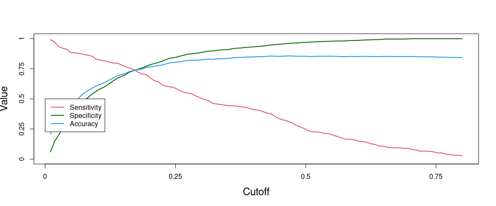<!-- -->

``` r
cutoff <- s[which(abs(OUT[,1]-OUT[,2])<0.02)]
cutoff # 0.169596
```

    ## [1] 0.169596

##### **8.1.10. Take the cutoff value of 0.169596 for final model**

``` r
test_cutoff_attrition <- factor(ifelse(test_pred >=0.169596, "Yes", "No"))
View(as.data.frame(test_cutoff_attrition))
      
conf_final <- confusionMatrix(test_cutoff_attrition, test_actual_attrition, positive = "Yes")
        
acc <- conf_final$overall[1]
acc # 0.7354056 or 73.5%
```

    ##  Accuracy 
    ## 0.7354056

``` r
sens <- conf_final$byClass[1]
sens # 0.745283 or 74.5%
```

    ## Sensitivity 
    ##    0.745283

``` r
spec <- conf_final$byClass[2]
spec # 0.733514 or 73.4%
```

    ## Specificity 
    ##    0.733514

``` r
View(test)
```

### **9. KS -statistic - Test Data**

``` r
test_cutoff_attrition <- ifelse(test_cutoff_attrition=="Yes",1,0)
test_actual_attrition <- ifelse(test_actual_attrition=="Yes",1,0)
```

#### **9.1. on testing data**

``` r
pred_object_test<- prediction(test_cutoff_attrition, test_actual_attrition)
performance_measures_test<- performance(pred_object_test, "tpr", "fpr")
ks_table_test <- attr(performance_measures_test, "y.values")[[1]] - (attr(performance_measures_test, "x.values")[[1]])
    
max(ks_table_test) # 0.478797
```

    ## [1] 0.478797

#################################################################### 

### **10. Lift & Gain Chart**

#### **10.1. plotting the lift chart**

``` r
  lift <- function(labels , predicted_prob,groups=10) {
  if(is.factor(labels)) labels  <- as.integer(as.character(labels ))
  if(is.factor(predicted_prob)) predicted_prob <- as.integer(as.character(predicted_prob))
  helper = data.frame(cbind(labels , predicted_prob))
  helper[,"bucket"] = ntile(-helper[,"predicted_prob"], groups)
  gaintable = helper %>% group_by(bucket)  %>%
  summarise_at(vars(labels ), funs(total = n(),totalresp=sum(., na.rm = TRUE))) %>%
  mutate(Cumresp = cumsum(totalresp),Gain=Cumresp/sum(totalresp)*100,Cumlift=Gain/(bucket*(100/groups))) 
  return(gaintable)
}
    
Churn_decile = lift(test_actual_attrition, test_pred, groups = 10)
Churn_decile
```

    ## # A tibble: 10 x 6
    ##    bucket total totalresp Cumresp  Gain Cumlift
    ##     <int> <int>     <dbl>   <dbl> <dbl>   <dbl>
    ##  1      1   132        76      76  35.8    3.58
    ##  2      2   132        41     117  55.2    2.76
    ##  3      3   132        30     147  69.3    2.31
    ##  4      4   132        20     167  78.8    1.97
    ##  5      5   132         9     176  83.0    1.66
    ##  6      6   132        10     186  87.7    1.46
    ##  7      7   132         1     187  88.2    1.26
    ##  8      8   132         8     195  92.0    1.15
    ##  9      9   132        14     209  98.6    1.10
    ## 10     10   131         3     212 100      1
