Loan\_Defaulter
================

### **1. Load Libraries ::**

``` r
library(dplyr)
library(tidyr)
library(chron)
library(gridExtra)
library(mltools)
library(ggplot2)
library(ggthemes)
library(scales)
```

### **2. Load “loan.csv” file in R ::**

``` r
loan <- read.csv("loan.csv",stringsAsFactors = FALSE)
```

### **3. Data Cleansing ::**

#### **3.1. Remove Columns with only One/Null Value**

``` r
loan_subset <- Filter(function(x)(length(unique(x))>1), loan)
```

#### **3.2. Remove columns which doesn’t helpful in analysis**

``` r
loan_subset <- loan_subset[, -c(1:2)]   # ID & Memeber, randomy generate numeric values
loan_subset <- loan_subset[, -8]        # Already retained the Grade column, so no need for sub-grade
loan_subset <- loan_subset[, -15]       # URL, not usefull in analysis
loan_subset <- loan_subset[, -15]       # desc, text field containing loan description
loan_subset <- loan_subset[, -17]       # Zip, incomplete information not useful
loan_subset <- loan_subset[, -22]       # mths_since_last_delinq, around 65% values are NA
loan_subset <- loan_subset[, -22]       # mths_since_last_record, around 93% values are NA
loan_subset <- loan_subset[, -c(27:30)] # mostly numeric columns related to the payment amount not significant for finding default pattern
loan_subset <- loan_subset[, -c(28:37)] # mostly numeric columns related to the payment amount not significant for finding default pattern
                                        # and some payment related date columns 
loan_subset <- loan_subset[, -29]       # Insignificant column containing 0 & NA's
```

#### **3.3. Derived variables**

``` r
loan_subset <- mutate(loan_subset, term = as.numeric(sub("months","", term)),
               int_rate = as.numeric(sub("%","", int_rate)),
               emp_length = ifelse(emp_length == "< 1 year", "0", emp_length),
               emp_length = ifelse(emp_length == "10+ years", "10", emp_length),
               emp_length = as.numeric(gsub("\\D", "", emp_length)),
               revol_util = as.numeric(sub("%","", revol_util)),
               balance_amt = funded_amnt-total_rec_prncp)
```

#### **3.4. finding data time objects and then sepearting them to get months and year sepately for analysis**

``` r
loan_subset$issue_d <-  paste(loan_subset$issue_d , "01" , sep ="-")
loan_subset$issue_d <- strptime(loan_subset$issue_d , "%b-%y-%d")

loan_subset <- separate(loan_subset , issue_d,c("issue_year","issue_month") ,"[-]" )
loan_subset$issue_month <- as.integer(loan_subset$issue_month)
loan_subset$issue_month <- month.abb[loan_subset$issue_month]
loan_subset$issue_month<- as.factor(loan_subset$issue_month)
loan_subset$issue_year <- as.factor(loan_subset$issue_year)
```

#### **3.5. Creating Bins for annual income**

#### **bintyppe =q uantile is used so as to create bins group that have equal number of observations**

``` r
loan_subset[,"annual_inc_range"] <- bin_data(loan_subset$annual_inc, bins=9, binType = "quantile" )
summary(loan_subset$annual_inc_range)
```

    ##             [4000, 30000)            [30000, 39600) [39600, 46886.6666666667) 
    ##                      3799                      5003                      4437 
    ## [46886.6666666667, 54000)            [54000, 62000)            [62000, 72500) 
    ##                      4067                      4511                      4654 
    ##            [72500, 86000)           [86000, 110000)           [110000, 6e+06] 
    ##                      4366                      4153                      4727

``` r
loan_subset[,"interest_rate_percent_bins"] <- bin_data(loan_subset$int_rate, bins=9, binType = "quantile")
summary(loan_subset$interest_rate_percent_bins)
```

    ##   [5.42, 7.29)   [7.29, 8.59)  [8.59, 10.37) [10.37, 11.36) [11.36, 12.53) 
    ##           4188           4575           4211           4542           4527 
    ## [12.53, 13.49) [13.49, 14.91) [14.91, 16.77) [16.77, 24.59] 
    ##           3931           4820           4305           4618

``` r
loan_subset[,"dti_range"] <- bin_data(loan_subset$dti, bins=9, binType = "quantile")
summary(loan_subset$dti_range)
```

    ##      [0, 4.43)   [4.43, 7.53)  [7.53, 10.01) [10.01, 12.31) [12.31, 14.47) 
    ##           4399           4416           4417           4405           4412 
    ## [14.47, 16.75) [16.75, 19.24) [19.24, 22.03) [22.03, 29.99] 
    ##           4420           4419           4410           4419

``` r
loan_subset[,"balance_range"] <- bin_data(loan_subset$balance_amt, bins=10, binType = "quantile" )
summary(loan_subset$balance_range)
```

    ##    [-0.25, 0)     [0, 3672) [3672, 35000] 
    ##           116         35629          3972

#### **3.6. recreated bins so as to have integer bins**

``` r
loan_subset$annual_inc_range<- bin_data(loan_subset$annual_inc, bins=c(4000,30000,40000,47000, 54000,62000,72500,86000,110000 , 6000000), binType = "explicit")
summary(loan_subset$annual_inc_range)
```

    ##   [4000, 30000)  [30000, 40000)  [40000, 47000)  [47000, 54000)  [54000, 62000) 
    ##            3799            5202            4247            4058            4511 
    ##  [62000, 72500)  [72500, 86000) [86000, 110000) [110000, 6e+06] 
    ##            4654            4366            4153            4727

### **4. Data Analysis :: Using graphs to find out trends**

#### **4.1. This graph shows that what is the ratio of loan status with respective to loan term**

``` r
p_term <- ggplot(loan_subset , aes(x=as.factor(term) , fill = loan_status)) + stat_count(aes(y = (..count..)/sum(..count..)), geom="bar", position="fill", width = 0.3)  + scale_y_continuous(labels = percent_format())+ labs(x="Loan Term in Months", y="Ratio") + ggtitle("Ratio of loan status w.r.t Loan term ") + theme_hc(base_size = 18, base_family = "sans") + scale_fill_manual("Loan Status: ", values = c("Charged Off" = "red3","Current" = "goldenrod1", "Fully Paid" = "navyblue")) + theme(plot.background = element_rect(fill="white"), axis.text.x = element_text(colour = "black"),axis.text.y = element_text(colour = "black"))
```

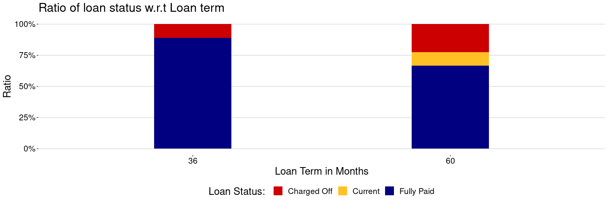<!-- -->

#### **4.2. This shows more than 10 yrs of experience has a high charge off ratio to the total number of customers in that segment**

``` r
p_emp_length <-ggplot(loan_subset , aes(x=as.factor(emp_length) , fill = loan_status)) + stat_count(aes(y = (..count..)/sum(..count..)), geom="bar", position="fill")  + scale_y_continuous(labels = percent_format())+ labs(x=" Employment Duration", y="Ratio") + 
              ggtitle("Ratio of loan status w.r.t Employment Term and annual Income") + theme_hc(base_size = 18, base_family = "sans") + 
              scale_fill_manual("Loan Status: ", values = c("Charged Off" = "red3","Current" = "goldenrod1", "Fully Paid" = "navyblue")) + 
              theme(plot.background = element_rect(fill="white"), axis.text.x = element_text(colour = "black"),axis.text.y = element_text(colour = "black"))
```

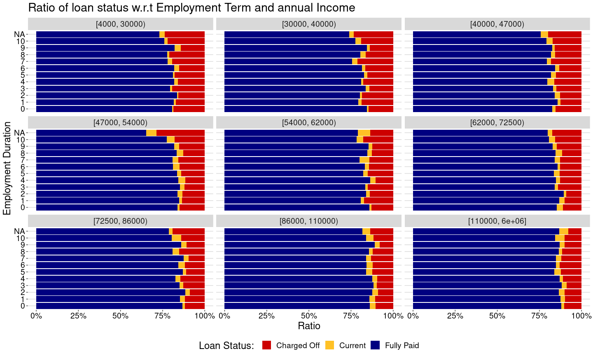<!-- -->

#### **4.3. This graph shows that what is the ratio of loans which get charged off or fully paid or are current in respective income groups**

``` r
p_annual_income <- ggplot(loan_subset , aes(annual_inc_range , fill = loan_status)) + stat_count(aes(y = (..count..)/sum(..count..)), geom="bar", position="fill")  + scale_y_continuous(labels = percent_format())+ labs(x="Income Group", y="Ratio") + 
ggtitle("Ratio of loan status w.r.t Income Groups") + theme_hc(base_size = 18, base_family = "sans") + 
scale_fill_manual("Loan Status: ", values = c("Charged Off" = "red3","Current" = "goldenrod1", "Fully Paid" = "navyblue")) + 
theme(plot.background = element_rect(fill="white"), axis.text.x = element_text(colour = "black"),axis.text.y = element_text(colour = "black"))
```

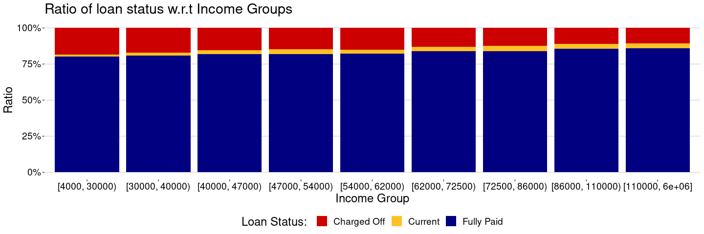<!-- -->

#### **4.4. This tells us about different grades and their respective loan statuses. Grade ‘G’ has a high charge off ratio**

``` r
p_grade<- ggplot(loan_subset , aes(grade , fill = loan_status)) + stat_count(aes(y = (..count..)/sum(..count..)), geom="bar", position="fill")  + 
          scale_y_continuous(labels = percent_format())+ labs(x=" Grades", y="Ratio") + 
          ggtitle("Ratio of loan status w.r.t Grades ") + theme_hc(base_size = 18, base_family = "sans") + 
          scale_fill_manual("Loan Status: ", values = c("Charged Off" = "red3","Current" = "goldenrod1", "Fully Paid" = "navyblue")) + 
          theme(plot.background = element_rect(fill="white"), axis.text.x = element_text(colour = "black"),axis.text.y = element_text(colour = "black"))
```

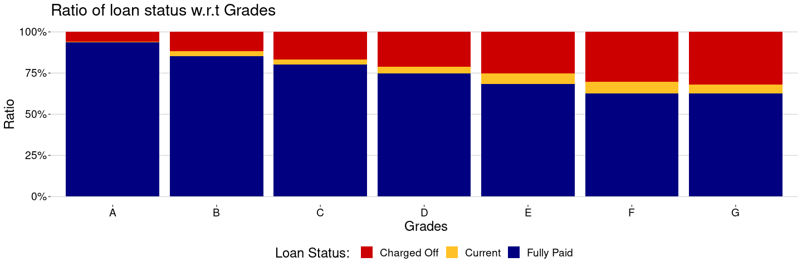<!-- -->

#### **4.5. This shows interest rates bins and then compares their charge off ratio**

``` r
p_interest <- ggplot(loan_subset , aes(interest_rate_percent_bins , fill = loan_status)) + stat_count(aes(y = (..count..)/sum(..count..)), geom="bar", position="fill")  + 
scale_y_continuous(labels = percent_format())+ labs(x=" Interest Rates Segment", y="Ratio") + 
ggtitle("Ratio of loan status w.r.t Interest Rates") + theme_hc(base_size = 18, base_family = "sans") + 
scale_fill_manual("Loan Status: ", values = c("Charged Off" = "red3","Current" = "goldenrod1", "Fully Paid" = "navyblue")) + 
theme(plot.background = element_rect(fill="white"), axis.text.x = element_text(colour = "black"),axis.text.y = element_text(colour = "black"))
```

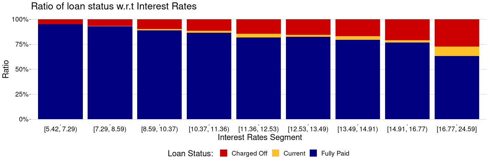<!-- -->

#### **4.6. This shows the purpose of loan status. Loans taken for small businesses have a high charge off ratio**

``` r
p_purpose <- ggplot(loan_subset , aes(purpose , fill = loan_status)) + stat_count(aes(y = (..count..)/sum(..count..)), geom="bar", position="fill")  + 
             scale_y_continuous(labels = percent_format())+ labs(x="Loan Purpose", y="Ratio") + 
             ggtitle("Ratio of loan status w.r.t Loan Purpose") + theme_hc(base_size = 18, base_family = "sans") + 
             scale_fill_manual("Loan Status: ", values = c("Charged Off" = "red3","Current" = "goldenrod1", "Fully Paid" = "navyblue")) + 
             theme(plot.background = element_rect(fill="white"), axis.text.x = element_text(colour = "black",angle = 45,vjust=1, hjust=1),axis.text.y = element_text(colour = "black"))
```

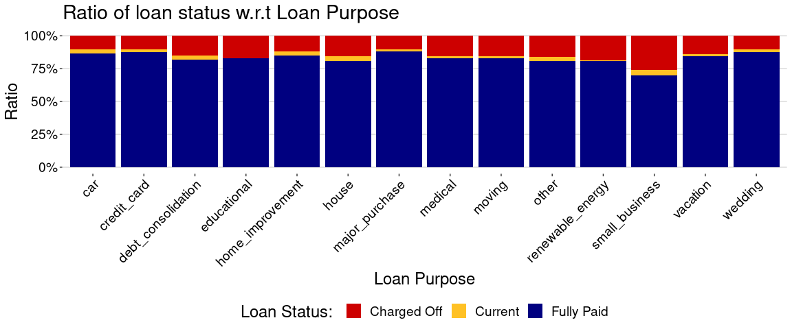<!-- -->

#### **4.7. This shows loans in which locations tend to default more**

``` r
p_location <- ggplot(loan_subset , aes(addr_state , fill = loan_status)) + stat_count(aes(y = (..count..)/sum(..count..)), geom="bar", position="fill")  + 
              scale_y_continuous(labels = percent_format())+ labs(x="Address States", y="Ratio") + 
              ggtitle("Ratio of loan status w.r.t Address State") + theme_hc(base_size = 18, base_family = "sans") + 
              scale_fill_manual("Loan Status: ", values = c("Charged Off" = "red3","Current" = "goldenrod1", "Fully Paid" = "navyblue")) + 
theme(plot.background = element_rect(fill="white"), axis.text.x = element_text(colour = "black",angle=90),axis.text.y = element_text(colour = "black"))
```

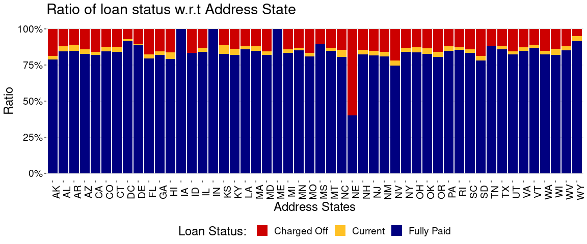<!-- -->

#### **4.8. Graph showing number of inquiries made during last 6 months and its effect of default ratio**

``` r
p_inq <- ggplot(loan_subset , aes(inq_last_6mths , fill = loan_status)) + stat_count(aes(y = (..count..)/sum(..count..)), geom="bar", position="fill")  + 
         scale_y_continuous(labels = percent_format())+ labs(x="Number of Inquiries", y="Ratio") + 
         ggtitle("Ratio of loan status w.r.t Inquiries in last 6 months") + theme_hc(base_size = 18, base_family = "sans") + 
         scale_fill_manual("Loan Status: ", values = c("Charged Off" = "red3","Current" = "goldenrod1", "Fully Paid" = "navyblue")) + 
         theme(plot.background = element_rect(fill="white"), axis.text.x = element_text(colour = "black"),axis.text.y = element_text(colour = "black"))
```

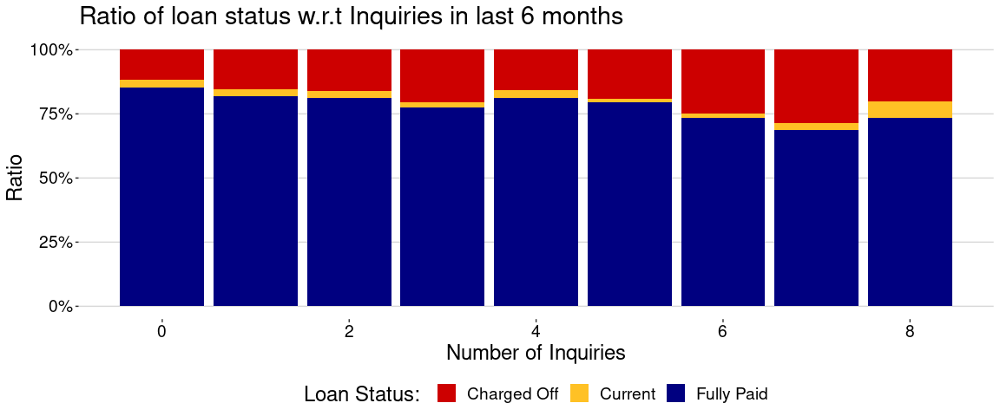<!-- -->

#### **4.9. Graph showing DTI RANGE. Low dti results in less charge**

``` r
p_dti<- ggplot(loan_subset , aes(dti_range , fill = loan_status)) + stat_count(aes(y = (..count..)/sum(..count..)), geom="bar", position="fill")  + 
        scale_y_continuous(labels = percent_format())+ labs(x="Dti Range", y="Ratio") + 
        ggtitle("Ratio of loan status w.r.t dti") + theme_hc(base_size = 18, base_family = "sans") + 
        scale_fill_manual("Loan Status: ", values = c("Charged Off" = "red3","Current" = "goldenrod1", "Fully Paid" = "navyblue")) + 
        theme(plot.background = element_rect(fill="white"), axis.text.x = element_text(colour = "black"),axis.text.y = element_text(colour = "black"))
```

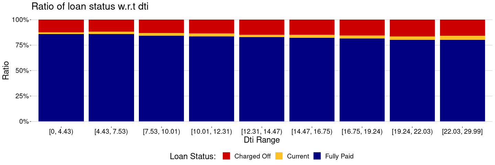<!-- -->

#### **4.10. Delinq 2 years show that people having 7*30+ or 8*30+ days of delinquency show high charge off ratio**

``` r
 p_delinq<- ggplot(loan_subset , aes(x=as.factor(delinq_2yrs) , fill = loan_status)) + stat_count(aes(y = (..count..)/sum(..count..)), geom="bar", position="fill")  + 
scale_y_continuous(labels = percent_format())+ labs(x="Number of Delinquencies", y="Ratio") + 
ggtitle("Ratio of loan status w.r.t Delinquencies in 2 years") + theme_hc(base_size = 18, base_family = "sans") + 
scale_fill_manual("Loan Status: ", values = c("Charged Off" = "red3","Current" = "goldenrod1", "Fully Paid" = "navyblue")) + 
theme(plot.background = element_rect(fill="white"), axis.text.x = element_text(colour = "black"),axis.text.y = element_text(colour = "black"))
```

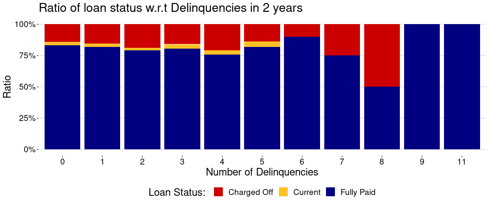<!-- -->

#### **4.11. Deragatory Accounts Bankruptcy leads to increase in defaulter**

``` r
p_pub_rec_bankruptcies <- ggplot(data=subset(loan_subset, !is.na(loan_subset$pub_rec_bankruptcies)) , aes(x=as.factor(pub_rec_bankruptcies) , fill = loan_status)) + stat_count(aes(y = (..count..)/sum(..count..)), geom="bar", position="fill", width = 0.4)  + 
scale_y_continuous(labels = percent_format())+ labs(x=" Number of Bankruptcies", y="Ratio") + 
ggtitle("Ratio of loan status w.r.t Bankruptcies") + theme_hc(base_size = 18, base_family = "sans") + 
scale_fill_manual("Loan Status: ", values = c("Charged Off" = "red3","Current" = "goldenrod1", "Fully Paid" = "navyblue")) + 
theme(plot.background = element_rect(fill="white"), axis.text.x = element_text(colour = "black"),axis.text.y = element_text(colour = "black"))
```

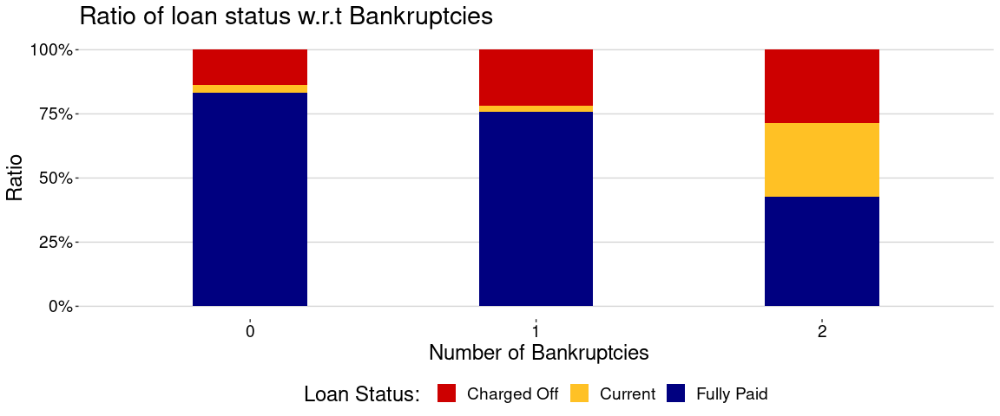<!-- -->

#### **4.12. This shows how a specific person will act given his income and grade**

``` r
p_grade_income<- ggplot(loan_subset , aes(x=as.factor(grade) , fill = loan_status)) + stat_count(aes(y = (..count..)/sum(..count..)), geom="bar", position="fill")  + scale_y_continuous(labels = percent_format())+ labs(x=" Grades", y="Ratio") + 
ggtitle("Ratio of loan status w.r.t Income and Grade") + theme_hc(base_size = 18, base_family = "sans") + 
scale_fill_manual("Loan Status: ", values = c("Charged Off" = "red3","Current" = "goldenrod1", "Fully Paid" = "navyblue")) + 
theme(plot.background = element_rect(fill="white"), axis.text.x = element_text(colour = "black"),axis.text.y = element_text(colour = "black"))
```

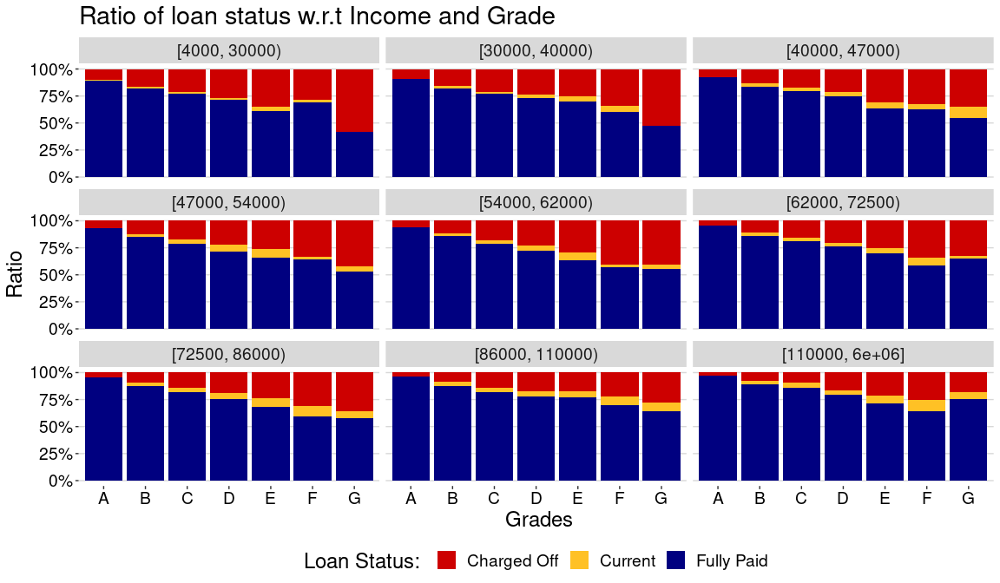<!-- -->

#### **4.13. This shows the purpose and income bins. Can be use for predictive analysis**

``` r
p_purpose_income<- ggplot(loan_subset , aes(x=purpose, fill = loan_status)) + stat_count(aes(y = (..count..)/sum(..count..)), geom="bar", position="fill")  + scale_y_continuous(labels = percent_format())+ labs(x="Purpose", y="Ratio") + 
ggtitle("Ratio of loan status w.r.t Loan Purpose and Income") + theme_hc(base_size = 18, base_family = "sans") + 
scale_fill_manual("Loan Status: ", values = c("Charged Off" = "red3","Current" = "goldenrod1", "Fully Paid" = "navyblue")) + 
theme(plot.background = element_rect(fill="white"), axis.text.x = element_text(colour = "black"),axis.text.y = element_text(colour = "black"))
```

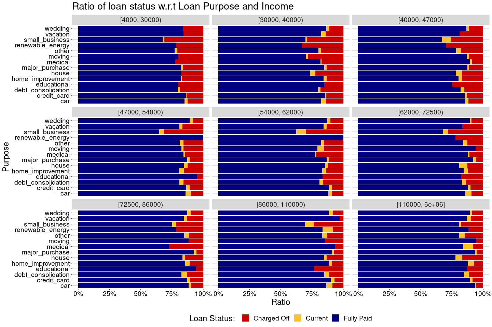<!-- -->

### **5. Analysis on the remaining attributes which doesn’t yield any meaningful insights**

#### **5.1 Graph showing home onwnership and the respective statuses**

``` r
p_home_own <- ggplot(loan_subset , aes(home_ownership , fill = loan_status))+geom_bar(stat="count", position="fill")
```

``` r
p_home_own+facet_wrap(~annual_inc_range)+coord_flip()
```

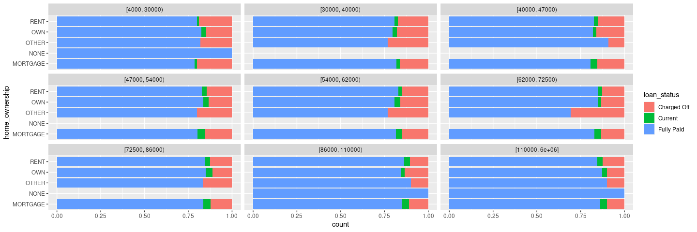<!-- -->

#### **5.2. Verifiacation statuses showing Chareg off ratio . It does not show any specific pattern**

``` r
p_verification <- ggplot(loan_subset , aes(verification_status , fill = loan_status))+geom_bar(stat ="count" , position = "fill") 
```

<!-- -->

#### **5.3. Graph showing no of total accounts along with loan statuses . This is just a random pattern**

``` r
p_total_acc <- ggplot(loan_subset , aes(as.factor(total_acc) , fill = loan_status))+geom_bar(stat = "count", position= "fill")
```

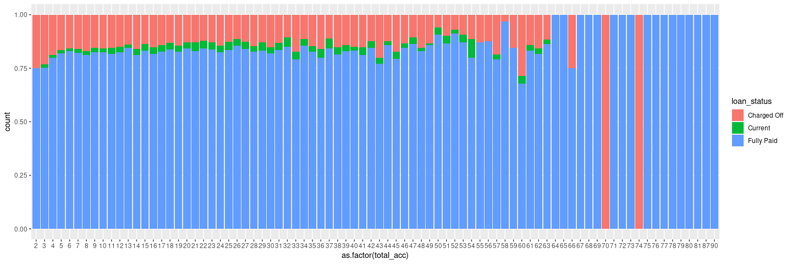<!-- -->

#### **5.4. Derogatory Accounts an dits effect on default cases**

``` r
p_pub_rec <-ggplot(loan_subset,aes(pub_rec, fill= loan_status))+geom_bar(stat ="count" , position = "fill")
```

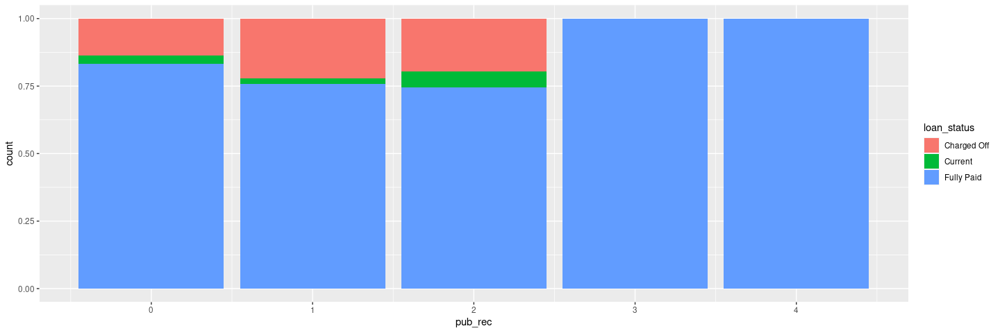<!-- -->

#### **5.5. subsetting on the basis loan\_status**

``` r
data_charged_off  <- subset(loan_subset , loan_status == "Charged Off")
data_current <- subset(loan_subset , loan_status == "Current")
data_paid <- subset(loan_subset ,loan_status == "Fully Paid")
```

#### **5.6. Analyzing trend on the basis of charged off loans (defining income groups to check if there is any trend)**

##### **5.6.1. This shows the income group to which highest number of defaulting customers belongs**

``` r
c1a <- ggplot(data_charged_off , aes(purpose))+geom_bar(stat = "count", fill="navyblue") + labs(x="Purpose", y="count") + 
       ggtitle("Income group with Highest no. of Defaulter") + theme_hc(base_size = 18, base_family = "sans") + 
       theme(plot.background = element_rect(fill="white"), axis.text.x = element_text(colour = "black"),axis.text.y = element_text(colour = "black"))
```

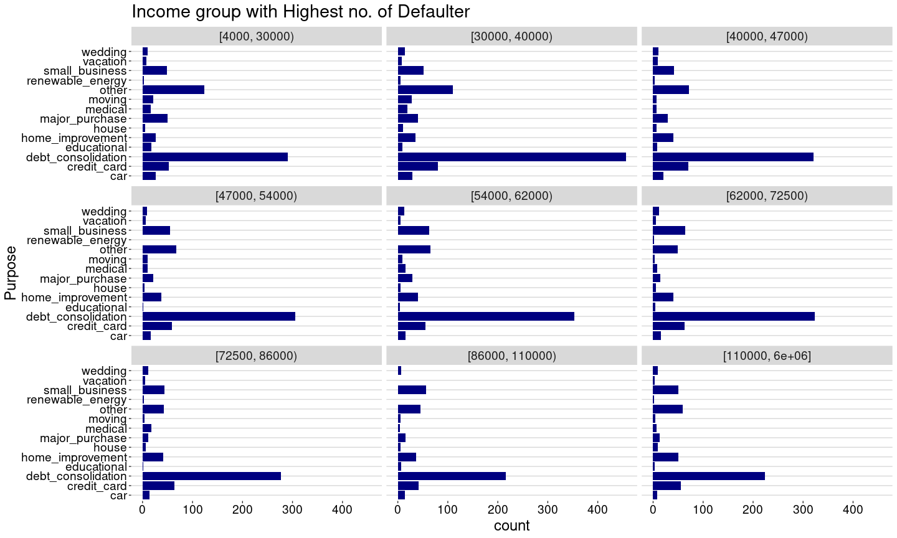<!-- -->

##### **5.6.2. This shows that which bracket of income group corresponds to which grade (i.e. a particular income group with Grade ‘A’ will have less chances to be defaulter)**

``` r
c1b <- ggplot(loan_subset , aes(x=annual_inc_range , fill = grade)) + stat_count(aes(y = (..count..)/sum(..count..)), geom="bar", position="fill")  + 
scale_y_continuous(labels = percent_format())+ labs(x=" Term", y="Ratio") + 
ggtitle("Ratio of Grades w.r.t Income") + theme_hc(base_size = 18, base_family = "sans") + 
scale_fill_manual("Grades: ", values = c("A" = "red3","B" = "goldenrod1", "C" = "navyblue", "D" = "green4", "E" = "gray", "F" = "purple", "G" = "orange")) + theme(plot.background = element_rect(fill="white"), axis.text.x = element_text(colour = "black"),axis.text.y = element_text(colour = "black"))
```

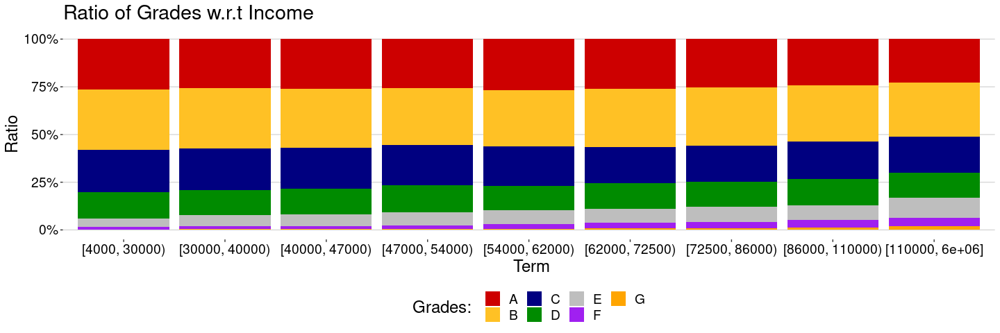<!-- -->

#### **5.6.3. This shows to which segment does not defaulting customers belong**

``` r
c_home <- ggplot(data_charged_off , aes(home_ownership))+geom_bar(stat = "count", fill= "navyblue", width = 0.4) + labs(x=" Home Ownership", y="Frequency") + ggtitle("Charged Off frequecy w.r.t Home Ownership ") + theme_hc(base_size = 18, base_family = "sans") + 
  theme(plot.background = element_rect(fill="white"), axis.text.x = element_text(colour = "black"),axis.text.y = element_text(colour = "black"))
```

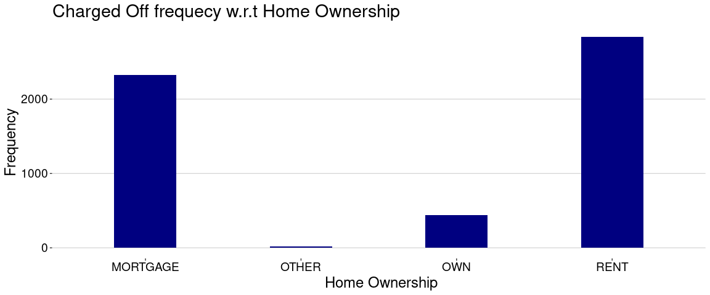<!-- -->

#### **5.6.4. This shows that defaulting rate has been increased significantly in 2011**

``` r
c_year <- ggplot(data_charged_off , aes(as.factor(issue_year)))+geom_bar(stat = "count", fill= "navyblue", width = 0.4) + labs(x="Issue Year", y="Frequency") + ggtitle("Charged Off frequecy w.r.t Loan Issue Year") + theme_hc(base_size = 18, base_family = "sans") + 
theme(plot.background = element_rect(fill="white"), axis.text.x = element_text(colour = "black"),axis.text.y = element_text(colour = "black")) 
```

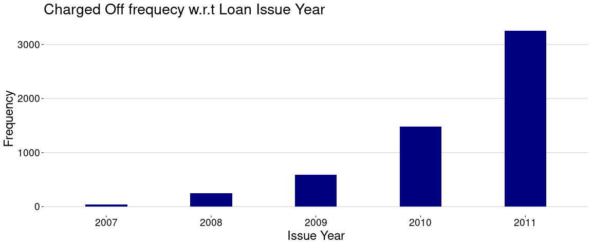<!-- -->

#### **5.6.5. This shows that defaulting rate has been increased significantly in 2011**

``` r
asd <- ggplot(loan_subset , aes(x=factor(emp_length) , fill = loan_status)) + stat_count(aes(y = (..count..)/sum(..count..)), geom="bar", position="fill")  + scale_y_continuous(labels = percent_format())+ labs(x="Employment Length", y="Ratio") + 
 ggtitle("Ratio of Grades w.r.t Purpose and Employment Length") + theme_hc(base_size = 18, base_family = "sans") + 
 scale_fill_manual("Loan Status: ", values = c("Charged Off" = "red3","Current" = "goldenrod1", "Fully Paid" = "navyblue")) + 
 theme(plot.background = element_rect(fill="white"), axis.text.x = element_text(colour = "black"),axis.text.y = element_text(colour = "black",size=10))
```

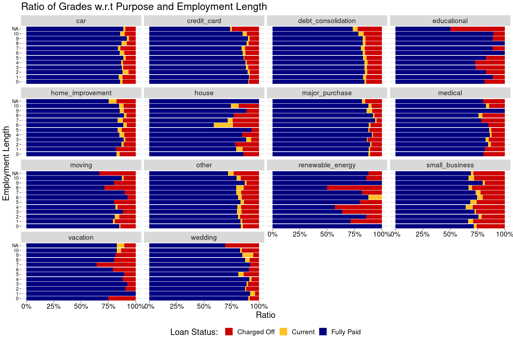<!-- -->
