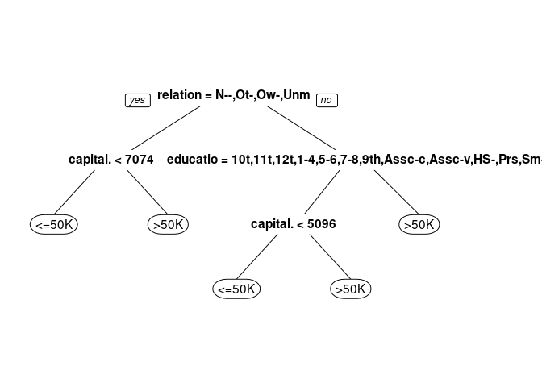
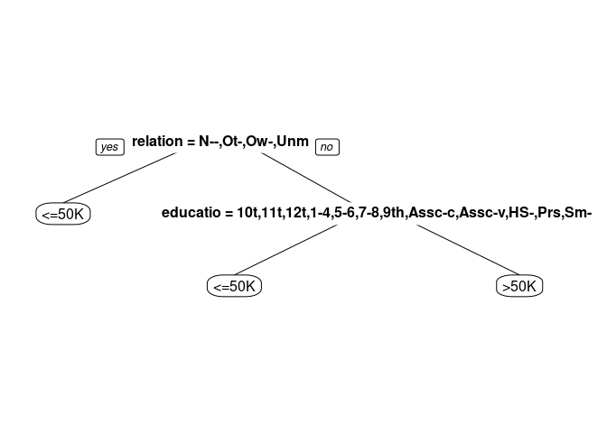
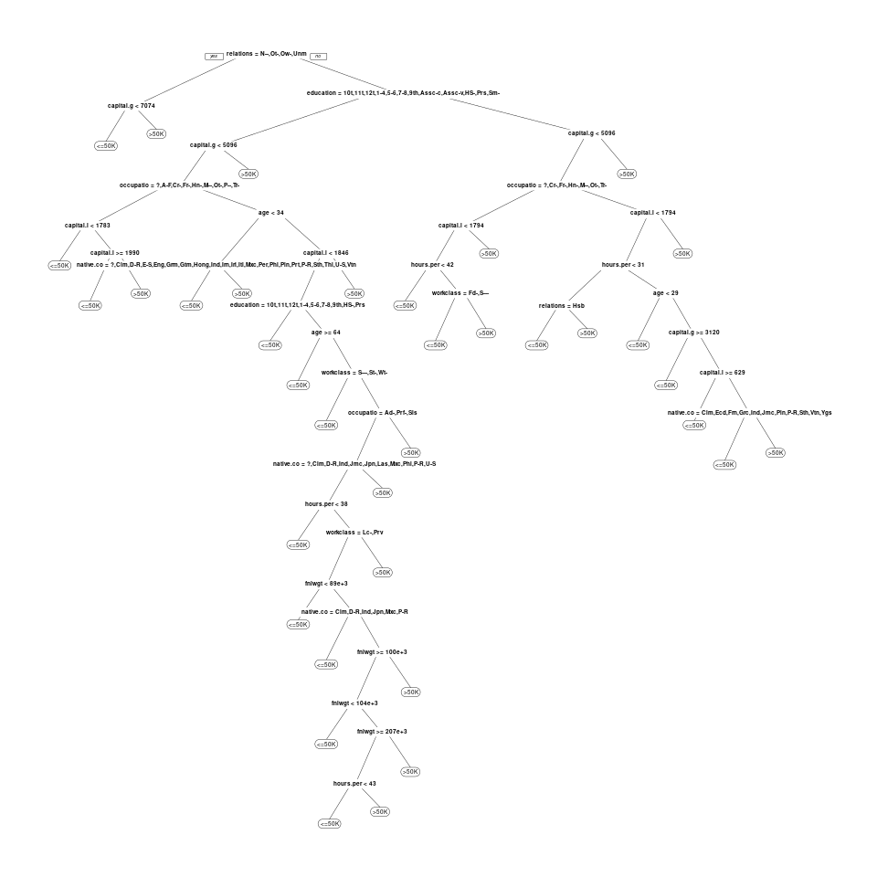
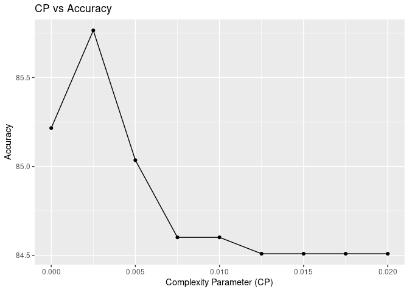

Adult Monthly Income
================

### **1. Load Libraries**

``` r
library(rpart)
library(rpart.plot)
library(caret)
library(ggplot2)
library(knitr)
```

### **2. Clean environment variables**

``` r
rm(list = ls())
```

### **3. Load the data**

``` r
income <- read.csv("adult_dataset.csv", stringsAsFactors = TRUE)
str(income)
```

    ## 'data.frame':    32561 obs. of  15 variables:
    ##  $ age           : int  90 82 66 54 41 34 38 74 68 41 ...
    ##  $ workclass     : Factor w/ 9 levels "?","Federal-gov",..: 1 5 1 5 5 5 5 8 2 5 ...
    ##  $ fnlwgt        : int  77053 132870 186061 140359 264663 216864 150601 88638 422013 70037 ...
    ##  $ education     : Factor w/ 16 levels "10th","11th",..: 12 12 16 6 16 12 1 11 12 16 ...
    ##  $ education.num : int  9 9 10 4 10 9 6 16 9 10 ...
    ##  $ marital.status: Factor w/ 7 levels "Divorced","Married-AF-spouse",..: 7 7 7 1 6 1 6 5 1 5 ...
    ##  $ occupation    : Factor w/ 15 levels "?","Adm-clerical",..: 1 5 1 8 11 9 2 11 11 4 ...
    ##  $ relationship  : Factor w/ 6 levels "Husband","Not-in-family",..: 2 2 5 5 4 5 5 3 2 5 ...
    ##  $ race          : Factor w/ 5 levels "Amer-Indian-Eskimo",..: 5 5 3 5 5 5 5 5 5 5 ...
    ##  $ sex           : Factor w/ 2 levels "Female","Male": 1 1 1 1 1 1 2 1 1 2 ...
    ##  $ capital.gain  : int  0 0 0 0 0 0 0 0 0 0 ...
    ##  $ capital.loss  : int  4356 4356 4356 3900 3900 3770 3770 3683 3683 3004 ...
    ##  $ hours.per.week: int  40 18 40 40 40 45 40 20 40 60 ...
    ##  $ native.country: Factor w/ 42 levels "?","Cambodia",..: 40 40 40 40 40 40 40 40 40 1 ...
    ##  $ income        : Factor w/ 2 levels "<=50K",">50K": 1 1 1 1 1 1 1 2 1 2 ...

``` r
kable(income[1:20, ])
```

| age | workclass        | fnlwgt | education    | education.num | marital.status | occupation        | relationship   | race  | sex    | capital.gain | capital.loss | hours.per.week | native.country | income   |
|----:|:-----------------|-------:|:-------------|--------------:|:---------------|:------------------|:---------------|:------|:-------|-------------:|-------------:|---------------:|:---------------|:---------|
|  90 | ?                |  77053 | HS-grad      |             9 | Widowed        | ?                 | Not-in-family  | White | Female |            0 |         4356 |             40 | United-States  | &lt;=50K |
|  82 | Private          | 132870 | HS-grad      |             9 | Widowed        | Exec-managerial   | Not-in-family  | White | Female |            0 |         4356 |             18 | United-States  | &lt;=50K |
|  66 | ?                | 186061 | Some-college |            10 | Widowed        | ?                 | Unmarried      | Black | Female |            0 |         4356 |             40 | United-States  | &lt;=50K |
|  54 | Private          | 140359 | 7th-8th      |             4 | Divorced       | Machine-op-inspct | Unmarried      | White | Female |            0 |         3900 |             40 | United-States  | &lt;=50K |
|  41 | Private          | 264663 | Some-college |            10 | Separated      | Prof-specialty    | Own-child      | White | Female |            0 |         3900 |             40 | United-States  | &lt;=50K |
|  34 | Private          | 216864 | HS-grad      |             9 | Divorced       | Other-service     | Unmarried      | White | Female |            0 |         3770 |             45 | United-States  | &lt;=50K |
|  38 | Private          | 150601 | 10th         |             6 | Separated      | Adm-clerical      | Unmarried      | White | Male   |            0 |         3770 |             40 | United-States  | &lt;=50K |
|  74 | State-gov        |  88638 | Doctorate    |            16 | Never-married  | Prof-specialty    | Other-relative | White | Female |            0 |         3683 |             20 | United-States  | &gt;50K  |
|  68 | Federal-gov      | 422013 | HS-grad      |             9 | Divorced       | Prof-specialty    | Not-in-family  | White | Female |            0 |         3683 |             40 | United-States  | &lt;=50K |
|  41 | Private          |  70037 | Some-college |            10 | Never-married  | Craft-repair      | Unmarried      | White | Male   |            0 |         3004 |             60 | ?              | &gt;50K  |
|  45 | Private          | 172274 | Doctorate    |            16 | Divorced       | Prof-specialty    | Unmarried      | Black | Female |            0 |         3004 |             35 | United-States  | &gt;50K  |
|  38 | Self-emp-not-inc | 164526 | Prof-school  |            15 | Never-married  | Prof-specialty    | Not-in-family  | White | Male   |            0 |         2824 |             45 | United-States  | &gt;50K  |
|  52 | Private          | 129177 | Bachelors    |            13 | Widowed        | Other-service     | Not-in-family  | White | Female |            0 |         2824 |             20 | United-States  | &gt;50K  |
|  32 | Private          | 136204 | Masters      |            14 | Separated      | Exec-managerial   | Not-in-family  | White | Male   |            0 |         2824 |             55 | United-States  | &gt;50K  |
|  51 | ?                | 172175 | Doctorate    |            16 | Never-married  | ?                 | Not-in-family  | White | Male   |            0 |         2824 |             40 | United-States  | &gt;50K  |
|  46 | Private          |  45363 | Prof-school  |            15 | Divorced       | Prof-specialty    | Not-in-family  | White | Male   |            0 |         2824 |             40 | United-States  | &gt;50K  |
|  45 | Private          | 172822 | 11th         |             7 | Divorced       | Transport-moving  | Not-in-family  | White | Male   |            0 |         2824 |             76 | United-States  | &gt;50K  |
|  57 | Private          | 317847 | Masters      |            14 | Divorced       | Exec-managerial   | Not-in-family  | White | Male   |            0 |         2824 |             50 | United-States  | &gt;50K  |
|  22 | Private          | 119592 | Assoc-acdm   |            12 | Never-married  | Handlers-cleaners | Not-in-family  | Black | Male   |            0 |         2824 |             40 | ?              | &gt;50K  |
|  34 | Private          | 203034 | Bachelors    |            13 | Separated      | Sales             | Not-in-family  | White | Male   |            0 |         2824 |             50 | United-States  | &gt;50K  |

#### **3.1. baseline accuracy**

``` r
prop.table(table(income$income))  # 0.76
```

    ## 
    ##     <=50K      >50K 
    ## 0.7591904 0.2408096

### **4. Divide into training and test dataset**

``` r
set.seed(123)
split.indices <- sample(nrow(income), nrow(income)*0.8, replace = F)
train <- income[split.indices, ]
test <- income[-split.indices, ]
```

### **5. Classification Trees**

#### **5.1. build tree model- default hyperparameters**

``` r
tree.model <- rpart(income ~ ., data = train, method = "class")               
```

##### **5.1.1. display decision tree**

``` r
prp(tree.model)
```

<!-- -->

##### **5.1.2. make predictions on the test set**

``` r
tree.predict <- predict(tree.model, test, type = "class")
```

##### **5.1.3. evaluate the results**

``` r
confusionMatrix(tree.predict, test$income, positive = ">50K")  # 0.8076
```

    ## Confusion Matrix and Statistics
    ## 
    ##           Reference
    ## Prediction <=50K >50K
    ##      <=50K  4668  785
    ##      >50K    252  808
    ##                                           
    ##                Accuracy : 0.8408          
    ##                  95% CI : (0.8317, 0.8496)
    ##     No Information Rate : 0.7554          
    ##     P-Value [Acc > NIR] : < 2.2e-16       
    ##                                           
    ##                   Kappa : 0.5142          
    ##                                           
    ##  Mcnemar's Test P-Value : < 2.2e-16       
    ##                                           
    ##             Sensitivity : 0.5072          
    ##             Specificity : 0.9488          
    ##          Pos Pred Value : 0.7623          
    ##          Neg Pred Value : 0.8560          
    ##              Prevalence : 0.2446          
    ##          Detection Rate : 0.1241          
    ##    Detection Prevalence : 0.1628          
    ##       Balanced Accuracy : 0.7280          
    ##                                           
    ##        'Positive' Class : >50K            
    ## 

#### **5.2. Change the algorithm to “information gain” instead of default “gini”**

``` r
tree.model <- rpart(income ~ .,data = train,method = "class",parms = list(split = "information"))
```

##### **5.2.1. display decision tree**

``` r
prp(tree.model)
```

<!-- -->

##### **5.2.2. make predictions on the test set**

``` r
tree.predict <- predict(tree.model, test, type = "class")
```

##### **5.2.3. evaluate the results**

``` r
confusionMatrix(tree.predict, test$income, positive = ">50K")  # 0.8076
```

    ## Confusion Matrix and Statistics
    ## 
    ##           Reference
    ## Prediction <=50K >50K
    ##      <=50K  4668  785
    ##      >50K    252  808
    ##                                           
    ##                Accuracy : 0.8408          
    ##                  95% CI : (0.8317, 0.8496)
    ##     No Information Rate : 0.7554          
    ##     P-Value [Acc > NIR] : < 2.2e-16       
    ##                                           
    ##                   Kappa : 0.5142          
    ##                                           
    ##  Mcnemar's Test P-Value : < 2.2e-16       
    ##                                           
    ##             Sensitivity : 0.5072          
    ##             Specificity : 0.9488          
    ##          Pos Pred Value : 0.7623          
    ##          Neg Pred Value : 0.8560          
    ##              Prevalence : 0.2446          
    ##          Detection Rate : 0.1241          
    ##    Detection Prevalence : 0.1628          
    ##       Balanced Accuracy : 0.7280          
    ##                                           
    ##        'Positive' Class : >50K            
    ## 

### **6. Tune the hyperparameters**

``` r
  tree.model <- rpart(income ~ .,                                # formula
                     data = train,                             # training data
                     method = "class",                         # classification or regression
                     control = rpart.control(minsplit = 1000,  # min observations for node
                                             minbucket = 1000, # min observations for leaf node
                                             cp = 0.05))       # complexity parameter
```

#### **6.1. display decision tree**

``` r
prp(tree.model)
```

<!-- -->

#### **6.2. make predictions on the test set**

``` r
tree.predict <- predict(tree.model, test, type = "class")
```

#### **6.3. evaluate the results**

``` r
    confusionMatrix(tree.predict, test$income, positive = ">50K")  # 0.77740
```

    ## Confusion Matrix and Statistics
    ## 
    ##           Reference
    ## Prediction <=50K >50K
    ##      <=50K  4673  942
    ##      >50K    247  651
    ##                                           
    ##                Accuracy : 0.8174          
    ##                  95% CI : (0.8078, 0.8268)
    ##     No Information Rate : 0.7554          
    ##     P-Value [Acc > NIR] : < 2.2e-16       
    ##                                           
    ##                   Kappa : 0.4205          
    ##                                           
    ##  Mcnemar's Test P-Value : < 2.2e-16       
    ##                                           
    ##             Sensitivity : 0.40866         
    ##             Specificity : 0.94980         
    ##          Pos Pred Value : 0.72494         
    ##          Neg Pred Value : 0.83224         
    ##              Prevalence : 0.24459         
    ##          Detection Rate : 0.09995         
    ##    Detection Prevalence : 0.13788         
    ##       Balanced Accuracy : 0.67923         
    ##                                           
    ##        'Positive' Class : >50K            
    ## 

### **7. A more complex tree**

``` r
  tree.model <- rpart(income ~ .,                                # formula
                     data = train,                             # training data
                     method = "class",                         # classification or regression
                     control = rpart.control(minsplit = 1,     # min observations for node
                                             minbucket = 1,    # min observations for leaf node
                                             cp = 0.001))      # complexity parameter
```

#### **7.1. display decision tree**

``` r
prp(tree.model)
```

<!-- -->

#### **7.2. make predictions on the test set**

``` r
tree.predict <- predict(tree.model, test, type = "class")
```

#### **7.3. evaluate the results**

``` r
confusionMatrix(tree.predict, test$income, positive = ">50K") 
```

    ## Confusion Matrix and Statistics
    ## 
    ##           Reference
    ## Prediction <=50K >50K
    ##      <=50K  4696  724
    ##      >50K    224  869
    ##                                           
    ##                Accuracy : 0.8544          
    ##                  95% CI : (0.8456, 0.8629)
    ##     No Information Rate : 0.7554          
    ##     P-Value [Acc > NIR] : < 2.2e-16       
    ##                                           
    ##                   Kappa : 0.5593          
    ##                                           
    ##  Mcnemar's Test P-Value : < 2.2e-16       
    ##                                           
    ##             Sensitivity : 0.5455          
    ##             Specificity : 0.9545          
    ##          Pos Pred Value : 0.7951          
    ##          Neg Pred Value : 0.8664          
    ##              Prevalence : 0.2446          
    ##          Detection Rate : 0.1334          
    ##    Detection Prevalence : 0.1678          
    ##       Balanced Accuracy : 0.7500          
    ##                                           
    ##        'Positive' Class : >50K            
    ## 

### **8.1. Cross test to choose CP**

#### **8.1.1. set the number of folds in cross test to 5**

``` r
tree.control = trainControl(method = "cv", number = 5)
```

#### **8.1.2. set the search space for CP**

``` r
tree.grid = expand.grid(cp = seq(0, 0.02, 0.0025))
```

#### **8.1.3. train model**

``` r
    tree.model <- train(income ~ .,
                     data = train,
                     method = "rpart",
                     metric = "Accuracy",
                     trControl = tree.control,
                     tuneGrid = tree.grid,
                     control = rpart.control(minsplit = 50,
                                             minbucket = 20))
```

#### **8.1.4. look at cross validated model results**

``` r
tree.model
```

    ## CART 
    ## 
    ## 26048 samples
    ##    14 predictor
    ##     2 classes: '<=50K', '>50K' 
    ## 
    ## No pre-processing
    ## Resampling: Cross-Validated (5 fold) 
    ## Summary of sample sizes: 20838, 20839, 20839, 20838, 20838 
    ## Resampling results across tuning parameters:
    ## 
    ##   cp      Accuracy   Kappa    
    ##   0.0000  0.8521572  0.5725157
    ##   0.0025  0.8576474  0.5698223
    ##   0.0050  0.8503533  0.5452414
    ##   0.0075  0.8460152  0.5289067
    ##   0.0100  0.8460152  0.5289067
    ##   0.0125  0.8450938  0.5244052
    ##   0.0150  0.8450938  0.5244052
    ##   0.0175  0.8450938  0.5244052
    ##   0.0200  0.8450938  0.5244052
    ## 
    ## Accuracy was used to select the optimal model using the largest value.
    ## The final value used for the model was cp = 0.0025.

#### **8.1.5. look at best value of hyperparameter**

``` r
tree.model$bestTune
```

    ##       cp
    ## 2 0.0025

#### **8.1.6. make predictions on test set**

``` r
tree.predict <- predict.train(tree.model, test)
```

#### **8.1.7. accuracy**

``` r
confusionMatrix(tree.predict, test$income)  
```

    ## Confusion Matrix and Statistics
    ## 
    ##           Reference
    ## Prediction <=50K >50K
    ##      <=50K  4706  770
    ##      >50K    214  823
    ##                                         
    ##                Accuracy : 0.8489        
    ##                  95% CI : (0.84, 0.8575)
    ##     No Information Rate : 0.7554        
    ##     P-Value [Acc > NIR] : < 2.2e-16     
    ##                                         
    ##                   Kappa : 0.5364        
    ##                                         
    ##  Mcnemar's Test P-Value : < 2.2e-16     
    ##                                         
    ##             Sensitivity : 0.9565        
    ##             Specificity : 0.5166        
    ##          Pos Pred Value : 0.8594        
    ##          Neg Pred Value : 0.7936        
    ##              Prevalence : 0.7554        
    ##          Detection Rate : 0.7226        
    ##    Detection Prevalence : 0.8408        
    ##       Balanced Accuracy : 0.7366        
    ##                                         
    ##        'Positive' Class : <=50K         
    ## 

### **9. plot CP vs Accuracy**

``` r
accuracy_graph <- data.frame(tree.model$results)
ggplot(data = accuracy_graph, aes(x = cp, y = Accuracy*100)) +
        geom_line() + geom_point() + labs(x = "Complexity Parameter (CP)", y = "Accuracy", title = "CP vs Accuracy")
```

<!-- -->
