Sales And Demand Forecasting
================

Need to forecast the sales and the demand for the next 6 months for a
super store giant “Global Mart”. Transactional data are available for
over 4 years transactional.

### Analysis Approach

Group the data in to 21 segments (For & Markets and 3 Segments) and Find
2 most profitable segments among those

### **1. Load Libraries**

``` r
library(dplyr)
library(forecast)
library(tseries)
library(ggplot2)
library(cowplot)
```

### **2. Load data**

``` r
superstore_data <- read.csv("Global Superstore.csv", stringsAsFactors = FALSE)  #51290 observations   24 variables
```

### 3. Data Preparation & Exploratory Data Analysis

#### **3.1. Checking for missing value**

``` r
sapply(superstore_data, function(x) sum(is.na(x)))
```

    ##         Row.ID       Order.ID     Order.Date      Ship.Date      Ship.Mode 
    ##              0              0              0              0              0 
    ##    Customer.ID  Customer.Name        Segment           City          State 
    ##              0              0              0              0              0 
    ##        Country    Postal.Code         Market         Region     Product.ID 
    ##              0          41296              0              0              0 
    ##       Category   Sub.Category   Product.Name          Sales       Quantity 
    ##              0              0              0              0              0 
    ##       Discount         Profit  Shipping.Cost Order.Priority 
    ##              0              0              0              0

``` r
# We've missing values for Zipcode but we won't consider zipcode for analysis, so no need to treat the missing values
```

#### **3.2. Extracting month and year from the “Order.Date” column**

``` r
superstore_data$Order.Month <- as.numeric(format(as.POSIXct(superstore_data$Order.Date,format="%d-%m-%Y"),"%m"))
superstore_data$Order.Year <- as.numeric(format(as.POSIXct(superstore_data$Order.Date,format="%d-%m-%Y"),"%Y"))
```

#### **3.3. Grouping data**

``` r
segmented_data <- superstore_data %>% group_by(Market,Segment,Order.Year,Order.Month) %>%summarise(sum(Sales),sum(Quantity),sum(Profit))
colnames(segmented_data)[4:7] <- c("Month","Sales","Quantity","Profit")
```

#### **3.4. Calculating “Cofficient of Variation” for the 21 segments**

``` r
Segments_21 <- segmented_data %>% group_by(Market,Segment)%>%summarise(sd(Profit)/mean(Profit))
colnames(Segments_21)[3] <- "CV"
```

``` r
top_2 <- as.data.frame(head(Segments_21[order(Segments_21$CV, decreasing = FALSE), ],2))
```

    ##   Market  Segment        CV
    ## 1     EU Consumer 0.6243052
    ## 2   APAC Consumer 0.6321323

#### **3.5. Also, checking for the top two most profitable segments**

``` r
Profit_21 <- segmented_data %>% group_by(Market,Segment)%>%summarise(sum(Profit))
top_2_profitable_segment <- as.data.frame(head(Profit_21[order(Profit_21$`sum(Profit)`, decreasing = TRUE), ],2))
top_2_profitable_segment
```

    ##   Market  Segment sum(Profit)
    ## 1   APAC Consumer    222817.6
    ## 2     EU Consumer    188687.7

#### **3.6. Final Top 2 segments " APAC Consumer" and “EU Consumer” (based on Cofficient of Variation and Total Profit)**

``` r
segmented_data_APAC_Consumer <- segmented_data[which(segmented_data$Market =="APAC" & segmented_data$Segment =="Consumer"),]
segmented_data_EU_Consumer <- segmented_data[which(segmented_data$Market =="EU" & segmented_data$Segment =="Consumer"),]
```

##### **3.6.1. Plot to check increasing trend for profit for the final 2 segments**

``` r
plot_grid(ggplot(segmented_data_APAC_Consumer, aes(x=Month, y=Profit)) + geom_line()+ geom_smooth(method = "lm"),
ggplot(segmented_data_EU_Consumer, aes(x=Month, y=Profit)) + geom_line()+ geom_smooth(method = "lm"), align = "h")
```

    ## `geom_smooth()` using formula 'y ~ x'
    ## `geom_smooth()` using formula 'y ~ x'

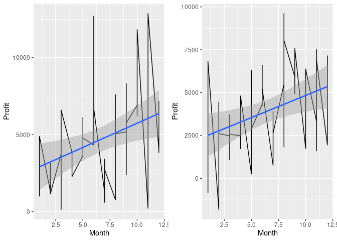<!-- -->

#### **3.7. Remove the unwanted columns from the finalized two segments**

``` r
segmented_data_APAC_Consumer$Month <- c(1:48)
segmented_data_APAC_Consumer <- segmented_data_APAC_Consumer[,4:6]
    
segmented_data_EU_Consumer$Month <- c(1:48)
segmented_data_EU_Consumer <- segmented_data_EU_Consumer[,4:6]
```

#### **3.8. Series to predict**

``` r
APAC_Consumer_Sales <- as.data.frame(segmented_data_APAC_Consumer[,c("Month","Sales")])
APAC_Consumer_Quantity <- as.data.frame(segmented_data_APAC_Consumer[,c("Month","Quantity")])
EU_Consumer_Sales <- as.data.frame(segmented_data_EU_Consumer[,c("Month","Sales")])
EU_Consumer_Quantity <- as.data.frame(segmented_data_EU_Consumer[,c("Month","Quantity")])
```

### **4. Forecasting APAC Consumer Sales**

#### **4.1. Creating the model using the first 42 rows and then we shall test the model on the remaining 6 rows later**

``` r
total_APAC_Consumer_Sales_timeser <- ts(APAC_Consumer_Sales$Sales)
APAC_Consumer_Sales_indata <- APAC_Consumer_Sales[1:42,]
APAC_Consumer_Sales_timeser <- ts(APAC_Consumer_Sales_indata$Sales)
```

##### **4.1.1 Plotting the APAC consumer Sales timeseries**

``` r
plot(APAC_Consumer_Sales_timeser)


#### **4.2. Smoothing the series - Moving Average Smoothing, choosing the width=1**

w <-1
APAC_Consumer_Sales_smoothedseries <- stats::filter(APAC_Consumer_Sales_timeser, filter=rep(1/(2*w+1),(2*w+1)), method='convolution', sides=2)


##### **4.2.1. Smoothing left end of the time series**

diff <- APAC_Consumer_Sales_smoothedseries[w+2] - APAC_Consumer_Sales_smoothedseries[w+1]
for (i in seq(w,1,-1)) {
  APAC_Consumer_Sales_smoothedseries[i] <- APAC_Consumer_Sales_smoothedseries[i+1] - diff
}


##### **4.2.2. Smoothing right end of the time series**

n <- length(APAC_Consumer_Sales_timeser)
diff <- APAC_Consumer_Sales_smoothedseries[n-w] - APAC_Consumer_Sales_smoothedseries[n-w-1]
for (i in seq(n-w+1, n)) {
  APAC_Consumer_Sales_smoothedseries[i] <- APAC_Consumer_Sales_smoothedseries[i-1] + diff
}


#### **4.3. Plot the smoothed time series**

APAC_Consumer_Sales_timevals <- APAC_Consumer_Sales_indata$Month
lines(APAC_Consumer_Sales_smoothedseries, col="blue", lwd=2)

    
#### **4.4. Building a model on the smoothed time series using classical decomposition**
    
##### **4.4.1. Converting the time series to a dataframe**
APAC_Consumer_Sales_smootheddf <- as.data.frame(cbind(APAC_Consumer_Sales_timevals, as.vector(APAC_Consumer_Sales_smoothedseries)))
colnames(APAC_Consumer_Sales_smootheddf) <- c('Month', 'Sales')

##### **4.4.2. Fitting a multiplicative model with trend and seasonality to the data, Seasonality will be modeled using a sinusoid function**
APAC_Consumer_Sales_lmfit <- lm(Sales ~ sin(1.0*Month) * poly(Month,3) + cos(0.473*Month) * poly(Month,2) + Month, data=APAC_Consumer_Sales_smootheddf)

##### **4.4.3. Predicting the global values of the series i.e Seasonality and trend**
APAC_Consumer_Sales_global_pred <- predict(APAC_Consumer_Sales_lmfit, Month=APAC_Consumer_Sales_timevals)
summary(APAC_Consumer_Sales_global_pred)
```

    ##    Min. 1st Qu.  Median    Mean 3rd Qu.    Max. 
    ##   16541   25648   34602   34503   41758   52200

``` r
###### Plotting the globally predictable part
lines(APAC_Consumer_Sales_timevals, APAC_Consumer_Sales_global_pred, col='red', lwd=2)
```

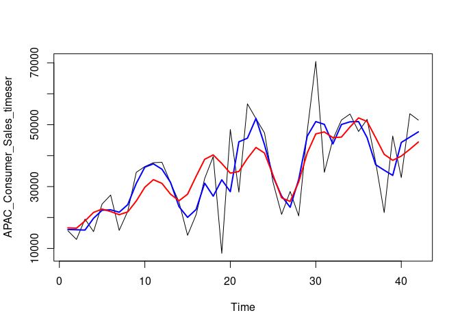<!-- -->

##### **4.4.4. Now, let’s look at the locally predictable series, We will model it through ARMA series**

``` r
APAC_Consumer_Sales_local_pred <- APAC_Consumer_Sales_timeser-APAC_Consumer_Sales_global_pred
```

###### **4.4.4.1. Plotting the local component of the series**

``` r
plot(APAC_Consumer_Sales_local_pred, col='red', type = "l")
```

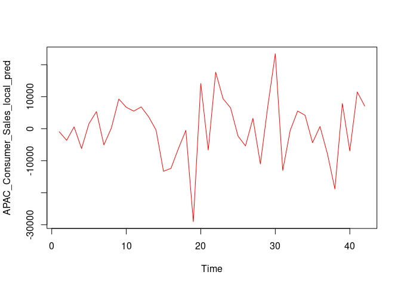<!-- -->

###### **4.4.4.2. Checking the Autocorrelation for the observations**

``` r
acf(APAC_Consumer_Sales_local_pred)
```

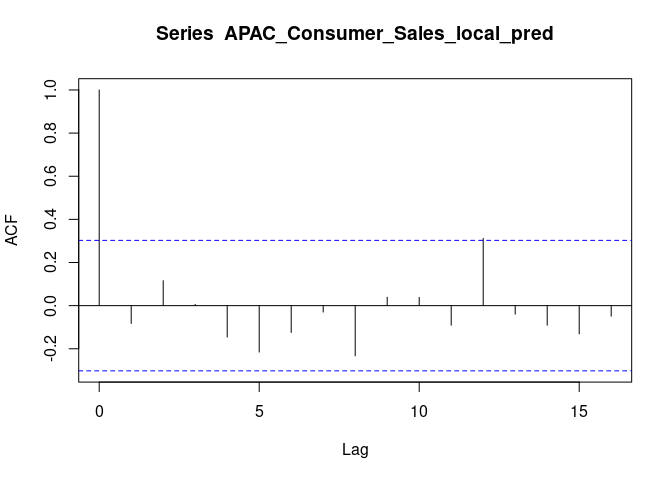<!-- -->

``` r
acf(APAC_Consumer_Sales_local_pred, type="partial")
```

<!-- -->

###### **4.4.4.3. Modelling the local component using ARMA or auto.arima function**

``` r
APAC_Consumer_Sales_armafit <- auto.arima(APAC_Consumer_Sales_local_pred)
tsdiag(APAC_Consumer_Sales_armafit)
```

<!-- -->

``` r
APAC_Consumer_Sales_armafit
```

    ## Series: APAC_Consumer_Sales_local_pred 
    ## ARIMA(0,0,0) with zero mean 
    ## 
    ## sigma^2 estimated as 93871039:  log likelihood=-445.1
    ## AIC=892.2   AICc=892.3   BIC=893.94

##### **4.4.5. Checking if the residual series is white noise**

``` r
APAC_Consumer_Sales_resi <- APAC_Consumer_Sales_local_pred-fitted(APAC_Consumer_Sales_armafit)
```

###### **4.4.5.1. Performing “adf” and “kpss” test for conforming residual series is stationary**

``` r
adf.test(APAC_Consumer_Sales_resi,alternative = "stationary")
```

    ## 
    ##  Augmented Dickey-Fuller Test
    ## 
    ## data:  APAC_Consumer_Sales_resi
    ## Dickey-Fuller = -3.093, Lag order = 3, p-value = 0.1428
    ## alternative hypothesis: stationary

``` r
kpss.test(APAC_Consumer_Sales_resi)
```

    ## 
    ##  KPSS Test for Level Stationarity
    ## 
    ## data:  APAC_Consumer_Sales_resi
    ## KPSS Level = 0.045798, Truncation lag parameter = 3, p-value = 0.1

##### **4.4.6. Evaluating the model using MAPE**

###### **4.4.6.1. First, making a prediction for the last 6 months**

``` r
APAC_Consumer_Sales_outdata <- APAC_Consumer_Sales[43:48,]
APAC_Consumer_Sales_timevals_out <- APAC_Consumer_Sales_outdata$Month
```

###### **4.4.6.2. Predicting the six month values by “lmfit” as ARMA component is absent**

``` r
APAC_Consumer_Sales_global_pred_out <- predict((APAC_Consumer_Sales_lmfit), data.frame(Month =APAC_Consumer_Sales_timevals_out))
APAC_Consumer_Sales_fcast <- APAC_Consumer_Sales_global_pred_out  # Predicted values
```

###### **4.4.6.3. Compare our prediction with the actual values, using MAPE**

``` r
APAC_Consumer_Sales_MAPE_class_dec <- accuracy(APAC_Consumer_Sales_fcast,APAC_Consumer_Sales_outdata[,2])[5]
APAC_Consumer_Sales_MAPE_class_dec  #20.22433
```

    ## [1] 20.22433

###### **4.4.6.4. Plotting the predictions along with original values, to get a visual feel of the fit**

``` r
APAC_Consumer_Sales_class_dec_pred <- c(ts(APAC_Consumer_Sales_global_pred),ts(APAC_Consumer_Sales_global_pred_out))
plot(total_APAC_Consumer_Sales_timeser, col = "black")
lines(APAC_Consumer_Sales_class_dec_pred, col = "red")
```

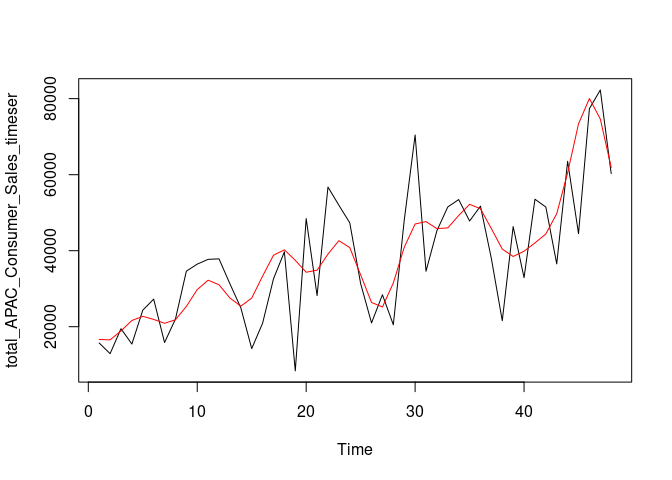<!-- -->

#### **4.5. Model building using ARIMA**

##### **4.5.1. Building the model using ARIMA**

``` r
APAC_Consumer_Sales_autoarima <- auto.arima(APAC_Consumer_Sales_timeser)
APAC_Consumer_Sales_autoarima
```

    ## Series: APAC_Consumer_Sales_timeser 
    ## ARIMA(0,1,1) 
    ## 
    ## Coefficients:
    ##           ma1
    ##       -0.7559
    ## s.e.   0.1381
    ## 
    ## sigma^2 estimated as 174361555:  log likelihood=-447.11
    ## AIC=898.23   AICc=898.55   BIC=901.66

###### **4.5.1.1. Timeseries diagram for ARIMA model**

``` r
tsdiag(APAC_Consumer_Sales_autoarima)
```

<!-- -->

``` r
plot(APAC_Consumer_Sales_autoarima$x, col="black")
lines(fitted(APAC_Consumer_Sales_autoarima), col="red")
```

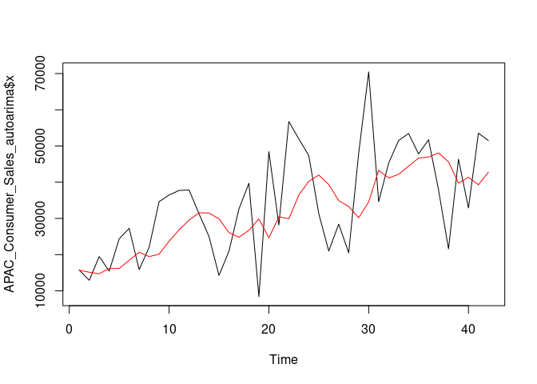<!-- -->

###### **4.5.1.2. Checking if the residual series is white noise**

``` r
APAC_Consumer_Sales_resi_autoarima <- APAC_Consumer_Sales_timeser - fitted(APAC_Consumer_Sales_autoarima)
```

###### **4.5.1.3. Performing “adf” and “kpss” test for conforming residual series is stationary**

``` r
adf.test(APAC_Consumer_Sales_resi_autoarima,alternative = "stationary")
```

    ## 
    ##  Augmented Dickey-Fuller Test
    ## 
    ## data:  APAC_Consumer_Sales_resi_autoarima
    ## Dickey-Fuller = -4.2563, Lag order = 3, p-value = 0.01
    ## alternative hypothesis: stationary

``` r
kpss.test(APAC_Consumer_Sales_resi_autoarima)
```

    ## 
    ##  KPSS Test for Level Stationarity
    ## 
    ## data:  APAC_Consumer_Sales_resi_autoarima
    ## KPSS Level = 0.043931, Truncation lag parameter = 3, p-value = 0.1

##### **4.5.2. Evaluating the model using MAPE**

``` r
APAC_Consumer_Sales_fcast_auto_arima <- predict(APAC_Consumer_Sales_autoarima, n.ahead = 6)
APAC_Consumer_Sales_fcast_auto_arima$pred  # Predicted values
```

    ## Time Series:
    ## Start = 43 
    ## End = 48 
    ## Frequency = 1 
    ## [1] 44898.7 44898.7 44898.7 44898.7 44898.7 44898.7

``` r
APAC_Consumer_Sales_MAPE_auto_arima <- accuracy(APAC_Consumer_Sales_fcast_auto_arima$pred,APAC_Consumer_Sales_outdata[,2])[5]
APAC_Consumer_Sales_MAPE_auto_arima  #27.68952
```

    ## [1] 27.68952

###### **4.5.2.1. Plotting the predictions along with original values, to get a visual feel of the fit**

``` r
APAC_Consumer_Sales_auto_arima_pred <- c(fitted(APAC_Consumer_Sales_autoarima),ts(APAC_Consumer_Sales_fcast_auto_arima$pred))
plot(total_APAC_Consumer_Sales_timeser, col = "black")
lines(APAC_Consumer_Sales_auto_arima_pred, col = "red")
```

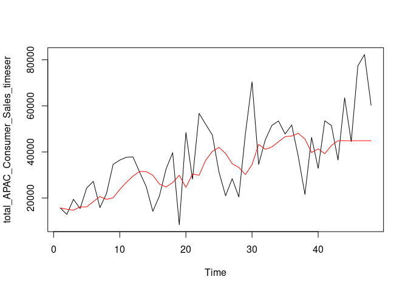<!-- -->

### **5. Forecasting APAC Consumer Quantity**

#### **5.1. Creating the model using the first 42 rows and then we shall test the model on the remaining 6 rows later**

``` r
total_APAC_Consumer_Quantity_timeser <- ts(APAC_Consumer_Quantity$Quantity)
APAC_Consumer_Quantity_indata <- APAC_Consumer_Quantity[1:42,]
APAC_Consumer_Quantity_timeser <- ts(APAC_Consumer_Quantity_indata$Quantity)
```

##### **5.1.1. Plotting the APAC consumer Sales timeseries**

``` r
plot(APAC_Consumer_Quantity_timeser)
```

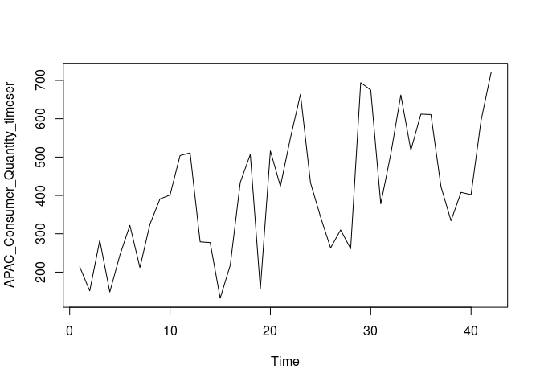<!-- -->

#### \*\*5.2. Smoothing the series - Moving Average Smoothing, choosing the width=1

``` r
w <-1
APAC_Consumer_Quantity_smoothedseries <- stats::filter(APAC_Consumer_Quantity_timeser, filter=rep(1/(2*w+1),(2*w+1)), method='convolution', sides=2)
```

##### **5.2.1. Smoothing left end of the time series**

``` r
diff <- APAC_Consumer_Quantity_smoothedseries[w+2] - APAC_Consumer_Quantity_smoothedseries[w+1]
for (i in seq(w,1,-1)) {
  APAC_Consumer_Quantity_smoothedseries[i] <- APAC_Consumer_Quantity_smoothedseries[i+1] - diff
}
```

##### **5.2.2. Smoothing right end of the time series**

``` r
n <- length(APAC_Consumer_Quantity_timeser)
diff <- APAC_Consumer_Quantity_smoothedseries[n-w] - APAC_Consumer_Quantity_smoothedseries[n-w-1]
for (i in seq(n-w+1, n)) {
  APAC_Consumer_Quantity_smoothedseries[i] <- APAC_Consumer_Quantity_smoothedseries[i-1] + diff
}
```

#### \*\*5.3. Plot the smoothed time series

``` r
APAC_Consumer_Quantity_timevals <- APAC_Consumer_Quantity_indata$Month
plot(APAC_Consumer_Quantity_timeser)
lines(APAC_Consumer_Quantity_smoothedseries, col="blue", lwd=2)


#### **5.4. Building a model on the smoothed time series using classical decomposition**
      
##### **5.4.1. Converting the time series to a dataframe**

APAC_Consumer_Quantity_smootheddf <- as.data.frame(cbind(APAC_Consumer_Quantity_timevals, as.vector(APAC_Consumer_Quantity_smoothedseries)))
colnames(APAC_Consumer_Quantity_smootheddf) <- c('Month', 'Sales')

##### **5.4.2. Fitting a multiplicative model with trend and seasonality to the data, Seasonality will be modeled using a sinusoid function**
APAC_Consumer_Quantity_lmfit <- lm(Sales ~ sin(1.0*Month) * poly(Month,3) + cos(0.469*Month) * poly(Month,2) + Month, data=APAC_Consumer_Quantity_smootheddf)
#APAC_Consumer_Quantity_lmfit <- lm(Sales ~ sin(1.0*Month) * poly(Month,3) + cos(0.473*Month) * poly(Month,2) + Month, data=APAC_Consumer_Quantity_smootheddf)
      #0.469

##### **5.4.3. Predicting the global values of the series i.e Seasonality and trend**
APAC_Consumer_Quantity_global_pred <- predict(APAC_Consumer_Quantity_lmfit, Month=APAC_Consumer_Quantity_timevals)
summary(APAC_Consumer_Quantity_global_pred)
```

    ##    Min. 1st Qu.  Median    Mean 3rd Qu.    Max. 
    ##   221.0   296.7   420.6   406.2   497.3   641.9

``` r
###### **5.4.3.1. Plotting the globally predictable part**
lines(APAC_Consumer_Quantity_timevals, APAC_Consumer_Quantity_global_pred, col='red', lwd=2)
```

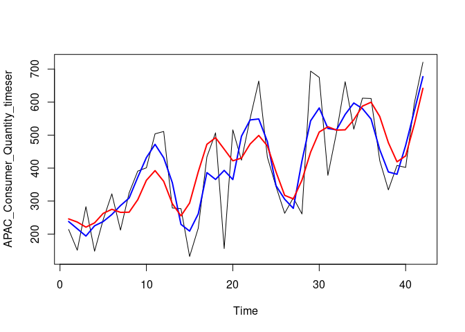<!-- -->

##### **5.4.4. Now, let’s look at the locally predictable series, We will model it through ARMA series**

``` r
APAC_Consumer_Quantity_local_pred <- APAC_Consumer_Quantity_timeser - APAC_Consumer_Quantity_global_pred
```

###### **5.4.4.1 Plotting the local component of the series**

``` r
plot(APAC_Consumer_Quantity_local_pred, col='red', type = "l")
```

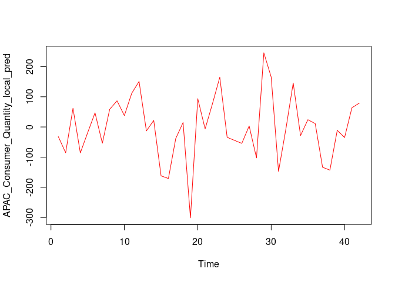<!-- -->

###### **5.4.4.2 Checking the Autocorrelation for the observations**

``` r
acf(APAC_Consumer_Quantity_local_pred)
```

<!-- -->

``` r
acf(APAC_Consumer_Quantity_local_pred, type="partial")
```

<!-- -->

###### \*\* 5.4.4.3. Modelling the local component using ARMA or auto.arima function\*\*

``` r
APAC_Consumer_Quantity_armafit <- auto.arima(APAC_Consumer_Quantity_local_pred)
tsdiag(APAC_Consumer_Quantity_armafit)
```

<!-- -->

``` r
APAC_Consumer_Quantity_armafit
```

    ## Series: APAC_Consumer_Quantity_local_pred 
    ## ARIMA(0,0,0) with zero mean 
    ## 
    ## sigma^2 estimated as 11008:  log likelihood=-255.03
    ## AIC=512.06   AICc=512.16   BIC=513.8

##### **5.4.5. Checking if the residual series is white noise**

``` r
APAC_Consumer_Quantity_resi <- APAC_Consumer_Quantity_local_pred-fitted(APAC_Consumer_Quantity_armafit)
```

###### **5.4.5.1. Performing “adf” and “kpss” test for conforming residual series is stationary**

``` r
adf.test(APAC_Consumer_Quantity_resi,alternative = "stationary")
```

    ## 
    ##  Augmented Dickey-Fuller Test
    ## 
    ## data:  APAC_Consumer_Quantity_resi
    ## Dickey-Fuller = -3.3646, Lag order = 3, p-value = 0.07562
    ## alternative hypothesis: stationary

``` r
kpss.test(APAC_Consumer_Quantity_resi)
```

    ## 
    ##  KPSS Test for Level Stationarity
    ## 
    ## data:  APAC_Consumer_Quantity_resi
    ## KPSS Level = 0.046803, Truncation lag parameter = 3, p-value = 0.1

##### **5.4.6. Evaluating the model using MAPE**

###### **5.4.6.1. First, making a prediction for the last 6 months**

``` r
APAC_Consumer_Quantity_outdata <- APAC_Consumer_Quantity[43:48,]
APAC_Consumer_Quantity_timevals_out <- APAC_Consumer_Quantity_outdata$Month
```

###### **5.4.6.2. Predicting the six month values by “lmfit” as ARMA component is absent**

``` r
APAC_Consumer_Quantity_global_pred_out <- predict((APAC_Consumer_Quantity_lmfit), data.frame(Month =APAC_Consumer_Quantity_timevals_out))
```

    ## Warning in predict.lm((APAC_Consumer_Quantity_lmfit), data.frame(Month =
    ## APAC_Consumer_Quantity_timevals_out)): prediction from a rank-deficient fit may
    ## be misleading

``` r
APAC_Consumer_Quantity_fcast <- APAC_Consumer_Quantity_global_pred_out  # predicted values
```

###### **5.4.6.3. Compare our prediction with the actual values, using MAPE**

``` r
APAC_Consumer_Quantity_MAPE_class_dec <- accuracy(APAC_Consumer_Quantity_fcast,APAC_Consumer_Quantity_outdata[,2])[5]
APAC_Consumer_Quantity_MAPE_class_dec  #28.78736
```

    ## [1] 28.78736

###### **5.4.6.4. Plotting the predictions along with original values, to get a visual feel of the fit**

``` r
APAC_Consumer_Quantity_class_dec_pred <- c(ts(APAC_Consumer_Quantity_global_pred),ts(APAC_Consumer_Quantity_global_pred_out))
plot(total_APAC_Consumer_Quantity_timeser, col = "black")
lines(APAC_Consumer_Quantity_class_dec_pred, col = "red")
```

<!-- -->

#### 5.5.**Model building using ARIMA**

##### **5.5.1. Building the model using ARIMA**

``` r
APAC_Consumer_Quantity_autoarima <- auto.arima(APAC_Consumer_Quantity_timeser)
APAC_Consumer_Quantity_autoarima
```

    ## Series: APAC_Consumer_Quantity_timeser 
    ## ARIMA(0,1,0) 
    ## 
    ## sigma^2 estimated as 25366:  log likelihood=-266.07
    ## AIC=534.14   AICc=534.24   BIC=535.85

###### **5.5.1.1. Timeseries diagram for ARIMA model**

``` r
tsdiag(APAC_Consumer_Quantity_autoarima)
```

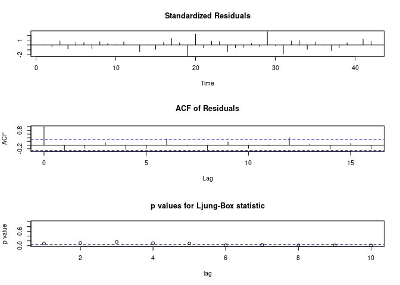<!-- -->

``` r
plot(APAC_Consumer_Quantity_autoarima$x, col="black")
lines(fitted(APAC_Consumer_Quantity_autoarima), col="red")
```

<!-- -->

###### **5.5.1.2. Checking if the residual series is white noise**

``` r
APAC_Consumer_Quantity_resi_autoarima <- APAC_Consumer_Quantity_timeser - fitted(APAC_Consumer_Quantity_autoarima)
```

###### **5.5.1.3. Performing “adf” and “kpss” test for conforming residual series is stationary**

``` r
adf.test(APAC_Consumer_Quantity_resi_autoarima,alternative = "stationary")
```

    ## 
    ##  Augmented Dickey-Fuller Test
    ## 
    ## data:  APAC_Consumer_Quantity_resi_autoarima
    ## Dickey-Fuller = -4.3326, Lag order = 3, p-value = 0.01
    ## alternative hypothesis: stationary

``` r
kpss.test(APAC_Consumer_Quantity_resi_autoarima)
```

    ## 
    ##  KPSS Test for Level Stationarity
    ## 
    ## data:  APAC_Consumer_Quantity_resi_autoarima
    ## KPSS Level = 0.04642, Truncation lag parameter = 3, p-value = 0.1

##### **5.5.2. Evaluating the model using MAPE**

``` r
APAC_Consumer_Quantity_fcast_auto_arima <- predict(APAC_Consumer_Quantity_autoarima, n.ahead = 6)
APAC_Consumer_Quantity_fcast_auto_arima$pred  # predicted values
```

    ## Time Series:
    ## Start = 43 
    ## End = 48 
    ## Frequency = 1 
    ## [1] 721 721 721 721 721 721

``` r
APAC_Consumer_Quantity_MAPE_auto_arima <- accuracy(APAC_Consumer_Quantity_fcast_auto_arima$pred,APAC_Consumer_Quantity_outdata[,2])[5]
APAC_Consumer_Quantity_MAPE_auto_arima  #26.24458
```

    ## [1] 26.24458

##### **5.5.3. Plotting the predictions along with original values, to get a visual feel of the fit**

``` r
APAC_Consumer_Quantity_auto_arima_pred <- c(fitted(APAC_Consumer_Quantity_autoarima),ts(APAC_Consumer_Quantity_fcast_auto_arima$pred))
plot(total_APAC_Consumer_Quantity_timeser, col = "black")
lines(APAC_Consumer_Quantity_auto_arima_pred, col = "red")   
```

<!-- -->

### \***6. Forecasting EU Consumer Sales**

#### **6.1. Creating the model using the first 42 rows and then we shall test the model on the remaining 6 rows later**

``` r
 total_EU_Consumer_Sales_timeser <- ts(EU_Consumer_Sales$Sales)
 EU_Consumer_Sales_indata <- EU_Consumer_Sales[1:42,]
 EU_Consumer_Sales_timeser <- ts(EU_Consumer_Sales_indata$Sales)
```

##### \*\* 6.1.1. Plotting the APAC consumer Sales timeseries\*\*

``` r
plot(EU_Consumer_Sales_timeser) 
```

<!-- -->

#### **6.2. Smoothing the series - Moving Average Smoothing, choosing the width=1**

``` r
w <-1
EU_Consumer_Sales_smoothedseries <- stats::filter(EU_Consumer_Sales_timeser, filter=rep(1/(2*w),(2*w)), method='convolution', sides=2)
```

##### **6.2.1. Smoothing right end of the time series**

``` r
n <- length(EU_Consumer_Sales_timeser)
diff <- EU_Consumer_Sales_smoothedseries[n-w] - EU_Consumer_Sales_smoothedseries[n-w-1]
for (i in seq(n-w+1, n)) {
  EU_Consumer_Sales_smoothedseries[i] <- EU_Consumer_Sales_smoothedseries[i-1] + diff
}
```

#### **6.3. Plot the smoothed time series**

``` r
EU_Consumer_Sales_timevals <- EU_Consumer_Sales_indata$Month
plot(EU_Consumer_Sales_timeser)
lines(EU_Consumer_Sales_smoothedseries, col="blue", lwd=2)

      
#### **6.4. Building a model on the smoothed time series using classical decomposition**
      
##### **6.4.1. Converting the time series to a dataframe**
EU_Consumer_Sales_smootheddf <- as.data.frame(cbind(EU_Consumer_Sales_timevals, as.vector(EU_Consumer_Sales_smoothedseries)))
colnames(EU_Consumer_Sales_smootheddf) <- c('Month', 'Sales')

##### **6.4.2. Fitting a multiplicative model with trend and seasonality to the data, Seasonality will be modeled using a sinusoid function**
EU_Consumer_Sales_lmfit <- lm(Sales ~ sin(1*Month) * poly(Month,3) + cos(.5*Month) * poly(Month,2) + Month, data=EU_Consumer_Sales_smootheddf)

##### **6.4.3. Predicting the global values of the series i.e Seasonality and trend**
EU_Consumer_Sales_global_pred <- predict(EU_Consumer_Sales_lmfit, Month=EU_Consumer_Sales_timevals)
summary(EU_Consumer_Sales_global_pred)
```

    ##    Min. 1st Qu.  Median    Mean 3rd Qu.    Max. 
    ##    6760   24780   29259   29360   33930   47314

``` r
###### **6.4.3.1. Plotting the globally predictable part**
lines(EU_Consumer_Sales_timevals, EU_Consumer_Sales_global_pred, col='red', lwd=2)
```

<!-- -->

##### **6.4.4. Now, let’s look at the locally predictable series, We will model it through ARMA series**

``` r
EU_Consumer_Sales_local_pred <- EU_Consumer_Sales_timeser - EU_Consumer_Sales_global_pred
```

###### **6.4.4.1. Plotting the local component of the series**

``` r
plot(EU_Consumer_Sales_local_pred, col='red', type = "l")
```

<!-- -->

###### **6.4.4.2. Checking the Autocorrelation for the observations**

``` r
acf(EU_Consumer_Sales_local_pred)
```

<!-- -->

``` r
acf(EU_Consumer_Sales_local_pred, type="partial")
```

<!-- -->

###### **6.4.4.3. Modelling the local component using ARMA or auto.arima function**

``` r
EU_Consumer_Sales_armafit <- auto.arima(EU_Consumer_Sales_local_pred)
tsdiag(EU_Consumer_Sales_armafit)
```

<!-- -->

``` r
EU_Consumer_Sales_armafit
```

    ## Series: EU_Consumer_Sales_local_pred 
    ## ARIMA(0,0,0) with zero mean 
    ## 
    ## sigma^2 estimated as 102317598:  log likelihood=-446.91
    ## AIC=895.82   AICc=895.92   BIC=897.56

##### **6.4.5. Checking if the residual series is white noise**

``` r
EU_Consumer_Sales_resi <- EU_Consumer_Sales_local_pred - fitted(EU_Consumer_Sales_armafit)
```

###### Performing “adf” and “kpss” test for conforming residual series is stationary

``` r
adf.test(EU_Consumer_Sales_resi,alternative = "stationary")
```

    ## 
    ##  Augmented Dickey-Fuller Test
    ## 
    ## data:  EU_Consumer_Sales_resi
    ## Dickey-Fuller = -3.3712, Lag order = 3, p-value = 0.07464
    ## alternative hypothesis: stationary

``` r
kpss.test(EU_Consumer_Sales_resi)
```

    ## 
    ##  KPSS Test for Level Stationarity
    ## 
    ## data:  EU_Consumer_Sales_resi
    ## KPSS Level = 0.039221, Truncation lag parameter = 3, p-value = 0.1

##### **6.4.6. Evaluating the model using MAPE**

###### **6.4.6.1. First, making a prediction for the last 6 months**

``` r
EU_Consumer_Sales_outdata <- EU_Consumer_Sales[43:48,]
EU_Consumer_Sales_timevals_out <- EU_Consumer_Sales_outdata$Month
```

###### **6.4.6.2. Predicting the six month values by “lmfit” as ARMA component is absent**

``` r
EU_Consumer_Sales_global_pred_out <- predict((EU_Consumer_Sales_lmfit), data.frame(Month =EU_Consumer_Sales_timevals_out))
```

    ## Warning in predict.lm((EU_Consumer_Sales_lmfit), data.frame(Month =
    ## EU_Consumer_Sales_timevals_out)): prediction from a rank-deficient fit may be
    ## misleading

``` r
EU_Consumer_Sales_fcast <- EU_Consumer_Sales_global_pred_out  # Predicted values
```

###### **6.4.6.3. Compare our prediction with the actual values, using MAPE**

``` r
EU_Consumer_Sales_MAPE_class_dec <- accuracy(EU_Consumer_Sales_fcast,EU_Consumer_Sales_outdata[,2])[5]
EU_Consumer_Sales_MAPE_class_dec  #29.66075
```

    ## [1] 29.66075

###### **6.4.6.4. Plotting the predictions along with original values, to get a visual feel of the fit**

``` r
EU_Consumer_Sales_class_dec_pred <- c(ts(EU_Consumer_Sales_global_pred),ts(EU_Consumer_Sales_global_pred_out))
plot(total_EU_Consumer_Sales_timeser, col = "black")
lines(EU_Consumer_Sales_class_dec_pred, col = "red")
```

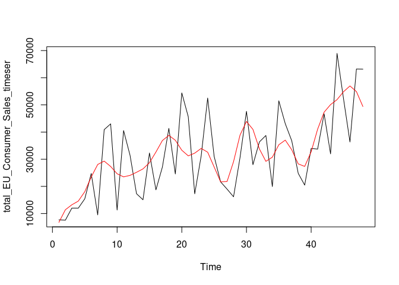<!-- -->

#### **6.5. Model building using ARIMA**

##### **6.5.1. Building the model using ARIMA**

``` r
EU_Consumer_Sales_autoarima <- auto.arima(EU_Consumer_Sales_timeser)
EU_Consumer_Sales_autoarima
```

    ## Series: EU_Consumer_Sales_timeser 
    ## ARIMA(2,1,0) 
    ## 
    ## Coefficients:
    ##           ar1      ar2
    ##       -0.5796  -0.4906
    ## s.e.   0.1346   0.1310
    ## 
    ## sigma^2 estimated as 168564623:  log likelihood=-445.84
    ## AIC=897.67   AICc=898.32   BIC=902.81

###### **6.5.1.1. Timeseries diagram for ARIMA model**

``` r
tsdiag(EU_Consumer_Sales_autoarima)
```

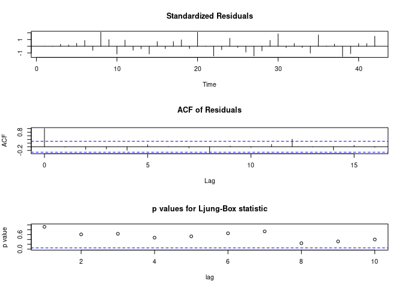<!-- -->

``` r
plot(EU_Consumer_Sales_autoarima$x, col="black")
lines(fitted(EU_Consumer_Sales_autoarima), col="red")
```

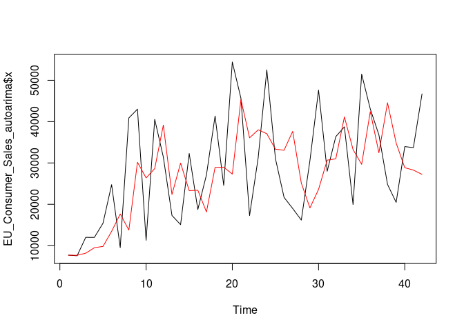<!-- -->

###### **6.5.1.2. Checking if the residual series is white noise**

``` r
EU_Consumer_Sales_resi_autoarima <- EU_Consumer_Sales_timeser - fitted(EU_Consumer_Sales_autoarima)
```

###### Performing “adf” and “kpss” test for conforming residual series is stationary

``` r
adf.test(EU_Consumer_Sales_resi_autoarima,alternative = "stationary")
```

    ## 
    ##  Augmented Dickey-Fuller Test
    ## 
    ## data:  EU_Consumer_Sales_resi_autoarima
    ## Dickey-Fuller = -4.3522, Lag order = 3, p-value = 0.01
    ## alternative hypothesis: stationary

``` r
kpss.test(EU_Consumer_Sales_resi_autoarima)
```

    ## 
    ##  KPSS Test for Level Stationarity
    ## 
    ## data:  EU_Consumer_Sales_resi_autoarima
    ## KPSS Level = 0.067962, Truncation lag parameter = 3, p-value = 0.1

##### **6.5.2. Evaluating the model using MAPE**

``` r
EU_Consumer_Sales_fcast_auto_arima <- predict(EU_Consumer_Sales_autoarima, n.ahead = 6)
EU_Consumer_Sales_fcast_auto_arima  # Predicted values
```

    ## $pred
    ## Time Series:
    ## Start = 43 
    ## End = 48 
    ## Frequency = 1 
    ## [1] 39297.86 37221.06 42062.87 40275.32 38936.08 40589.28
    ## 
    ## $se
    ## Time Series:
    ## Start = 43 
    ## End = 48 
    ## Frequency = 1 
    ## [1] 12983.24 14083.80 14500.28 16710.60 17921.71 18648.29

``` r
EU_Consumer_Sales_MAPE_auto_arima <- accuracy(EU_Consumer_Sales_fcast_auto_arima$pred,EU_Consumer_Sales_outdata[,2])[5]
EU_Consumer_Sales_MAPE_auto_arima #28.9226
```

    ## [1] 28.9226

##### **6.5.3. Plotting the predictions along with original values, to get a visual feel of the fit**

``` r
EU_Consumer_Sales_auto_arima_pred <- c(fitted(EU_Consumer_Sales_autoarima),ts(EU_Consumer_Sales_fcast_auto_arima$pred))
plot(total_EU_Consumer_Sales_timeser, col = "black")
lines(EU_Consumer_Sales_auto_arima_pred, col = "red")
```

<!-- -->

### **7. Forecasting EU Consumer Quantity**

#### **7.1. Creating the model using the first 42 rows and then we shall test the model on the remaining 6 rows later**

``` r
    total_EU_Consumer_Quantity_timeser <- ts(EU_Consumer_Quantity$Quantity)
    EU_Consumer_Quantity_indata <- EU_Consumer_Quantity[1:42,]
    EU_Consumer_Quantity_timeser <- ts(EU_Consumer_Quantity_indata$Quantity)
```

##### **7.1.1. Plotting the APAC consumer Sales timeseries**

``` r
plot(EU_Consumer_Quantity_timeser)
```

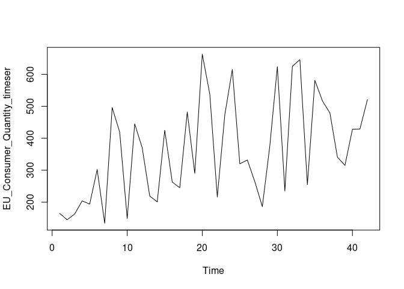<!-- -->

#### **7.2. Smoothing the series - Moving Average Smoothing, choosing the width=1**

``` r
    w <-1
    EU_Consumer_Quantity_smoothedseries <- stats::filter(EU_Consumer_Quantity_timeser, filter=rep(1/(2*w+1),(2*w+1)), method='convolution', sides=2)
```

##### **7.2.1. Smoothing left end of the time series**

``` r
diff <- EU_Consumer_Quantity_smoothedseries[w+2] - EU_Consumer_Quantity_smoothedseries[w+1]
for (i in seq(w,1,-1)) {
  EU_Consumer_Quantity_smoothedseries[i] <- EU_Consumer_Quantity_smoothedseries[i+1] - diff
}
```

##### **7.2.2. Smoothing right end of the time series**

``` r
n <- length(EU_Consumer_Quantity_timeser)
diff <- EU_Consumer_Quantity_smoothedseries[n-w] - EU_Consumer_Quantity_smoothedseries[n-w-1]
for (i in seq(n-w+1, n)) {
  EU_Consumer_Quantity_smoothedseries[i] <- EU_Consumer_Quantity_smoothedseries[i-1] + diff
}
```

#### **7.3. Plot the smoothed time series**

``` r
EU_Consumer_Quantity_timevals <- EU_Consumer_Quantity_indata$Month
plot(EU_Consumer_Quantity_timeser)
lines(EU_Consumer_Quantity_smoothedseries, col="blue", lwd=2)
      

#### **7.4. Building a model on the smoothed time series using classical decomposition**
      
##### **7.4.1. Converting the time series to a dataframe**
EU_Consumer_Quantity_smootheddf <- as.data.frame(cbind(EU_Consumer_Quantity_timevals, as.vector(EU_Consumer_Quantity_smoothedseries)))
colnames(EU_Consumer_Quantity_smootheddf) <- c('Month', 'Sales')

##### **7.4.2. Fitting a multiplicative model with trend and seasonality to the data, Seasonality will be modeled using a sinusoid function**
EU_Consumer_Quantity_lmfit <- lm(Sales ~ sin(1*Month) * poly(Month,3) + cos(.5*Month) * poly(Month,3) + Month, data=EU_Consumer_Quantity_smootheddf)

##### **7.4.3. Predicting the global values of the series i.e Seasonality and trend**
EU_Consumer_Quantity_global_pred <- predict(EU_Consumer_Quantity_lmfit, Month=EU_Consumer_Quantity_timevals)
summary(EU_Consumer_Quantity_global_pred)
```

    ##    Min. 1st Qu.  Median    Mean 3rd Qu.    Max. 
    ##   139.9   303.0   379.4   364.6   428.2   544.1

``` r
###### **7.4.3.1. Plotting the globally predictable part**
lines(EU_Consumer_Quantity_timevals, EU_Consumer_Quantity_global_pred, col='red', lwd=2)
```

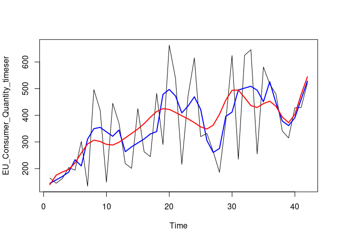<!-- -->

##### **7.4.4. Now, let’s look at the locally predictable series, We will model it through ARMA series**

``` r
EU_Consumer_Quantity_local_pred <- EU_Consumer_Quantity_timeser - EU_Consumer_Quantity_global_pred
```

###### **7.4.4.1. Plotting the local component of the series**

``` r
plot(EU_Consumer_Quantity_local_pred, col='red', type = "l")
```

<!-- -->

###### **7.4.4.2. Checking the Autocorrelation for the observations**

``` r
acf(EU_Consumer_Quantity_local_pred)
```

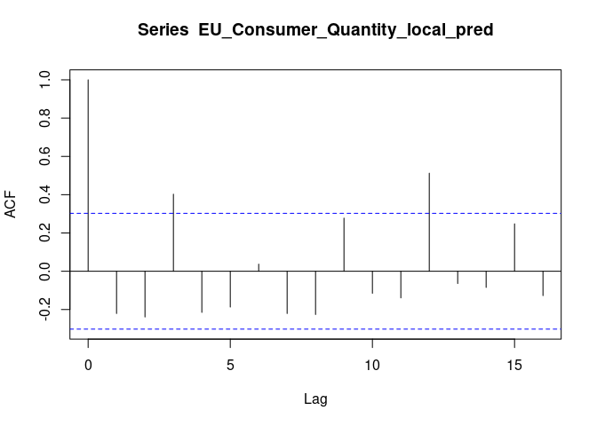<!-- -->

``` r
acf(EU_Consumer_Quantity_local_pred, type="partial")
```

<!-- -->

###### **7.4.4.3. Modelling the local component using ARMA or auto.arima function**

``` r
EU_Consumer_Quantity_armafit <- auto.arima(EU_Consumer_Quantity_local_pred)
tsdiag(EU_Consumer_Quantity_armafit)
```

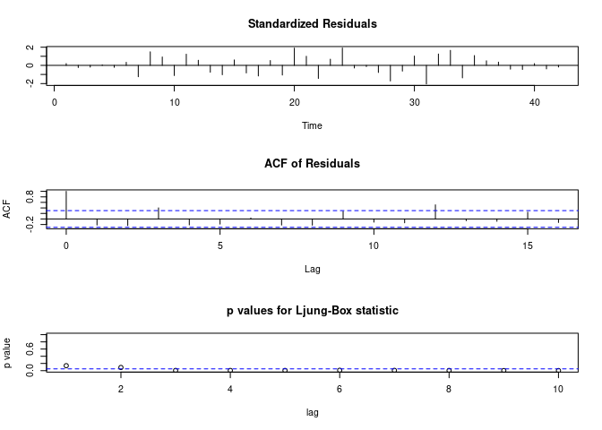<!-- -->

``` r
EU_Consumer_Quantity_armafit
```

    ## Series: EU_Consumer_Quantity_local_pred 
    ## ARIMA(0,0,0) with zero mean 
    ## 
    ## sigma^2 estimated as 16071:  log likelihood=-262.98
    ## AIC=527.95   AICc=528.05   BIC=529.69

##### **7.4.5. Checking if the residual series is white noise**

``` r
EU_Consumer_Quantity_resi <- EU_Consumer_Quantity_local_pred - fitted(EU_Consumer_Quantity_armafit)
```

###### **7.4.5.1. Performing “adf” and “kpss” test for conforming residual series is stationary**

``` r
adf.test(EU_Consumer_Quantity_resi,alternative = "stationary")
```

    ## 
    ##  Augmented Dickey-Fuller Test
    ## 
    ## data:  EU_Consumer_Quantity_resi
    ## Dickey-Fuller = -3.0939, Lag order = 3, p-value = 0.1425
    ## alternative hypothesis: stationary

``` r
kpss.test(EU_Consumer_Quantity_resi)
```

    ## 
    ##  KPSS Test for Level Stationarity
    ## 
    ## data:  EU_Consumer_Quantity_resi
    ## KPSS Level = 0.038954, Truncation lag parameter = 3, p-value = 0.1

##### **7.4.6. Evaluating the model using MAPE**

###### **7.4.6.1. First, making a prediction for the last 6 months**

``` r
EU_Consumer_Quantity_outdata <- EU_Consumer_Quantity[43:48,]
EU_Consumer_Quantity_timevals_out <- EU_Consumer_Quantity_outdata$Month
```

###### **7.4.6.2. Predicting the six month values by “lmfit” as ARMA component is absent**

``` r
EU_Consumer_Quantity_global_pred_out <- predict((EU_Consumer_Quantity_lmfit), data.frame(Month =EU_Consumer_Quantity_timevals_out))
```

    ## Warning in predict.lm((EU_Consumer_Quantity_lmfit), data.frame(Month =
    ## EU_Consumer_Quantity_timevals_out)): prediction from a rank-deficient fit may be
    ## misleading

``` r
EU_Consumer_Quantity_fcast <- EU_Consumer_Quantity_global_pred_out  # Predicted values
```

###### **7.4.6.3. Compare our prediction with the actual values, using MAPE**

``` r
EU_Consumer_Quantity_MAPE_class_dec <- accuracy(EU_Consumer_Quantity_fcast,EU_Consumer_Quantity_outdata[,2])[5]
EU_Consumer_Quantity_MAPE_class_dec  #33.04939
```

    ## [1] 33.04939

###### **7.4.6.4. Plotting the predictions along with original values, to get a visual feel of the fit**

``` r
EU_Consumer_Quantity_class_dec_pred <- c(ts(EU_Consumer_Quantity_global_pred),ts(EU_Consumer_Quantity_global_pred_out))
plot(total_EU_Consumer_Quantity_timeser, col = "black")
lines(EU_Consumer_Quantity_class_dec_pred, col = "red")
```

<!-- -->

#### **7.5. Model building using ARIMA**

##### **7.5.1. Building the model using ARIMA**

``` r
EU_Consumer_Quantity_autoarima <- auto.arima(EU_Consumer_Quantity_timeser)
EU_Consumer_Quantity_autoarima
```

    ## Series: EU_Consumer_Quantity_timeser 
    ## ARIMA(2,1,0) 
    ## 
    ## Coefficients:
    ##           ar1      ar2
    ##       -0.7359  -0.5879
    ## s.e.   0.1224   0.1185
    ## 
    ## sigma^2 estimated as 21185:  log likelihood=-261.9
    ## AIC=529.8   AICc=530.44   BIC=534.94

###### **7.5.1.1. Timeseries diagram for ARIMA model**

``` r
tsdiag(EU_Consumer_Quantity_autoarima)
```

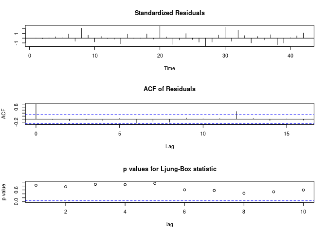<!-- -->

``` r
plot(EU_Consumer_Quantity_autoarima$x, col="black")
lines(fitted(EU_Consumer_Quantity_autoarima), col="red")
```

<!-- -->

###### **7.5.1.2. Checking if the residual series is white noise**

``` r
EU_Consumer_Quantity_resi_autoarima <- EU_Consumer_Quantity_timeser - fitted(EU_Consumer_Quantity_autoarima)
```

###### **7.5.1.3. Performing “adf” and “kpss” test for conforming residual series is stationary**

``` r
adf.test(EU_Consumer_Quantity_resi_autoarima,alternative = "stationary")
```

    ## 
    ##  Augmented Dickey-Fuller Test
    ## 
    ## data:  EU_Consumer_Quantity_resi_autoarima
    ## Dickey-Fuller = -3.5969, Lag order = 3, p-value = 0.04521
    ## alternative hypothesis: stationary

``` r
kpss.test(EU_Consumer_Quantity_resi_autoarima)
```

    ## 
    ##  KPSS Test for Level Stationarity
    ## 
    ## data:  EU_Consumer_Quantity_resi_autoarima
    ## KPSS Level = 0.056232, Truncation lag parameter = 3, p-value = 0.1

##### **7.5.2. Evaluating the model using MAPE**

``` r
EU_Consumer_Quantity_fcast_auto_arima <- predict(EU_Consumer_Quantity_autoarima, n.ahead = 6)
EU_Consumer_Quantity_fcast_auto_arima$pred  # Predicted values
```

    ## Time Series:
    ## Start = 43 
    ## End = 48 
    ## Frequency = 1 
    ## [1] 452.7129 448.8772 491.8447 462.4816 458.8288 478.7789

``` r
EU_Consumer_Quantity_MAPE_auto_arima <- accuracy(EU_Consumer_Quantity_fcast_auto_arima$pred,EU_Consumer_Quantity_outdata[,2])[5]
EU_Consumer_Quantity_MAPE_auto_arima  #30.13319
```

    ## [1] 30.13319

##### **7.5.3. Plotting the predictions along with original values, to get a visual feel of the fit**

``` r
EU_Consumer_Quantity_auto_arima_pred <- c(fitted(EU_Consumer_Quantity_autoarima),ts(EU_Consumer_Quantity_fcast_auto_arima$pred))
plot(total_EU_Consumer_Quantity_timeser, col = "black")
lines(EU_Consumer_Quantity_auto_arima_pred, col = "red")   
```

<!-- -->
