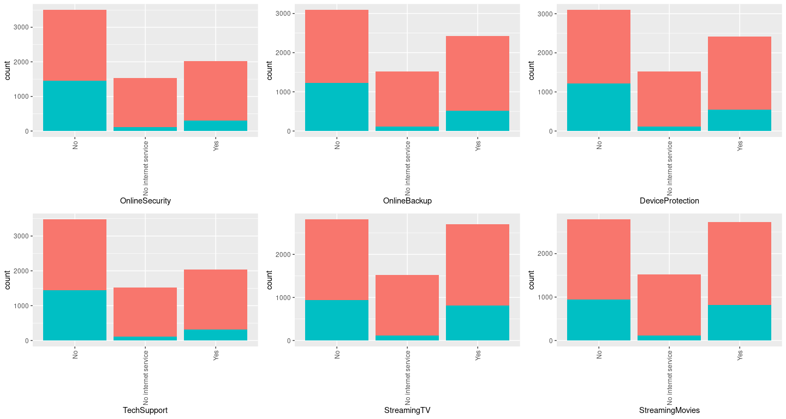
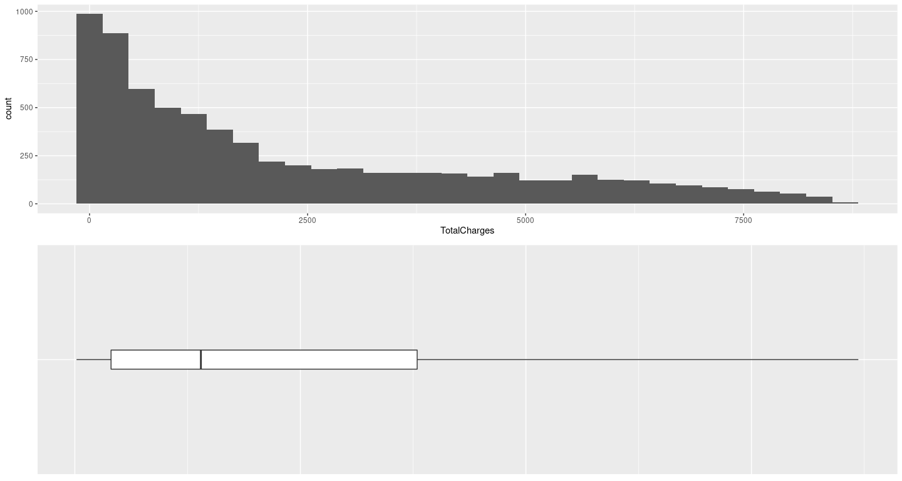
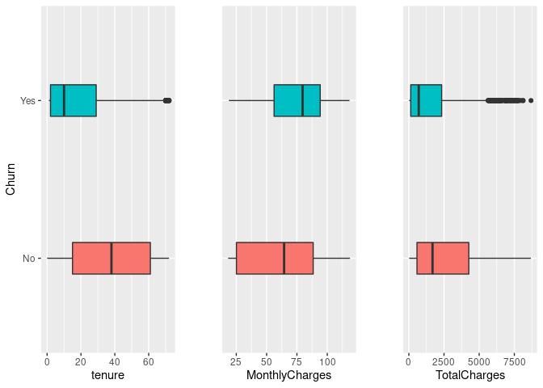
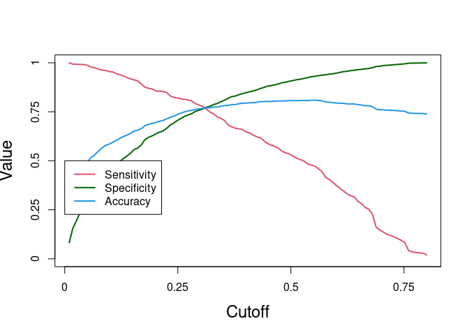

Telecom Churn Model
================

### Business Understanding:

Based on the past and current customer information,the company has
maintained a database containing personal/demographic information,the
services availed by a customer and the expense information related to
each customer.

### AIM:

The aim is to automate the process of predicting if a customer would
telecom or not and to find the factors affecting the telecom. Whether a
customer will telecom or not will depend on data from the following
three buckets: 1. Demographic Information 2. Services Availed by the
customer 3. Overall Expenses

### **1. Data Understanding**

#### **1.1. Install and Load the required packages**

``` r
library(MASS)
library(car)
library(e1071)
library(caret)
library(ggplot2)
library(cowplot)
library(caTools)
library(e1071)
library(ROCR)
library(dplyr)
library(GGally)
library(knitr)
```

#### **1.2. Loading 3 files**

``` r
churn_data<- read.csv("churn_data.csv", stringsAsFactors = F)
customer_data<- read.csv("customer_data.csv", stringsAsFactors = F)
internet_data<- read.csv("internet_data.csv", stringsAsFactors = F)

str(churn_data)    # 7043 obs of 9 variables including the target variable
```

    ## 'data.frame':    7043 obs. of  9 variables:
    ##  $ customerID      : chr  "7590-VHVEG" "5575-GNVDE" "3668-QPYBK" "7795-CFOCW" ...
    ##  $ tenure          : int  1 34 2 45 2 8 22 10 28 62 ...
    ##  $ PhoneService    : chr  "No" "Yes" "Yes" "No" ...
    ##  $ Contract        : chr  "Month-to-month" "One year" "Month-to-month" "One year" ...
    ##  $ PaperlessBilling: chr  "Yes" "No" "Yes" "No" ...
    ##  $ PaymentMethod   : chr  "Electronic check" "Mailed check" "Mailed check" "Bank transfer (automatic)" ...
    ##  $ MonthlyCharges  : num  29.9 57 53.9 42.3 70.7 ...
    ##  $ TotalCharges    : num  29.9 1889.5 108.2 1840.8 151.7 ...
    ##  $ Churn           : chr  "No" "No" "Yes" "No" ...

``` r
str(customer_data) # 7043 obs of 5 variables
```

    ## 'data.frame':    7043 obs. of  5 variables:
    ##  $ customerID   : chr  "7590-VHVEG" "5575-GNVDE" "3668-QPYBK" "7795-CFOCW" ...
    ##  $ gender       : chr  "Female" "Male" "Male" "Male" ...
    ##  $ SeniorCitizen: int  0 0 0 0 0 0 0 0 0 0 ...
    ##  $ Partner      : chr  "Yes" "No" "No" "No" ...
    ##  $ Dependents   : chr  "No" "No" "No" "No" ...

``` r
str(internet_data) # 7043 obs of 9 variables
```

    ## 'data.frame':    7043 obs. of  9 variables:
    ##  $ customerID      : chr  "7590-VHVEG" "5575-GNVDE" "3668-QPYBK" "7795-CFOCW" ...
    ##  $ MultipleLines   : chr  "No phone service" "No" "No" "No phone service" ...
    ##  $ InternetService : chr  "DSL" "DSL" "DSL" "DSL" ...
    ##  $ OnlineSecurity  : chr  "No" "Yes" "Yes" "Yes" ...
    ##  $ OnlineBackup    : chr  "Yes" "No" "Yes" "No" ...
    ##  $ DeviceProtection: chr  "No" "Yes" "No" "Yes" ...
    ##  $ TechSupport     : chr  "No" "No" "No" "Yes" ...
    ##  $ StreamingTV     : chr  "No" "No" "No" "No" ...
    ##  $ StreamingMovies : chr  "No" "No" "No" "No" ...

#### **1.3. Collate the data together in one single file**

``` r
length(unique(tolower(churn_data$customerID)))    # 7043, confirming customerID is key 
```

    ## [1] 7043

``` r
length(unique(tolower(customer_data$customerID))) # 7043, confirming customerID is key
```

    ## [1] 7043

``` r
length(unique(tolower(internet_data$customerID))) # 7043, confirming customerID is key
```

    ## [1] 7043

``` r
setdiff(churn_data$customerID,customer_data$customerID) # Identical customerID across these datasets
```

    ## character(0)

``` r
setdiff(churn_data$customerID,internet_data$customerID) # Identical customerID across these datasets
```

    ## character(0)

``` r
telecom<- merge(churn_data,customer_data, by="customerID", all = F)
telecom<- merge(telecom,internet_data, by="customerID", all = F)
```

``` r
kable(telecom[1:10, ])
```

| customerID | tenure | PhoneService | Contract       | PaperlessBilling | PaymentMethod             | MonthlyCharges | TotalCharges | Churn | gender | SeniorCitizen | Partner | Dependents | MultipleLines | InternetService | OnlineSecurity | OnlineBackup | DeviceProtection | TechSupport | StreamingTV | StreamingMovies |
|:-----------|-------:|:-------------|:---------------|:-----------------|:--------------------------|---------------:|-------------:|:------|:-------|--------------:|:--------|:-----------|:--------------|:----------------|:---------------|:-------------|:-----------------|:------------|:------------|:----------------|
| 0002-ORFBO |      9 | Yes          | One year       | Yes              | Mailed check              |          65.60 |       593.30 | No    | Female |             0 | Yes     | Yes        | No            | DSL             | No             | Yes          | No               | Yes         | Yes         | No              |
| 0003-MKNFE |      9 | Yes          | Month-to-month | No               | Mailed check              |          59.90 |       542.40 | No    | Male   |             0 | No      | No         | Yes           | DSL             | No             | No           | No               | No          | No          | Yes             |
| 0004-TLHLJ |      4 | Yes          | Month-to-month | Yes              | Electronic check          |          73.90 |       280.85 | Yes   | Male   |             0 | No      | No         | No            | Fiber optic     | No             | No           | Yes              | No          | No          | No              |
| 0011-IGKFF |     13 | Yes          | Month-to-month | Yes              | Electronic check          |          98.00 |      1237.85 | Yes   | Male   |             1 | Yes     | No         | No            | Fiber optic     | No             | Yes          | Yes              | No          | Yes         | Yes             |
| 0013-EXCHZ |      3 | Yes          | Month-to-month | Yes              | Mailed check              |          83.90 |       267.40 | Yes   | Female |             1 | Yes     | No         | No            | Fiber optic     | No             | No           | No               | Yes         | Yes         | No              |
| 0013-MHZWF |      9 | Yes          | Month-to-month | Yes              | Credit card (automatic)   |          69.40 |       571.45 | No    | Female |             0 | No      | Yes        | No            | DSL             | No             | No           | No               | Yes         | Yes         | Yes             |
| 0013-SMEOE |     71 | Yes          | Two year       | Yes              | Bank transfer (automatic) |         109.70 |      7904.25 | No    | Female |             1 | Yes     | No         | No            | Fiber optic     | Yes            | Yes          | Yes              | Yes         | Yes         | Yes             |
| 0014-BMAQU |     63 | Yes          | Two year       | Yes              | Credit card (automatic)   |          84.65 |      5377.80 | No    | Male   |             0 | Yes     | No         | Yes           | Fiber optic     | Yes            | No           | No               | Yes         | No          | No              |
| 0015-UOCOJ |      7 | Yes          | Month-to-month | Yes              | Electronic check          |          48.20 |       340.35 | No    | Female |             1 | No      | No         | No            | DSL             | Yes            | No           | No               | No          | No          | No              |
| 0016-QLJIS |     65 | Yes          | Two year       | Yes              | Mailed check              |          90.45 |      5957.90 | No    | Female |             0 | Yes     | Yes        | Yes           | DSL             | Yes            | Yes          | Yes              | Yes         | Yes         | Yes             |

### **2. Data Preparation & Exploratory Data Analysis**

#### **2.1. Understanding the structure of the collated file**

``` r
str(telecom) #7043 obs. of 21 variables;
```

    ## 'data.frame':    7043 obs. of  21 variables:
    ##  $ customerID      : chr  "0002-ORFBO" "0003-MKNFE" "0004-TLHLJ" "0011-IGKFF" ...
    ##  $ tenure          : int  9 9 4 13 3 9 71 63 7 65 ...
    ##  $ PhoneService    : chr  "Yes" "Yes" "Yes" "Yes" ...
    ##  $ Contract        : chr  "One year" "Month-to-month" "Month-to-month" "Month-to-month" ...
    ##  $ PaperlessBilling: chr  "Yes" "No" "Yes" "Yes" ...
    ##  $ PaymentMethod   : chr  "Mailed check" "Mailed check" "Electronic check" "Electronic check" ...
    ##  $ MonthlyCharges  : num  65.6 59.9 73.9 98 83.9 ...
    ##  $ TotalCharges    : num  593 542 281 1238 267 ...
    ##  $ Churn           : chr  "No" "No" "Yes" "Yes" ...
    ##  $ gender          : chr  "Female" "Male" "Male" "Male" ...
    ##  $ SeniorCitizen   : int  0 0 0 1 1 0 1 0 1 0 ...
    ##  $ Partner         : chr  "Yes" "No" "No" "Yes" ...
    ##  $ Dependents      : chr  "Yes" "No" "No" "No" ...
    ##  $ MultipleLines   : chr  "No" "Yes" "No" "No" ...
    ##  $ InternetService : chr  "DSL" "DSL" "Fiber optic" "Fiber optic" ...
    ##  $ OnlineSecurity  : chr  "No" "No" "No" "No" ...
    ##  $ OnlineBackup    : chr  "Yes" "No" "No" "Yes" ...
    ##  $ DeviceProtection: chr  "No" "No" "Yes" "Yes" ...
    ##  $ TechSupport     : chr  "Yes" "No" "No" "No" ...
    ##  $ StreamingTV     : chr  "Yes" "No" "No" "Yes" ...
    ##  $ StreamingMovies : chr  "No" "Yes" "No" "Yes" ...

``` r
# tenure, MonthlyCharges, TotalCharges are continuous
# SeniorCitizen need to be changed from integer to categorical
```

#### **2.2. Barcharts for categorical features with stacked telecom information**

``` r
bar_theme1<- theme(axis.text.x = element_text(angle = 90, hjust = 1, vjust = 0.5), 
                   legend.position="none")
```

``` r
plot_grid(ggplot(telecom, aes(x=PhoneService,fill=Churn))+ geom_bar(), 
          ggplot(telecom, aes(x=Contract,fill=Churn))+ geom_bar()+bar_theme1,
          ggplot(telecom, aes(x=PaperlessBilling,fill=Churn))+ geom_bar()+bar_theme1,
          ggplot(telecom, aes(x=PaymentMethod,fill=Churn))+ geom_bar()+bar_theme1,
          ggplot(telecom, aes(x=gender,fill=Churn))+ geom_bar()+bar_theme1,
          ggplot(telecom, aes(x=factor(SeniorCitizen),fill=Churn))+ geom_bar()+bar_theme1,
          align = "h")   
```

<!-- -->

``` r
plot_grid(ggplot(telecom, aes(x=Partner,fill=Churn))+ geom_bar()+bar_theme1,
          ggplot(telecom, aes(x=Dependents,fill=Churn))+ geom_bar()+bar_theme1,
          ggplot(telecom, aes(x=MultipleLines,fill=Churn))+ geom_bar()+bar_theme1,
          ggplot(telecom, aes(x=InternetService,fill=Churn))+ geom_bar()+bar_theme1,
          align = "h") 
```

<!-- -->

``` r
plot_grid(ggplot(telecom, aes(x=OnlineSecurity,fill=Churn))+ geom_bar()+bar_theme1,
          ggplot(telecom, aes(x=OnlineBackup,fill=Churn))+ geom_bar()+bar_theme1,
          ggplot(telecom, aes(x=DeviceProtection,fill=Churn))+ geom_bar()+bar_theme1,
          ggplot(telecom, aes(x=TechSupport,fill=Churn))+ geom_bar()+bar_theme1,
          ggplot(telecom, aes(x=StreamingTV,fill=Churn))+ geom_bar()+bar_theme1,
          ggplot(telecom, aes(x=StreamingMovies,fill=Churn))+ geom_bar()+bar_theme1,
          align = "h") 
```

<!-- -->

``` r
#reveals strong contrast for telecom wrt Contract,InternetServices, (not availing) OnlineSecurity and Techsupport and PaymentMethod,
#moderate wrt whether SeniorCitizen, having partner, OnlineBackup and DeviceProtection
```

#### **2.3. Histogram and Boxplots for numeric variables**

``` r
box_theme<- theme(axis.line=element_blank(),axis.title=element_blank(), 
                  axis.ticks=element_blank(), axis.text=element_blank())

box_theme_y<- theme(axis.line.y=element_blank(),axis.title.y=element_blank(), 
                    axis.ticks.y=element_blank(), axis.text.y=element_blank(),
                    legend.position="none")
```

``` r
plot_grid(ggplot(telecom, aes(tenure))+ geom_histogram(binwidth = 10),
          ggplot(telecom, aes(x="",y=tenure))+ geom_boxplot(width=0.1)+coord_flip()+box_theme, 
          align = "v",ncol = 1)
```

<!-- -->

``` r
plot_grid(ggplot(telecom, aes(MonthlyCharges))+ geom_histogram(binwidth = 20),
          ggplot(telecom, aes(x="",y=MonthlyCharges))+ geom_boxplot(width=0.1)+coord_flip()+box_theme, 
          align = "v",ncol = 1)
```

<!-- -->

``` r
plot_grid(ggplot(telecom, aes(TotalCharges))+ geom_histogram(),
          ggplot(telecom, aes(x="",y=TotalCharges))+ geom_boxplot(width=0.1)+coord_flip()+box_theme, 
          align = "v",ncol = 1) 
```

    ## `stat_bin()` using `bins = 30`. Pick better value with `binwidth`.

<!-- -->

``` r
#No outliers in numeric variables
```

#### **2.4. Boxplots of numeric variables relative to telecom status**

``` r
plot_grid(ggplot(telecom, aes(x=Churn,y=tenure, fill=Churn))+ geom_boxplot(width=0.2)+ 
            coord_flip() +theme(legend.position="none"),
          ggplot(telecom, aes(x=Churn,y=MonthlyCharges, fill=Churn))+ geom_boxplot(width=0.2)+
            coord_flip() + box_theme_y,
          ggplot(telecom, aes(x=Churn,y=TotalCharges, fill=Churn))+ geom_boxplot(width=0.2)+
            coord_flip() + box_theme_y,
          align = "v",nrow = 1)
```

<!-- -->

``` r
# Shorter tenure sees more telecom
```

#### \*\*2.5. Correlation between numeric variables

``` r
ggpairs(telecom[, c("tenure", "MonthlyCharges", "TotalCharges")])
```

<!-- -->

``` r
#As expected, tenure and TotalCharges are highly correlated (corr 0.83)
```

### **3. Data Preparation**

#### De-Duplication not needed

#### **3.1. Bringing the variables in the correct format**

``` r
telecom$SeniorCitizen<- ifelse(telecom$SeniorCitizen==1,"Yes","No")
```

#### **3.2. Outlier treatment and imputing missing value**

##### **3.2.1. Boxplot showed no outlier, Nevertheless confirming it also with percentiles**

``` r
sapply(telecom[,c("tenure","MonthlyCharges","TotalCharges")], 
       function(x) quantile(x,seq(0,1,.01),na.rm = T)) #no outlier
```

    ##      tenure MonthlyCharges TotalCharges
    ## 0%     0.00         18.250      18.8000
    ## 1%     1.00         19.200      19.9000
    ## 2%     1.00         19.350      20.5500
    ## 3%     1.00         19.500      32.6440
    ## 4%     1.00         19.600      44.5620
    ## 5%     1.00         19.650      49.6050
    ## 6%     1.00         19.750      55.6790
    ## 7%     1.00         19.850      69.5085
    ## 8%     1.00         19.900      71.5980
    ## 9%     2.00         20.000      77.4265
    ## 10%    2.00         20.050      84.6000
    ## 11%    2.00         20.150      93.4910
    ## 12%    2.00         20.250     108.8800
    ## 13%    3.00         20.350     131.0500
    ## 14%    3.00         20.450     148.3900
    ## 15%    3.00         20.600     164.5650
    ## 16%    4.00         20.850     184.3900
    ## 17%    4.00         23.750     205.3470
    ## 18%    5.00         24.400     226.0530
    ## 19%    5.00         24.750     246.1345
    ## 20%    6.00         25.050     267.0700
    ## 21%    6.00         25.250     293.7520
    ## 22%    7.00         25.700     316.9000
    ## 23%    8.00         29.333     340.4585
    ## 24%    8.00         33.174     369.1940
    ## 25%    9.00         35.500     401.4500
    ## 26%    9.00         39.700     426.3680
    ## 27%   10.00         43.567     459.7295
    ## 28%   11.00         44.588     486.1520
    ## 29%   11.00         45.150     520.9460
    ## 30%   12.00         45.850     551.9950
    ## 31%   12.00         48.800     587.1000
    ## 32%   13.00         49.650     625.0140
    ## 33%   14.00         50.200     666.9685
    ## 34%   15.00         50.800     702.0270
    ## 35%   15.00         53.135     743.0350
    ## 36%   16.00         54.256     785.8380
    ## 37%   17.00         54.850     827.1675
    ## 38%   18.00         55.450     862.2790
    ## 39%   19.00         56.250     906.8680
    ## 40%   20.00         58.830     944.1700
    ## 41%   21.00         59.800     995.1905
    ## 42%   22.00         60.632    1035.5040
    ## 43%   22.00         62.150    1078.7995
    ## 44%   23.00         64.450    1125.4560
    ## 45%   24.00         65.450    1172.8775
    ## 46%   25.00         66.900    1217.5100
    ## 47%   26.00         69.050    1261.5925
    ## 48%   27.00         69.600    1304.6440
    ## 49%   28.00         69.950    1354.5330
    ## 50%   29.00         70.350    1397.4750
    ## 51%   30.00         70.850    1440.4840
    ## 52%   31.00         72.192    1498.2180
    ## 53%   32.00         73.800    1554.3870
    ## 54%   33.00         74.350    1622.1640
    ## 55%   34.00         74.750    1688.9275
    ## 56%   35.00         75.150    1752.4860
    ## 57%   36.00         75.550    1812.3575
    ## 58%   37.00         76.368    1879.1760
    ## 59%   38.00         78.450    1959.1095
    ## 60%   40.00         79.100    2048.9500
    ## 61%   41.00         79.550    2167.8710
    ## 62%   42.00         80.000    2249.2870
    ## 63%   43.00         80.400    2348.1915
    ## 64%   44.00         80.800    2448.4120
    ## 65%   45.00         81.450    2555.1775
    ## 66%   46.00         83.200    2657.9410
    ## 67%   47.00         84.150    2790.4315
    ## 68%   48.00         84.628    2911.3160
    ## 69%   49.00         85.050    3023.9670
    ## 70%   50.00         85.500    3141.1300
    ## 71%   51.00         86.100    3255.3975
    ## 72%   52.00         87.250    3400.9860
    ## 73%   53.00         88.900    3522.2985
    ## 74%   54.00         89.450    3645.7410
    ## 75%   55.00         89.850    3794.7375
    ## 76%   56.00         90.400    3929.5600
    ## 77%   57.00         90.867    4045.2145
    ## 78%   58.00         92.000    4177.0510
    ## 79%   60.00         93.559    4317.8400
    ## 80%   60.00         94.250    4475.4100
    ## 81%   61.00         94.750    4616.0555
    ## 82%   62.00         95.200    4759.1150
    ## 83%   63.00         95.850    4890.1760
    ## 84%   64.00         96.900    5018.1040
    ## 85%   65.00         98.550    5200.1500
    ## 86%   66.00         99.250    5374.4530
    ## 87%   67.00         99.900    5542.4375
    ## 88%   67.96        100.450    5682.6280
    ## 89%   68.00        101.150    5817.5975
    ## 90%   69.00        102.600    5976.6400
    ## 91%   70.00        103.950    6141.9650
    ## 92%   70.00        104.550    6333.0880
    ## 93%   71.00        105.250    6511.7065
    ## 94%   71.00        106.000    6716.6530
    ## 95%   72.00        107.400    6923.5900
    ## 96%   72.00        108.950    7147.7060
    ## 97%   72.00        110.100    7414.1485
    ## 98%   72.00        111.558    7721.0960
    ## 99%   72.00        114.729    8039.8830
    ## 100%  72.00        118.750    8684.8000

#### **3.3. Missing value**

``` r
sapply(telecom, function(x) sum(is.na(x))) # shows all 11 NAs are in Totalcharges column
```

    ##       customerID           tenure     PhoneService         Contract 
    ##                0                0                0                0 
    ## PaperlessBilling    PaymentMethod   MonthlyCharges     TotalCharges 
    ##                0                0                0               11 
    ##            Churn           gender    SeniorCitizen          Partner 
    ##                0                0                0                0 
    ##       Dependents    MultipleLines  InternetService   OnlineSecurity 
    ##                0                0                0                0 
    ##     OnlineBackup DeviceProtection      TechSupport      StreamingTV 
    ##                0                0                0                0 
    ##  StreamingMovies 
    ##                0

``` r
View(subset(telecom, is.na(TotalCharges))) # All 11 NAs in TotalCharges correspond to tenure 0
View(subset(telecom, telecom$tenure==0)) #vice-versa of above is also true
```

#### **3.4. It means that 11/7043 = 0.001561834 i.e 0.1%, best is to remove these observations from the analysis**

``` r
telecom <- telecom[!is.na(telecom$TotalCharges),]
```

### **4. Feature standardisation**

#### **4.1. Normalising continuous features**

``` r
telecom$tenure<- scale(telecom$tenure) # scale used: mean 32.4, sd 24.6
telecom$MonthlyCharges<- scale(telecom$MonthlyCharges) # scale used: mean 64.8, sd 30.1
telecom$TotalCharges<- scale(telecom$TotalCharges) # scale used: mean 2280, sd 2267
```

#### **4.2. converting target variable telecom from No/Yes character to factorwith levels 0/1**

``` r
telecom$Churn<- ifelse(telecom$Churn=="Yes",1,0)
```

#### **4.3. Checking churn rate of prospect customer**

``` r
Churn <- sum(telecom$Churn)/nrow(telecom)
Churn # 26.57% churn rate. 
```

    ## [1] 0.265785

#### **4.4. creating a dataframe of categorical features**

``` r
telecom_chr<- telecom[,-c(1,2,7,8,9)]
```

#### **4.5. converting categorical attributes to factor**

``` r
telecom_fact<- data.frame(sapply(telecom_chr, function(x) factor(x)))
str(telecom_fact)
```

    ## 'data.frame':    7032 obs. of  16 variables:
    ##  $ PhoneService    : chr  "Yes" "Yes" "Yes" "Yes" ...
    ##  $ Contract        : chr  "One year" "Month-to-month" "Month-to-month" "Month-to-month" ...
    ##  $ PaperlessBilling: chr  "Yes" "No" "Yes" "Yes" ...
    ##  $ PaymentMethod   : chr  "Mailed check" "Mailed check" "Electronic check" "Electronic check" ...
    ##  $ gender          : chr  "Female" "Male" "Male" "Male" ...
    ##  $ SeniorCitizen   : chr  "No" "No" "No" "Yes" ...
    ##  $ Partner         : chr  "Yes" "No" "No" "Yes" ...
    ##  $ Dependents      : chr  "Yes" "No" "No" "No" ...
    ##  $ MultipleLines   : chr  "No" "Yes" "No" "No" ...
    ##  $ InternetService : chr  "DSL" "DSL" "Fiber optic" "Fiber optic" ...
    ##  $ OnlineSecurity  : chr  "No" "No" "No" "No" ...
    ##  $ OnlineBackup    : chr  "Yes" "No" "No" "Yes" ...
    ##  $ DeviceProtection: chr  "No" "No" "Yes" "Yes" ...
    ##  $ TechSupport     : chr  "Yes" "No" "No" "No" ...
    ##  $ StreamingTV     : chr  "Yes" "No" "No" "Yes" ...
    ##  $ StreamingMovies : chr  "No" "Yes" "No" "Yes" ...

#### **4.6. creating dummy variables for factor attributes**

``` r
dummies<- data.frame(sapply(telecom_fact, function(x) data.frame(model.matrix(~x-1,data =telecom_fact))[,-1]))

# For variables having only two levels, verified PhoneService, PaperlessBilling, Partner, Dependents "yes" is 1,
#gender "male" is 1 and SeniorCitizen "1" is 1 
```

#### **4.7. Final dataset**

``` r
telecom_final<- cbind(telecom[,c(9,2,7,8)],dummies) 
kable(telecom_final[1:10, ]) #7032 obs. of  31 variables
```

| Churn |     tenure | MonthlyCharges | TotalCharges | PhoneService | Contract.xOne.year | Contract.xTwo.year | PaperlessBilling | PaymentMethod.xCredit.card..automatic. | PaymentMethod.xElectronic.check | PaymentMethod.xMailed.check | gender | SeniorCitizen | Partner | Dependents | MultipleLines.xNo.phone.service | MultipleLines.xYes | InternetService.xFiber.optic | InternetService.xNo | OnlineSecurity.xNo.internet.service | OnlineSecurity.xYes | OnlineBackup.xNo.internet.service | OnlineBackup.xYes | DeviceProtection.xNo.internet.service | DeviceProtection.xYes | TechSupport.xNo.internet.service | TechSupport.xYes | StreamingTV.xNo.internet.service | StreamingTV.xYes | StreamingMovies.xNo.internet.service | StreamingMovies.xYes |
|------:|-----------:|---------------:|-------------:|-------------:|-------------------:|-------------------:|-----------------:|---------------------------------------:|--------------------------------:|----------------------------:|-------:|--------------:|--------:|-----------:|--------------------------------:|-------------------:|-----------------------------:|--------------------:|------------------------------------:|--------------------:|----------------------------------:|------------------:|--------------------------------------:|----------------------:|---------------------------------:|-----------------:|---------------------------------:|-----------------:|-------------------------------------:|---------------------:|
|     0 | -0.9542285 |     0.02665002 |   -0.7455540 |            1 |                  1 |                  0 |                1 |                                      0 |                               0 |                           1 |      0 |             0 |       1 |          1 |                               0 |                  0 |                            0 |                   0 |                                   0 |                   0 |                                 0 |                 1 |                                     0 |                     0 |                                0 |                1 |                                0 |                1 |                                    0 |                    0 |
|     0 | -0.9542285 |    -0.16280703 |   -0.7680088 |            1 |                  0 |                  0 |                0 |                                      0 |                               0 |                           1 |      1 |             0 |       0 |          0 |                               0 |                  1 |                            0 |                   0 |                                   0 |                   0 |                                 0 |                 0 |                                     0 |                     0 |                                0 |                0 |                                0 |                0 |                                    0 |                    1 |
|     1 | -1.1579338 |     0.30252608 |   -0.8833932 |            1 |                  0 |                  0 |                1 |                                      0 |                               1 |                           0 |      1 |             0 |       0 |          0 |                               0 |                  0 |                            1 |                   0 |                                   0 |                   0 |                                 0 |                 0 |                                     0 |                     1 |                                0 |                0 |                                0 |                0 |                                    0 |                    0 |
|     1 | -0.7912642 |     1.10356380 |   -0.4612068 |            1 |                  0 |                  0 |                1 |                                      0 |                               1 |                           0 |      1 |             1 |       1 |          0 |                               0 |                  0 |                            1 |                   0 |                                   0 |                   0 |                                 0 |                 1 |                                     0 |                     1 |                                0 |                0 |                                0 |                1 |                                    0 |                    1 |
|     1 | -1.1986749 |     0.63490688 |   -0.8893268 |            1 |                  0 |                  0 |                1 |                                      0 |                               0 |                           1 |      0 |             1 |       1 |          0 |                               0 |                  0 |                            1 |                   0 |                                   0 |                   0 |                                 0 |                 0 |                                     0 |                     0 |                                0 |                1 |                                0 |                1 |                                    0 |                    0 |
|     0 | -0.9542285 |     0.15295472 |   -0.7551933 |            1 |                  0 |                  0 |                1 |                                      1 |                               0 |                           0 |      0 |             0 |       0 |          1 |                               0 |                  0 |                            0 |                   0 |                                   0 |                   0 |                                 0 |                 0 |                                     0 |                     0 |                                0 |                1 |                                0 |                1 |                                    0 |                    1 |
|     0 |  1.5717175 |     1.49244934 |    2.4797162 |            1 |                  0 |                  1 |                1 |                                      0 |                               0 |                           0 |      0 |             1 |       1 |          0 |                               0 |                  0 |                            1 |                   0 |                                   0 |                   1 |                                 0 |                 1 |                                     0 |                     1 |                                0 |                1 |                                0 |                1 |                                    0 |                    1 |
|     0 |  1.2457890 |     0.65983544 |    1.3651573 |            1 |                  0 |                  1 |                1 |                                      1 |                               0 |                           0 |      1 |             0 |       1 |          0 |                               0 |                  1 |                            1 |                   0 |                                   0 |                   1 |                                 0 |                 0 |                                     0 |                     0 |                                0 |                1 |                                0 |                0 |                                    0 |                    0 |
|     0 | -1.0357106 |    -0.55169257 |   -0.8571444 |            1 |                  0 |                  0 |                1 |                                      0 |                               1 |                           0 |      0 |             1 |       0 |          0 |                               0 |                  0 |                            0 |                   0 |                                   0 |                   1 |                                 0 |                 0 |                                     0 |                     0 |                                0 |                0 |                                0 |                0 |                                    0 |                    0 |
|     0 |  1.3272711 |     0.85261630 |    1.6210720 |            1 |                  0 |                  1 |                1 |                                      0 |                               0 |                           1 |      0 |             0 |       1 |          1 |                               0 |                  1 |                            0 |                   0 |                                   0 |                   1 |                                 0 |                 1 |                                     0 |                     1 |                                0 |                1 |                                0 |                1 |                                    0 |                    1 |

### **5. splitting the data between train and test**

``` r
set.seed(100)
indices = sample.split(telecom_final$Churn, SplitRatio = 0.7)
train = telecom_final[indices,]
test = telecom_final[!(indices),]
```

### **6. Logistic Regression**

#### **6.1. Initial model**

``` r
model_1 = glm(Churn ~ ., data = train, family = "binomial")
summary(model_1) #AIC 4150.1....31 coeff..nullDev 5699.5...resDev 4102.1
```

    ## 
    ## Call:
    ## glm(formula = Churn ~ ., family = "binomial", data = train)
    ## 
    ## Deviance Residuals: 
    ##     Min       1Q   Median       3Q      Max  
    ## -1.7960  -0.6872  -0.2831   0.7608   3.3892  
    ## 
    ## Coefficients: (7 not defined because of singularities)
    ##                                        Estimate Std. Error z value Pr(>|z|)    
    ## (Intercept)                            -3.42365    1.50991  -2.267 0.023363 *  
    ## tenure                                 -1.40885    0.18035  -7.812 5.65e-15 ***
    ## MonthlyCharges                         -1.74007    1.13171  -1.538 0.124157    
    ## TotalCharges                            0.68402    0.18890   3.621 0.000293 ***
    ## PhoneService                            0.61762    0.76674   0.806 0.420524    
    ## Contract.xOne.year                     -0.73606    0.12948  -5.685 1.31e-08 ***
    ## Contract.xTwo.year                     -1.46320    0.21252  -6.885 5.78e-12 ***
    ## PaperlessBilling                        0.31159    0.08863   3.516 0.000439 ***
    ## PaymentMethod.xCredit.card..automatic. -0.09740    0.13740  -0.709 0.478413    
    ## PaymentMethod.xElectronic.check         0.28462    0.11188   2.544 0.010958 *  
    ## PaymentMethod.xMailed.check            -0.01186    0.13602  -0.087 0.930515    
    ## gender                                  0.04595    0.07720   0.595 0.551701    
    ## SeniorCitizen                           0.13349    0.10162   1.314 0.188981    
    ## Partner                                 0.03796    0.09250   0.410 0.681518    
    ## Dependents                             -0.14534    0.10716  -1.356 0.175038    
    ## MultipleLines.xNo.phone.service              NA         NA      NA       NA    
    ## MultipleLines.xYes                      0.55407    0.21113   2.624 0.008681 ** 
    ## InternetService.xFiber.optic            2.14126    0.94554   2.265 0.023538 *  
    ## InternetService.xNo                    -2.25088    0.95478  -2.357 0.018399 *  
    ## OnlineSecurity.xNo.internet.service          NA         NA      NA       NA    
    ## OnlineSecurity.xYes                    -0.12140    0.21148  -0.574 0.565921    
    ## OnlineBackup.xNo.internet.service            NA         NA      NA       NA    
    ## OnlineBackup.xYes                       0.21162    0.20798   1.018 0.308900    
    ## DeviceProtection.xNo.internet.service        NA         NA      NA       NA    
    ## DeviceProtection.xYes                   0.31106    0.20933   1.486 0.137278    
    ## TechSupport.xNo.internet.service             NA         NA      NA       NA    
    ## TechSupport.xYes                       -0.10709    0.21453  -0.499 0.617651    
    ## StreamingTV.xNo.internet.service             NA         NA      NA       NA    
    ## StreamingTV.xYes                        0.72470    0.38574   1.879 0.060282 .  
    ## StreamingMovies.xNo.internet.service         NA         NA      NA       NA    
    ## StreamingMovies.xYes                    0.77156    0.38810   1.988 0.046808 *  
    ## ---
    ## Signif. codes:  0 '***' 0.001 '**' 0.01 '*' 0.05 '.' 0.1 ' ' 1
    ## 
    ## (Dispersion parameter for binomial family taken to be 1)
    ## 
    ##     Null deviance: 5699.5  on 4921  degrees of freedom
    ## Residual deviance: 4102.1  on 4898  degrees of freedom
    ## AIC: 4150.1
    ## 
    ## Number of Fisher Scoring iterations: 6

#### **6.2. Stepwise selection**

``` r
model_2<- stepAIC(model_1, direction="both")
```

    ## Start:  AIC=4150.07
    ## Churn ~ tenure + MonthlyCharges + TotalCharges + PhoneService + 
    ##     Contract.xOne.year + Contract.xTwo.year + PaperlessBilling + 
    ##     PaymentMethod.xCredit.card..automatic. + PaymentMethod.xElectronic.check + 
    ##     PaymentMethod.xMailed.check + gender + SeniorCitizen + Partner + 
    ##     Dependents + MultipleLines.xNo.phone.service + MultipleLines.xYes + 
    ##     InternetService.xFiber.optic + InternetService.xNo + OnlineSecurity.xNo.internet.service + 
    ##     OnlineSecurity.xYes + OnlineBackup.xNo.internet.service + 
    ##     OnlineBackup.xYes + DeviceProtection.xNo.internet.service + 
    ##     DeviceProtection.xYes + TechSupport.xNo.internet.service + 
    ##     TechSupport.xYes + StreamingTV.xNo.internet.service + StreamingTV.xYes + 
    ##     StreamingMovies.xNo.internet.service + StreamingMovies.xYes
    ## 
    ## 
    ## Step:  AIC=4150.07
    ## Churn ~ tenure + MonthlyCharges + TotalCharges + PhoneService + 
    ##     Contract.xOne.year + Contract.xTwo.year + PaperlessBilling + 
    ##     PaymentMethod.xCredit.card..automatic. + PaymentMethod.xElectronic.check + 
    ##     PaymentMethod.xMailed.check + gender + SeniorCitizen + Partner + 
    ##     Dependents + MultipleLines.xNo.phone.service + MultipleLines.xYes + 
    ##     InternetService.xFiber.optic + InternetService.xNo + OnlineSecurity.xNo.internet.service + 
    ##     OnlineSecurity.xYes + OnlineBackup.xNo.internet.service + 
    ##     OnlineBackup.xYes + DeviceProtection.xNo.internet.service + 
    ##     DeviceProtection.xYes + TechSupport.xNo.internet.service + 
    ##     TechSupport.xYes + StreamingTV.xNo.internet.service + StreamingTV.xYes + 
    ##     StreamingMovies.xYes
    ## 
    ## 
    ## Step:  AIC=4150.07
    ## Churn ~ tenure + MonthlyCharges + TotalCharges + PhoneService + 
    ##     Contract.xOne.year + Contract.xTwo.year + PaperlessBilling + 
    ##     PaymentMethod.xCredit.card..automatic. + PaymentMethod.xElectronic.check + 
    ##     PaymentMethod.xMailed.check + gender + SeniorCitizen + Partner + 
    ##     Dependents + MultipleLines.xNo.phone.service + MultipleLines.xYes + 
    ##     InternetService.xFiber.optic + InternetService.xNo + OnlineSecurity.xNo.internet.service + 
    ##     OnlineSecurity.xYes + OnlineBackup.xNo.internet.service + 
    ##     OnlineBackup.xYes + DeviceProtection.xNo.internet.service + 
    ##     DeviceProtection.xYes + TechSupport.xNo.internet.service + 
    ##     TechSupport.xYes + StreamingTV.xYes + StreamingMovies.xYes
    ## 
    ## 
    ## Step:  AIC=4150.07
    ## Churn ~ tenure + MonthlyCharges + TotalCharges + PhoneService + 
    ##     Contract.xOne.year + Contract.xTwo.year + PaperlessBilling + 
    ##     PaymentMethod.xCredit.card..automatic. + PaymentMethod.xElectronic.check + 
    ##     PaymentMethod.xMailed.check + gender + SeniorCitizen + Partner + 
    ##     Dependents + MultipleLines.xNo.phone.service + MultipleLines.xYes + 
    ##     InternetService.xFiber.optic + InternetService.xNo + OnlineSecurity.xNo.internet.service + 
    ##     OnlineSecurity.xYes + OnlineBackup.xNo.internet.service + 
    ##     OnlineBackup.xYes + DeviceProtection.xNo.internet.service + 
    ##     DeviceProtection.xYes + TechSupport.xYes + StreamingTV.xYes + 
    ##     StreamingMovies.xYes
    ## 
    ## 
    ## Step:  AIC=4150.07
    ## Churn ~ tenure + MonthlyCharges + TotalCharges + PhoneService + 
    ##     Contract.xOne.year + Contract.xTwo.year + PaperlessBilling + 
    ##     PaymentMethod.xCredit.card..automatic. + PaymentMethod.xElectronic.check + 
    ##     PaymentMethod.xMailed.check + gender + SeniorCitizen + Partner + 
    ##     Dependents + MultipleLines.xNo.phone.service + MultipleLines.xYes + 
    ##     InternetService.xFiber.optic + InternetService.xNo + OnlineSecurity.xNo.internet.service + 
    ##     OnlineSecurity.xYes + OnlineBackup.xNo.internet.service + 
    ##     OnlineBackup.xYes + DeviceProtection.xYes + TechSupport.xYes + 
    ##     StreamingTV.xYes + StreamingMovies.xYes
    ## 
    ## 
    ## Step:  AIC=4150.07
    ## Churn ~ tenure + MonthlyCharges + TotalCharges + PhoneService + 
    ##     Contract.xOne.year + Contract.xTwo.year + PaperlessBilling + 
    ##     PaymentMethod.xCredit.card..automatic. + PaymentMethod.xElectronic.check + 
    ##     PaymentMethod.xMailed.check + gender + SeniorCitizen + Partner + 
    ##     Dependents + MultipleLines.xNo.phone.service + MultipleLines.xYes + 
    ##     InternetService.xFiber.optic + InternetService.xNo + OnlineSecurity.xNo.internet.service + 
    ##     OnlineSecurity.xYes + OnlineBackup.xYes + DeviceProtection.xYes + 
    ##     TechSupport.xYes + StreamingTV.xYes + StreamingMovies.xYes
    ## 
    ## 
    ## Step:  AIC=4150.07
    ## Churn ~ tenure + MonthlyCharges + TotalCharges + PhoneService + 
    ##     Contract.xOne.year + Contract.xTwo.year + PaperlessBilling + 
    ##     PaymentMethod.xCredit.card..automatic. + PaymentMethod.xElectronic.check + 
    ##     PaymentMethod.xMailed.check + gender + SeniorCitizen + Partner + 
    ##     Dependents + MultipleLines.xNo.phone.service + MultipleLines.xYes + 
    ##     InternetService.xFiber.optic + InternetService.xNo + OnlineSecurity.xYes + 
    ##     OnlineBackup.xYes + DeviceProtection.xYes + TechSupport.xYes + 
    ##     StreamingTV.xYes + StreamingMovies.xYes
    ## 
    ## 
    ## Step:  AIC=4150.07
    ## Churn ~ tenure + MonthlyCharges + TotalCharges + PhoneService + 
    ##     Contract.xOne.year + Contract.xTwo.year + PaperlessBilling + 
    ##     PaymentMethod.xCredit.card..automatic. + PaymentMethod.xElectronic.check + 
    ##     PaymentMethod.xMailed.check + gender + SeniorCitizen + Partner + 
    ##     Dependents + MultipleLines.xYes + InternetService.xFiber.optic + 
    ##     InternetService.xNo + OnlineSecurity.xYes + OnlineBackup.xYes + 
    ##     DeviceProtection.xYes + TechSupport.xYes + StreamingTV.xYes + 
    ##     StreamingMovies.xYes
    ## 
    ##                                          Df Deviance    AIC
    ## - PaymentMethod.xMailed.check             1   4102.1 4148.1
    ## - Partner                                 1   4102.2 4148.2
    ## - TechSupport.xYes                        1   4102.3 4148.3
    ## - OnlineSecurity.xYes                     1   4102.4 4148.4
    ## - gender                                  1   4102.4 4148.4
    ## - PaymentMethod.xCredit.card..automatic.  1   4102.6 4148.6
    ## - PhoneService                            1   4102.7 4148.7
    ## - OnlineBackup.xYes                       1   4103.1 4149.1
    ## - SeniorCitizen                           1   4103.8 4149.8
    ## - Dependents                              1   4103.9 4149.9
    ## <none>                                        4102.1 4150.1
    ## - DeviceProtection.xYes                   1   4104.3 4150.3
    ## - MonthlyCharges                          1   4104.4 4150.4
    ## - StreamingTV.xYes                        1   4105.6 4151.6
    ## - StreamingMovies.xYes                    1   4106.0 4152.0
    ## - InternetService.xFiber.optic            1   4107.2 4153.2
    ## - InternetService.xNo                     1   4107.6 4153.6
    ## - PaymentMethod.xElectronic.check         1   4108.6 4154.6
    ## - MultipleLines.xYes                      1   4109.0 4155.0
    ## - PaperlessBilling                        1   4114.5 4160.5
    ## - TotalCharges                            1   4115.8 4161.8
    ## - Contract.xOne.year                      1   4136.1 4182.1
    ## - Contract.xTwo.year                      1   4159.6 4205.6
    ## - tenure                                  1   4173.2 4219.2
    ## 
    ## Step:  AIC=4148.08
    ## Churn ~ tenure + MonthlyCharges + TotalCharges + PhoneService + 
    ##     Contract.xOne.year + Contract.xTwo.year + PaperlessBilling + 
    ##     PaymentMethod.xCredit.card..automatic. + PaymentMethod.xElectronic.check + 
    ##     gender + SeniorCitizen + Partner + Dependents + MultipleLines.xYes + 
    ##     InternetService.xFiber.optic + InternetService.xNo + OnlineSecurity.xYes + 
    ##     OnlineBackup.xYes + DeviceProtection.xYes + TechSupport.xYes + 
    ##     StreamingTV.xYes + StreamingMovies.xYes
    ## 
    ##                                          Df Deviance    AIC
    ## - Partner                                 1   4102.3 4146.3
    ## - TechSupport.xYes                        1   4102.3 4146.3
    ## - OnlineSecurity.xYes                     1   4102.4 4146.4
    ## - gender                                  1   4102.4 4146.4
    ## - PaymentMethod.xCredit.card..automatic.  1   4102.7 4146.7
    ## - PhoneService                            1   4102.7 4146.7
    ## - OnlineBackup.xYes                       1   4103.1 4147.1
    ## - SeniorCitizen                           1   4103.8 4147.8
    ## - Dependents                              1   4103.9 4147.9
    ## <none>                                        4102.1 4148.1
    ## - DeviceProtection.xYes                   1   4104.3 4148.3
    ## - MonthlyCharges                          1   4104.4 4148.4
    ## - StreamingTV.xYes                        1   4105.6 4149.6
    ## - StreamingMovies.xYes                    1   4106.0 4150.0
    ## + PaymentMethod.xMailed.check             1   4102.1 4150.1
    ## - InternetService.xFiber.optic            1   4107.2 4151.2
    ## - InternetService.xNo                     1   4107.6 4151.6
    ## - MultipleLines.xYes                      1   4109.0 4153.0
    ## - PaymentMethod.xElectronic.check         1   4112.3 4156.3
    ## - PaperlessBilling                        1   4114.5 4158.5
    ## - TotalCharges                            1   4115.9 4159.9
    ## - Contract.xOne.year                      1   4136.2 4180.2
    ## - Contract.xTwo.year                      1   4159.6 4203.6
    ## - tenure                                  1   4174.8 4218.8
    ## 
    ## Step:  AIC=4146.25
    ## Churn ~ tenure + MonthlyCharges + TotalCharges + PhoneService + 
    ##     Contract.xOne.year + Contract.xTwo.year + PaperlessBilling + 
    ##     PaymentMethod.xCredit.card..automatic. + PaymentMethod.xElectronic.check + 
    ##     gender + SeniorCitizen + Dependents + MultipleLines.xYes + 
    ##     InternetService.xFiber.optic + InternetService.xNo + OnlineSecurity.xYes + 
    ##     OnlineBackup.xYes + DeviceProtection.xYes + TechSupport.xYes + 
    ##     StreamingTV.xYes + StreamingMovies.xYes
    ## 
    ##                                          Df Deviance    AIC
    ## - TechSupport.xYes                        1   4102.5 4144.5
    ## - OnlineSecurity.xYes                     1   4102.6 4144.6
    ## - gender                                  1   4102.6 4144.6
    ## - PaymentMethod.xCredit.card..automatic.  1   4102.8 4144.8
    ## - PhoneService                            1   4102.9 4144.9
    ## - OnlineBackup.xYes                       1   4103.3 4145.3
    ## - Dependents                              1   4104.0 4146.0
    ## - SeniorCitizen                           1   4104.2 4146.2
    ## <none>                                        4102.3 4146.3
    ## - DeviceProtection.xYes                   1   4104.5 4146.5
    ## - MonthlyCharges                          1   4104.6 4146.6
    ## - StreamingTV.xYes                        1   4105.8 4147.8
    ## + Partner                                 1   4102.1 4148.1
    ## - StreamingMovies.xYes                    1   4106.2 4148.2
    ## + PaymentMethod.xMailed.check             1   4102.2 4148.2
    ## - InternetService.xFiber.optic            1   4107.4 4149.4
    ## - InternetService.xNo                     1   4107.9 4149.9
    ## - MultipleLines.xYes                      1   4109.2 4151.2
    ## - PaymentMethod.xElectronic.check         1   4112.5 4154.5
    ## - PaperlessBilling                        1   4114.7 4156.7
    ## - TotalCharges                            1   4116.0 4158.0
    ## - Contract.xOne.year                      1   4136.3 4178.3
    ## - Contract.xTwo.year                      1   4159.7 4201.7
    ## - tenure                                  1   4175.0 4217.0
    ## 
    ## Step:  AIC=4144.49
    ## Churn ~ tenure + MonthlyCharges + TotalCharges + PhoneService + 
    ##     Contract.xOne.year + Contract.xTwo.year + PaperlessBilling + 
    ##     PaymentMethod.xCredit.card..automatic. + PaymentMethod.xElectronic.check + 
    ##     gender + SeniorCitizen + Dependents + MultipleLines.xYes + 
    ##     InternetService.xFiber.optic + InternetService.xNo + OnlineSecurity.xYes + 
    ##     OnlineBackup.xYes + DeviceProtection.xYes + StreamingTV.xYes + 
    ##     StreamingMovies.xYes
    ## 
    ##                                          Df Deviance    AIC
    ## - OnlineSecurity.xYes                     1   4102.6 4142.6
    ## - gender                                  1   4102.9 4142.9
    ## - PaymentMethod.xCredit.card..automatic.  1   4103.1 4143.1
    ## - Dependents                              1   4104.2 4144.2
    ## - SeniorCitizen                           1   4104.5 4144.5
    ## <none>                                        4102.5 4144.5
    ## + TechSupport.xYes                        1   4102.3 4146.3
    ## + Partner                                 1   4102.3 4146.3
    ## + PaymentMethod.xMailed.check             1   4102.5 4146.5
    ## - OnlineBackup.xYes                       1   4107.8 4147.8
    ## - PhoneService                            1   4108.4 4148.4
    ## - DeviceProtection.xYes                   1   4111.5 4151.5
    ## - PaymentMethod.xElectronic.check         1   4113.0 4153.0
    ## - PaperlessBilling                        1   4114.9 4154.9
    ## - TotalCharges                            1   4116.2 4156.2
    ## - MonthlyCharges                          1   4120.0 4160.0
    ## - StreamingTV.xYes                        1   4121.3 4161.3
    ## - StreamingMovies.xYes                    1   4123.9 4163.9
    ## - MultipleLines.xYes                      1   4127.5 4167.5
    ## - InternetService.xNo                     1   4131.3 4171.3
    ## - InternetService.xFiber.optic            1   4136.3 4176.3
    ## - Contract.xOne.year                      1   4136.7 4176.7
    ## - Contract.xTwo.year                      1   4160.9 4200.9
    ## - tenure                                  1   4175.3 4215.3
    ## 
    ## Step:  AIC=4142.58
    ## Churn ~ tenure + MonthlyCharges + TotalCharges + PhoneService + 
    ##     Contract.xOne.year + Contract.xTwo.year + PaperlessBilling + 
    ##     PaymentMethod.xCredit.card..automatic. + PaymentMethod.xElectronic.check + 
    ##     gender + SeniorCitizen + Dependents + MultipleLines.xYes + 
    ##     InternetService.xFiber.optic + InternetService.xNo + OnlineBackup.xYes + 
    ##     DeviceProtection.xYes + StreamingTV.xYes + StreamingMovies.xYes
    ## 
    ##                                          Df Deviance    AIC
    ## - gender                                  1   4103.0 4141.0
    ## - PaymentMethod.xCredit.card..automatic.  1   4103.1 4141.1
    ## - Dependents                              1   4104.3 4142.3
    ## - SeniorCitizen                           1   4104.6 4142.6
    ## <none>                                        4102.6 4142.6
    ## + Partner                                 1   4102.4 4144.4
    ## + OnlineSecurity.xYes                     1   4102.5 4144.5
    ## + PaymentMethod.xMailed.check             1   4102.6 4144.6
    ## + TechSupport.xYes                        1   4102.6 4144.6
    ## - OnlineBackup.xYes                       1   4110.2 4148.2
    ## - PaymentMethod.xElectronic.check         1   4113.1 4151.1
    ## - PhoneService                            1   4113.6 4151.6
    ## - PaperlessBilling                        1   4115.0 4153.0
    ## - DeviceProtection.xYes                   1   4115.4 4153.4
    ## - TotalCharges                            1   4116.3 4154.3
    ## - StreamingTV.xYes                        1   4135.5 4173.5
    ## - MultipleLines.xYes                      1   4135.9 4173.9
    ## - Contract.xOne.year                      1   4136.8 4174.8
    ## - MonthlyCharges                          1   4138.0 4176.0
    ## - StreamingMovies.xYes                    1   4139.3 4177.3
    ## - InternetService.xNo                     1   4149.7 4187.7
    ## - Contract.xTwo.year                      1   4160.9 4198.9
    ## - InternetService.xFiber.optic            1   4170.4 4208.4
    ## - tenure                                  1   4175.6 4213.6
    ## 
    ## Step:  AIC=4140.96
    ## Churn ~ tenure + MonthlyCharges + TotalCharges + PhoneService + 
    ##     Contract.xOne.year + Contract.xTwo.year + PaperlessBilling + 
    ##     PaymentMethod.xCredit.card..automatic. + PaymentMethod.xElectronic.check + 
    ##     SeniorCitizen + Dependents + MultipleLines.xYes + InternetService.xFiber.optic + 
    ##     InternetService.xNo + OnlineBackup.xYes + DeviceProtection.xYes + 
    ##     StreamingTV.xYes + StreamingMovies.xYes
    ## 
    ##                                          Df Deviance    AIC
    ## - PaymentMethod.xCredit.card..automatic.  1   4103.5 4139.5
    ## - Dependents                              1   4104.7 4140.7
    ## - SeniorCitizen                           1   4104.9 4140.9
    ## <none>                                        4103.0 4141.0
    ## + gender                                  1   4102.6 4142.6
    ## + Partner                                 1   4102.8 4142.8
    ## + OnlineSecurity.xYes                     1   4102.9 4142.9
    ## + PaymentMethod.xMailed.check             1   4103.0 4143.0
    ## + TechSupport.xYes                        1   4103.0 4143.0
    ## - OnlineBackup.xYes                       1   4110.5 4146.5
    ## - PaymentMethod.xElectronic.check         1   4113.5 4149.5
    ## - PhoneService                            1   4114.0 4150.0
    ## - PaperlessBilling                        1   4115.4 4151.4
    ## - DeviceProtection.xYes                   1   4115.9 4151.9
    ## - TotalCharges                            1   4116.8 4152.8
    ## - StreamingTV.xYes                        1   4136.0 4172.0
    ## - MultipleLines.xYes                      1   4136.2 4172.2
    ## - Contract.xOne.year                      1   4137.2 4173.2
    ## - MonthlyCharges                          1   4138.5 4174.5
    ## - StreamingMovies.xYes                    1   4139.8 4175.8
    ## - InternetService.xNo                     1   4150.1 4186.1
    ## - Contract.xTwo.year                      1   4161.4 4197.4
    ## - InternetService.xFiber.optic            1   4170.8 4206.8
    ## - tenure                                  1   4176.2 4212.2
    ## 
    ## Step:  AIC=4139.53
    ## Churn ~ tenure + MonthlyCharges + TotalCharges + PhoneService + 
    ##     Contract.xOne.year + Contract.xTwo.year + PaperlessBilling + 
    ##     PaymentMethod.xElectronic.check + SeniorCitizen + Dependents + 
    ##     MultipleLines.xYes + InternetService.xFiber.optic + InternetService.xNo + 
    ##     OnlineBackup.xYes + DeviceProtection.xYes + StreamingTV.xYes + 
    ##     StreamingMovies.xYes
    ## 
    ##                                          Df Deviance    AIC
    ## - Dependents                              1   4105.2 4139.2
    ## - SeniorCitizen                           1   4105.5 4139.5
    ## <none>                                        4103.5 4139.5
    ## + PaymentMethod.xCredit.card..automatic.  1   4103.0 4141.0
    ## + gender                                  1   4103.1 4141.1
    ## + Partner                                 1   4103.3 4141.3
    ## + OnlineSecurity.xYes                     1   4103.4 4141.4
    ## + PaymentMethod.xMailed.check             1   4103.5 4141.5
    ## + TechSupport.xYes                        1   4103.5 4141.5
    ## - OnlineBackup.xYes                       1   4111.0 4145.0
    ## - PhoneService                            1   4114.6 4148.6
    ## - PaperlessBilling                        1   4115.8 4149.8
    ## - DeviceProtection.xYes                   1   4116.3 4150.3
    ## - TotalCharges                            1   4117.7 4151.7
    ## - PaymentMethod.xElectronic.check         1   4118.6 4152.6
    ## - StreamingTV.xYes                        1   4136.6 4170.6
    ## - MultipleLines.xYes                      1   4136.6 4170.6
    ## - Contract.xOne.year                      1   4138.0 4172.0
    ## - MonthlyCharges                          1   4139.0 4173.0
    ## - StreamingMovies.xYes                    1   4140.2 4174.2
    ## - InternetService.xNo                     1   4150.4 4184.4
    ## - Contract.xTwo.year                      1   4162.2 4196.2
    ## - InternetService.xFiber.optic            1   4171.2 4205.2
    ## - tenure                                  1   4178.2 4212.2
    ## 
    ## Step:  AIC=4139.21
    ## Churn ~ tenure + MonthlyCharges + TotalCharges + PhoneService + 
    ##     Contract.xOne.year + Contract.xTwo.year + PaperlessBilling + 
    ##     PaymentMethod.xElectronic.check + SeniorCitizen + MultipleLines.xYes + 
    ##     InternetService.xFiber.optic + InternetService.xNo + OnlineBackup.xYes + 
    ##     DeviceProtection.xYes + StreamingTV.xYes + StreamingMovies.xYes
    ## 
    ##                                          Df Deviance    AIC
    ## <none>                                        4105.2 4139.2
    ## + Dependents                              1   4103.5 4139.5
    ## - SeniorCitizen                           1   4107.9 4139.9
    ## + PaymentMethod.xCredit.card..automatic.  1   4104.7 4140.7
    ## + gender                                  1   4104.8 4140.8
    ## + OnlineSecurity.xYes                     1   4105.1 4141.1
    ## + PaymentMethod.xMailed.check             1   4105.2 4141.2
    ## + Partner                                 1   4105.2 4141.2
    ## + TechSupport.xYes                        1   4105.2 4141.2
    ## - OnlineBackup.xYes                       1   4112.6 4144.6
    ## - PhoneService                            1   4116.3 4148.3
    ## - PaperlessBilling                        1   4117.7 4149.7
    ## - DeviceProtection.xYes                   1   4118.1 4150.1
    ## - TotalCharges                            1   4119.9 4151.9
    ## - PaymentMethod.xElectronic.check         1   4120.5 4152.5
    ## - StreamingTV.xYes                        1   4138.2 4170.2
    ## - MultipleLines.xYes                      1   4138.4 4170.4
    ## - Contract.xOne.year                      1   4140.8 4172.8
    ## - MonthlyCharges                          1   4141.0 4173.0
    ## - StreamingMovies.xYes                    1   4142.1 4174.1
    ## - InternetService.xNo                     1   4152.6 4184.6
    ## - Contract.xTwo.year                      1   4165.7 4197.7
    ## - InternetService.xFiber.optic            1   4173.5 4205.5
    ## - tenure                                  1   4182.0 4214.0

``` r
summary(model_2)
```

    ## 
    ## Call:
    ## glm(formula = Churn ~ tenure + MonthlyCharges + TotalCharges + 
    ##     PhoneService + Contract.xOne.year + Contract.xTwo.year + 
    ##     PaperlessBilling + PaymentMethod.xElectronic.check + SeniorCitizen + 
    ##     MultipleLines.xYes + InternetService.xFiber.optic + InternetService.xNo + 
    ##     OnlineBackup.xYes + DeviceProtection.xYes + StreamingTV.xYes + 
    ##     StreamingMovies.xYes, family = "binomial", data = train)
    ## 
    ## Deviance Residuals: 
    ##     Min       1Q   Median       3Q      Max  
    ## -1.8208  -0.6860  -0.2846   0.7615   3.4218  
    ## 
    ## Coefficients:
    ##                                 Estimate Std. Error z value Pr(>|z|)    
    ## (Intercept)                     -4.27692    0.50835  -8.413  < 2e-16 ***
    ## tenure                          -1.43076    0.17714  -8.077 6.64e-16 ***
    ## MonthlyCharges                  -2.35503    0.39751  -5.924 3.13e-09 ***
    ## TotalCharges                     0.70341    0.18761   3.749 0.000177 ***
    ## PhoneService                     1.02448    0.30878   3.318 0.000907 ***
    ## Contract.xOne.year              -0.74919    0.12907  -5.805 6.45e-09 ***
    ## Contract.xTwo.year              -1.48772    0.21150  -7.034 2.00e-12 ***
    ## PaperlessBilling                 0.31082    0.08829   3.520 0.000431 ***
    ## PaymentMethod.xElectronic.check  0.32431    0.08262   3.925 8.67e-05 ***
    ## SeniorCitizen                    0.16282    0.09926   1.640 0.100949    
    ## MultipleLines.xYes               0.65352    0.11422   5.722 1.06e-08 ***
    ## InternetService.xFiber.optic     2.65643    0.32780   8.104 5.33e-16 ***
    ## InternetService.xNo             -2.75216    0.40152  -6.854 7.16e-12 ***
    ## OnlineBackup.xYes                0.30671    0.11315   2.711 0.006716 ** 
    ## DeviceProtection.xYes            0.41264    0.11536   3.577 0.000348 ***
    ## StreamingTV.xYes                 0.92563    0.16274   5.688 1.29e-08 ***
    ## StreamingMovies.xYes             0.97512    0.16223   6.011 1.85e-09 ***
    ## ---
    ## Signif. codes:  0 '***' 0.001 '**' 0.01 '*' 0.05 '.' 0.1 ' ' 1
    ## 
    ## (Dispersion parameter for binomial family taken to be 1)
    ## 
    ##     Null deviance: 5699.5  on 4921  degrees of freedom
    ## Residual deviance: 4105.2  on 4905  degrees of freedom
    ## AIC: 4139.2
    ## 
    ## Number of Fisher Scoring iterations: 6

#### **6.3. Removing multicollinearity through VIF check**

``` r
vif(model_2)
```

    ##                          tenure                  MonthlyCharges 
    ##                       14.909198                       84.536936 
    ##                    TotalCharges                    PhoneService 
    ##                       19.576591                        5.802816 
    ##              Contract.xOne.year              Contract.xTwo.year 
    ##                        1.321485                        1.322933 
    ##                PaperlessBilling PaymentMethod.xElectronic.check 
    ##                        1.118356                        1.149867 
    ##                   SeniorCitizen              MultipleLines.xYes 
    ##                        1.100932                        2.155903 
    ##    InternetService.xFiber.optic             InternetService.xNo 
    ##                       17.421426                        9.525066 
    ##               OnlineBackup.xYes           DeviceProtection.xYes 
    ##                        1.880894                        1.952990 
    ##                StreamingTV.xYes            StreamingMovies.xYes 
    ##                        4.320306                        4.298663

``` r
# 6.4. Excluding Department
model_3<- glm(formula = Churn ~ tenure + MonthlyCharges +  
                PhoneService + Contract.xOne.year + Contract.xTwo.year + 
                PaperlessBilling + PaymentMethod.xElectronic.check + SeniorCitizen + 
                MultipleLines.xYes + InternetService.xFiber.optic + InternetService.xNo + 
                OnlineBackup.xYes + DeviceProtection.xYes + StreamingTV.xYes + 
                StreamingMovies.xYes, family = "binomial", data = train) 

summary(model_3) 
```

    ## 
    ## Call:
    ## glm(formula = Churn ~ tenure + MonthlyCharges + PhoneService + 
    ##     Contract.xOne.year + Contract.xTwo.year + PaperlessBilling + 
    ##     PaymentMethod.xElectronic.check + SeniorCitizen + MultipleLines.xYes + 
    ##     InternetService.xFiber.optic + InternetService.xNo + OnlineBackup.xYes + 
    ##     DeviceProtection.xYes + StreamingTV.xYes + StreamingMovies.xYes, 
    ##     family = "binomial", data = train)
    ## 
    ## Deviance Residuals: 
    ##     Min       1Q   Median       3Q      Max  
    ## -1.8535  -0.6764  -0.2907   0.7305   3.1466  
    ## 
    ## Coefficients:
    ##                                 Estimate Std. Error z value Pr(>|z|)    
    ## (Intercept)                     -4.14471    0.50663  -8.181 2.82e-16 ***
    ## tenure                          -0.83023    0.06699 -12.392  < 2e-16 ***
    ## MonthlyCharges                  -2.07950    0.39117  -5.316 1.06e-07 ***
    ## PhoneService                     0.97550    0.30760   3.171 0.001518 ** 
    ## Contract.xOne.year              -0.75426    0.12808  -5.889 3.89e-09 ***
    ## Contract.xTwo.year              -1.47248    0.20939  -7.032 2.03e-12 ***
    ## PaperlessBilling                 0.30608    0.08809   3.474 0.000512 ***
    ## PaymentMethod.xElectronic.check  0.31629    0.08278   3.821 0.000133 ***
    ## SeniorCitizen                    0.16568    0.09966   1.662 0.096432 .  
    ## MultipleLines.xYes               0.65662    0.11407   5.756 8.59e-09 ***
    ## InternetService.xFiber.optic     2.58211    0.32678   7.902 2.75e-15 ***
    ## InternetService.xNo             -2.54410    0.39896  -6.377 1.81e-10 ***
    ## OnlineBackup.xYes                0.31629    0.11332   2.791 0.005253 ** 
    ## DeviceProtection.xYes            0.41865    0.11545   3.626 0.000288 ***
    ## StreamingTV.xYes                 0.90845    0.16271   5.583 2.36e-08 ***
    ## StreamingMovies.xYes             0.96394    0.16219   5.943 2.79e-09 ***
    ## ---
    ## Signif. codes:  0 '***' 0.001 '**' 0.01 '*' 0.05 '.' 0.1 ' ' 1
    ## 
    ## (Dispersion parameter for binomial family taken to be 1)
    ## 
    ##     Null deviance: 5699.5  on 4921  degrees of freedom
    ## Residual deviance: 4119.9  on 4906  degrees of freedom
    ## AIC: 4151.9
    ## 
    ## Number of Fisher Scoring iterations: 6

``` r
vif(model_3) 
```

    ##                          tenure                  MonthlyCharges 
    ##                        2.073100                       80.844116 
    ##                    PhoneService              Contract.xOne.year 
    ##                        6.085070                        1.313511 
    ##              Contract.xTwo.year                PaperlessBilling 
    ##                        1.309130                        1.116434 
    ## PaymentMethod.xElectronic.check                   SeniorCitizen 
    ##                        1.150190                        1.101261 
    ##              MultipleLines.xYes    InternetService.xFiber.optic 
    ##                        2.133981                       17.466552 
    ##             InternetService.xNo               OnlineBackup.xYes 
    ##                        9.637929                        1.871157 
    ##           DeviceProtection.xYes                StreamingTV.xYes 
    ##                        1.935175                        4.276680 
    ##            StreamingMovies.xYes 
    ##                        4.256406

``` r
# MonthlyCharges has high vif and but high significance, also, it came in the above model as well, even the VIF
# has not reduced much,so better is to remove this variable
```

``` r
# Excluding MonthlyCharges 
model_4<- glm(formula = Churn ~ tenure +
                PhoneService + Contract.xOne.year + Contract.xTwo.year + 
                PaperlessBilling + PaymentMethod.xElectronic.check + SeniorCitizen + 
                MultipleLines.xYes + InternetService.xFiber.optic + InternetService.xNo + 
                OnlineBackup.xYes + DeviceProtection.xYes + StreamingTV.xYes + 
                StreamingMovies.xYes, family = "binomial", data = train)

summary(model_4)
```

    ## 
    ## Call:
    ## glm(formula = Churn ~ tenure + PhoneService + Contract.xOne.year + 
    ##     Contract.xTwo.year + PaperlessBilling + PaymentMethod.xElectronic.check + 
    ##     SeniorCitizen + MultipleLines.xYes + InternetService.xFiber.optic + 
    ##     InternetService.xNo + OnlineBackup.xYes + DeviceProtection.xYes + 
    ##     StreamingTV.xYes + StreamingMovies.xYes, family = "binomial", 
    ##     data = train)
    ## 
    ## Deviance Residuals: 
    ##     Min       1Q   Median       3Q      Max  
    ## -1.8144  -0.6861  -0.2945   0.7493   3.2338  
    ## 
    ## Coefficients:
    ##                                 Estimate Std. Error z value Pr(>|z|)    
    ## (Intercept)                     -1.60414    0.15708 -10.212  < 2e-16 ***
    ## tenure                          -0.88074    0.06632 -13.280  < 2e-16 ***
    ## PhoneService                    -0.45759    0.14805  -3.091 0.001996 ** 
    ## Contract.xOne.year              -0.82944    0.12696  -6.533 6.43e-11 ***
    ## Contract.xTwo.year              -1.62674    0.20750  -7.840 4.52e-15 ***
    ## PaperlessBilling                 0.32695    0.08757   3.734 0.000189 ***
    ## PaymentMethod.xElectronic.check  0.34745    0.08218   4.228 2.36e-05 ***
    ## SeniorCitizen                    0.20004    0.09907   2.019 0.043475 *  
    ## MultipleLines.xYes               0.31263    0.09322   3.354 0.000797 ***
    ## InternetService.xFiber.optic     0.94909    0.10625   8.932  < 2e-16 ***
    ## InternetService.xNo             -0.58107    0.15665  -3.709 0.000208 ***
    ## OnlineBackup.xYes               -0.04383    0.09037  -0.485 0.627653    
    ## DeviceProtection.xYes            0.05658    0.09256   0.611 0.540988    
    ## StreamingTV.xYes                 0.20644    0.09392   2.198 0.027946 *  
    ## StreamingMovies.xYes             0.26578    0.09399   2.828 0.004686 ** 
    ## ---
    ## Signif. codes:  0 '***' 0.001 '**' 0.01 '*' 0.05 '.' 0.1 ' ' 1
    ## 
    ## (Dispersion parameter for binomial family taken to be 1)
    ## 
    ##     Null deviance: 5699.5  on 4921  degrees of freedom
    ## Residual deviance: 4148.7  on 4907  degrees of freedom
    ## AIC: 4178.7
    ## 
    ## Number of Fisher Scoring iterations: 6

``` r
vif(model_4) # cannot exclude any more variable based on vif 
```

    ##                          tenure                    PhoneService 
    ##                        2.038773                        1.431091 
    ##              Contract.xOne.year              Contract.xTwo.year 
    ##                        1.296914                        1.285262 
    ##                PaperlessBilling PaymentMethod.xElectronic.check 
    ##                        1.112809                        1.144241 
    ##                   SeniorCitizen              MultipleLines.xYes 
    ##                        1.096280                        1.438749 
    ##    InternetService.xFiber.optic             InternetService.xNo 
    ##                        1.863467                        1.474416 
    ##               OnlineBackup.xYes           DeviceProtection.xYes 
    ##                        1.203187                        1.258076 
    ##                StreamingTV.xYes            StreamingMovies.xYes 
    ##                        1.438511                        1.443874

``` r
#as most of them have low vif; those with higher vif are very significant and not correlated
```

``` r
#Excluding OnlineBackup.xYes  due to lower significance
model_5<- glm(formula = Churn ~ tenure +
                PhoneService + Contract.xOne.year + Contract.xTwo.year + 
                PaperlessBilling + PaymentMethod.xElectronic.check + SeniorCitizen + 
                MultipleLines.xYes + InternetService.xFiber.optic + InternetService.xNo + 
                DeviceProtection.xYes + StreamingTV.xYes + 
                StreamingMovies.xYes, family = "binomial", data = train)  

summary(model_5) 
```

    ## 
    ## Call:
    ## glm(formula = Churn ~ tenure + PhoneService + Contract.xOne.year + 
    ##     Contract.xTwo.year + PaperlessBilling + PaymentMethod.xElectronic.check + 
    ##     SeniorCitizen + MultipleLines.xYes + InternetService.xFiber.optic + 
    ##     InternetService.xNo + DeviceProtection.xYes + StreamingTV.xYes + 
    ##     StreamingMovies.xYes, family = "binomial", data = train)
    ## 
    ## Deviance Residuals: 
    ##     Min       1Q   Median       3Q      Max  
    ## -1.8113  -0.6875  -0.2947   0.7492   3.2383  
    ## 
    ## Coefficients:
    ##                                 Estimate Std. Error z value Pr(>|z|)    
    ## (Intercept)                     -1.62180    0.15288 -10.608  < 2e-16 ***
    ## tenure                          -0.88909    0.06408 -13.875  < 2e-16 ***
    ## PhoneService                    -0.45852    0.14803  -3.098 0.001951 ** 
    ## Contract.xOne.year              -0.82872    0.12692  -6.529 6.61e-11 ***
    ## Contract.xTwo.year              -1.62569    0.20747  -7.836 4.66e-15 ***
    ## PaperlessBilling                 0.32561    0.08753   3.720 0.000199 ***
    ## PaymentMethod.xElectronic.check  0.34850    0.08215   4.242 2.21e-05 ***
    ## SeniorCitizen                    0.19993    0.09906   2.018 0.043567 *  
    ## MultipleLines.xYes               0.31237    0.09321   3.351 0.000805 ***
    ## InternetService.xFiber.optic     0.95059    0.10620   8.951  < 2e-16 ***
    ## InternetService.xNo             -0.56924    0.15478  -3.678 0.000235 ***
    ## DeviceProtection.xYes            0.05490    0.09248   0.594 0.552772    
    ## StreamingTV.xYes                 0.20581    0.09390   2.192 0.028387 *  
    ## StreamingMovies.xYes             0.26621    0.09397   2.833 0.004612 ** 
    ## ---
    ## Signif. codes:  0 '***' 0.001 '**' 0.01 '*' 0.05 '.' 0.1 ' ' 1
    ## 
    ## (Dispersion parameter for binomial family taken to be 1)
    ## 
    ##     Null deviance: 5699.5  on 4921  degrees of freedom
    ## Residual deviance: 4149.0  on 4908  degrees of freedom
    ## AIC: 4177
    ## 
    ## Number of Fisher Scoring iterations: 6

``` r
#Excluding DeviceProtection.xYes  due to lower significance
model_6<- glm(formula = Churn ~ tenure +
                PhoneService + Contract.xOne.year + Contract.xTwo.year + 
                PaperlessBilling + PaymentMethod.xElectronic.check + SeniorCitizen + 
                MultipleLines.xYes + InternetService.xFiber.optic + InternetService.xNo + 
                 StreamingTV.xYes + StreamingMovies.xYes, family = "binomial", data = train)  

summary(model_6)
```

    ## 
    ## Call:
    ## glm(formula = Churn ~ tenure + PhoneService + Contract.xOne.year + 
    ##     Contract.xTwo.year + PaperlessBilling + PaymentMethod.xElectronic.check + 
    ##     SeniorCitizen + MultipleLines.xYes + InternetService.xFiber.optic + 
    ##     InternetService.xNo + StreamingTV.xYes + StreamingMovies.xYes, 
    ##     family = "binomial", data = train)
    ## 
    ## Deviance Residuals: 
    ##     Min       1Q   Median       3Q      Max  
    ## -1.8173  -0.6847  -0.2956   0.7462   3.2321  
    ## 
    ## Coefficients:
    ##                                 Estimate Std. Error z value Pr(>|z|)    
    ## (Intercept)                     -1.60528    0.15024 -10.685  < 2e-16 ***
    ## tenure                          -0.88305    0.06322 -13.968  < 2e-16 ***
    ## PhoneService                    -0.45947    0.14802  -3.104 0.001909 ** 
    ## Contract.xOne.year              -0.82180    0.12636  -6.504 7.83e-11 ***
    ## Contract.xTwo.year              -1.61586    0.20676  -7.815 5.50e-15 ***
    ## PaperlessBilling                 0.32430    0.08750   3.706 0.000210 ***
    ## PaymentMethod.xElectronic.check  0.34687    0.08210   4.225 2.39e-05 ***
    ## SeniorCitizen                    0.20099    0.09905   2.029 0.042444 *  
    ## MultipleLines.xYes               0.31232    0.09321   3.351 0.000806 ***
    ## InternetService.xFiber.optic     0.95195    0.10619   8.964  < 2e-16 ***
    ## InternetService.xNo             -0.58102    0.15345  -3.786 0.000153 ***
    ## StreamingTV.xYes                 0.21122    0.09347   2.260 0.023829 *  
    ## StreamingMovies.xYes             0.27225    0.09343   2.914 0.003569 ** 
    ## ---
    ## Signif. codes:  0 '***' 0.001 '**' 0.01 '*' 0.05 '.' 0.1 ' ' 1
    ## 
    ## (Dispersion parameter for binomial family taken to be 1)
    ## 
    ##     Null deviance: 5699.5  on 4921  degrees of freedom
    ## Residual deviance: 4149.3  on 4909  degrees of freedom
    ## AIC: 4175.3
    ## 
    ## Number of Fisher Scoring iterations: 6

``` r
#Excluding SeniorCitizen  due to lower significance
model_7<- glm(formula = Churn ~ tenure +
                PhoneService + Contract.xOne.year + Contract.xTwo.year + 
                PaperlessBilling + PaymentMethod.xElectronic.check + 
                MultipleLines.xYes + InternetService.xFiber.optic + InternetService.xNo + 
                StreamingTV.xYes + StreamingMovies.xYes, family = "binomial", data = train)   

summary(model_7) 
```

    ## 
    ## Call:
    ## glm(formula = Churn ~ tenure + PhoneService + Contract.xOne.year + 
    ##     Contract.xTwo.year + PaperlessBilling + PaymentMethod.xElectronic.check + 
    ##     MultipleLines.xYes + InternetService.xFiber.optic + InternetService.xNo + 
    ##     StreamingTV.xYes + StreamingMovies.xYes, family = "binomial", 
    ##     data = train)
    ## 
    ## Deviance Residuals: 
    ##     Min       1Q   Median       3Q      Max  
    ## -1.7685  -0.6875  -0.2965   0.7526   3.2332  
    ## 
    ## Coefficients:
    ##                                 Estimate Std. Error z value Pr(>|z|)    
    ## (Intercept)                     -1.56682    0.14873 -10.535  < 2e-16 ***
    ## tenure                          -0.86893    0.06273 -13.853  < 2e-16 ***
    ## PhoneService                    -0.47818    0.14758  -3.240 0.001194 ** 
    ## Contract.xOne.year              -0.84099    0.12599  -6.675 2.47e-11 ***
    ## Contract.xTwo.year              -1.65224    0.20600  -8.020 1.05e-15 ***
    ## PaperlessBilling                 0.33167    0.08737   3.796 0.000147 ***
    ## PaymentMethod.xElectronic.check  0.35841    0.08184   4.380 1.19e-05 ***
    ## MultipleLines.xYes               0.31693    0.09312   3.404 0.000665 ***
    ## InternetService.xFiber.optic     0.97880    0.10537   9.289  < 2e-16 ***
    ## InternetService.xNo             -0.58339    0.15345  -3.802 0.000144 ***
    ## StreamingTV.xYes                 0.20986    0.09342   2.246 0.024677 *  
    ## StreamingMovies.xYes             0.27838    0.09334   2.982 0.002860 ** 
    ## ---
    ## Signif. codes:  0 '***' 0.001 '**' 0.01 '*' 0.05 '.' 0.1 ' ' 1
    ## 
    ## (Dispersion parameter for binomial family taken to be 1)
    ## 
    ##     Null deviance: 5699.5  on 4921  degrees of freedom
    ## Residual deviance: 4153.4  on 4910  degrees of freedom
    ## AIC: 4177.4
    ## 
    ## Number of Fisher Scoring iterations: 6

``` r
#Excluding StreamingTV.xYes due to lower significance with respect to other 10 variables
model_8<- glm(formula = Churn ~ tenure +
                PhoneService + Contract.xOne.year + Contract.xTwo.year + 
                PaperlessBilling + PaymentMethod.xElectronic.check + 
                MultipleLines.xYes + InternetService.xFiber.optic + InternetService.xNo + 
                StreamingMovies.xYes, family = "binomial", data = train)   

summary(model_8) 
```

    ## 
    ## Call:
    ## glm(formula = Churn ~ tenure + PhoneService + Contract.xOne.year + 
    ##     Contract.xTwo.year + PaperlessBilling + PaymentMethod.xElectronic.check + 
    ##     MultipleLines.xYes + InternetService.xFiber.optic + InternetService.xNo + 
    ##     StreamingMovies.xYes, family = "binomial", data = train)
    ## 
    ## Deviance Residuals: 
    ##     Min       1Q   Median       3Q      Max  
    ## -1.8132  -0.6887  -0.3014   0.7525   3.2201  
    ## 
    ## Coefficients:
    ##                                 Estimate Std. Error z value Pr(>|z|)    
    ## (Intercept)                     -1.52468    0.14728 -10.352  < 2e-16 ***
    ## tenure                          -0.85242    0.06208 -13.732  < 2e-16 ***
    ## PhoneService                    -0.49106    0.14747  -3.330 0.000869 ***
    ## Contract.xOne.year              -0.81904    0.12547  -6.528 6.67e-11 ***
    ## Contract.xTwo.year              -1.62796    0.20556  -7.920 2.38e-15 ***
    ## PaperlessBilling                 0.34290    0.08713   3.936 8.30e-05 ***
    ## PaymentMethod.xElectronic.check  0.37199    0.08158   4.560 5.12e-06 ***
    ## MultipleLines.xYes               0.32648    0.09297   3.512 0.000445 ***
    ## InternetService.xFiber.optic     1.00106    0.10490   9.543  < 2e-16 ***
    ## InternetService.xNo             -0.61205    0.15277  -4.006 6.17e-05 ***
    ## StreamingMovies.xYes             0.34593    0.08836   3.915 9.05e-05 ***
    ## ---
    ## Signif. codes:  0 '***' 0.001 '**' 0.01 '*' 0.05 '.' 0.1 ' ' 1
    ## 
    ## (Dispersion parameter for binomial family taken to be 1)
    ## 
    ##     Null deviance: 5699.5  on 4921  degrees of freedom
    ## Residual deviance: 4158.5  on 4911  degrees of freedom
    ## AIC: 4180.5
    ## 
    ## Number of Fisher Scoring iterations: 6

``` r
# With 10 significant variables in the model
final_model<- model_8
```

### **7. Model Evaluation**

#### **7.1. predicted probabilities of Churn 1 for test data**

``` r
test_pred = predict(final_model, type = "response", newdata = test[,-1])
```

#### \*\*7.2. Let’s see the summary

``` r
summary(test_pred)
```

    ##     Min.  1st Qu.   Median     Mean  3rd Qu.     Max. 
    ## 0.003575 0.054936 0.196948 0.267533 0.441353 0.812122

``` r
test$prob <- test_pred
kable(test[1:10, ])
```

|     | Churn |     tenure | MonthlyCharges | TotalCharges | PhoneService | Contract.xOne.year | Contract.xTwo.year | PaperlessBilling | PaymentMethod.xCredit.card..automatic. | PaymentMethod.xElectronic.check | PaymentMethod.xMailed.check | gender | SeniorCitizen | Partner | Dependents | MultipleLines.xNo.phone.service | MultipleLines.xYes | InternetService.xFiber.optic | InternetService.xNo | OnlineSecurity.xNo.internet.service | OnlineSecurity.xYes | OnlineBackup.xNo.internet.service | OnlineBackup.xYes | DeviceProtection.xNo.internet.service | DeviceProtection.xYes | TechSupport.xNo.internet.service | TechSupport.xYes | StreamingTV.xNo.internet.service | StreamingTV.xYes | StreamingMovies.xNo.internet.service | StreamingMovies.xYes |      prob |
|:----|------:|-----------:|---------------:|-------------:|-------------:|-------------------:|-------------------:|-----------------:|---------------------------------------:|--------------------------------:|----------------------------:|-------:|--------------:|--------:|-----------:|--------------------------------:|-------------------:|-----------------------------:|--------------------:|------------------------------------:|--------------------:|----------------------------------:|------------------:|--------------------------------------:|----------------------:|---------------------------------:|-----------------:|---------------------------------:|-----------------:|-------------------------------------:|---------------------:|----------:|
| 10  |     0 |  1.3272711 |      0.8526163 |    1.6210720 |            1 |                  0 |                  1 |                1 |                                      0 |                               0 |                           1 |      0 |             0 |       1 |          1 |                               0 |                  1 |                            0 |                   0 |                                   0 |                   1 |                                 0 |                 1 |                                     0 |                     1 |                                0 |                1 |                                0 |                1 |                                    0 |                    1 | 0.0227592 |
| 15  |     0 |  0.9606015 |     -0.6563925 |    0.1221118 |            0 |                  0 |                  1 |                0 |                                      0 |                               0 |                           0 |      0 |             0 |       0 |          0 |                               1 |                  0 |                            0 |                   0 |                                   0 |                   1 |                                 0 |                 1 |                                     0 |                     1 |                                0 |                1 |                                0 |                0 |                                    0 |                    0 | 0.0184972 |
| 18  |     0 | -1.2801570 |      0.2426975 |   -0.9754845 |            1 |                  0 |                  0 |                1 |                                      0 |                               1 |                           0 |      0 |             1 |       0 |          0 |                               0 |                  1 |                            1 |                   0 |                                   0 |                   0 |                                 0 |                 0 |                                     0 |                     0 |                                0 |                0 |                                0 |                0 |                                    0 |                    0 | 0.7536040 |
| 30  |     0 |  1.4902354 |     -1.4989778 |   -0.3910410 |            1 |                  0 |                  1 |                0 |                                      0 |                               0 |                           0 |      0 |             0 |       1 |          1 |                               0 |                  0 |                            0 |                   1 |                                   1 |                   0 |                                 1 |                 0 |                                     1 |                     0 |                                1 |                0 |                                1 |                0 |                                    1 |                    0 | 0.0039659 |
| 32  |     0 |  0.6754141 |     -1.4740493 |   -0.6098544 |            1 |                  1 |                  0 |                0 |                                      0 |                               0 |                           0 |      0 |             0 |       1 |          0 |                               0 |                  0 |                            0 |                   1 |                                   1 |                   0 |                                 1 |                 0 |                                     1 |                     0 |                                1 |                0 |                                1 |                0 |                                    1 |                    0 | 0.0175920 |
| 35  |     0 | -0.5060768 |     -0.8441877 |   -0.6431617 |            0 |                  0 |                  1 |                1 |                                      1 |                               0 |                           0 |      1 |             0 |       1 |          1 |                               1 |                  0 |                            0 |                   0 |                                   0 |                   1 |                                 0 |                 0 |                                     0 |                     1 |                                0 |                1 |                                0 |                0 |                                    0 |                    0 | 0.0848392 |
| 36  |     0 |  0.4309677 |     -1.3194922 |   -0.5351887 |            1 |                  0 |                  1 |                1 |                                      0 |                               1 |                           0 |      0 |             0 |       0 |          1 |                               0 |                  1 |                            0 |                   1 |                                   1 |                   0 |                                 1 |                 0 |                                     1 |                     0 |                                1 |                0 |                                1 |                0 |                                    1 |                    0 | 0.0270742 |
| 40  |     0 | -0.2208893 |      0.3640165 |   -0.1563018 |            1 |                  0 |                  0 |                1 |                                      0 |                               0 |                           0 |      1 |             0 |       1 |          1 |                               0 |                  1 |                            1 |                   0 |                                   0 |                   0 |                                 0 |                 0 |                                     0 |                     0 |                                0 |                0 |                                0 |                0 |                                    0 |                    0 | 0.4608309 |
| 41  |     1 | -1.2394159 |     -0.5167926 |   -0.9671026 |            1 |                  0 |                  0 |                1 |                                      0 |                               1 |                           0 |      1 |             1 |       0 |          0 |                               0 |                  0 |                            0 |                   0 |                                   0 |                   1 |                                 0 |                 0 |                                     0 |                     0 |                                0 |                0 |                                0 |                0 |                                    0 |                    0 | 0.4392161 |
| 43  |     0 | -0.3023715 |     -1.3061970 |   -0.7290989 |            1 |                  0 |                  1 |                0 |                                      1 |                               0 |                           0 |      1 |             0 |       1 |          1 |                               0 |                  1 |                            0 |                   1 |                                   1 |                   0 |                                 1 |                 0 |                                     1 |                     0 |                                1 |                0 |                                1 |                0 |                                    1 |                    0 | 0.0248070 |

#### **7.3. Let’s use the probability cutoff of 50%**

``` r
test_pred_churn <- factor(ifelse(test_pred >= 0.50, "Yes", "No"))
test_actual_churn <- factor(ifelse(test$Churn==1,"Yes","No"))
table(test_actual_churn,test_pred_churn)
```

    ##                  test_pred_churn
    ## test_actual_churn   No  Yes
    ##               No  1406  143
    ##               Yes  263  298

``` r
test_pred_churn <- factor(ifelse(test_pred >= 0.40, "Yes", "No"))

test_conf <- confusionMatrix(test_pred_churn, test_actual_churn, positive = "Yes")
test_conf
```

    ## Confusion Matrix and Statistics
    ## 
    ##           Reference
    ## Prediction   No  Yes
    ##        No  1312  198
    ##        Yes  237  363
    ##                                           
    ##                Accuracy : 0.7938          
    ##                  95% CI : (0.7759, 0.8109)
    ##     No Information Rate : 0.7341          
    ##     P-Value [Acc > NIR] : 1.094e-10       
    ##                                           
    ##                   Kappa : 0.4833          
    ##                                           
    ##  Mcnemar's Test P-Value : 0.06846         
    ##                                           
    ##             Sensitivity : 0.6471          
    ##             Specificity : 0.8470          
    ##          Pos Pred Value : 0.6050          
    ##          Neg Pred Value : 0.8689          
    ##              Prevalence : 0.2659          
    ##          Detection Rate : 0.1720          
    ##    Detection Prevalence : 0.2844          
    ##       Balanced Accuracy : 0.7470          
    ##                                           
    ##        'Positive' Class : Yes             
    ## 

#### \*\*7.4. Let’s Choose the cutoff value. Let’s find out the optimal probalility cutoff

``` r
perform_fn <- function(cutoff) 
{
  predicted_churn <- factor(ifelse(test_pred >= cutoff, "Yes", "No"))
  conf <- confusionMatrix(predicted_churn, test_actual_churn, positive = "Yes")
  acc <- conf$overall[1]
  sens <- conf$byClass[1]
  spec <- conf$byClass[2]
  out <- t(as.matrix(c(sens, spec, acc))) 
  colnames(out) <- c("sensitivity", "specificity", "accuracy")
  return(out)
}

# Creating cutoff values from 0.003575 to 0.812100 for plotting and initiallizing a matrix of 100 X 3.
```

#### **7.5. Summary of test probability**

``` r
summary(test_pred)
```

    ##     Min.  1st Qu.   Median     Mean  3rd Qu.     Max. 
    ## 0.003575 0.054936 0.196948 0.267533 0.441353 0.812122

``` r
s = seq(.01,.80,length=100)
OUT = matrix(0,100,3)
for(i in 1:100)
{
  OUT[i,] = perform_fn(s[i])
} 
```

``` r
plot(s, OUT[,1],xlab="Cutoff",ylab="Value",cex.lab=1.5,cex.axis=1.5,ylim=c(0,1),type="l",lwd=2,axes=FALSE,col=2)
axis(1,seq(0,1,length=5),seq(0,1,length=5),cex.lab=1.5)
axis(2,seq(0,1,length=5),seq(0,1,length=5),cex.lab=1.5)
lines(s,OUT[,2],col="darkgreen",lwd=2)
lines(s,OUT[,3],col=4,lwd=2)
box()

legend(0,.50,col=c(2,"darkgreen",4,"darkred"),lwd=c(2,2,2,2),c("Sensitivity","Specificity","Accuracy"))
```

<!-- -->

``` r
cutoff <- s[which(abs(OUT[,1]-OUT[,2])<0.01)]
cutoff
```

    ## [1] 0.3132323

#### **7.6. Let’s choose a cutoff value of 0.3132 for final model**

``` r
test_cutoff_churn <- factor(ifelse(test_pred >=0.3132, "Yes", "No"))
conf_final <- confusionMatrix(test_cutoff_churn, test_actual_churn, positive = "Yes")

acc <- conf_final$overall[1]
sens <- conf_final$byClass[1]
spec <- conf_final$byClass[2]

acc
```

    ##  Accuracy 
    ## 0.7701422

``` r
sens
```

    ## Sensitivity 
    ##   0.7629234

``` r
spec
```

    ## Specificity 
    ##   0.7727566

``` r
kable(test[1:10, ])
```

|     | Churn |     tenure | MonthlyCharges | TotalCharges | PhoneService | Contract.xOne.year | Contract.xTwo.year | PaperlessBilling | PaymentMethod.xCredit.card..automatic. | PaymentMethod.xElectronic.check | PaymentMethod.xMailed.check | gender | SeniorCitizen | Partner | Dependents | MultipleLines.xNo.phone.service | MultipleLines.xYes | InternetService.xFiber.optic | InternetService.xNo | OnlineSecurity.xNo.internet.service | OnlineSecurity.xYes | OnlineBackup.xNo.internet.service | OnlineBackup.xYes | DeviceProtection.xNo.internet.service | DeviceProtection.xYes | TechSupport.xNo.internet.service | TechSupport.xYes | StreamingTV.xNo.internet.service | StreamingTV.xYes | StreamingMovies.xNo.internet.service | StreamingMovies.xYes |      prob |
|:----|------:|-----------:|---------------:|-------------:|-------------:|-------------------:|-------------------:|-----------------:|---------------------------------------:|--------------------------------:|----------------------------:|-------:|--------------:|--------:|-----------:|--------------------------------:|-------------------:|-----------------------------:|--------------------:|------------------------------------:|--------------------:|----------------------------------:|------------------:|--------------------------------------:|----------------------:|---------------------------------:|-----------------:|---------------------------------:|-----------------:|-------------------------------------:|---------------------:|----------:|
| 10  |     0 |  1.3272711 |      0.8526163 |    1.6210720 |            1 |                  0 |                  1 |                1 |                                      0 |                               0 |                           1 |      0 |             0 |       1 |          1 |                               0 |                  1 |                            0 |                   0 |                                   0 |                   1 |                                 0 |                 1 |                                     0 |                     1 |                                0 |                1 |                                0 |                1 |                                    0 |                    1 | 0.0227592 |
| 15  |     0 |  0.9606015 |     -0.6563925 |    0.1221118 |            0 |                  0 |                  1 |                0 |                                      0 |                               0 |                           0 |      0 |             0 |       0 |          0 |                               1 |                  0 |                            0 |                   0 |                                   0 |                   1 |                                 0 |                 1 |                                     0 |                     1 |                                0 |                1 |                                0 |                0 |                                    0 |                    0 | 0.0184972 |
| 18  |     0 | -1.2801570 |      0.2426975 |   -0.9754845 |            1 |                  0 |                  0 |                1 |                                      0 |                               1 |                           0 |      0 |             1 |       0 |          0 |                               0 |                  1 |                            1 |                   0 |                                   0 |                   0 |                                 0 |                 0 |                                     0 |                     0 |                                0 |                0 |                                0 |                0 |                                    0 |                    0 | 0.7536040 |
| 30  |     0 |  1.4902354 |     -1.4989778 |   -0.3910410 |            1 |                  0 |                  1 |                0 |                                      0 |                               0 |                           0 |      0 |             0 |       1 |          1 |                               0 |                  0 |                            0 |                   1 |                                   1 |                   0 |                                 1 |                 0 |                                     1 |                     0 |                                1 |                0 |                                1 |                0 |                                    1 |                    0 | 0.0039659 |
| 32  |     0 |  0.6754141 |     -1.4740493 |   -0.6098544 |            1 |                  1 |                  0 |                0 |                                      0 |                               0 |                           0 |      0 |             0 |       1 |          0 |                               0 |                  0 |                            0 |                   1 |                                   1 |                   0 |                                 1 |                 0 |                                     1 |                     0 |                                1 |                0 |                                1 |                0 |                                    1 |                    0 | 0.0175920 |
| 35  |     0 | -0.5060768 |     -0.8441877 |   -0.6431617 |            0 |                  0 |                  1 |                1 |                                      1 |                               0 |                           0 |      1 |             0 |       1 |          1 |                               1 |                  0 |                            0 |                   0 |                                   0 |                   1 |                                 0 |                 0 |                                     0 |                     1 |                                0 |                1 |                                0 |                0 |                                    0 |                    0 | 0.0848392 |
| 36  |     0 |  0.4309677 |     -1.3194922 |   -0.5351887 |            1 |                  0 |                  1 |                1 |                                      0 |                               1 |                           0 |      0 |             0 |       0 |          1 |                               0 |                  1 |                            0 |                   1 |                                   1 |                   0 |                                 1 |                 0 |                                     1 |                     0 |                                1 |                0 |                                1 |                0 |                                    1 |                    0 | 0.0270742 |
| 40  |     0 | -0.2208893 |      0.3640165 |   -0.1563018 |            1 |                  0 |                  0 |                1 |                                      0 |                               0 |                           0 |      1 |             0 |       1 |          1 |                               0 |                  1 |                            1 |                   0 |                                   0 |                   0 |                                 0 |                 0 |                                     0 |                     0 |                                0 |                0 |                                0 |                0 |                                    0 |                    0 | 0.4608309 |
| 41  |     1 | -1.2394159 |     -0.5167926 |   -0.9671026 |            1 |                  0 |                  0 |                1 |                                      0 |                               1 |                           0 |      1 |             1 |       0 |          0 |                               0 |                  0 |                            0 |                   0 |                                   0 |                   1 |                                 0 |                 0 |                                     0 |                     0 |                                0 |                0 |                                0 |                0 |                                    0 |                    0 | 0.4392161 |
| 43  |     0 | -0.3023715 |     -1.3061970 |   -0.7290989 |            1 |                  0 |                  1 |                0 |                                      1 |                               0 |                           0 |      1 |             0 |       1 |          1 |                               0 |                  1 |                            0 |                   1 |                                   1 |                   0 |                                 1 |                 0 |                                     1 |                     0 |                                1 |                0 |                                1 |                0 |                                    1 |                    0 | 0.0248070 |

### **8. KS -statistic - Test Data**

``` r
test_cutoff_churn <- ifelse(test_cutoff_churn=="Yes",1,0)
test_actual_churn <- ifelse(test_actual_churn=="Yes",1,0)
```

#### **8.1. on testing data**

``` r
pred_object_test<- prediction(test_cutoff_churn, test_actual_churn)
performance_measures_test<- performance(pred_object_test, "tpr", "fpr")
ks_table_test <- attr(performance_measures_test, "y.values")[[1]] - (attr(performance_measures_test, "x.values")[[1]])
max(ks_table_test) #0.53568
```

    ## [1] 0.53568

### **9. Lift & Gain Chart**

#### **9.1. plotting the lift chart**

``` r
lift <- function(labels , predicted_prob,groups=10) {
  if(is.factor(labels)) labels  <- as.integer(as.character(labels ))
  if(is.factor(predicted_prob)) predicted_prob <- as.integer(as.character(predicted_prob))
  helper = data.frame(cbind(labels , predicted_prob))
  helper[,"bucket"] = ntile(-helper[,"predicted_prob"], groups)
  gaintable = helper %>% group_by(bucket)  %>%
    summarise_at(vars(labels ), funs(total = n(),
                                     totalresp=sum(., na.rm = TRUE))) %>%
    
    mutate(Cumresp = cumsum(totalresp),
           Gain=Cumresp/sum(totalresp)*100,
           Cumlift=Gain/(bucket*(100/groups))) 
  return(gaintable)
}

Churn_decile = lift(test_actual_churn, test_pred, groups = 10)
```

    ## Warning: `funs()` was deprecated in dplyr 0.8.0.
    ## Please use a list of either functions or lambdas: 
    ## 
    ##   # Simple named list: 
    ##   list(mean = mean, median = median)
    ## 
    ##   # Auto named with `tibble::lst()`: 
    ##   tibble::lst(mean, median)
    ## 
    ##   # Using lambdas
    ##   list(~ mean(., trim = .2), ~ median(., na.rm = TRUE))
