Transaction data analysis and prediction
================

### **1. Load Libraries**

``` r
library(dplyr)
library(ggpubr)
library(forecast)
library(tseries)
library(knitr)
```

### **2. Load Data**

``` r
jan_2017 <- read.csv("Jan 2017.csv", stringsAsFactors = FALSE)
feb_2017 <- read.csv("Feb 2017.csv", stringsAsFactors = FALSE)
mar_2017 <- read.csv("April 2017.csv", stringsAsFactors = FALSE)
apr_2017 <- read.csv("May 2017.csv", stringsAsFactors = FALSE)
may_2017 <- read.csv("June 2017.csv", stringsAsFactors = FALSE)
jun_2017 <- read.csv("Aug 2017.csv", stringsAsFactors = FALSE)
jul_2017 <- read.csv("Sept 2017.csv", stringsAsFactors = FALSE)
aug_2017 <- read.csv("Oct 2017.csv", stringsAsFactors = FALSE)
sep_2017 <- read.csv("Nov 2017.csv", stringsAsFactors = FALSE)
oct_2017 <- read.csv("Dec 2017.csv", stringsAsFactors = FALSE)
```

| Transaction.Number | created\_date | created\_time | updated\_date | updated\_time | User.ID | Operator\_code | Product.name | Procurement.price | Category | Provider | Transaction.Status | Response.Code  | Reciept.Code  | Mode   | price..Rp.. | discount | Cashback | Price.After.Discount…Cashback | Promo.Code | Promo.Campaign | TO.bank | From.Bank | Token | Transaction.Notes             | Split.Mode | Mode.1 | Mode.1.Channel | Mode.2 | Mode.2.Channel | Discounted.Amount | Round.of.Amount | Amount.Type |
|:-------------------|:--------------|:--------------|:--------------|:--------------|--------:|:---------------|:-------------|------------------:|:---------|:---------|:-------------------|:---------------|:--------------|:-------|------------:|---------:|---------:|------------------------------:|:-----------|:---------------|:--------|:----------|:------|:------------------------------|:-----------|:-------|:---------------|:-------|:---------------|------------------:|----------------:|:------------|
| A0177775           | 01/01/2017    | 00:05:51      | 01/01/2017    | 00:06:17      |   35046 | Tri            | 10           |             10100 | Pulsa    | D        | Sukses             | 0              |               | WALLET |       10500 |        0 |        0 |                         10500 |            |                |         |           |       |                               | No         | NA     | NA             | NA     | NA             |                NA |              NA |             |
| A0177776           | 01/01/2017    | 00:06:43      | 01/01/2017    | 00:06:43      |   51054 | XL             | 50           |             49400 | Pulsa    | D        | Expired            |                |               | ATM    |       50000 |        0 |        0 |                         50000 |            |                | BCA     | BCA       |       | Transaction Expired By System | No         | NA     | NA             | NA     | NA             |                 0 |               0 | Original    |
| A0177777           | 01/01/2017    | 00:07:02      | 01/01/2017    | 00:07:15      |   35369 | Telkomsel      |              |              5300 | Pulsa    | SM       | Sukses             | 4              | A170101000702 | WALLET |        5500 |        0 |        0 |                          5500 |            |                |         |           |       |                               | No         | NA     | NA             | NA     | NA             |                NA |              NA |             |
| A0177778           | 01/01/2017    | 00:07:34      | 01/01/2017    | 00:07:34      |   51054 | XL             | 5            |              5600 | Pulsa    | D        | Expired            |                |               | ATM    |        5500 |        0 |        0 |                          5500 |            |                | BCA     | BCA       |       | Transaction Expired By System | No         | NA     | NA             | NA     | NA             |                 0 |               0 | Original    |
| A0177779           | 01/01/2017    | 00:07:38      | 01/01/2017    | 00:07:44      |   47840 | Tri            | 10           |             10100 | Pulsa    | D        | Sukses             | 0              |               | WALLET |       10500 |        0 |        0 |                         10500 |            |                |         |           |       |                               | No         | NA     | NA             | NA     | NA             |                NA |              NA |             |
| A0177780           | 01/01/2017    | 00:09:37      | 01/01/2017    | 00:09:51      |   49239 | Telkomsel      | 10           |             10250 | Pulsa    | SM       | Sukses             | 4              | A170101000937 | WALLET |       10500 |        0 |        0 |                         10500 |            |                |         |           |       |                               | No         | NA     | NA             | NA     | NA             |                NA |              NA |             |
| A0177781           | 01/01/2017    | 00:13:05      | 01/01/2017    | 00:13:15      |   43403 | Tri            | 4            |              4120 | Pulsa    | D        | Sukses             | 0              |               | WALLET |        4200 |        0 |        0 |                          4200 |            |                |         |           |       |                               | No         | NA     | NA             | NA     | NA             |                NA |              NA |             |
| A0177782           | 01/01/2017    | 00:13:05      | 01/01/2017    | 00:13:17      |   49758 | Telkomsel      | 10           |             10250 | Pulsa    | SM       | Sukses             | 4              | A170101001305 | WALLET |       10500 |        0 |        0 |                         10500 |            |                |         |           |       |                               | No         | NA     | NA             | NA     | NA             |                NA |              NA |             |
| A0177783           | 01/01/2017    | 00:16:08      | 01/01/2017    | 00:16:21      |     264 | Telkomsel      |              |              5300 | Pulsa    | SM       | Sukses             | 4              | A170101001609 | WALLET |        5500 |        0 |        0 |                          5500 |            |                |         |           |       |                               | No         | NA     | NA             | NA     | NA             |                NA |              NA |             |
| A0177784           | 01/01/2017    | 00:18:55      | 01/01/2017    | 00:18:57      |   38740 | PLN Prepaid    | Rp 20.000    |             20500 | Listrik  | D        | Lagi Verifikasi    | Inquiry Failed |               | WALLET |       22500 |        0 |        0 |                         22500 |            |                |         |           |       |                               | No         | NA     | NA             | NA     | NA             |                NA |              NA |             |

### **3. Data Preparation and EDA**

#### **3.1. Making the negation of %in%**

``` r
`%nin%` = Negate(`%in%`)
```

#### **3.2. Creating Credit Card fee column in Jan\_2017 dataset**

``` r
jan_2017$Credit.card.fee <- 0
```

#### **3.3. Creating a function**

``` r
monthly_data <- function(dataset){
  
    ## Column Rename
    colnames(dataset)[colnames(dataset) == "Transaction.otes"] <- "Transaction.Notes"
    colnames(dataset)[colnames(dataset) == "Transaction.umber"] <- "Transaction.Number"
  
  
    ## Number of Unique users
      print(paste0("Unique Users : ",length(unique(dataset$User.ID))))
  
  
    ## Number of Unique operators
      print(paste0("Unique Operators : ",length(unique(dataset$Operator_code))))
  
  
    ## Checking for the columns having 'NA' value
      print("Removing columns having Large Number of NA values")
      print(sapply(dataset, function(x) sum(is.na(x))))
    
      # Removing column with NA values
      dataset <- subset(dataset, select=-c(Mode.1,Mode.1.Channel,Mode.2,Mode.2.Channel,Discounted.Amount,Round.of.Amount))
    
    
    ## Checking for the columns having blank value
      print("Removing columns having Large Number of Blank values")
      print(sapply(dataset, function(x) length(which(x==""))))
    
      # Removing column with Blank values
        dataset <- subset(dataset, select=-c(Reciept.Code, Promo.Code, Promo.Campaign, TO.bank, From.Bank, Token, Transaction.Notes,Amount.Type))
  
  
    ## Checking for the duplicate records in the dataset
      print(paste0("Unique records in dataset: ",length(unique(dataset$Transaction.Number))))
  
    
    ## Converting the create_date column to teh Date format
      dataset$created_date <- as.Date(dataset$created_date, "%d/%m/%Y")
      print(paste0("Class of create_date column: ",class(dataset$created_date)))
   
     
    ## Extracting out the Hour from the created time
      dataset$Hour <- as.numeric(substr(dataset$created_time, start = 1, stop = 2))
   
     
    ## Deriving Time Slots (i.e. Morning, Day Time, Evening and Late Night) from the "Hour" column
      dataset$Time_Slot[dataset$Hour <= 3] <- c("Late Night")
      dataset$Time_Slot[((dataset$Hour >= 4) & (dataset$Hour <= 10))] <- c("Morning")
      dataset$Time_Slot[((dataset$Hour >= 11) & (dataset$Hour <= 16))] <- c("Day Time")
      dataset$Time_Slot[((dataset$Hour >= 17) & (dataset$Hour <= 21))] <- c("Evening")
      dataset$Time_Slot[which(is.na(dataset$Time_Slot==T))] <- c("Late Night")
   
    
    ## Replacing Credit Card fee NA values to 0
      dataset$Credit.card.fee <- ifelse(is.na(dataset$Credit.card.fee), 0, dataset$Credit.card.fee)
    
    
    ## Aggreagting the number of transactions by Time_slot
      transactions_in_time_slot <- dataset %>% group_by(Time_Slot) %>% summarize(n()) %>% as.data.frame()
      colnames(transactions_in_time_slot)[2] <- "counts"   #Re-naming the column
    
      #Plot
      p1 <- ggplot(transactions_in_time_slot, aes(x=Time_Slot, y=counts, fill=Time_Slot)) + geom_bar(stat = "identity", width = 0.5)
 
    
    ## Aggreagting the number of transactions per day
      transactions_per_day <- dataset %>% group_by(created_date) %>% summarize(n()) %>% as.data.frame()
      colnames(transactions_per_day)[2] <- "counts"   #Re-naming the column
    
      #Plot
      p2 <- ggplot(transactions_per_day, aes(x=created_date, y=counts)) + geom_line() + geom_point()

    
    ## Aggregating the transactions by Operator_code
      transactions_per_operator <- dataset %>% group_by(Operator_code) %>% summarize(n()) %>% as.data.frame() 
      colnames(transactions_per_operator)[2] <- "counts"  ##Re-naming the column
    
      # Re-arranging the "transactions_per_operator" dataframe
        transactions_per_operator <- head(arrange(transactions_per_operator, desc(counts)),7)
      
      #Plot [Top7 Operator_code]
      p3 <- ggplot(transactions_per_operator, aes(x=Operator_code, y=counts, fill=Operator_code)) + geom_bar(stat = "identity")
   
         
    ## Aggregating the transactions by Category
      transactions_per_category <- dataset %>% group_by(Category) %>% summarize(n()) %>% as.data.frame()
      colnames(transactions_per_category)[2] <- "counts"   #Re-naming the column
    
      #Plot
      p4 <- ggplot(transactions_per_category, aes(x=Category, y=counts, fill=Category)) + geom_bar(stat = "identity")

    
    ## Aggregating the transactions by Provider
      transactions_per_provider <- dataset %>% group_by(Provider) %>% summarize(n()) %>% as.data.frame()
      colnames(transactions_per_provider)[2] <- "counts"   #Re-naming the column
    
      #Plot
      p5 <- ggplot(transactions_per_provider, aes(x=Provider, y=counts, fill=Provider)) + geom_bar(stat = "identity", width=0.5)
    
      
    ## Transaction Status frequency
      transaction_status_freq <- dataset %>% group_by(Transaction.Status) %>% summarize(n()) %>% as.data.frame()
      colnames(transaction_status_freq)[2] <- "counts"   #Re-naming the column
    
      #Plot
      p6 <- ggplot(transaction_status_freq, aes(x=Transaction.Status, y=counts, fill=Transaction.Status)) + geom_bar(stat = "identity")
    
    
    ## Transaction status per day frequecncy
      transaction_status_per_day <- dataset %>% group_by(Transaction.Status,created_date) %>% summarize(n()) %>% as.data.frame() %>% 
                                  filter(Transaction.Status %nin% c("Lagi Verifikasi -", "Lagi Verifikasi - No Inquiry P", "Sukses"))
      colnames(transaction_status_per_day)[3] <- "counts"   #Re-naming the column
    
      #Plot
      p7 <- ggplot(transaction_status_per_day, aes(x=created_date, y=counts, fill= as.factor(Transaction.Status))) + 
           geom_bar(stat = "identity", position = "stack", width = 0.6)
    
      
    ## Transaction status frequency by Operator Code
      transaction_status_by_operator <- dataset %>% group_by(Transaction.Status,Operator_code) %>% summarize(n()) %>% as.data.frame()
      colnames(transaction_status_by_operator)[3] <- "counts"   #Re-naming the column
     
      #Plot
      p8 <- ggplot(transaction_status_by_operator, aes(x=Operator_code, y=counts, fill= as.factor(Transaction.Status))) + 
           geom_bar(stat = "identity", position = "stack") 

     
    ## Transaction frequency by Mode
      transaction_freq_by_mode <- dataset %>% group_by(Mode) %>% summarize(n()) %>% as.data.frame()
      colnames(transaction_freq_by_mode)[2] <- "counts"   #Re-naming the column
     
     #Plot
      p9 <- ggplot(transaction_freq_by_mode, aes(x=as.factor(Mode), y=counts, fill= as.factor(Mode))) + geom_bar(stat = "identity")

     
    ## Checking the discount & Cashback columns, incase significant amount of values are 0 then we're good to remove the column   
      quantile(dataset$discount, seq(0,1,.001))
      quantile(dataset$Cashback, seq(0,1,.001)) 

     
    ## As most of values are 0 in cashback and discount, removing the columns from dataset
      dataset <- subset(dataset, select=-c(discount, Cashback))
   
       
    ## Removing other columns
      dataset <- subset(dataset, select=-c(created_time ,Transaction.Number, updated_date,updated_time,User.ID,Split.Mode,
                                            Response.Code, Hour, Product.name))
   
      
    ## Making the column in same order for ll the datasets 
      dataset <- dataset[,c("created_date","Operator_code","Procurement.price","Category","Provider","Transaction.Status","Mode",
                          "price..Rp..","Price.After.Discount...Cashback","Credit.card.fee","Time_Slot")]
     
     
    print(ggarrange(p1,p2,p3,p4,p5,p6,p7,p8,p9, ncol = 3, nrow = 3))
     
    return(dataset)
     
}
```

### **4. Calling the above function for all the data sets**

``` r
jan_data <- monthly_data(jan_2017)
```

    ## [1] "Unique Users : 5142"
    ## [1] "Unique Operators : 24"
    ## [1] "Removing columns having Large Number of NA values"
    ##              Transaction.Number                    created_date 
    ##                               0                               0 
    ##                    created_time                    updated_date 
    ##                               0                               0 
    ##                    updated_time                         User.ID 
    ##                               0                               0 
    ##                   Operator_code                    Product.name 
    ##                               0                               0 
    ##               Procurement.price                        Category 
    ##                               0                               0 
    ##                        Provider              Transaction.Status 
    ##                               0                               0 
    ##                   Response.Code                    Reciept.Code 
    ##                               0                               0 
    ##                            Mode                     price..Rp.. 
    ##                               0                               0 
    ##                        discount                        Cashback 
    ##                               0                               0 
    ## Price.After.Discount...Cashback                      Promo.Code 
    ##                               0                               0 
    ##                  Promo.Campaign                         TO.bank 
    ##                               0                               0 
    ##                       From.Bank                           Token 
    ##                               0                               0 
    ##               Transaction.Notes                      Split.Mode 
    ##                               0                               0 
    ##                          Mode.1                  Mode.1.Channel 
    ##                           41668                           41668 
    ##                          Mode.2                  Mode.2.Channel 
    ##                           41668                           41668 
    ##               Discounted.Amount                 Round.of.Amount 
    ##                           35337                           35337 
    ##                     Amount.Type                 Credit.card.fee 
    ##                               0                               0 
    ## [1] "Removing columns having Large Number of Blank values"
    ##              Transaction.Number                    created_date 
    ##                               0                               0 
    ##                    created_time                    updated_date 
    ##                               0                               0 
    ##                    updated_time                         User.ID 
    ##                               0                               0 
    ##                   Operator_code                    Product.name 
    ##                               0                            4138 
    ##               Procurement.price                        Category 
    ##                               0                               0 
    ##                        Provider              Transaction.Status 
    ##                               0                               0 
    ##                   Response.Code                    Reciept.Code 
    ##                            7541                           28856 
    ##                            Mode                     price..Rp.. 
    ##                               0                               0 
    ##                        discount                        Cashback 
    ##                               0                               0 
    ## Price.After.Discount...Cashback                      Promo.Code 
    ##                               0                           40413 
    ##                  Promo.Campaign                         TO.bank 
    ##                           40399                           35337 
    ##                       From.Bank                           Token 
    ##                           35337                           40328 
    ##               Transaction.Notes                      Split.Mode 
    ##                           34336                               0 
    ##                     Amount.Type                 Credit.card.fee 
    ##                           35337                               0 
    ## [1] "Unique records in dataset: 41668"
    ## [1] "Class of create_date column: Date"

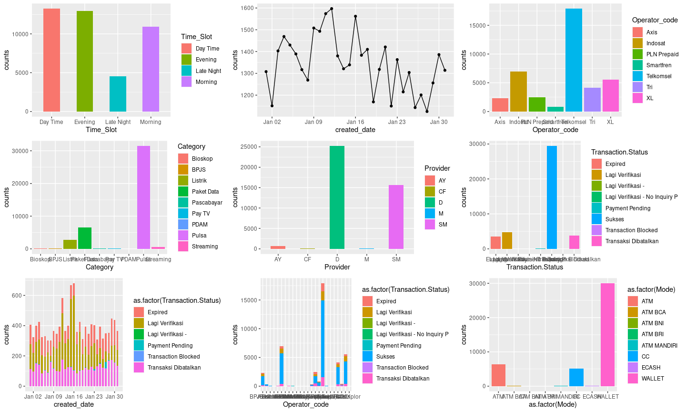<!-- -->

``` r
feb_data <- monthly_data(feb_2017)
```

    ## [1] "Unique Users : 8938"
    ## [1] "Unique Operators : 26"
    ## [1] "Removing columns having Large Number of NA values"
    ##              Transaction.Number                    created_date 
    ##                               0                               0 
    ##                    created_time                    updated_date 
    ##                               0                               0 
    ##                    updated_time                         User.ID 
    ##                               0                               0 
    ##                   Operator_code                    Product.name 
    ##                               0                               0 
    ##               Procurement.price                 Credit.card.fee 
    ##                               0                            4831 
    ##                        Category                        Provider 
    ##                               0                               0 
    ##              Transaction.Status                   Response.Code 
    ##                               0                               0 
    ##                    Reciept.Code                            Mode 
    ##                               0                               0 
    ##                     price..Rp..                        discount 
    ##                               0                               0 
    ##                        Cashback Price.After.Discount...Cashback 
    ##                               0                               0 
    ##                      Promo.Code                  Promo.Campaign 
    ##                               0                               0 
    ##                         TO.bank                       From.Bank 
    ##                               0                               0 
    ##                           Token               Transaction.Notes 
    ##                               0                               0 
    ##                      Split.Mode                          Mode.1 
    ##                               0                           54522 
    ##                  Mode.1.Channel                          Mode.2 
    ##                           54522                           54522 
    ##                  Mode.2.Channel               Discounted.Amount 
    ##                           54522                           45614 
    ##                 Round.of.Amount                     Amount.Type 
    ##                           45614                               0 
    ## [1] "Removing columns having Large Number of Blank values"
    ##              Transaction.Number                    created_date 
    ##                               0                               0 
    ##                    created_time                    updated_date 
    ##                               0                               0 
    ##                    updated_time                         User.ID 
    ##                               0                               0 
    ##                   Operator_code                    Product.name 
    ##                               0                            4831 
    ##               Procurement.price                 Credit.card.fee 
    ##                               0                               0 
    ##                        Category                        Provider 
    ##                               0                               0 
    ##              Transaction.Status                   Response.Code 
    ##                               0                           15478 
    ##                    Reciept.Code                            Mode 
    ##                           41036                               0 
    ##                     price..Rp..                        discount 
    ##                               0                               0 
    ##                        Cashback Price.After.Discount...Cashback 
    ##                               0                               0 
    ##                      Promo.Code                  Promo.Campaign 
    ##                           51796                           51784 
    ##                         TO.bank                       From.Bank 
    ##                           45614                           45614 
    ##                           Token               Transaction.Notes 
    ##                           51960                           36108 
    ##                      Split.Mode                     Amount.Type 
    ##                               0                           45614 
    ## [1] "Unique records in dataset: 54522"
    ## [1] "Class of create_date column: Date"

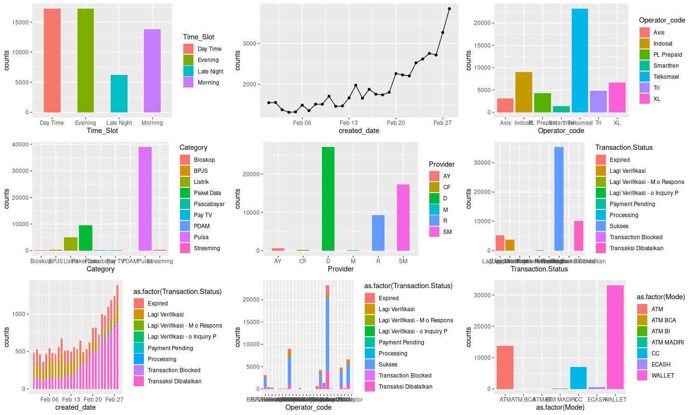<!-- -->

``` r
mar_data <- monthly_data(mar_2017)
```

    ## [1] "Unique Users : 15579"
    ## [1] "Unique Operators : 57"
    ## [1] "Removing columns having Large Number of NA values"
    ##              Transaction.Number                    created_date 
    ##                               0                               0 
    ##                    created_time                    updated_date 
    ##                               0                               0 
    ##                    updated_time                         User.ID 
    ##                               0                               0 
    ##                   Operator_code                    Product.name 
    ##                               0                               0 
    ##               Procurement.price                 Credit.card.fee 
    ##                               0                            3150 
    ##                        Category                        Provider 
    ##                               0                               0 
    ##              Transaction.Status                   Response.Code 
    ##                               0                               0 
    ##                    Reciept.Code                            Mode 
    ##                               0                               0 
    ##                     price..Rp..                        discount 
    ##                               0                               0 
    ##                        Cashback Price.After.Discount...Cashback 
    ##                               0                               0 
    ##                      Promo.Code                  Promo.Campaign 
    ##                               0                               0 
    ##                         TO.bank                       From.Bank 
    ##                               0                               0 
    ##                           Token               Transaction.Notes 
    ##                               0                               0 
    ##                      Split.Mode                          Mode.1 
    ##                               0                          156429 
    ##                  Mode.1.Channel                          Mode.2 
    ##                          156429                          156429 
    ##                  Mode.2.Channel               Discounted.Amount 
    ##                          156429                          143467 
    ##                 Round.of.Amount                     Amount.Type 
    ##                          143467                               0 
    ## [1] "Removing columns having Large Number of Blank values"
    ##              Transaction.Number                    created_date 
    ##                               0                               0 
    ##                    created_time                    updated_date 
    ##                               0                               0 
    ##                    updated_time                         User.ID 
    ##                               0                               0 
    ##                   Operator_code                    Product.name 
    ##                               0                            3150 
    ##               Procurement.price                 Credit.card.fee 
    ##                               0                               0 
    ##                        Category                        Provider 
    ##                               0                               0 
    ##              Transaction.Status                   Response.Code 
    ##                               0                           28969 
    ##                    Reciept.Code                            Mode 
    ##                          117848                               0 
    ##                     price..Rp..                        discount 
    ##                               0                               0 
    ##                        Cashback Price.After.Discount...Cashback 
    ##                               0                               0 
    ##                      Promo.Code                  Promo.Campaign 
    ##                          154368                          154363 
    ##                         TO.bank                       From.Bank 
    ##                          143467                          143467 
    ##                           Token               Transaction.Notes 
    ##                          136526                          121549 
    ##                      Split.Mode                     Amount.Type 
    ##                               0                          143467 
    ## [1] "Unique records in dataset: 156429"
    ## [1] "Class of create_date column: Date"

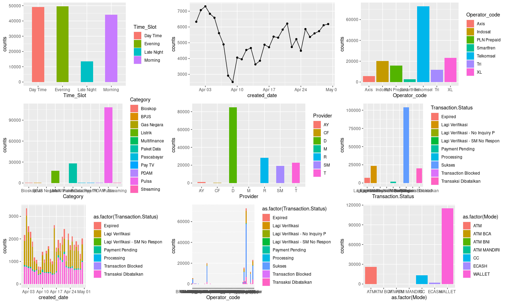<!-- -->

``` r
apr_data <- monthly_data(apr_2017)
```

    ## [1] "Unique Users : 17912"
    ## [1] "Unique Operators : 80"
    ## [1] "Removing columns having Large Number of NA values"
    ##              Transaction.Number                    created_date 
    ##                               0                               0 
    ##                    created_time                    updated_date 
    ##                               0                               0 
    ##                    updated_time                         User.ID 
    ##                               0                               0 
    ##                   Operator_code                    Product.name 
    ##                               0                               0 
    ##               Procurement.price                 Credit.card.fee 
    ##                               0                            3064 
    ##                        Category                        Provider 
    ##                               0                               0 
    ##              Transaction.Status                   Response.Code 
    ##                               0                               0 
    ##                    Reciept.Code                            Mode 
    ##                               0                               0 
    ##                     price..Rp..                        discount 
    ##                               0                               0 
    ##                        Cashback Price.After.Discount...Cashback 
    ##                               0                               0 
    ##                      Promo.Code                  Promo.Campaign 
    ##                               0                               0 
    ##                         TO.bank                       From.Bank 
    ##                               0                               0 
    ##                           Token               Transaction.Notes 
    ##                               0                               0 
    ##                      Split.Mode                          Mode.1 
    ##                               0                          187696 
    ##                  Mode.1.Channel                          Mode.2 
    ##                          187696                          187696 
    ##                  Mode.2.Channel               Discounted.Amount 
    ##                          187696                          171610 
    ##                 Round.of.Amount                     Amount.Type 
    ##                          171610                               0 
    ## [1] "Removing columns having Large Number of Blank values"
    ##              Transaction.Number                    created_date 
    ##                               0                               0 
    ##                    created_time                    updated_date 
    ##                               0                               0 
    ##                    updated_time                         User.ID 
    ##                               0                               0 
    ##                   Operator_code                    Product.name 
    ##                               0                            3064 
    ##               Procurement.price                 Credit.card.fee 
    ##                               0                               0 
    ##                        Category                        Provider 
    ##                               0                               0 
    ##              Transaction.Status                   Response.Code 
    ##                               0                           33339 
    ##                    Reciept.Code                            Mode 
    ##                          152296                               0 
    ##                     price..Rp..                        discount 
    ##                               0                               0 
    ##                        Cashback Price.After.Discount...Cashback 
    ##                               0                               0 
    ##                      Promo.Code                  Promo.Campaign 
    ##                          171768                          171768 
    ##                         TO.bank                       From.Bank 
    ##                          171610                          171610 
    ##                           Token               Transaction.Notes 
    ##                          103325                          144376 
    ##                      Split.Mode                     Amount.Type 
    ##                               0                          171610 
    ## [1] "Unique records in dataset: 187696"
    ## [1] "Class of create_date column: Date"

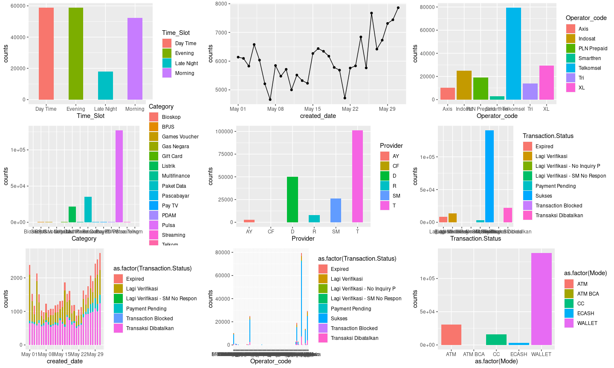<!-- -->

``` r
may_data <- monthly_data(may_2017)
```

    ## [1] "Unique Users : 28354"
    ## [1] "Unique Operators : 114"
    ## [1] "Removing columns having Large Number of NA values"
    ##              Transaction.Number                    created_date 
    ##                               0                               0 
    ##                    created_time                    updated_date 
    ##                               0                               0 
    ##                    updated_time                         User.ID 
    ##                               0                               0 
    ##                   Operator_code                    Product.name 
    ##                               0                               0 
    ##               Procurement.price                 Credit.card.fee 
    ##                               0                               0 
    ##                        Category                        Provider 
    ##                               0                               0 
    ##              Transaction.Status                   Response.Code 
    ##                               0                               0 
    ##                    Reciept.Code                            Mode 
    ##                               0                               0 
    ##                     price..Rp..                        discount 
    ##                               0                               0 
    ##                        Cashback Price.After.Discount...Cashback 
    ##                               0                               0 
    ##                      Promo.Code                  Promo.Campaign 
    ##                               0                               0 
    ##                         TO.bank                       From.Bank 
    ##                               0                               0 
    ##                           Token               Transaction.Notes 
    ##                               0                               0 
    ##                      Split.Mode                          Mode.1 
    ##                               0                          231851 
    ##                  Mode.1.Channel                          Mode.2 
    ##                          231851                          231851 
    ##                  Mode.2.Channel               Discounted.Amount 
    ##                          231851                          208280 
    ##                 Round.of.Amount                     Amount.Type 
    ##                          208280                               0 
    ## [1] "Removing columns having Large Number of Blank values"
    ##              Transaction.Number                    created_date 
    ##                               0                               0 
    ##                    created_time                    updated_date 
    ##                               0                               0 
    ##                    updated_time                         User.ID 
    ##                               0                               0 
    ##                   Operator_code                    Product.name 
    ##                               0                               0 
    ##               Procurement.price                 Credit.card.fee 
    ##                               0                               0 
    ##                        Category                        Provider 
    ##                               0                               0 
    ##              Transaction.Status                   Response.Code 
    ##                               0                               0 
    ##                    Reciept.Code                            Mode 
    ##                             459                               0 
    ##                     price..Rp..                        discount 
    ##                               0                               0 
    ##                        Cashback Price.After.Discount...Cashback 
    ##                               0                               0 
    ##                      Promo.Code                  Promo.Campaign 
    ##                          227241                               0 
    ##                         TO.bank                       From.Bank 
    ##                               0                               0 
    ##                           Token               Transaction.Notes 
    ##                           96530                               0 
    ##                      Split.Mode                     Amount.Type 
    ##                               0                          208280 
    ## [1] "Unique records in dataset: 231851"
    ## [1] "Class of create_date column: Date"

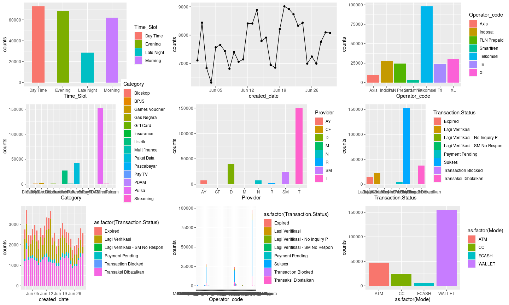<!-- -->

``` r
jun_data <- monthly_data(jun_2017)
```

    ## [1] "Unique Users : 29732"
    ## [1] "Unique Operators : 164"
    ## [1] "Removing columns having Large Number of NA values"
    ##              Transaction.Number                    created_date 
    ##                               0                               0 
    ##                    created_time                    updated_date 
    ##                               0                               0 
    ##                    updated_time                         User.ID 
    ##                               0                               0 
    ##                   Operator_code                    Product.name 
    ##                               0                               0 
    ##               Procurement.price                 Credit.card.fee 
    ##                               0                            1946 
    ##                        Category                        Provider 
    ##                               0                               0 
    ##              Transaction.Status                   Response.Code 
    ##                               0                               0 
    ##                    Reciept.Code                            Mode 
    ##                               0                               0 
    ##                     price..Rp..                        discount 
    ##                               0                               0 
    ##                        Cashback Price.After.Discount...Cashback 
    ##                               0                               0 
    ##                      Promo.Code                  Promo.Campaign 
    ##                               0                               0 
    ##                         TO.bank                       From.Bank 
    ##                               0                               0 
    ##                           Token               Transaction.Notes 
    ##                               0                               0 
    ##                      Split.Mode                          Mode.1 
    ##                               0                          318339 
    ##                  Mode.1.Channel                          Mode.2 
    ##                               0                          318339 
    ##                  Mode.2.Channel               Discounted.Amount 
    ##                               0                          291390 
    ##                 Round.of.Amount                     Amount.Type 
    ##                          291390                               0 
    ## [1] "Removing columns having Large Number of Blank values"
    ##              Transaction.Number                    created_date 
    ##                               0                               0 
    ##                    created_time                    updated_date 
    ##                               0                               0 
    ##                    updated_time                         User.ID 
    ##                               0                               0 
    ##                   Operator_code                    Product.name 
    ##                               0                            1946 
    ##               Procurement.price                 Credit.card.fee 
    ##                               0                               0 
    ##                        Category                        Provider 
    ##                               0                               0 
    ##              Transaction.Status                   Response.Code 
    ##                               0                           50605 
    ##                    Reciept.Code                            Mode 
    ##                          254132                               0 
    ##                     price..Rp..                        discount 
    ##                               0                               0 
    ##                        Cashback Price.After.Discount...Cashback 
    ##                               0                               0 
    ##                      Promo.Code                  Promo.Campaign 
    ##                          315454                          314502 
    ##                         TO.bank                       From.Bank 
    ##                          291390                          291390 
    ##                           Token               Transaction.Notes 
    ##                           87045                          242026 
    ##                      Split.Mode                     Amount.Type 
    ##                               0                          291390 
    ## [1] "Unique records in dataset: 318340"
    ## [1] "Class of create_date column: Date"

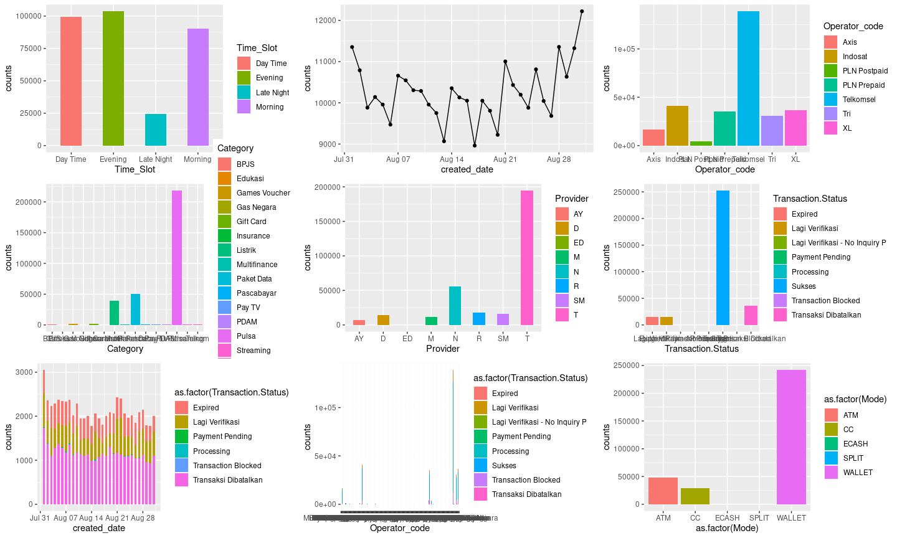<!-- -->

``` r
jul_data <- monthly_data(jul_2017)
```

    ## [1] "Unique Users : 29525"
    ## [1] "Unique Operators : 172"
    ## [1] "Removing columns having Large Number of NA values"
    ##              Transaction.Number                    created_date 
    ##                               0                               0 
    ##                    created_time                    updated_date 
    ##                               0                               0 
    ##                    updated_time                         User.ID 
    ##                               0                               0 
    ##                   Operator_code                    Product.name 
    ##                               0                               0 
    ##               Procurement.price                 Credit.card.fee 
    ##                               0                            3288 
    ##                        Category                        Provider 
    ##                               0                               0 
    ##              Transaction.Status                   Response.Code 
    ##                               0                               0 
    ##                    Reciept.Code                            Mode 
    ##                               0                               0 
    ##                     price..Rp..                        discount 
    ##                               0                               0 
    ##                        Cashback Price.After.Discount...Cashback 
    ##                               0                               0 
    ##                      Promo.Code                  Promo.Campaign 
    ##                               0                               0 
    ##                         TO.bank                       From.Bank 
    ##                               0                               0 
    ##                           Token               Transaction.Notes 
    ##                               0                               0 
    ##                      Split.Mode                          Mode.1 
    ##                               0                          385274 
    ##                  Mode.1.Channel                          Mode.2 
    ##                          385274                          385274 
    ##                  Mode.2.Channel               Discounted.Amount 
    ##                          385274                          349578 
    ##                 Round.of.Amount                     Amount.Type 
    ##                          349578                               0 
    ## [1] "Removing columns having Large Number of Blank values"
    ##              Transaction.Number                    created_date 
    ##                               0                               0 
    ##                    created_time                    updated_date 
    ##                               0                               0 
    ##                    updated_time                         User.ID 
    ##                               0                               0 
    ##                   Operator_code                    Product.name 
    ##                               0                            3288 
    ##               Procurement.price                 Credit.card.fee 
    ##                               0                               0 
    ##                        Category                        Provider 
    ##                               0                               0 
    ##              Transaction.Status                   Response.Code 
    ##                               0                           50947 
    ##                    Reciept.Code                            Mode 
    ##                          296591                               0 
    ##                     price..Rp..                        discount 
    ##                               0                               0 
    ##                        Cashback Price.After.Discount...Cashback 
    ##                               0                               0 
    ##                      Promo.Code                  Promo.Campaign 
    ##                          381687                          381506 
    ##                         TO.bank                       From.Bank 
    ##                          349578                          349578 
    ##                           Token               Transaction.Notes 
    ##                           99284                          311149 
    ##                      Split.Mode                     Amount.Type 
    ##                               0                          349578 
    ## [1] "Unique records in dataset: 385274"
    ## [1] "Class of create_date column: Date"

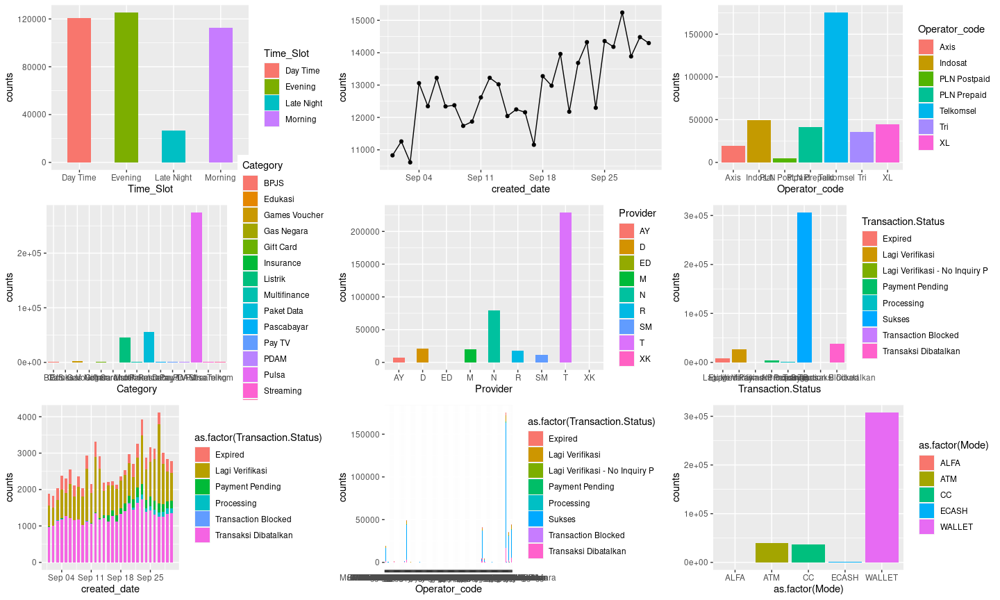<!-- -->

``` r
aug_data <- monthly_data(aug_2017)
```

    ## [1] "Unique Users : 30549"
    ## [1] "Unique Operators : 145"
    ## [1] "Removing columns having Large Number of NA values"
    ##              Transaction.Number                    created_date 
    ##                               0                               0 
    ##                    created_time                    updated_date 
    ##                               0                               0 
    ##                    updated_time                         User.ID 
    ##                               0                               0 
    ##                   Operator_code                    Product.name 
    ##                               0                               0 
    ##               Procurement.price                 Credit.card.fee 
    ##                               0                            2234 
    ##                        Category                        Provider 
    ##                               0                               0 
    ##              Transaction.Status                   Response.Code 
    ##                               0                               0 
    ##                    Reciept.Code                            Mode 
    ##                               0                               0 
    ##                     price..Rp..                        discount 
    ##                               0                               0 
    ##                        Cashback Price.After.Discount...Cashback 
    ##                               0                               0 
    ##                      Promo.Code                  Promo.Campaign 
    ##                               0                               0 
    ##                         TO.bank                       From.Bank 
    ##                               0                               0 
    ##                           Token               Transaction.Notes 
    ##                               0                               0 
    ##                      Split.Mode                          Mode.1 
    ##                               0                          423830 
    ##                  Mode.1.Channel                          Mode.2 
    ##                          423830                          423830 
    ##                  Mode.2.Channel               Discounted.Amount 
    ##                          423830                          387281 
    ##                 Round.of.Amount                     Amount.Type 
    ##                          387281                               0 
    ## [1] "Removing columns having Large Number of Blank values"
    ##              Transaction.Number                    created_date 
    ##                               0                               0 
    ##                    created_time                    updated_date 
    ##                               0                               0 
    ##                    updated_time                         User.ID 
    ##                               0                               0 
    ##                   Operator_code                    Product.name 
    ##                               0                            2234 
    ##               Procurement.price                 Credit.card.fee 
    ##                               0                               0 
    ##                        Category                        Provider 
    ##                               0                               0 
    ##              Transaction.Status                   Response.Code 
    ##                               0                           54350 
    ##                    Reciept.Code                            Mode 
    ##                          338871                               0 
    ##                     price..Rp..                        discount 
    ##                               0                               0 
    ##                        Cashback Price.After.Discount...Cashback 
    ##                               0                               0 
    ##                      Promo.Code                  Promo.Campaign 
    ##                          417215                          416391 
    ##                         TO.bank                       From.Bank 
    ##                          387281                          387281 
    ##                           Token               Transaction.Notes 
    ##                          107533                          346878 
    ##                      Split.Mode                     Amount.Type 
    ##                               0                          387281 
    ## [1] "Unique records in dataset: 423830"
    ## [1] "Class of create_date column: Date"

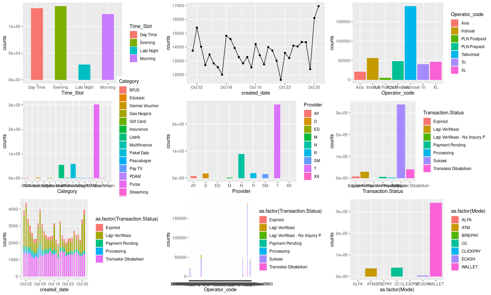<!-- -->

``` r
sep_data <- monthly_data(sep_2017)
```

    ## [1] "Unique Users : 35827"
    ## [1] "Unique Operators : 107"
    ## [1] "Removing columns having Large Number of NA values"
    ##              Transaction.Number                    created_date 
    ##                               0                               0 
    ##                    created_time                    updated_date 
    ##                               0                               0 
    ##                    updated_time                         User.ID 
    ##                               0                               0 
    ##                   Operator_code                    Product.name 
    ##                               0                               0 
    ##               Procurement.price                 Credit.card.fee 
    ##                               0                            2360 
    ##                        Category                        Provider 
    ##                               0                               0 
    ##              Transaction.Status                   Response.Code 
    ##                               0                               0 
    ##                    Reciept.Code                            Mode 
    ##                               0                               0 
    ##                     price..Rp..                        discount 
    ##                               0                               0 
    ##                        Cashback Price.After.Discount...Cashback 
    ##                               0                               0 
    ##                      Promo.Code                  Promo.Campaign 
    ##                               0                               0 
    ##                         TO.bank                       From.Bank 
    ##                               0                               0 
    ##                           Token               Transaction.Notes 
    ##                               0                               0 
    ##                      Split.Mode                          Mode.1 
    ##                               0                          463834 
    ##                  Mode.1.Channel                          Mode.2 
    ##                          463834                          463834 
    ##                  Mode.2.Channel               Discounted.Amount 
    ##                          463834                          414029 
    ##                 Round.of.Amount                     Amount.Type 
    ##                          414029                               0 
    ## [1] "Removing columns having Large Number of Blank values"
    ##              Transaction.Number                    created_date 
    ##                               0                               0 
    ##                    created_time                    updated_date 
    ##                               0                               0 
    ##                    updated_time                         User.ID 
    ##                               0                               0 
    ##                   Operator_code                    Product.name 
    ##                               0                            2360 
    ##               Procurement.price                 Credit.card.fee 
    ##                               0                               0 
    ##                        Category                        Provider 
    ##                               0                               0 
    ##              Transaction.Status                   Response.Code 
    ##                               0                           55837 
    ##                    Reciept.Code                            Mode 
    ##                          380682                               0 
    ##                     price..Rp..                        discount 
    ##                               0                               0 
    ##                        Cashback Price.After.Discount...Cashback 
    ##                               0                               0 
    ##                      Promo.Code                  Promo.Campaign 
    ##                          461121                          459216 
    ##                         TO.bank                       From.Bank 
    ##                          414029                          414029 
    ##                           Token               Transaction.Notes 
    ##                          121828                          381398 
    ##                      Split.Mode                     Amount.Type 
    ##                               0                          444753 
    ## [1] "Unique records in dataset: 463834"
    ## [1] "Class of create_date column: Date"

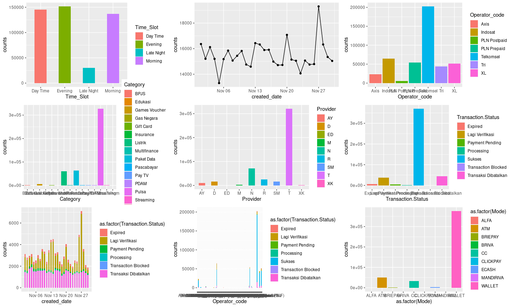<!-- -->

``` r
oct_data <- monthly_data(oct_2017)
```

    ## [1] "Unique Users : 37595"
    ## [1] "Unique Operators : 98"
    ## [1] "Removing columns having Large Number of NA values"
    ##              Transaction.Number                    created_date 
    ##                               0                               0 
    ##                    created_time                    updated_date 
    ##                               0                               0 
    ##                    updated_time                         User.ID 
    ##                               0                               0 
    ##                   Operator_code                    Product.name 
    ##                               0                               0 
    ##               Procurement.price                 Credit.card.fee 
    ##                               0                             692 
    ##                        Category                        Provider 
    ##                               0                               0 
    ##              Transaction.Status                   Response.Code 
    ##                               0                               0 
    ##                    Reciept.Code                            Mode 
    ##                               0                               0 
    ##                     price..Rp..                        discount 
    ##                               0                               0 
    ##                        Cashback Price.After.Discount...Cashback 
    ##                               0                               0 
    ##                      Promo.Code                  Promo.Campaign 
    ##                               0                               0 
    ##                         TO.bank                       From.Bank 
    ##                               0                               0 
    ##                           Token               Transaction.Notes 
    ##                               0                               0 
    ##                      Split.Mode                          Mode.1 
    ##                               0                          472852 
    ##                  Mode.1.Channel                          Mode.2 
    ##                          472852                          472852 
    ##                  Mode.2.Channel               Discounted.Amount 
    ##                          472852                          418321 
    ##                 Round.of.Amount                     Amount.Type 
    ##                          418321                               0 
    ## [1] "Removing columns having Large Number of Blank values"
    ##              Transaction.Number                    created_date 
    ##                               0                               0 
    ##                    created_time                    updated_date 
    ##                               0                               0 
    ##                    updated_time                         User.ID 
    ##                               0                               0 
    ##                   Operator_code                    Product.name 
    ##                               0                             692 
    ##               Procurement.price                 Credit.card.fee 
    ##                               0                               0 
    ##                        Category                        Provider 
    ##                               0                               0 
    ##              Transaction.Status                   Response.Code 
    ##                               0                           55620 
    ##                    Reciept.Code                            Mode 
    ##                          375637                               0 
    ##                     price..Rp..                        discount 
    ##                               0                               0 
    ##                        Cashback Price.After.Discount...Cashback 
    ##                               0                               0 
    ##                      Promo.Code                  Promo.Campaign 
    ##                          468740                          467037 
    ##                         TO.bank                       From.Bank 
    ##                          418321                          418321 
    ##                           Token               Transaction.Notes 
    ##                          104835                          386129 
    ##                      Split.Mode                     Amount.Type 
    ##                               0                          463684 
    ## [1] "Unique records in dataset: 472852"
    ## [1] "Class of create_date column: Date"

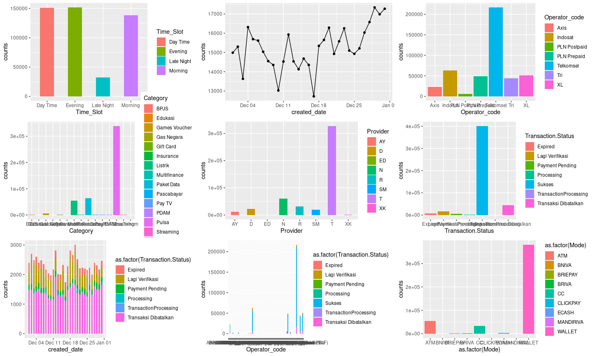<!-- -->

### **5. Data Merge and EDA**

#### **5.1. Combining all the dataset into one**

``` r
month_data <- rbind(jan_data,feb_data,mar_data,apr_data,may_data,jun_data,jul_data,aug_data,sep_data,oct_data)
```

#### **5.2. EDA on combined data for all months**

##### **5.2.1 Aggregating the number of transactions by Time\_slot**

``` r
transactions_in_time_slot <- month_data %>% group_by(Time_Slot) %>% summarize(n()) %>% as.data.frame()
colnames(transactions_in_time_slot)[2] <- "counts"   #Re-naming the column

###### **5.2.1.1. Plot**
ggplot(transactions_in_time_slot, aes(x=Time_Slot, y=counts, fill=Time_Slot)) + geom_bar(stat = "identity", width = 0.5)
```

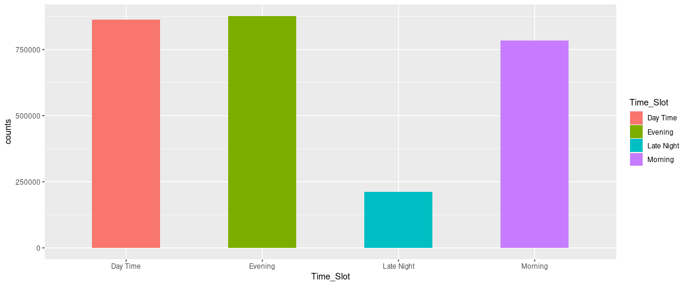<!-- -->

##### **5.2.2. Aggregating the number of transactions per day**

``` r
transactions_per_day <- month_data %>% group_by(created_date) %>% summarize(n()) %>% as.data.frame()
colnames(transactions_per_day)[2] <- "counts"   #Re-naming the column

###### **5.2.2.1. Plot**
ggplot(transactions_per_day, aes(x=created_date, y=counts)) + geom_line() + geom_point()
```

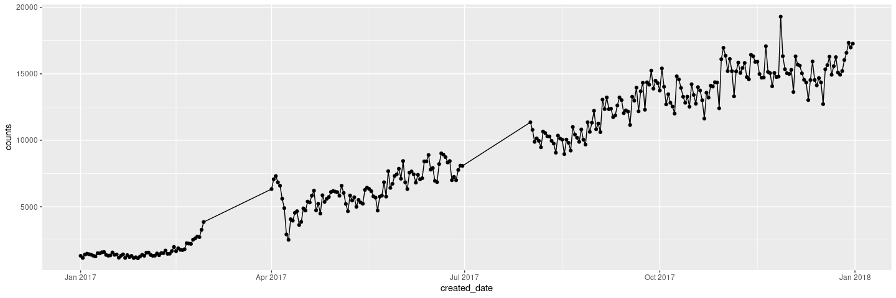<!-- -->

##### **5.2.3. Aggregating the transactions by Operator\_code**

``` r
transactions_per_operator <- month_data %>% group_by(Operator_code) %>% summarize(n()) %>% as.data.frame() 
colnames(transactions_per_operator)[2] <- "counts"  ##Re-naming the column

###### **5.2.3.1. Re-arranging the "transactions_per_operator" dataframe**
transactions_per_operator <- head(arrange(transactions_per_operator, desc(counts)),7)
```

###### \*\* 5.2.3.2. Plot \[Top7 Operator\_code\]\*\*

``` r
ggplot(transactions_per_operator, aes(x=Operator_code, y=counts, fill=Operator_code)) + geom_bar(stat = "identity")
```

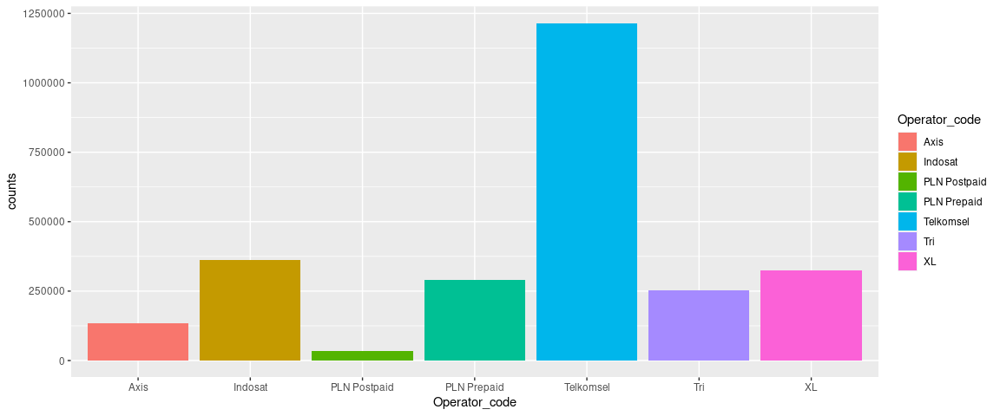<!-- -->

##### **5.2.4. Aggregating the transactions by Category**

``` r
transactions_per_category <- month_data %>% group_by(Category) %>% summarize(n()) %>% as.data.frame()
colnames(transactions_per_category)[2] <- "counts"   #Re-naming the column
  
###### **5.2.4.1. Plot**
ggplot(transactions_per_category, aes(x=Category, y=counts, fill=Category)) + geom_bar(stat = "identity")
```

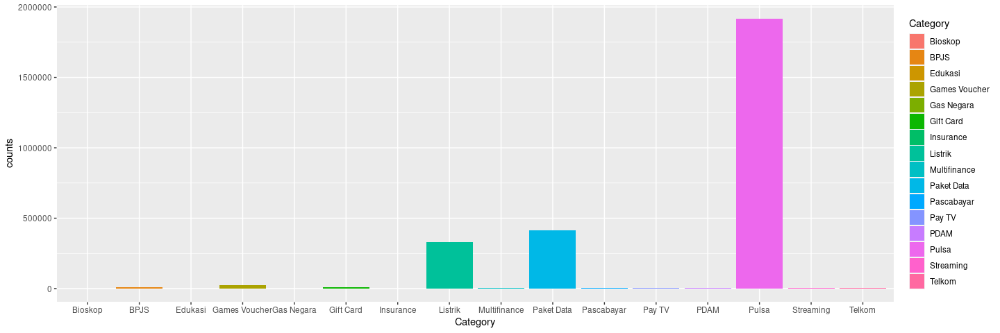<!-- -->

##### **5.2.5. Aggregating the transactions by Provider**

``` r
transactions_per_provider <- month_data %>% group_by(Provider) %>% summarize(n()) %>% as.data.frame()
colnames(transactions_per_provider)[2] <- "counts"   #Re-naming the column
  
###### **5.2.5.1. Plot**
ggplot(transactions_per_provider, aes(x=Provider, y=counts, fill=Provider)) + geom_bar(stat = "identity", width=0.5)
```

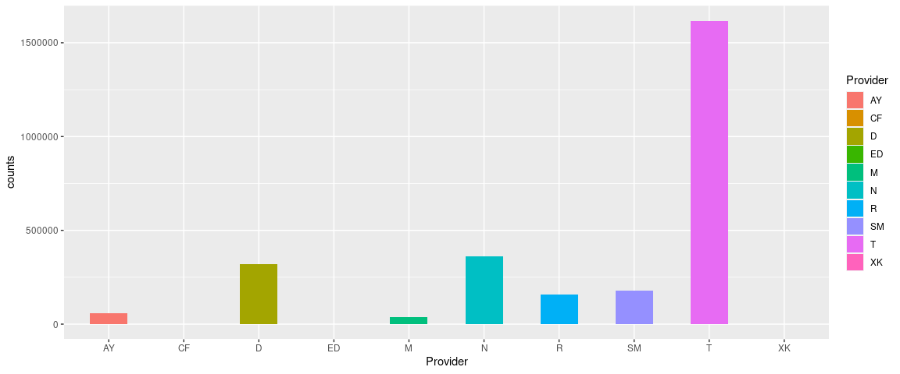<!-- -->

##### **5.2.6. Transaction Status frequency**

``` r
transaction_status_freq <- month_data %>% group_by(Transaction.Status) %>% summarize(n()) %>% as.data.frame()
colnames(transaction_status_freq)[2] <- "counts"   #Re-naming the column
  
###### **5.2.6.1. Plot**
ggplot(transaction_status_freq, aes(x=Transaction.Status, y=counts, fill=Transaction.Status)) + geom_bar(stat = "identity") + 
theme(axis.text.x = element_text(colour = "black", angle=90, vjust = 0.5)) 
```

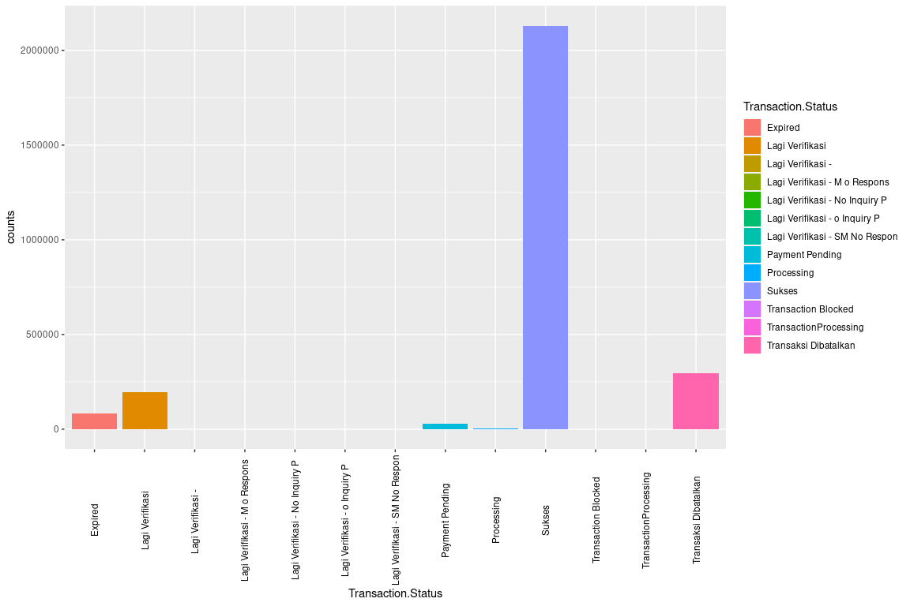<!-- -->

##### **5.2.7. Transaction status per day frequency**

``` r
transaction_status_per_day <- month_data %>% group_by(Transaction.Status,created_date) %>% summarize(n()) %>% as.data.frame() %>% 
filter(Transaction.Status %nin% c("Lagi Verifikasi -", "Lagi Verifikasi - No Inquiry P", "Sukses"))
colnames(transaction_status_per_day)[3] <- "counts"   #Re-naming the column
  
###### **5.2.7.1. Plot**
ggplot(transaction_status_per_day, aes(x=created_date, y=counts, fill= as.factor(Transaction.Status))) + 
geom_bar(stat = "identity", position = "stack", width = 0.6)
```

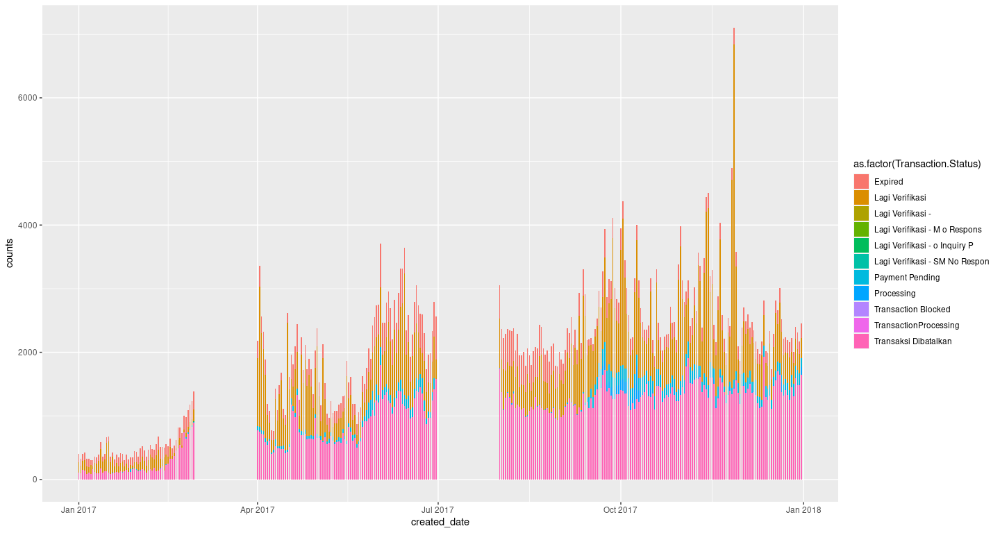<!-- -->

``` r
ggplot(transaction_status_per_day, aes(x=created_date, y=counts, group = as.factor(Transaction.Status))) + geom_line(aes(color =Transaction.Status))
```

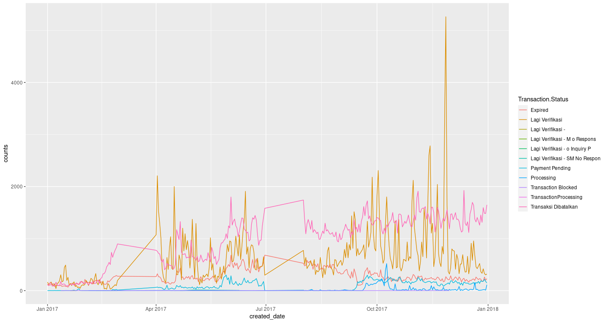<!-- -->

##### **5.2.8. Transaction status frequency by Operator Code**

``` r
transaction_status_by_operator <- month_data %>% group_by(Transaction.Status,Operator_code) %>% summarize(n()) %>% as.data.frame()
colnames(transaction_status_by_operator)[3] <- "counts"   #Re-naming the column
  
###### **5.2.8.1. Plot**
ggplot(transaction_status_by_operator, aes(x=Operator_code, y=counts, fill= as.factor(Transaction.Status))) + 
geom_bar(stat = "identity", position = "stack") + theme(axis.text.x = element_text(colour = "black", angle=90, vjust = 0.5)) 
```

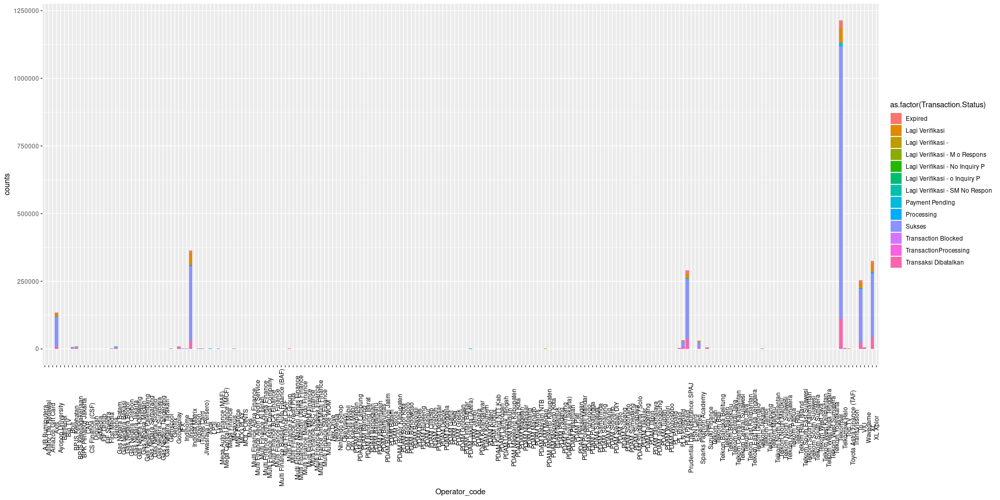<!-- -->

##### **5.2.9. Transaction frequency by Mode**

``` r
transaction_freq_by_mode <- month_data %>% group_by(Mode) %>% summarize(n()) %>% as.data.frame()
colnames(transaction_freq_by_mode)[2] <- "counts"   #Re-naming the column
  
###### **5.2.9.1. Plot**
ggplot(transaction_freq_by_mode, aes(x=as.factor(Mode), y=counts, fill= as.factor(Mode))) + geom_bar(stat = "identity")
```

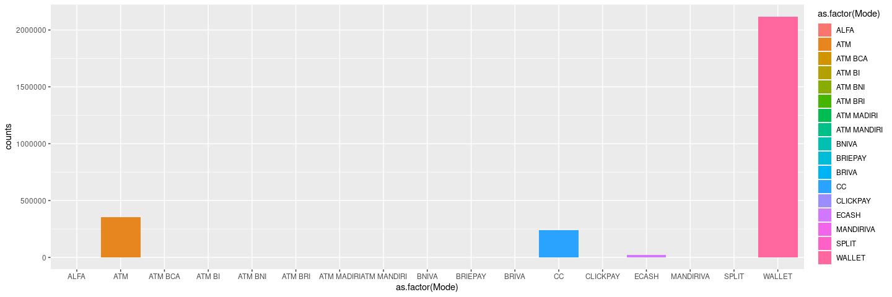<!-- -->

### **6. Data Preparation for Model Building**

#### **6.1. Preparing data for Model Building**

##### **6.1.1. Aggregating the 10 months transaction by day**

``` r
per_day_transaction_count <- month_data %>% group_by(created_date) %>% summarize(n()) %>% as.data.frame()
colnames(per_day_transaction_count)[2] <- "counts"   #Re-naming the column
```

###### **6.1.2. Creating a sequence of days**

``` r
timeseries_data <- as.data.frame(cbind(1:303, per_day_transaction_count$counts))
colnames(timeseries_data) <- c("Day", "Transactions") #Re-naming the column
```

### **7. Model Building**

#### **7.1. Building Model \[Time-Series\]**

##### **7.1.1. Converting data into time-series**

``` r
total_timeser <- ts(timeseries_data$Transactions)
    
###### **7.1.1.1. Plotting the time series**
plot(total_timeser)
```

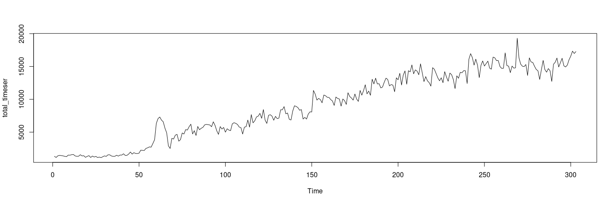<!-- -->

##### \*\* 7.1.2. Fitting a ARIMA model\*\*

``` r
autoarima <- auto.arima(total_timeser)
autoarima
```

    ## Series: total_timeser 
    ## ARIMA(1,1,2) with drift 
    ## 
    ## Coefficients:
    ##          ar1      ma1     ma2    drift
    ##       0.6997  -1.1614  0.2117  51.8380
    ## s.e.  0.1337   0.1530  0.1191   8.6272
    ## 
    ## sigma^2 estimated as 724202:  log likelihood=-2464.33
    ## AIC=4938.65   AICc=4938.85   BIC=4957.2

``` r
tsdiag(autoarima)
```

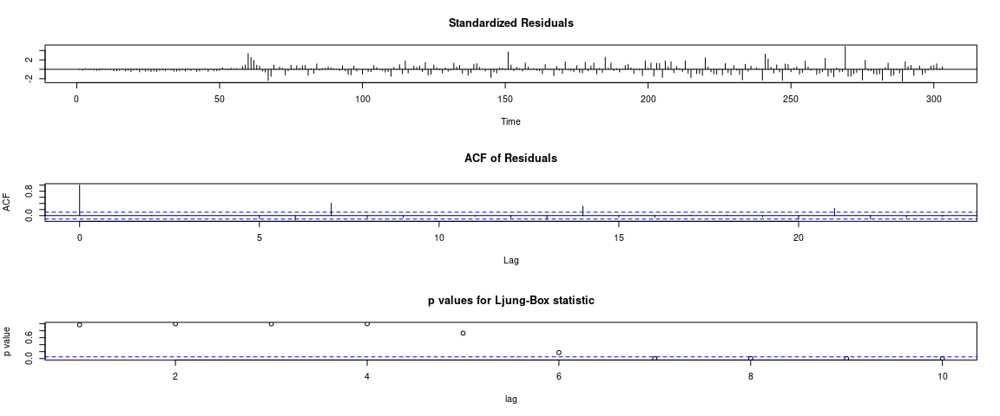<!-- -->

``` r
###### **7.1.2.1. Plotting the actual and predicted values**
plot(autoarima$x, col="black")
lines(fitted(autoarima), col="red")
```

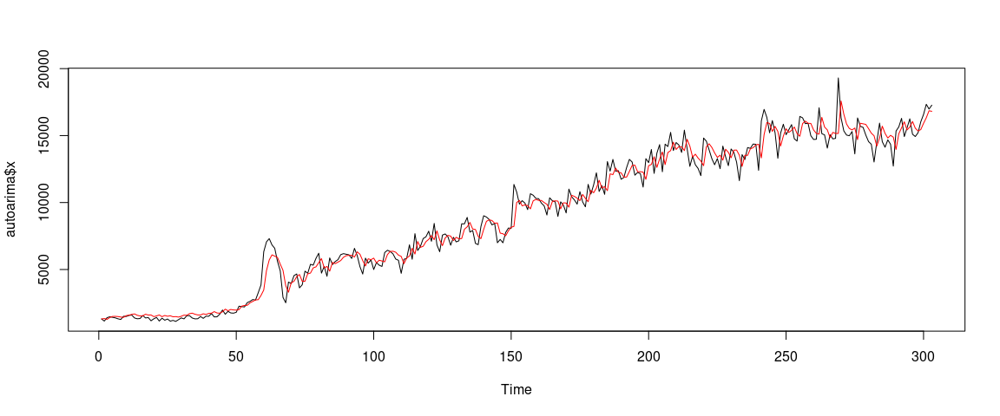<!-- -->

##### **7.1.3. Checking if the residual series is white noise**

``` r
resi_auto_arima <- total_timeser - fitted(autoarima)
      
adf.test(resi_auto_arima,alternative = "stationary")
```

    ## 
    ##  Augmented Dickey-Fuller Test
    ## 
    ## data:  resi_auto_arima
    ## Dickey-Fuller = -4.8853, Lag order = 6, p-value = 0.01
    ## alternative hypothesis: stationary

``` r
kpss.test(resi_auto_arima)
```

    ## 
    ##  KPSS Test for Level Stationarity
    ## 
    ## data:  resi_auto_arima
    ## KPSS Level = 0.13045, Truncation lag parameter = 5, p-value = 0.1

### **8. Prediction**

### **8.1. Predicting the transactions for next 5 days**

``` r
fcast_auto_arima <- forecast(autoarima, h = 5)
fcast_auto_arima
```

    ##     Point Forecast    Lo 80    Hi 80    Lo 95    Hi 95
    ## 304       16982.79 15892.19 18073.39 15314.86 18650.72
    ## 305       16894.78 15656.20 18133.36 15000.54 18789.02
    ## 306       16848.77 15525.57 18171.97 14825.11 18872.43
    ## 307       16832.15 15455.29 18209.01 14726.43 18937.87
    ## 308       16836.09 15422.27 18249.91 14673.84 18998.34

``` r
#Point     Forecast Lo 80    Hi 80    Lo 95    Hi 95
#304       16982.79 15892.19 18073.39 15314.86 18650.72
#305       16894.78 15656.20 18133.36 15000.54 18789.02
#306       16848.77 15525.57 18171.97 14825.11 18872.43
#307       16832.15 15455.29 18209.01 14726.43 18937.87
#308       16836.09 15422.27 18249.91 14673.84 18998.34
      
fcast_auto_arima$mean
```

    ## Time Series:
    ## Start = 304 
    ## End = 308 
    ## Frequency = 1 
    ## [1] 16982.79 16894.78 16848.77 16832.15 16836.09

``` r
# Time Series:
# Start = 304 
# End = 308 
# Frequency = 1 
# [1] 16982.79 16894.78 16848.77 16832.15 16836.09
```

### **9. Desired Output \[i.e. forecasting for next 5 days\]**

``` r
#16982.79 16894.78 16848.77 16832.15 16836.09
```

### **10. Analysis**

``` r
# Majority of Transactions happens in Day time and Evening  
# Increasing trend of number of transactions from Jan to Oct Month
# "Telkomsel" is the preferred/popular Operator
# Majority of Transactions from "Pulsa" Category
# "T" Provider holds maximum number of transactions
# Majority of transactions got succeeded, few were canceled
# Wallet was the preferred Mode
  
#**** Removed the Below attributes *****  
# Discount - 99.6% values are 0
# Cashback - 97.2% values are 0
```

### **11. Factors Affecting the Daily Transaction**

``` r
# Operator, Category, Mode and Timings [Time_Slot that I derived]
```
